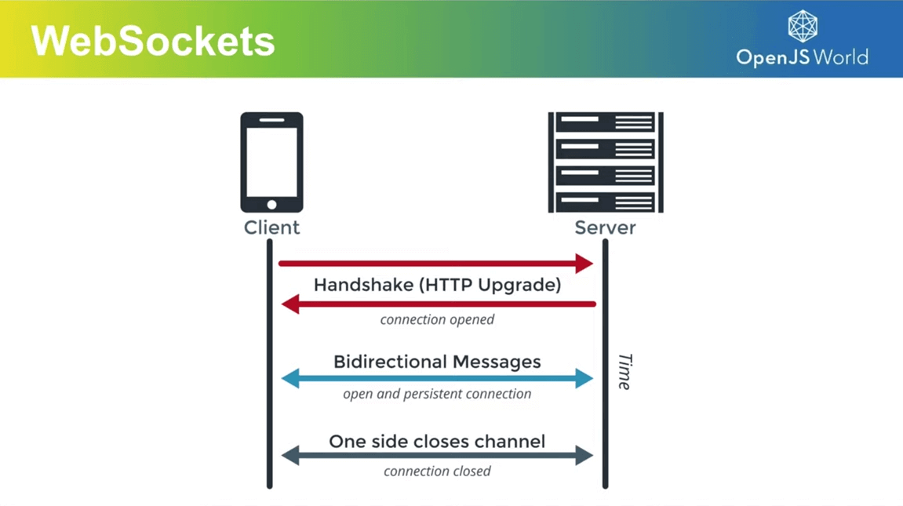

### Schedule

  - **Study the suggested material**
  - **Practice on the topics and share your questions**

### Study Plan

  Here's an interesting question: how will our human battleship players be able to play the game together online?

  There are quite a few options available, but one of the most prominent technologies these days is **WebSockets**.

  

  **What is a WebSocket**

  > "WebSocket is a standardized communication protocol that enables simultaneous two-way communication over a single TCP connection. It has full-duplex or bi-directional capabilities that distinguishes it from HTTP. WebSocket achieves HTTP compatibility by using the HTTP Upgrade header to transition protocols. 
  > 
  > It allows servers to push content to clients without initial requests and maintains open connections for continuous message exchange, making it ideal for real-time data transfer with lower overhead than alternatives like HTTP polling. 
  > 
  > WebSocket communications typically occur over TCP ports 443 (secured) or 80 (unsecured), helping bypass firewall restrictions on non-web connections. The protocol defines its own URI schemes (ws:// and wss://) for unencrypted and encrypted connections respectively and supported by all major browsers." 

  _(From the [Node.js](https://nodejs.org/en/learn/getting-started/websocket#what-is-a-websocket){:target="_blank"} documentation)_

  Here are a few resources for studying WebSockets today and experimenting with some code that will prepare us for the Battleship implementation:

  - [WebSockets Explained](https://www.youtube.com/embed/2Nt-ZrNP22A){:target="_blank"} 

  - [WebSockets (javascript.info)](https://javascript.info/websocket){:target="_blank"}

  - [In 5 minutes learn HTML5 WebSockets](https://www.youtube.com/watch?v=WDowDtfWiGQ){:target="_blank"}
  
### Summary

### Exercises

### Extra Resources
