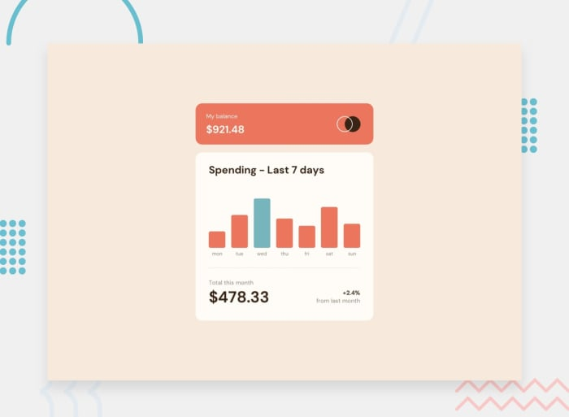

### Schedule

  - **Study the suggested material**
  - **Practice on the topics and share your questions**

### Study Plan

  Study the following TypeScript concepts and then scroll down
  to the `Exercises` section to start your Frontend coding challenge.

  - [TypeScript Generics explained with pets](https://maddev.netlify.app/development/typescript_generics/){:target="_blank"}

  - [Generic Types](https://www.typescriptlang.org/docs/handbook/2/generics.html#generic-types){:target="_blank"}

  - Try TypeScript with [ts-node](https://www.npmjs.com/package/ts-node){:target="_blank"}, a TypeScript execution engine and REPL for Node.js.

### Summary

### Exercises

  

  Time for a Frontend coding challenge!

  In this challenge, you'll create a bar chart component from scratch.

  Visit the [Frontend Mentor](https://www.frontendmentor.io/challenges/expenses-chart-component-e7yJBUdjwt){:target="_blank"} web page and start hacking!

  You can also download the exercise resources and instructions [here](https://github.com/in-tech-gration/WDX-180/tree/main/curriculum/week31/assets/day02){:target="_blank"}.

### Extra Resources
