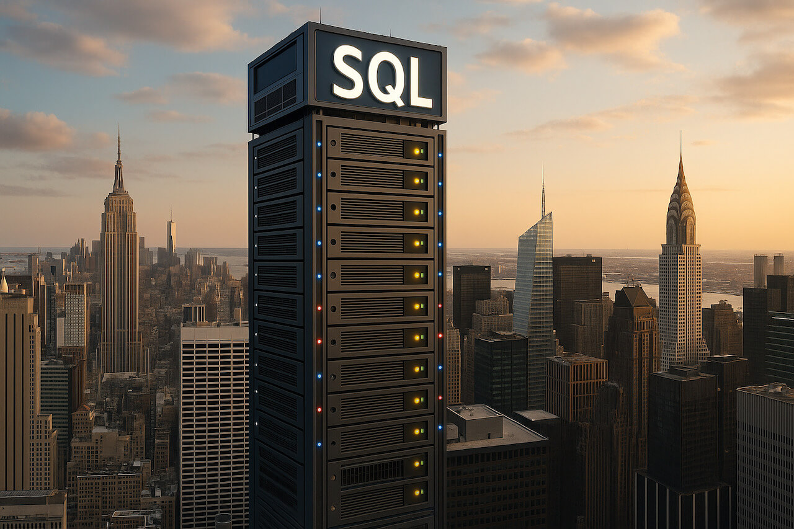

### Schedule

  - **Study the suggested material**
  - **Practice on the topics and share your questions**

### Study Plan

  

  Today is a good opportunity to watch the following videos related to Relational Databases (aka SQL-databases):

  - One of the best introductions: [SQL Tutorial for Beginners \| SQL Crash Course](https://www.youtube.com/watch?v=2kHV2_CXJ38){:target="_blank"} (1h)

  - [Intro to Databases by Al Zimmerman](https://www.youtube.com/watch?v=D98mNPLccSg){:target="_blank"}
  
  - An amazing [introduction to SQL](https://www.youtube.com/watch?v=KLwnfxhobIQ){:target="_blank"} by the incredible Eddie Woo 

  - If you are into Podcasts or just want to take a little break AFK and take a walk, [here's a great episode](http://kopec.live/episode/e63557fe721b446c/databases){:target="_blank"} by "Kopec Explains Software", explaining Databases. We highly recommend that you check out the other episodes of this Podcast.

  When you are done going through the theory, jump into practice through this interactive SQL book:

  - [Select Star SQL](https://in-tech-gration.github.io/WDX-180/curriculum/modules/backend/databases/sql/selectstarsql/){:target="_blank"}

  - Here's the repository with the code accompanying the "SQL Crash Course"
    - [https://github.com/in-tech-gration/sql-crash-course](https://github.com/in-tech-gration/sql-crash-course){:target="_blank"}

 ### Summary

### Exercises

### Extra Resources
