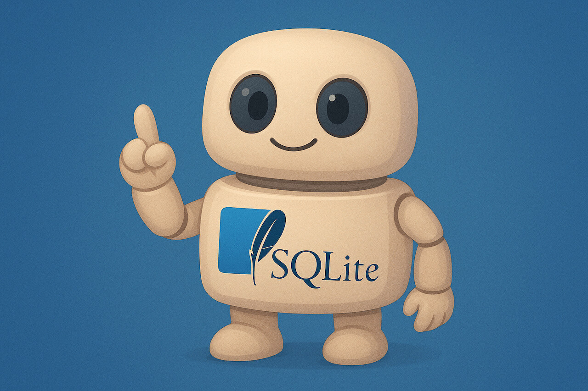

### Schedule

  - **Watch the lectures**
  - **Study the suggested material**
  - **Practice on the topics and share your questions**

### Study Plan

  

  Your instructor will share the video lectures with you. Here are the topics covered:

  - **Part 1:** Relational Databases - A Full stack overview 
  - **Part 2:** SQLite & The Database Murder Mystery

  You can find the lecture diagrams [here](https://github.com/in-tech-gration/WDX-180/tree/main/curriculum/week33/assets/day03){:target="_blank"}

  **Lecture Notes & Questions:**

  - CLI: `sqlite3`
    - `.help`
    - `.quit`
    - Create a new DB: `sqlite3 test.db`

  **Lecture Questions:**

  - What is the difference between SQL and MySQL?  
    - **SQL** is the Structured Query Language **standard**  
    - **MySQL** is a **Database** and a **variation of the SQL**  
      - **Software + SQL: a DB server that speaks a particular dialect of SQL**  
    - **SQLite is a Database software and a SQL dialect**  
    -  **MySQL, SQLite, PostgreSQL, SQL Server are RDBMS**  
  - What Database should I learn or use?  
    - Try to stick with either MySQL or **PostgreSQL (through Supabase)**  
      - *MariaDB is the open source version of MySQL*  
  - *After I install SQLite on Windows, there’s no sqlite3 or sqlite command available. What’s going on?*  
    - Check the PATH configuration:   
      - [https://www.tutorialspoint.com/sqlite/sqlite\_installation.htm](https://www.tutorialspoint.com/sqlite/sqlite_installation.htm){:target="_blank"}  
      - [https://www.linkedin.com/pulse/part-5-how-install-sqlite-your-machine-windows-linux-mac-julles/](https://www.linkedin.com/pulse/part-5-how-install-sqlite-your-machine-windows-linux-mac-julles/){:target="_blank"}  
      - [https://stackoverflow.com/a/46042259/4861760](https://stackoverflow.com/a/46042259/4861760){:target="_blank"}

  **References & Resources:**

  - Star this repo please: [https://github.com/NUKnightLab/sql-mysteries](https://github.com/NUKnightLab/sql-mysteries){:target="_blank"}  
  - Some cloud SQL services: [https://gist.github.com/bmaupin/0ce79806467804fdbbf8761970511b8c](https://gist.github.com/bmaupin/0ce79806467804fdbbf8761970511b8c){:target="_blank"}  
  - VSCode Extension: [SQLite Viewer](https://marketplace.visualstudio.com/items?itemName=qwtel.sqlite-viewer){:target="_blank"}  
  - [Visual JOIN](https://joins.spathon.com/){:target="_blank"}
  - [DB Browser for SQLite](https://sqlitebrowser.org/){:target="_blank"}  

### Summary

### Exercises

  - Solve the DB Mystery game: [https://in-tech-gration.github.io/database-mysteries/](https://in-tech-gration.github.io/database-mysteries/){:target="_blank"}

  - Design the Schema for what your Smartphone’s Contact table looks like and start adding entries and querying. Think how your phone will look up a number when you write the name. SMS => Emily => query => 6912345678 => Send message.   

  - Try the [Select Star SQL](https://in-tech-gration.github.io/WDX-180/curriculum/modules/backend/databases/sql/selectstarsql/){:target="_blank"} challenge (and give the project a star [here](https://github.com/zichongkao/selectstarsql){:target="_blank"})

### Extra Resources
