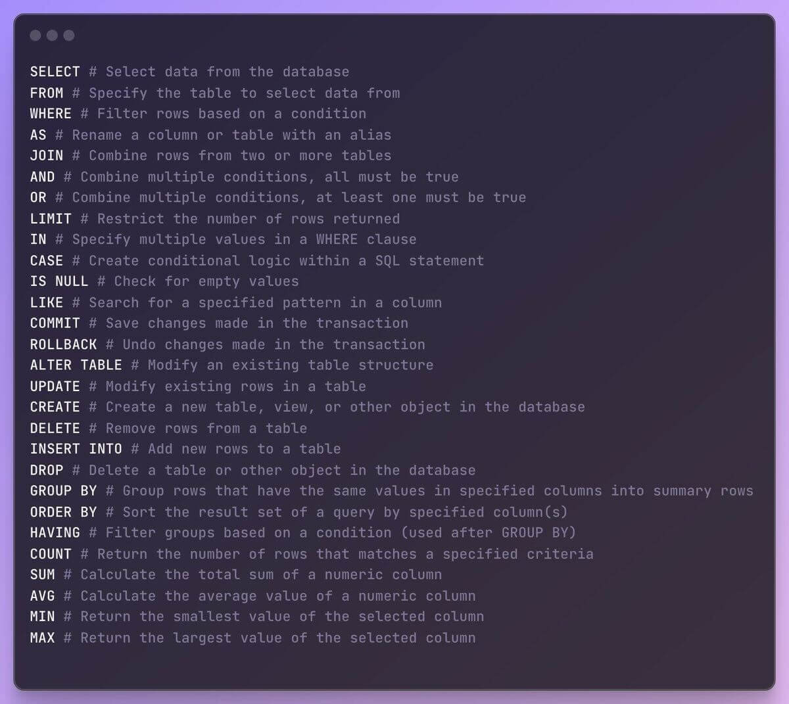

### Schedule

  - **Study the suggested material**
  - **Practice on the topics and share your questions**

### Study Plan

  

  Time to earn your first SQL certificate!

  Head over to the `Exercises` section below and start
  the Solo Learn SQL course.

### Summary

### Exercises

  - Time to earn your first SQL certificate! Try to complete the [Solo Learn SQL intro course](https://www.sololearn.com/en/learn/courses/sql-introduction){:target="_blank"}.

  - Done with SoloLearn? On with [SQLite Tutorial](https://www.tutorialspoint.com/sqlite/index.htm){:target="_blank"}.

  - **SQL Commands**

  

  - A nice resource for [SQL](https://www.atlassian.com/data/sql){:target="_blank"} and [SQL joins](https://www.atlassian.com/data/sql/sql-join-types-explained-visually){:target="_blank"} also check [inner join](https://dataschool.com/how-to-teach-people-sql/inner-join-animated/){:target="_blank"}

### Extra Resources
