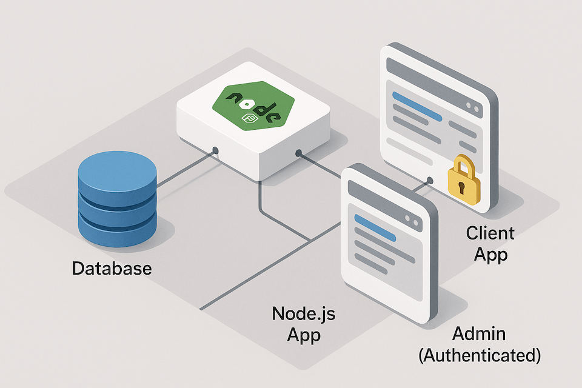

### Schedule

  - **Watch the lectures**
  - **Study the suggested material**
  - **Practice on the topics and share your questions**

### Study Plan

  

  Your instructor will share the video lectures with you. Here are the topics covered:

  - Going Fullstack: Connecting SQLite with our Node.js app

  **References & Resources:**

  - **Environment(al) variables:** are key/value pairs that are stored in a text file (usually prefixed with .env) and are read during build time and made available to either the Node.js or the Browser.  
  - **CAUTION:** Make sure to read the documentation and understand **how to set private env variables** that will only be available on the server (Node.js) and **how to set public env variables** (available in the Browser). Ensure that you are strictly following the documentation procedures. (Be extra cautious and careful with things like Vite, Create React App, Webpack)  
  - FE Frameworks:  
    - React  
    - Angular  
    - Vue  
  - Full Stack Frameworks:  
    - Next.js (React)  
    - Nest.js (Angular)  
    - Nuxt.js (Vue)  
  - [DB Browser](https://sqlitebrowser.org/){:target="_blank"}: a GUI for SQLite  
  - DB Beaver: [https://dbeaver.io](https://dbeaver.io){:target="_blank"} (also supports other databases)  
  - [**VSCode SQLite Viewer**](https://marketplace.visualstudio.com/items?itemName=qwtel.sqlite-viewer){:target="_blank"}  
  - SQLite3  
    - Show Table Schema: **PRAGMA table_info(table_name);**  
    - **Ctrl+L** will clear the sqlite console  
  - `npm install PACKAGE` will immediately install the PACKAGE and **run any post/pre build scripts**  
  - [**npq**](https://www.npmjs.com/package/npq){:target="_blank"} **install PACKAGE** runs some verifications before installing  
  - [Supabase](https://supabase.com){:target="_blank"}  
  - VSCode: fold on first level: Ctrl+K+1, second level: Ctrl+K+2, etc.

### Summary

### Exercises

  - **Read: [https://vitejs.dev/guide/env-and-mode](https://vitejs.dev/guide/env-and-mode){:target="_blank"} to learn all about the security measures and best practices**  
  - **SQLite Quick start: [https://sqlite.org/quickstart.html](https://sqlite.org/quickstart.html){:target="_blank"}**  
  - **Study** the [sqlite3](https://www.npmjs.com/package/sqlite3){:target="_blank"} package docs (API):   
  - Quick start example can be found here: [https://github.com/TryGhost/node-sqlite3#usage](https://github.com/TryGhost/node-sqlite3#usage){:target="_blank"}  
  - [https://github.com/TryGhost/node-sqlite3/wiki](https://github.com/TryGhost/node-sqlite3/wiki){:target="_blank"}  
    - [https://github.com/TryGhost/node-sqlite3/wiki/API](https://github.com/TryGhost/node-sqlite3/wiki/API){:target="_blank"}  
  - Challenge: change the “:memory:” value to something silly and Google for what the error that comes back mean: `Error: SQLITE_ERROR: table lorem already exists`...  
  - Learn more about Prepared Statements [https://en.wikipedia.org/wiki/Prepared_statement](https://en.wikipedia.org/wiki/Prepared_statement){:target="_blank"}  
    - Always use prepared Statements when the queries involve some kind of user input (CONSIDER ALL USER INPUT EVIL / GUILTY UNTIL PROVEN INNOCENT)  
  - **CHALLENGE:** Find out what the rowid is all about and it comes from. Check what the AS SQL operator does. 

### Extra Resources