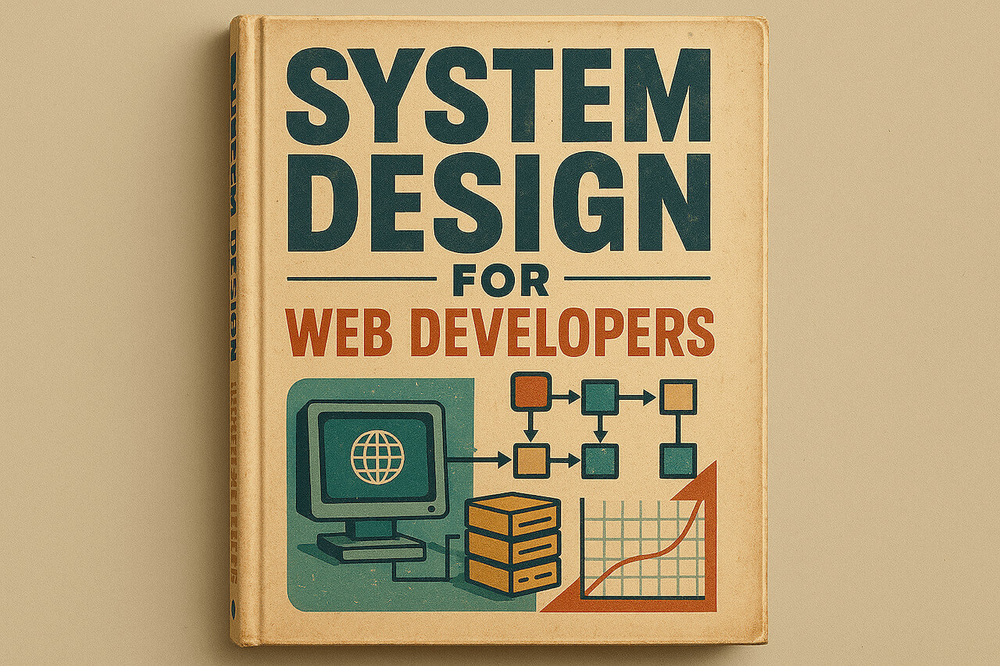

### Schedule

  - **Study the suggested material**
  - **Practice on the topics and share your questions**

### Study Plan

  

  Since we are going to be designing our Database soon, here are two really
  interesting videos that will walk you through designing a system 
  (an Instagram-like app in one case, a calendar app in the other). 
  
  You can learn a lot from this process, such as thinking about the system 
  from a high level and breaking it up in different modules and deciding 
  on the Database entities (tables) and Schema (columns and types).

  Enjoy and gain some insights!

  - [Design Instagram: 30'](https://www.youtube.com/watch?v=VJpfO6KdyWE){:target="_blank"} 

  - [Design Calendar Application: 25'](https://www.youtube.com/watch?v=39eAITqeu7g){:target="_blank"} 

### Summary

### Exercises

### Extra Resources
