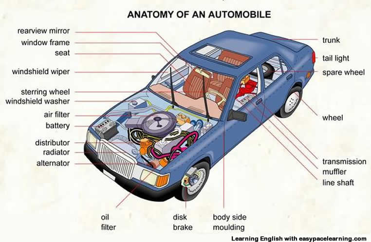

### Schedule

  - **Watch the lectures**
  - **Study the suggested material**
  - **Practice on the topics and share your questions**

### Study Plan

  

  Your instructor will share the video lectures with you. Here are the topics covered:

  - **Part 1:** Databases & ORMs (Object Relational Mapping)
  - **Part 2:** Modular architecture and creating and populating Database tables with data

  You can find the lecture code [here](https://github.com/in-tech-gration/build-a-cms-2024/tree/7a20932556ee71cef0efe498161aaadfcb0d2e17){:target="_blank"}

  **References & Resources:**

  - [Dark Reader Chrome and Firefox extension](https://chromewebstore.google.com/detail/dark-reader/eimadpbcbfnmbkopoojfekhnkhdbieeh?authuser=1){:target="_blank"}  
    - [GitHub](https://github.com/darkreader/darkreader){:target="_blank"}  
    - [**ORM: Object–relational mapping**](https://en.wikipedia.org/wiki/Object%E2%80%93relational_mapping){:target="_blank"}  
      - **Examples of ORMs:**  
        - [https://sequelize.org/](https://sequelize.org/){:target="_blank"}  
        - [https://www.npmjs.com/package/sqlite3orm\#selectinsertupdatedelete-using-daos](https://www.npmjs.com/package/sqlite3orm#selectinsertupdatedelete-using-daos){:target="_blank"}  
        - [https://www.npmjs.com/package/@mikro-orm/better-sqlite](https://www.npmjs.com/package/@mikro-orm/better-sqlite){:target="_blank"}  
        - [https://github.com/thebinarysearchtree/flyweight](https://github.com/thebinarysearchtree/flyweight){:target="_blank"}  
    - Modular Architecture  
      - [Think simple](https://o.quizlet.com/8.9Oa8PTRRKzrhUh-bE8mA_b.jpg){:target="_blank"}  
      - Google for  “modular architecture”

### Summary

### Exercises

  - Search for patterns to connect the web server module and the database module  
  - Study the `sqlite3` API documentation

### Extra Resources
