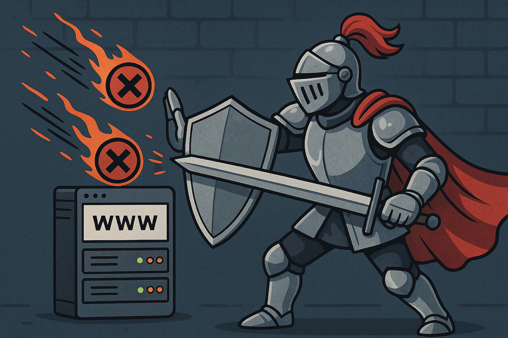

### Schedule

  - **Watch the lectures**
  - **Study the suggested material**
  - **Practice on the topics and share your questions**

### Study Plan

  

  Your instructor will share the video lectures with you. Here are the topics covered:

  - **Part 1:** Work on the Home Page Controller
  - **Part 2:** Authentication

  You can find the lecture code [here](https://github.com/in-tech-gration/build-a-cms-2024/tree/7ae3568842a082682b7c363eff0bd00ba856f486){:target="_blank"} and the diagrams [here](https://github.com/in-tech-gration/WDX-180/tree/main/curriculum/modules/javascript/misc/_w36d03/assets/day03/diagrams){:target="_blank"}.

  **Important:** The code link above, points to a particular commit in the repository. Click the `Code` => `Download Zip` button on GitHub, to download the code as it was in that exact commit.

  **Lecture Notes & Questions:**

  **References & Resources:**

  - Authentication (AuthN) vs Authorization (AuthZ)  
    - [https://www.cloudflare.com/learning/access-management/authn-vs-authz/](https://www.cloudflare.com/learning/access-management/authn-vs-authz/){:target="_blank"}

### Summary

### Exercises

### Extra Resources