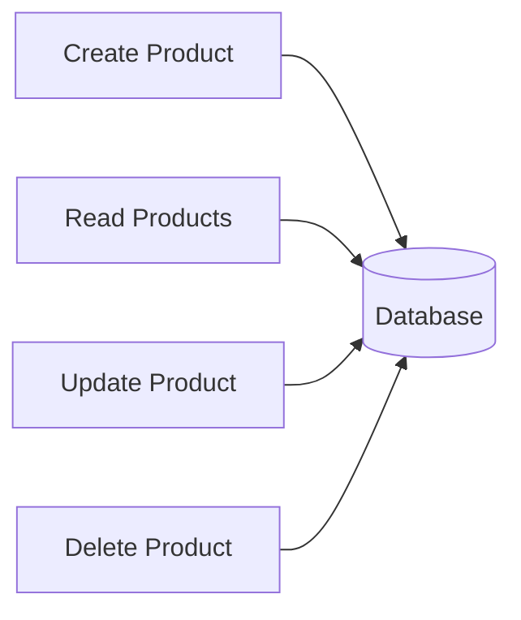
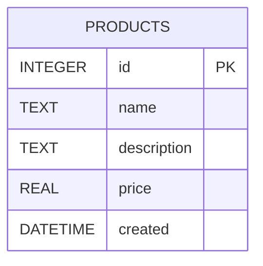
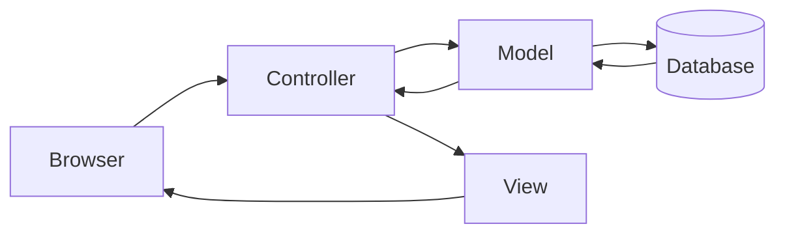
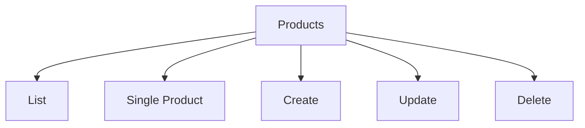
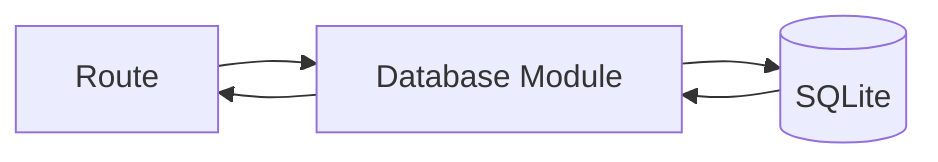

# Planning, Architecture & Diagrams

## From "Code That Works" to "Code That Scales"

> Most beginners think software development is writing code.
>
> Professional developers know software development is designing systems.

Yesterday, we built a small Express application.

Today, we're going to answer a more important question:

**"How do we stop this project from becoming a disaster in three weeks?"**

---

# Learning Objectives

By the end of this lesson, students will be able to:

* Understand software architecture fundamentals
* Explain separation of concerns
* Understand MVC architecture
* Design a relational database schema
* Understand primary keys and relationships
* Organize an Express application into modules
* Use Express Router
* Design route structures before implementation
* Create architecture diagrams
* Plan a CRUD application before writing code

---

# Why Planning Matters

Imagine building a house.

Would you:

1. Create blueprints first?
2. Start randomly placing bricks?

Most developers choose option #2 and then wonder why their application resembles a haunted shed.

---

## Software Engineering Reality

A typical project spends:

| Activity  | Time |
| --------- | ---- |
| Planning  | 20%  |
| Coding    | 30%  |
| Debugging | 50%  |

Good architecture dramatically reduces debugging.

---

# Part 1 — Understanding Our CMS

Before writing more code, let's define the problem.

Our CMS manages products.

Each product contains:

```text
ID
Name
Description
Price
Created Date
```

Example:

| ID | Name     | Price |
| -- | -------- | ----- |
| 1  | Keyboard | 49.99 |
| 2  | Mouse    | 19.99 |

---

# What Operations Do We Need?

Our CMS needs CRUD operations.



---

# Part 2 — Database Fundamentals

## What Is a Database?

A database is simply a system for storing information.

Think of Excel.

But:

* Faster
* More reliable
* Supports millions of records
* Multiple users can access it simultaneously

---

## Why SQLite?

We'll use SQLite because:

* Zero configuration
* Single file database
* Fast
* Great for learning
* Used in real-world products

Examples:

* Android
* iOS
* Chrome
* Firefox

All use SQLite internally.

---

# Understanding Tables

A table is like a spreadsheet.

Products Table:

| id | name     | description | price |
| -- | -------- | ----------- | ----- |
| 1  | Keyboard | Mechanical  | 49.99 |
| 2  | Mouse    | Wireless    | 19.99 |

---

# Primary Keys

Every table needs a unique identifier.

```sql
id INTEGER PRIMARY KEY
```

Example:

| id | name     |
| -- | -------- |
| 1  | Keyboard |
| 2  | Mouse    |
| 3  | Monitor  |

The ID uniquely identifies a record.

Think of it as a database passport number.

---

# Product Database Schema

Our first schema:

```sql
CREATE TABLE products (
    id INTEGER PRIMARY KEY AUTOINCREMENT,
    name TEXT NOT NULL,
    description TEXT,
    price REAL NOT NULL,
    created DATETIME DEFAULT CURRENT_TIMESTAMP
);
```

---

# Understanding the Schema

| Column      | Purpose            |
| ----------- | ------------------ |
| id          | Unique identifier  |
| name        | Product name       |
| description | Product details    |
| price       | Product price      |
| created     | Creation timestamp |

---

# Visualizing the Database



---

# Part 3 — Thinking Like an Architect

Most beginners create this:

```text
index.js
```

And then add:

```text
index.js
```

And then add:

```text
index.js
```

Until the file reaches 4,000 lines.

At this point the file becomes sentient and starts generating bugs.

---

# Better Organization

Instead:

```text
project/

├── routes/
├── views/
├── db/
├── public/
├── config/
└── index.js
```

Each folder has a single responsibility.

---

# Separation of Concerns

One of the most important principles in software engineering:

> A module should have one reason to change.

---

Bad:

```javascript
// route
// html
// sql
// css
// validation

// all mixed together
```

Good:

```text
Route handles requests

Database handles storage

View handles presentation
```

---

# Part 4 — MVC Architecture

Most web frameworks are based on MVC.

MVC means:

```text
Model
View
Controller
```

---

## Model

Responsible for:

```text
Data
Database
Business Logic
```

Examples:

```javascript
Product.findAll()
Product.create()
```

---

## View

Responsible for:

```text
HTML
UI
Templates
```

Examples:

```text
EJS
React
Vue
Angular
```

---

## Controller

Responsible for:

```text
Requests
Responses
Coordination
```

Example:

```javascript
app.get('/products', controller);
```

---

# MVC Diagram



---

# MVC in Our Project

## Model

Later:

```javascript
Product
```

---

## View

Current:

```text
EJS Templates
```

---

## Controller

Current:

```javascript
app.get(...)
app.post(...)
```

---

# Part 5 — Express Router

Yesterday everything lived in:

```javascript
index.js
```

That won't scale.

---

## Router Concept

Instead of:

```javascript
app.get(...)
app.get(...)
app.get(...)
app.get(...)
app.get(...)
```

We create route modules.

---

# Example Structure

```text
routes/

products.js
users.js
admin.js
```

---

# Product Router

```javascript
const express = require('express');

const router = express.Router();

router.get('/', (req, res) => {
    res.send('All Products');
});

module.exports = router;
```

---

# Register Router

```javascript
const productsRouter = require('./routes/products');

app.use('/products', productsRouter);
```

---

Result:

```text
/products
```

is handled by:

```text
routes/products.js
```

---

# Visualizing Route Flow


---

# Part 6 — Designing Routes Before Coding

Good developers design routes first.

---

## Product Routes

| Method | URL                  | Purpose   |
| ------ | -------------------- | --------- |
| GET    | /products            | List all  |
| GET    | /products/:id        | View one  |
| GET    | /products/create     | Show form |
| POST   | /products/create     | Save      |
| GET    | /products/edit/:id   | Edit form |
| POST   | /products/edit/:id   | Update    |
| POST   | /products/delete/:id | Delete    |

---

# Route Diagram



---

# Part 7 — Planning Views

Before creating templates, define them.

```text
views/

index.ejs
product/

    list.ejs
    single.ejs
    create.ejs
    edit.ejs
```

---

# Why This Structure?

Without structure:

```text
views/

index.ejs
index2.ejs
productPage.ejs
newProduct.ejs
test.ejs
```

Nobody knows what's happening.

Not even the person who wrote it.

Especially not the person who wrote it.

---

# Part 8 — Planning Database Access

Soon we'll add:

```text
db/

db.js
setup.js
```

---

## db.js

Responsible for:

```text
Connecting to SQLite
```

---

## setup.js

Responsible for:

```text
Creating tables
Seeding sample data
```

---

# Future Database Flow



---

# Part 9 — Node.js SQLite

Node.js now includes a built-in SQLite module.

Documentation:

[Node.js SQLite Documentation](https://nodejs.org/api/sqlite.html?utm_source=chatgpt.com)

We'll begin with SQLite fundamentals first and later compare:

* Raw SQL
* SQLite APIs
* Sequelize ORM

Understanding SQL before ORM is critical.

Otherwise ORMs become magic spells rather than tools.

---

# Architecture Review

Current:

```text
Browser
   ↓
Express
   ↓
EJS
```

---

Soon:

```text
Browser
   ↓
Express
   ↓
Router
   ↓
Controller
   ↓
Database
   ↓
SQLite
```

---

# Assignment

## Exercise 1

Create the following folder structure:

```text
project/

routes/
views/
public/
db/
config/
```

---

## Exercise 2

Move your homepage route into:

```text
routes/products.js
```

using Express Router.

---

## Exercise 3

Create placeholder routes:

```text
GET /products
GET /products/create
GET /products/1
GET /products/edit/1
```

Return simple text responses.

Example:

```text
Product List
```

```text
Create Product
```

etc.

---

## Exercise 4

Create a database design document.

Example:

| Column      | Type    |
| ----------- | ------- |
| id          | INTEGER |
| name        | TEXT    |
| description | TEXT    |
| price       | REAL    |

---

## Bonus Challenge

Design the schema for a future Users table:

```text
users
```

Think about:

* username
* email
* password
* created date

What fields should be required?

What fields should be unique?

---

# Key Takeaways

Today you learned:

* Why architecture matters
* Separation of concerns
* MVC fundamentals
* Database schema design
* Primary keys
* Express Router
* Route planning
* View planning
* Application structure

Tomorrow we stop drawing diagrams and start storing real data in SQLite.

The database will finally enter the chat. 😄
