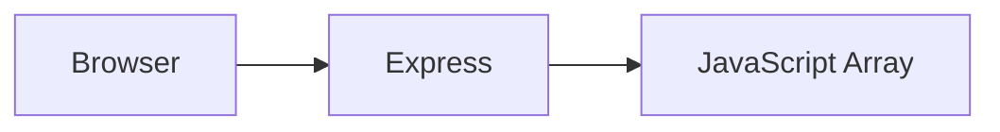
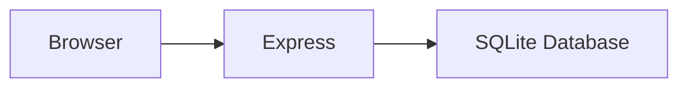
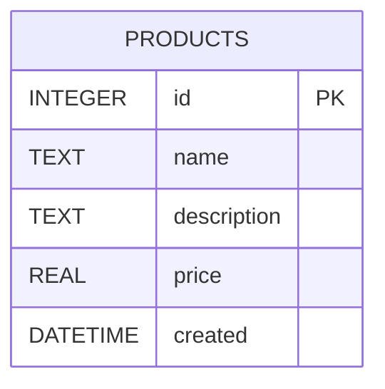
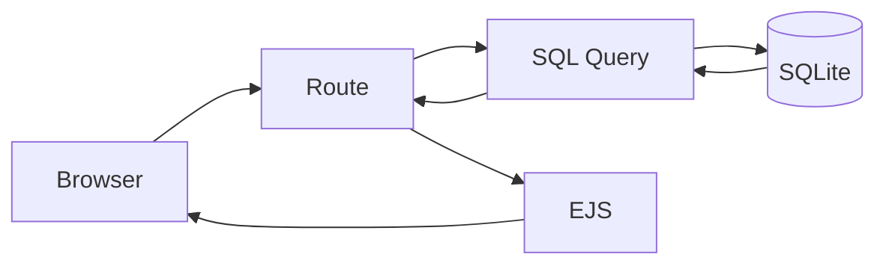

# Public Routes & Basic CRUD

## Building a Real Database-Driven Application

> Yesterday we designed the blueprint.
>
> Today we start pouring concrete.

Up until now, our products have lived inside JavaScript arrays:

```javascript
const products = [
  { id: 1, name: 'Keyboard' },
  { id: 2, name: 'Mouse' }
];
```

This works until:

* The server restarts
* The application crashes
* Your laptop explodes
* A user actually wants to save data

Today we solve that problem.

---

# Learning Objectives

By the end of this lesson, students will be able to:

* Create a SQLite database
* Design and create tables
* Seed a database with sample data
* Connect Express to SQLite
* Execute SQL queries
* Display records using EJS
* Understand basic CRUD database operations
* Separate database logic from routes
* Build the "Read" portion of a CMS

---

# What We Are Building Today

Our application currently looks like this:



By the end of today:



We're replacing fake data with real persistence.

---

# Part 1 — What Is SQLite?

SQLite is a relational database engine.

Unlike:

* MySQL
* PostgreSQL
* SQL Server

SQLite stores everything in a single file.

Example:

```text
products.sqlite
```

That's the entire database.

No server.

No installation.

No configuration.

No sacrifices to the DevOps gods.

---

# Why SQLite?

For learning and small applications, SQLite is fantastic.

Advantages:

* Extremely lightweight
* Fast
* Easy setup
* Portable
* Used in production by major companies

Examples:

* Chrome
* Firefox
* Android
* iOS
* Discord

---

# Part 2 — Creating Our Database Structure

Create:

```text
db/

db.js
setup.js
products.sqlite
```

---

# Project Structure

```text
express-crud/

├── db/
│   ├── db.js
│   ├── setup.js
│   └── products.sqlite

├── routes/
├── views/
├── public/

└── index.js
```

---

# Part 3 — Database Schema Design

Our Products table:

```sql
CREATE TABLE products (
    id INTEGER PRIMARY KEY AUTOINCREMENT,
    name TEXT NOT NULL,
    description TEXT,
    price REAL NOT NULL,
    created DATETIME DEFAULT CURRENT_TIMESTAMP
);
```

---

# Understanding the Schema

| Column      | Type     | Purpose            |
| ----------- | -------- | ------------------ |
| id          | INTEGER  | Unique ID          |
| name        | TEXT     | Product name       |
| description | TEXT     | Product details    |
| price       | REAL     | Product price      |
| created     | DATETIME | Creation timestamp |

---

# Database Diagram



---

# Part 4 — Creating the Database

## db/setup.js

```javascript
const sqlite = require('node:sqlite');
const path = require('node:path');

const dbPath = path.join(__dirname, 'products.sqlite');

const db = new sqlite.DatabaseSync(dbPath);

db.exec(`
CREATE TABLE IF NOT EXISTS products (
    id INTEGER PRIMARY KEY AUTOINCREMENT,
    name TEXT NOT NULL,
    description TEXT,
    price REAL NOT NULL,
    created DATETIME DEFAULT CURRENT_TIMESTAMP
);
`);

console.log('Database created successfully.');
```

---

# Running Setup

```bash
node db/setup.js
```

After running:

```text
products.sqlite
```

appears inside your db folder.

Congratulations.

You now own a database.

---

# Part 5 — Seeding Sample Data

A database without data is just an expensive empty notebook.

Let's add products.

---

## db/setup.js

Extend it:

```javascript
db.exec(`
INSERT INTO products (name, description, price)
VALUES
('Mechanical Keyboard', 'RGB Gaming Keyboard', 89.99),

('Wireless Mouse', 'Bluetooth Mouse', 24.99),

('27 Inch Monitor', '4K IPS Display', 349.99);
`);
```

---

# Verify the Data

Install VSCode SQLite Viewer.

Open:

```text
products.sqlite
```

You should see:

| id | name                |
| -- | ------------------- |
| 1  | Mechanical Keyboard |
| 2  | Wireless Mouse      |
| 3  | 27 Inch Monitor     |

---

# Part 6 — Creating a Database Connection Module

Never connect directly inside routes.

Bad:

```javascript
router.get('/', () => {

   const db = ...

});
```

Very quickly this becomes chaos.

---

## db/db.js

```javascript
const sqlite = require('node:sqlite');
const path = require('node:path');

const dbPath = path.join(__dirname, 'products.sqlite');

const db = new sqlite.DatabaseSync(dbPath);

module.exports = db;
```

---

# Why Create a Shared Connection?

Benefits:

* Reusable
* Centralized
* Easier maintenance
* Easier testing

Professional software engineers avoid duplication whenever possible.

---

# Part 7 — Creating Product Routes

## routes/products.js

```javascript
const express = require('express');
const db = require('../db/db');

const router = express.Router();
```

---

# Querying All Products

```javascript
router.get('/', (req, res) => {

    const stmt = db.prepare(`
        SELECT *
        FROM products
        ORDER BY id DESC
    `);

    const products = stmt.all();

    res.render('products/list', {
        title: 'Products',
        products
    });

});
```

---

# What Happens Here?



---

# Part 8 — Registering the Router

## index.js

```javascript
const productsRouter = require('./routes/products');

app.use('/products', productsRouter);
```

Now:

```text
http://localhost:3000/products
```

loads products from SQLite.

Not JavaScript arrays.

Not hardcoded values.

Real database records.

---

# Part 9 — Rendering Products

## views/products/list.ejs

```html
<h2>Products</h2>

<table>

  <thead>
    <tr>
      <th>ID</th>
      <th>Name</th>
      <th>Price</th>
    </tr>
  </thead>

  <tbody>

    <% products.forEach(product => { %>

      <tr>
        <td><%= product.id %></td>
        <td><%= product.name %></td>
        <td>$<%= product.price %></td>
      </tr>

    <% }) %>

  </tbody>

</table>
```

---

# Result

Instead of:

```javascript
const products = [...]
```

we now have:

```sql
SELECT *
FROM products
```

Powerful difference.

The data survives application restarts.

---

# Part 10 — Understanding SQL SELECT

Most CRUD applications spend 90% of their time reading data.

Understanding SELECT is critical.

---

# Select Everything

```sql
SELECT *
FROM products;
```

---

# Select Specific Columns

```sql
SELECT
    id,
    name
FROM products;
```

---

# Sort Results

```sql
SELECT *
FROM products
ORDER BY price DESC;
```

---

# Filter Results

```sql
SELECT *
FROM products
WHERE price > 100;
```

---

# Limit Results

```sql
SELECT *
FROM products
LIMIT 10;
```

---

# Part 11 — Adding Sorting

Let's allow sorting.

Example:

```text
/products?sort=name
```

---

## Route

```javascript
router.get('/', (req, res) => {

    const sort = req.query.sort || 'id';

    const allowed = [
        'id',
        'name',
        'price'
    ];

    const column = allowed.includes(sort)
        ? sort
        : 'id';

    const stmt = db.prepare(`
        SELECT *
        FROM products
        ORDER BY ${column}
    `);

    const products = stmt.all();

    res.render('products/list', {
        products
    });

});
```

---

# Why Validation Matters

Never trust user input.

Bad:

```javascript
ORDER BY ${req.query.sort}
```

Could lead to SQL injection.

Always whitelist allowed values.

---

# Part 12 — Adding Product Count

Example:

```javascript
const countStmt = db.prepare(`
    SELECT COUNT(*) AS total
    FROM products
`);

const result = countStmt.get();
```

Result:

```javascript
{
   total: 3
}
```

---

Display:

```html
<p>Total Products: <%= total %></p>
```

---

# Part 13 — Route Planning for Tomorrow

Today:

```text
GET /products
```

Tomorrow:

```text
GET /products/:id
```

---

Future:

```text
GET /products/create
POST /products/create

GET /products/edit/:id
POST /products/edit/:id

POST /products/delete/:id
```

We are gradually building toward full CRUD.

---

# Common Beginner Mistakes

## 1. Running setup.js Multiple Times

This:

```sql
INSERT ...
```

runs every time.

You may accidentally create duplicates.

---

## 2. Creating Database Connections Everywhere

Bad:

```javascript
new Database()
new Database()
new Database()
```

Use one shared connection.

---

## 3. Forgetting to Create Views

Error:

```text
Failed to lookup view
```

Usually means:

```text
views/products/list.ejs
```

does not exist.

---

## 4. Using User Input in SQL

Never:

```javascript
ORDER BY ${req.query.column}
```

without validation.

---

# Assignment

## Exercise 1

Create:

```text
products.sqlite
```

and the Products table.

---

## Exercise 2

Seed at least:

```text
10 products
```

with realistic data.

---

## Exercise 3

Create:

```text
GET /products
```

that reads all products from SQLite.

---

## Exercise 4

Render the results in an HTML table.

---

## Exercise 5

Add sorting by:

```text
id
name
price
```

using query parameters.

---

# Bonus Challenge

Create:

```text
GET /products/expensive
```

that only shows products costing:

```text
100+
```

using:

```sql
WHERE price >= 100
```

---

# Key Takeaways

Today you learned:

* What SQLite is
* How databases persist data
* How to create tables
* How to seed data
* How to connect Express to SQLite
* How to execute SQL queries
* How to render database records in EJS
* How to validate sorting parameters
* How to build the Read part of CRUD
