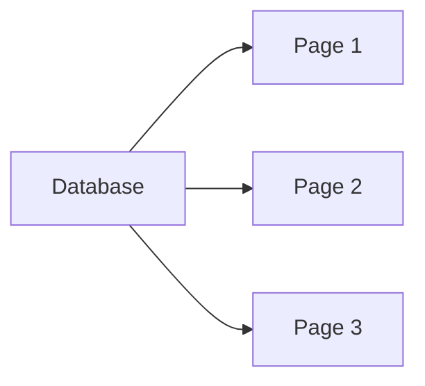

# Pagination

## Managing Large Amounts of Data

> Every application works perfectly with 5 records.
>
> The real test begins with 5,000.

Our CMS currently displays every product:

```sql
SELECT *
FROM products
```

This works until:

* The table contains hundreds of records
* The page becomes slow
* Users spend 20 minutes scrolling
* Your browser starts negotiating overtime pay

Today we solve that problem with pagination.

---

# Learning Objectives

By the end of this lesson, students will be able to:

* Understand why pagination exists
* Implement OFFSET/LIMIT pagination
* Calculate page numbers
* Read query parameters
* Generate pagination links
* Display page counts
* Handle edge cases
* Understand the limitations of OFFSET pagination
* Compare OFFSET and Cursor Pagination

---

# Part 1 — The Problem

Imagine:

```text
Products Table

1
2
3
...
9999
```

Current query:

```sql
SELECT *
FROM products
```

Returns:

```text
9999 rows
```

Bad idea.

---

# Problems Without Pagination

## Performance

Database:

```text
Returns 9999 records
```

Server:

```text
Processes 9999 records
```

Browser:

```text
Renders 9999 rows
```

Everyone loses.

---

## User Experience

Imagine Amazon showing:

```text
1,000,000 products
```

on one page.

Users would scroll until retirement.

---

# What Is Pagination?

Pagination divides data into pages.

Example:

```text
Page 1

1-10
```

```text
Page 2

11-20
```

```text
Page 3

21-30
```

---

Visualization:



---

# Part 2 — SQL LIMIT

SQLite supports:

```sql
LIMIT
```

Example:

```sql
SELECT *
FROM products
LIMIT 10;
```

Result:

```text
Only 10 records
```

---

# OFFSET

OFFSET tells SQLite:

```text
Skip rows
```

Example:

```sql
SELECT *
FROM products
LIMIT 10
OFFSET 20;
```

Meaning:

```text
Skip first 20 rows

Return next 10 rows
```

---

Visualization:

```text
Rows

1
2
3
...
20 ← skipped

21 ← start
22
23
...
30
```

---

# Part 3 — Understanding Page Calculations

Assume:

```text
10 items per page
```

---

Page 1

```text
OFFSET = 0
```

---

Page 2

```text
OFFSET = 10
```

---

Page 3

```text
OFFSET = 20
```

---

Formula:

```text
(page - 1) * limit
```

Example:

```text
(3 - 1) * 10

20
```

---

# Part 4 — Reading Query Parameters

URL:

```text
/products?page=3
```

Express:

```javascript
const page = Number(req.query.page) || 1;
```

Result:

```javascript
page === 3
```

---

# Part 5 — Building Pagination

First, let's update our `db/setup.js` seeding script to add 30 more 
dummy products and be able to test our pagination:

```js
// Let's create 30 rows to test pagination:
for (let i = 1; i <= 30; i++) {
  db.exec(`
    INSERT INTO products (name, description, price)
    VALUES
    ('Product ${i}', 'Description for product ${i}', ${(i * 10).toFixed(2)});
    `);
}

console.log('Database created successfully.');
```

Route:

```javascript
router.get('/', (req, res) => {

    const page = Number(req.query.page) || 1;
    const limit = 10;
    const offset = (page - 1) * limit;

    const stmt = db.prepare(`
        SELECT *
        FROM products
        ORDER BY id DESC
        LIMIT ?
        OFFSET ?
    `);

    const products = stmt.all(limit, offset);

    res.render('products/list',
        {
          // ...
          products,
          page
        }
    );

});
```

---

# What Happens?

Page 1:

```sql
LIMIT 10
OFFSET 0
```

---

Page 2:

```sql
LIMIT 10
OFFSET 10
```

---

Page 3:

```sql
LIMIT 10
OFFSET 20
```

---

# Part 6 — Total Record Count

Pagination requires knowing:

```text
How many records exist?
```

---

Query:

```sql
SELECT COUNT(*) AS total
FROM products
```

---

Repository:

```javascript
function count() {

    const stmt = db.prepare(`
        SELECT COUNT(*) AS total
        FROM products
    `);

    return stmt.get().total;

}
```

---

Example:

```javascript
150
```

products.

---

# Part 7 — Total Pages

Formula:

```text
totalRecords / pageSize
```

Not quite.

---

Problem:

```text
151 / 10

15.1 pages
```

Impossible.

---

Use:

```javascript
Math.ceil(totalRecords / limit)
```

---

Example:

```javascript
Math.ceil(151 / 10)

16
```

Perfect.

---

# Part 8 — Generating Page Numbers

Route:

```javascript
const totalRecords = productRepository.count();
const totalPages = Math.ceil(totalRecords / limit);
```

---

Pass:

```javascript
res.render('products/list',
    {
      // ...
      products,
      page,
      totalPages
    }
);
```

---

# Part 9 — Rendering Pagination Links

View:

```html
<nav>
  <% for ( let i = 1; i <= totalPages; i++ ) { %>
    <a href="/products?page=<%= i %>">
      <%= i %>
    </a>
  <% } %>
</nav>
```

---

Result:

```text
1 2 3 4 5 6 7
```

---

# Highlight Current Page

```html
<% if(i === page) { %>

<strong>
    <%= i %>
</strong>

<% } else { %>

<a href="/products?page=<%= i %>">
    <%= i %>
</a>

<% } %>
```

---

Result:

```text
1 2 [3] 4 5 6
```

---

# Part 10 — Previous and Next Links

Previous:

```html
<% if (page > 1) { %>
  <a href="/products?page=<%= page - 1 %>">Previous</a>
<% } %>
```

---

Next:

```html
<% if (page < totalPages) { %>
  <a href="/products?page=<%= page + 1 %>">Next</a>
<% } %>
```

---

Result:

```text
Previous

1 2 3 4 5

Next
```

---

# Part 11 — Validation

Bad URL:

```text
/products?page=-999
```

---

Bad URL:

```text
/products?page=banana
```

---

Validation:

```javascript
let page = Number(req.query.page);

if (
    !Number.isInteger(page)
    || page < 1
) {
    page = 1;
}
```

---

# Page Too Large

Example:

```text
/products?page=999999
```

---

Fix:

```javascript
if (page > totalPages) {
    page = totalPages;
}
```

---

# Part 12 — Extracting Repository Functions

Repository:

```javascript
function findPage( page, limit ) {

    const offset = (page - 1) * limit;
    const stmt = db.prepare(`
        SELECT *
        FROM products
        ORDER BY id DESC
        LIMIT ?
        OFFSET ?
    `);

    return stmt.all(
        limit,
        offset
    );

}
```

---

Route:

```javascript
const products = productRepository.findPage(
  page,
  limit
);
```

Cleaner.

---

# Part 13 — Offset Pagination Limitations

Offset pagination is simple.

But it has drawbacks.

Imagine:

```text
1 million rows
```

---

Page:

```text
100,000
```

requires:

```sql
OFFSET 999990
```

SQLite must still skip nearly a million rows.

Expensive.

---

# Cursor Pagination

Large applications often use:

```text
Cursor Pagination
```

instead.

Example:

```text
/products?after=120
```

SQL:

```sql
SELECT *
FROM products
WHERE id > 120
LIMIT 10
```

---

Used by:

* Instagram
* Twitter/X
* Facebook
* YouTube APIs
* GitHub APIs

We'll stick with OFFSET pagination for now because it's easier to learn.

---

# Part 14 — Improving User Experience

Show:

```html
<p>

Showing page

<%= page %>

of

<%= totalPages %>

</p>
```

---

Example:

```text
Showing page 3 of 15
```

---

Show totals:

```html
<p>

Total Products:

<%= totalRecords %>

</p>
```

---

Users appreciate context.

---

# Common Beginner Mistakes

## Forgetting ORDER BY

Bad:

```sql
SELECT *
FROM products
LIMIT 10
```

Results may appear in unexpected order.

Always:

```sql
ORDER BY id DESC
```

or another explicit column.

---

## Trusting Query Parameters

Bad:

```javascript
const page = req.query.page;
```

Validate everything.

---

## Using OFFSET Without LIMIT

Bad:

```sql
OFFSET 10
```

Always pair with LIMIT.

---

## Calculating Total Pages Incorrectly

Bad:

```javascript
total / limit
```

Use:

```javascript
Math.ceil(...)
```

---

# Bonus Challenge

Allow users to choose:

```text
10 per page
25 per page
50 per page
100 per page
```

Example:

```text
/products?page=2&limit=25
```

Validate the limit against an allowed list:

```javascript
const allowed = [
    10,
    25,
    50,
    100
];
```

Never trust arbitrary limits from users.

Otherwise someone eventually discovers:

```text
/products?limit=999999999
```

and your server begins reconsidering its life choices.

---

# Key Takeaways

Today you learned:

* Why pagination exists
* LIMIT and OFFSET
* Query parameters
* Calculating offsets
* Counting records
* Total page calculations
* Rendering pagination links
* Previous/Next navigation
* Validation
* Offset vs Cursor pagination

Most CRUD applications eventually need pagination. It's one of those features that seems trivial until you discover your database contains 500,000 rows and your browser tab has become a space heater.

---

⚠️ A large part of the content of this module was created using Generative AI (ChatGPT). The synthetic (AI-generated) content was reviewed and curated by Kostas Minaidis.

