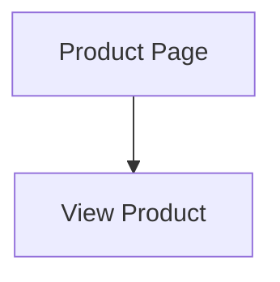
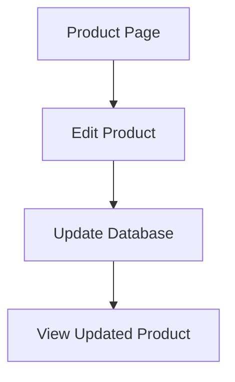

# Updating Products (UPDATE)

## Completing the Second Quarter of CRUD

> Creating data is exciting.
>
> Updating data is where reality begins.

In the real world:

* Product prices change
* Descriptions improve
* Inventory evolves
* Mistakes happen

Lots of mistakes.

If your application can only create products, eventually users start creating:

```text
Keyboard
Keyboard v2
Keyboard v3
Keyboard FINAL
Keyboard FINAL FINAL
Keyboard FINAL USE THIS ONE
```

Congratulations.

You've accidentally recreated Microsoft Word document versioning.

Today we learn how to update existing records properly.

---

# Learning Objectives

By the end of this lesson, students will be able to:

* Understand the Update portion of CRUD
* Build edit forms
* Pre-populate forms with existing data
* Process update requests
* Execute SQL UPDATE statements
* Validate incoming data
* Handle missing records
* Reuse form templates
* Understand optimistic thinking versus defensive programming

---

# What We Are Building

Current:



After today:



---

# Part 1 — Understanding UPDATE

Creating records:

```sql 
INSERT INTO products (...)
```

adds new data.

---

Updating records:

```sql 
UPDATE products
SET ...
WHERE ...
```

modifies existing data.

---

Example:

Before:

```text
Mechanical Keyboard

$89.99
```

---

After:

```text
Mechanical Keyboard Pro

$99.99
```

Same record.

New values.

---

# Part 2 — SQL UPDATE

Basic syntax:

```sql
UPDATE products

SET
    name = ?,
    description = ?,
    price = ?

WHERE id = ?
```

---

Very important:

```sql
WHERE id = ?
```

Without it:

```sql 
UPDATE products
SET price = 0
```

becomes:

```text
Every product now costs $0
```

Customers love this.

Management usually does not.

---

# Part 3 — The Edit Route

URL:

```text
/products/edit/5
```

---

Route:

```javascript
router.get('/edit/:id', (req, res) => {

    const product =
        productRepository.findById(
            req.params.id
        );

    if (!product) {

        return res
            .status(404)
            .render('404');

    }

    res.render(
        'products/edit',
        {
            product
        }
    );

});
```

---

# Why Load the Product First?

Users need to see:

```text
Current Values
```

before editing.

---

Without loading:

```html
Name:

[____________]
```

---

With loading:

```html
Name:

[Mechanical Keyboard]
```

Much better.

---

# Part 4 — Building the Edit Form

## views/products/edit.ejs

```html
<h2>Edit Product</h2>

<form
    action="/products/edit/<%= product.id %>"
    method="post"
>

    <div>

        <label>Name</label>

        <input
            type="text"
            name="name"
            value="<%= product.name %>"
        >

    </div>

    <div>

        <label>Description</label>

        <textarea
            name="description"
        ><%= product.description %></textarea>

    </div>

    <div>

        <label>Price</label>

        <input
            type="number"
            step="0.01"
            name="price"
            value="<%= product.price %>"
        >

    </div>

    <button type="submit">
        Save Changes
    </button>

</form>
```

---

# Understanding Pre-Populated Forms

The form displays:

```html
value="<%= product.name %>"
```

instead of:

```html
value=""
```

This is how nearly every edit form on the internet works.

---

# Part 5 — Processing Updates

Route:

```javascript
router.post('/edit/:id', (req, res) => {

    const {
        name,
        description,
        price
    } = req.body;

    const id =
        req.params.id;

    productRepository.update(
        id,
        name,
        description,
        price
    );

    res.redirect(
        `/products/${id}`
    );

});
```

---

# Repository Function

```javascript
function update(
    id,
    name,
    description,
    price
) {

    const stmt = db.prepare(`
        UPDATE products

        SET
            name = ?,
            description = ?,
            price = ?

        WHERE id = ?
    `);

    return stmt.run(
        name,
        description,
        price,
        id
    );

}
```

---

# What Does run() Return?

Example:

```javascript
{
    changes: 1
}
```

Meaning:

```text 
1 row updated
```

---

If:

```javascript
{
    changes: 0
}
```

then nothing changed.

Possibly because the product doesn't exist.

---

# Part 6 — Validation

Updating requires validation just like creating.

---

Bad:

```javascript
{
    name: '',
    price: ''
}
```

---

Bad:

```javascript
{
    name: 'Keyboard',
    price: -100
}
```

---

Validation:

```javascript
if (!name) {

    return res.render(
        'products/edit',
        {
            error:
                'Name is required.',
            product: req.body
        }
    );

}
```

---

Price Validation:

```javascript
const numericPrice =
    Number(price);

if (
    Number.isNaN(
        numericPrice
    )
) {

    return res.render(...);

}
```

---

# Part 7 — Preserving User Input

Suppose:

```text
Name OK

Price Invalid
```

Validation fails.

---

Bad UX:

```text
All form data disappears
```

---

Good UX:

```javascript
res.render(
    'products/edit',
    {
        error:
            'Invalid price',

        product: {
            id,
            name,
            description,
            price
        }
    }
);
```

---

The form remains populated.

Users remain calm.

---

# Part 8 — Adding Edit Links

Product page:

```html
<a
href="/products/edit/<%= product.id %>"
>

Edit Product

</a>
```

---

List page:

```html
<a
href="/products/edit/<%= product.id %>"
>

Edit

</a>
```

---

Now editing is accessible everywhere.

---

# Part 9 — Reusing Forms

Notice:

```text
create.ejs
```

and

```text
edit.ejs
```

look almost identical.

---

Professional developers avoid duplication.

---

Example Partial:

```text
views/products/_form.ejs
```

---

```html
<input
    name="name"
    value="<%= product?.name || '' %>"
>
```

---

Create:

```html
<%- include(
    '_form',
    {
        product: {}
    }
) %>
```

---

Edit:

```html
<%- include(
    '_form',
    {
        product
    }
) %>
```

---

One form.

Two use cases.

Less maintenance.

---

# Part 10 — Understanding Idempotency

Interesting concept:

---

Create:

```http
POST /products/create
```

twice

creates:

```text
Two Products
```

---

Update:

```http
POST /products/edit/5
```

with same values twice

results in:

```text
Same Product State
```

---

This property is called:

```text
Idempotency
```

A useful concept for APIs.

---

# Part 11 — Defensive Programming

Imagine:

```text
/products/edit/999999
```

---

Repository:

```javascript
const result =
    productRepository.update(...);
```

---

Check:

```javascript
if(
    result.changes === 0
) {

    return res
        .status(404)
        .render('404');

}
```

Never assume records exist.

Verify.

---

# Part 12 — Audit Thinking

Imagine:

```text 
Original Price

$100
```

---

User changes:

```text 
$10
```

---

Question:

```text 
Who changed it?
When?
Why?
```

Most CRUD tutorials ignore this.

Real businesses care deeply.

---

Future systems often add:

```sql
updated_at
updated_by
```

columns.

We'll keep things simple for now.

---

# Common Beginner Mistakes

## Forgetting WHERE

Bad:

```sql 
UPDATE products
SET price = 0
```

Dangerous.

---

## Not Checking Existence

Bad:

```javascript 
update(id)
```

without verifying product exists.

---

## Repeating Form Code

Create and Edit forms often become duplicates.

Extract shared partials.

---

## Skipping Validation

Updates require validation just as much as creation.

---

## Trusting Route Parameters

Validate:

```javascript 
req.params.id
```

before using them.

---

# Assignment

## Exercise 1

Create:

```text 
GET /products/edit/:id
```

that loads an edit form.

---

## Exercise 2

Create:

```text 
POST /products/edit/:id
```

that updates the database.

---

## Exercise 3

Validate:

* name
* description
* price

before saving.

---

## Exercise 4

Redirect users back to:

```text 
/products/:id
```

after updating.

---

## Exercise 5

Extract shared form fields into:

```text 
_form.ejs
```

partial.

---

# Bonus Challenge

Add:

```sql 
updated_at
```

to the table.

Schema:

```sql 
ALTER TABLE products

ADD COLUMN updated_at DATETIME;
```

---

Update query:

```sql 
UPDATE products

SET
    name = ?,
    description = ?,
    price = ?,
    updated_at =
        CURRENT_TIMESTAMP

WHERE id = ?
```

Display:

```text 
Last Updated:
```

on the product page.

This is the first step toward real audit tracking.

---

# Key Takeaways

Today you learned:

* SQL UPDATE
* Edit forms
* Pre-populated forms
* Validation during updates
* Redirects
* Shared form partials
* Idempotency
* Defensive programming
* Audit thinking

At this point, your CMS can:

```text
Create Products
Read Products
Update Products
```

Three quarters of CRUD are complete.

The application is beginning to resemble the core of a real content management system rather than a collection of isolated pages.

---

⚠️ A large part of the content of this module was created using Generative AI (ChatGPT). The synthetic (AI-generated) content was reviewed and curated by Kostas Minaidis.
