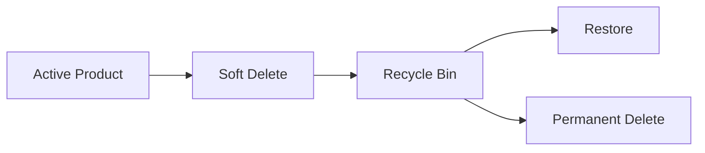

# Deleting Products (DELETE)

## Completing CRUD

> Creating data is easy.
>
> Updating data is common.
>
> Deleting data is where developers become nervous.

There is a reason many enterprise systems make deletion difficult.

Deleting data is often irreversible.

One careless query can transform:

```text id="4u3v5z"
10,000 products
```

into:

```text id="uqr4m5"
0 products
```

faster than you can say:

```text id="wgq4p2"
"Do we have backups?"
```

Today we implement the final piece of CRUD:

```text id="97g4z9"
Create
Read
Update
Delete
```

---

# Learning Objectives

By the end of this lesson, students will be able to:

* Understand DELETE operations
* Build delete workflows
* Implement confirmation pages
* Execute SQL DELETE statements
* Handle missing records
* Understand soft deletes
* Understand hard deletes
* Prevent accidental data loss
* Build safer CRUD applications

---

# Part 1 — Understanding DELETE

SQL provides:

```sql id="6i5wz4"
DELETE
```

for removing rows.

---

Example:

```sql id="2vcm7i"
DELETE
FROM products
WHERE id = 5
```

Result:

```text id="vw8kxy"
Product 5 no longer exists
```

---

Without:

```sql id="33qoj0"
WHERE id = 5
```

things become exciting.

---

Example:

```sql id="gl7v1k"
DELETE
FROM products
```

Result:

```text id="rjv4zj"
Entire table emptied
```

---

Every backend developer eventually learns to fear running SQL against production.

Usually only once.

---

# Part 2 — Why Not Delete with GET?

Bad:

```html id="58h1xg"
<a href="/products/delete/5">
    Delete
</a>
```

---

Why?

Because:

```http id="hzy53s"
GET
```

should not change data.

---

Search engines, crawlers, prefetchers, and browser tools may visit links automatically.

You don't want:

```text id="f74f8y"
Googlebot
```

accidentally deleting your inventory.

---

Rule:

| Action | Method        |
| ------ | ------------- |
| Read   | GET           |
| Create | POST          |
| Update | POST / PUT    |
| Delete | POST / DELETE |

---

# Part 3 — Confirmation Page

First step:

```http id="h8xv8o"
GET /products/delete/:id
```

---

Purpose:

```text id="e4m6vi"
Show confirmation
```

---

Route:

```javascript id="1o6l5f"
router.get(
    '/delete/:id',
    (req, res) => {

        const product =
            productRepository.findById(
                req.params.id
            );

        if (!product) {

            return res
                .status(404)
                .render('404');

        }

        res.render(
            'products/delete',
            {
                product
            }
        );

    }
);
```

---

# Confirmation View

```html id="my5wvu"
<h2>

Delete Product

</h2>

<p>

Are you sure you want
to delete:

<strong>

<%= product.name %>

</strong>

?

</p>

<form
    method="post"
    action="/products/delete/<%= product.id %>"
>

    <button type="submit">

        Delete

    </button>

</form>
```

---

Result:

```text id="1m9v4o"
Are you sure?
```

before deletion.

A simple but powerful safety mechanism.

---

# Part 4 — Processing Deletion

Route:

```javascript id="smbngw"
router.post(
    '/delete/:id',
    (req, res) => {

        productRepository.delete(
            req.params.id
        );

        res.redirect(
            '/products'
        );

    }
);
```

---

Repository:

```javascript id="jlwmwa"
function deleteById(id) {

    const stmt = db.prepare(`
        DELETE
        FROM products
        WHERE id = ?
    `);

    return stmt.run(id);

}
```

---

Notice:

```sql id="ebstt9"
WHERE id = ?
```

Always.

No exceptions.

---

# Part 5 — Checking Results

Repository:

```javascript id="jfqjlwm"
const result =
    stmt.run(id);
```

---

Returns:

```javascript id="nxbzgs"
{
    changes: 1
}
```

Meaning:

```text id="f3a5t9"
One record deleted
```

---

Or:

```javascript id="h6rmw7"
{
    changes: 0
}
```

Meaning:

```text id="2k7jlwm"
Nothing deleted
```

---

Handle properly:

```javascript id="7jy3zc"
if (
    result.changes === 0
) {

    return res
        .status(404)
        .render('404');

}
```

---

# Part 6 — Adding Delete Buttons

Product page:

```html id="zhlx6h"
<a
href="/products/delete/<%= product.id %>"
>

Delete Product

</a>
```

---

List page:

```html id="5hjlwm"
<a
href="/products/delete/<%= product.id %>"
>

Delete

</a>
```

---

Now every product can be removed.

Dangerous.

Useful.

Mostly dangerous.

---

# Part 7 — Hard Deletes

Current behavior:

```sql id="a3nmpr"
DELETE
FROM products
WHERE id = ?
```

This is called:

```text id="y6qu8o"
Hard Delete
```

---

Result:

```text id="1kz4tg"
Data is physically removed
```

---

Advantages:

* Simple
* Fast
* Clean

---

Disadvantages:

* Data gone forever
* Difficult recovery
* Auditing impossible

---

# Part 8 — Soft Deletes

Many applications never truly delete.

Instead:

```sql id="cykpq9"
ALTER TABLE products

ADD COLUMN deleted_at DATETIME;
```

---

Deleting becomes:

```sql id="9lpn4r"
UPDATE products

SET deleted_at =
    CURRENT_TIMESTAMP

WHERE id = ?
```

---

Record remains:

```text id="ywy9zv"
In database
```

but is hidden.

---

Query:

```sql id="x7lm80"
SELECT *
FROM products
WHERE deleted_at IS NULL
```

---

This is called:

```text id="mvl3a7"
Soft Delete
```

---

# Why Large Systems Use Soft Deletes

Imagine:

```text id="3e2h7p"
Employee deletes 500 products
```

---

Hard delete:

```text id="ylnl7j"
Restore from backup
```

Potentially painful.

---

Soft delete:

```sql id="uq7uuk"
UPDATE products

SET deleted_at = NULL
```

Done.

---

Many enterprise systems default to soft deletes.

---

# Part 9 — Recycle Bin Pattern

Some applications provide:

```text id="u7n5m5"
Trash
Recycle Bin
Archive
```

---

Workflow:



---

Examples:

* Gmail
* Google Drive
* Dropbox
* Notion

---

Users appreciate second chances.

Developers appreciate third chances.

---

# Part 10 — Foreign Key Considerations

Suppose later:

```text id="8mjlwm"
Products
Orders
```

exist.

---

Question:

```text id="jlwmq7"
Can we delete a product
referenced by orders?
```

---

Potential problem:

```text id="vup4xt"
Order references
missing product
```

Broken data.

---

Future solutions:

```sql id="7ocn0k"
ON DELETE CASCADE
```

or:

```sql id="jlwmk0"
ON DELETE RESTRICT
```

We'll revisit this when relationships are introduced.

---

# Part 11 — Security Thinking

Never trust:

```javascript id="q4m1xt"
req.params.id
```

---

Validate:

```javascript id="vjlwmn"
const id =
    Number(
        req.params.id
    );

if (
    !Number.isInteger(id)
) {

    return res
        .status(400)
        .send(
            'Invalid ID'
        );

}
```

---

Never assume:

```text id="9lmz9t"
Delete requests
are legitimate
```

Authentication and authorization will eventually become critical.

---

# Part 12 — UX Improvements

After deletion:

```text id="ebjlwm"
Product deleted successfully
```

is helpful.

---

Simple redirect:

```javascript id="jlwmx3"
res.redirect(
    '/products?deleted=1'
);
```

---

View:

```html id="jlwmz9"
<% if(deleted) { %>

<div>

Product deleted.

</div>

<% } %>
```

---

Users should always know what happened.

---

# Part 13 — RESTful Perspective

Current:

```http id="4wdwkj"
POST /products/delete/5
```

Works.

---

True REST:

```http id="rskl3d"
DELETE /products/5
```

---

Browsers don't support:

```html id="2om5eu"
<form method="delete">
```

natively.

So many applications use:

```http id="jlwmw0"
POST
```

for deletes.

---

This is normal.

---

# Common Beginner Mistakes

## Forgetting WHERE

Catastrophic.

---

Bad:

```sql id="u9u0xv"
DELETE
FROM products
```

---

Good:

```sql id="d1kh3j"
DELETE
FROM products
WHERE id = ?
```

---

## Deleting with GET

Bad:

```http id="jlwmj3"
GET /delete/5
```

Never perform destructive actions via GET.

---

## No Confirmation Step

Accidental clicks happen.

Confirmation pages save data.

---

## Not Checking changes

Always verify:

```javascript id="bjlwm7"
result.changes
```

---

## No Recovery Strategy

Soft deletes often provide a safer long-term solution.

---

# Assignment

## Exercise 1

Create:

```text id="jlwmn1"
GET /products/delete/:id
```

confirmation page.

---

## Exercise 2

Create:

```text id="jlwmn2"
POST /products/delete/:id
```

that removes the product.

---

## Exercise 3

Handle:

```text id="jlwmn3"
Missing Product
```

correctly.

---

## Exercise 4

Add:

```text id="jlwmn4"
Delete
```

links to list and detail pages.

---

## Exercise 5

Display:

```text id="jlwmn5"
Product deleted successfully
```

after removal.

---

# Bonus Challenge

Implement soft deletes.

Add:

```sql id="jlwmn6"
deleted_at DATETIME
```

to the table.

---

Update deletion:

```sql id="jlwmn7"
UPDATE products

SET deleted_at =
    CURRENT_TIMESTAMP

WHERE id = ?
```

---

Update queries:

```sql id="jlwmn8"
WHERE deleted_at IS NULL
```

for all product listings.

---

Add:

```text id="jlwmn9"
Recycle Bin
```

page showing deleted products.

---

Add:

```text id="jlwmna"
Restore Product
```

functionality.

Congratulations.

You've just implemented a simplified version of what many production systems use.

---

# Key Takeaways

Today you learned:

* SQL DELETE
* Confirmation workflows
* Hard deletes
* Soft deletes
* Recycle bin patterns
* Validation
* Safer destructive actions
* RESTful delete concepts
* Defensive programming

Your CMS now supports the complete CRUD lifecycle:

```text id="jlwmnb"
Create
Read
Update
Delete
```

This is a major milestone. Most business applications are, at their core, sophisticated variations of CRUD systems with additional layers of validation, permissions, workflows, and automation built on top.

At this stage, students should be capable of building a fully functional data management application from scratch using Express, EJS, and SQLite.

---

⚠️ A large part of the content of this module was created using Generative AI (ChatGPT). The synthetic (AI-generated) content was reviewed and curated by Kostas Minaidis.
