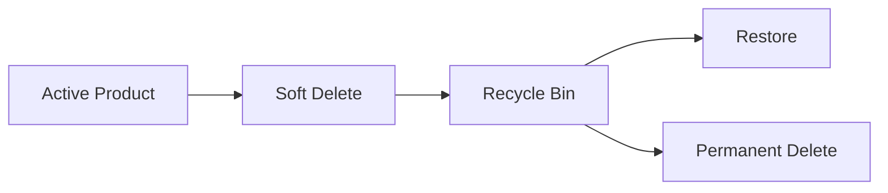

# Deleting Products (DELETE)

  **Completing CRUD**

  > Creating data is easy.
  >
  > Updating data is common.
  >
  > Deleting data is where developers become nervous.

  There is a reason many enterprise systems make deletion difficult.

  Deleting data is often irreversible.

  One careless query can transform:

  ```text 
  10,000 products
  ```

  into:

  ```text 
  0 products
  ```

  faster than you can say:

  ```text 
  "Do we have backups?"
  ```

  Today we implement the final piece of CRUD:

  - Create
  - Read
  - Update
  - **Delete**

# Learning Objectives

  By the end of this lesson, students will be able to:

  * Understand DELETE operations
  * Build delete workflows
  * Implement confirmation pages
  * Execute SQL DELETE statements
  * Handle missing records
  * Understand soft deletes
  * Understand hard deletes
  * Prevent accidental data loss
  * Build safer CRUD applications

# Part 1 — Understanding DELETE

  SQL provides:

  ```sql 
  DELETE
  ```

  for removing rows.

  Example:

  ```sql 
  DELETE
  FROM products
  WHERE id = 5
  ```

  Result:

  ```text 
  Product 5 no longer exists
  ```

  Without:

  ```sql 
  WHERE id = 5
  ```

  things become exciting.

  Example:

  ```sql 
  DELETE
  FROM products
  ```

  Result:

  ```text 
  Entire table emptied
  ```

  Every backend developer eventually learns to fear running SQL against production.

  Usually only once.

# Part 2 — Why Not Delete with GET?

  Bad:

  ```html 
  <a href="/products/delete/5">
      Delete
  </a>
  ```

  Why?

  Because:

  ```http 
  GET
  ```

  should not change data.

  Search engines, crawlers, prefetchers, and browser tools may visit links automatically.

  You don't want:

  ```text 
  Googlebot
  ```

  accidentally deleting your inventory.

  Rule:

  | Action | Method        |
  | ------ | ------------- |
  | Read   | GET           |
  | Create | POST          |
  | Update | POST / PUT    |
  | Delete | POST / DELETE |

# Part 3 — Confirmation Page

  First step:

  ```http 
  GET /products/delete/:id
  ```

  Purpose:

  ```text 
  Show confirmation
  ```

  Route:

  ```javascript 
  router.get(
      '/delete/:id',
      (req, res) => {

          const product = productRepository.findById(req.params.id);

          if (!product) {
              return res
                  .status(404)
                  .render('404');
          }

          res.render('products/delete',
              {
                title: "Delete Product",
                product
              }
          );

      }
  );
  ```

  **Confirmation View**

  `views/products/delete.ejs`:

  ```html 
  <h2>Delete Product</h2>
  <p>Are you sure you want
  to delete:
  <strong><%= product.name %></strong>?
  </p>

  <form
      method="post"
      action="/products/delete/<%= product.id %>"
  >
      <button type="submit">
          Delete
      </button>
  </form>
  ```

  Result:

  ```text 
  Are you sure?
  ```

  before deletion.

  A simple but powerful safety mechanism.

# Part 4 — Processing Deletion

  Route:

  ```javascript 
  router.delete('/delete/:id',
      (req, res) => {
          productRepository.deleteById(req.params.id);
          res.redirect('/products');
      }
  );
  ```

  Repository:

  ```javascript 
  function deleteById(id) {

      const stmt = db.prepare(`
          DELETE
          FROM products
          WHERE id = ?
      `);

      return stmt.run(id);

  }
  ```

  Notice:

  ```sql 
  WHERE id = ?
  ```

  Always.

  No exceptions.

# Part 5 — Checking Results

  Repository:

  ```javascript 
  const result = stmt.run(id);
```

  Returns:

  ```javascript 
  {
      changes: 1
  }
  ```

  Meaning:

  ```text 
  One record deleted
  ```

  Or:

  ```javascript 
  {
      changes: 0
  }
  ```

  Meaning:

  ```text 
  Nothing deleted
  ```

  Handle properly:

  ```javascript 
  if ( result.changes === 0 ) {
      return res
          .status(404)
          .render('404');
  }
  ```

# Part 6 — Adding Delete Buttons

  Product page:

  ```html 
  <a href="/products/delete/<%= product.id %>">
    Delete Product
  </a>
  ```

  List page:

  ```html 
  <a href="/products/delete/<%= product.id %>">
    Delete
  </a>
  ```

  Now every product can be removed.

  Dangerous.

  Useful.

  Mostly dangerous.

# Part 7 — Hard Deletes

Current behavior:

```sql 
DELETE
FROM products
WHERE id = ?
```

This is called:

```text 
Hard Delete
```

---

Result:

```text 
Data is physically removed
```

---

Advantages:

* Simple
* Fast
* Clean

---

Disadvantages:

* Data gone forever
* Difficult recovery
* Auditing impossible

---

# Part 8 — Soft Deletes

Many applications never truly delete.

Instead:

```sql 
ALTER TABLE products

ADD COLUMN deleted_at DATETIME;
```

---

Deleting becomes:

```sql 
UPDATE products

SET deleted_at =
    CURRENT_TIMESTAMP

WHERE id = ?
```

---

Record remains:

```text 
In database
```

but is hidden.

---

Query:

```sql 
SELECT *
FROM products
WHERE deleted_at IS NULL
```

---

This is called:

```text 
Soft Delete
```

---

# Why Large Systems Use Soft Deletes

Imagine:

```text 
Employee deletes 500 products
```

---

Hard delete:

```text 
Restore from backup
```

Potentially painful.

---

Soft delete:

```sql 
UPDATE products

SET deleted_at = NULL
```

Done.

---

Many enterprise systems default to soft deletes.

---

# Part 9 — Recycle Bin Pattern

Some applications provide:

```text 
Trash
Recycle Bin
Archive
```

---

Workflow:



---

Examples:

* Gmail
* Google Drive
* Dropbox
* Notion

---

Users appreciate second chances.

Developers appreciate third chances.

---

# Part 10 — Foreign Key Considerations

Suppose later:

```text 
Products
Orders
```

exist.

---

Question:

```text 
Can we delete a product
referenced by orders?
```

---

Potential problem:

```text 
Order references
missing product
```

Broken data.

---

Future solutions:

```sql 
ON DELETE CASCADE
```

or:

```sql 
ON DELETE RESTRICT
```

We'll revisit this when relationships are introduced.

---

# Part 11 — Security Thinking

Never trust:

```javascript 
req.params.id
```

---

Validate:

```javascript 
const id =
    Number(
        req.params.id
    );

if (
    !Number.isInteger(id)
) {

    return res
        .status(400)
        .send(
            'Invalid ID'
        );

}
```

---

Never assume:

```text 
Delete requests
are legitimate
```

Authentication and authorization will eventually become critical.

---

# Part 12 — UX Improvements

After deletion:

```text 
Product deleted successfully
```

is helpful.

---

Simple redirect:

```javascript 
res.redirect(
    '/products?deleted=1'
);
```

---

View:

```html 
<% if(deleted) { %>

<div>

Product deleted.

</div>

<% } %>
```

---

Users should always know what happened.

---

# Part 13 — RESTful Perspective

Current:

```http 
POST /products/delete/5
```

Works.

---

True REST:

```http 
DELETE /products/5
```

---

Browsers don't support:

```html 
<form method="delete">
```

natively.

So many applications use:

```http 
POST
```

for deletes.

---

This is normal.

---

# Common Beginner Mistakes

## Forgetting WHERE

Catastrophic.

---

Bad:

```sql 
DELETE
FROM products
```

---

Good:

```sql 
DELETE
FROM products
WHERE id = ?
```

---

## Deleting with GET

Bad:

```http 
GET /delete/5
```

Never perform destructive actions via GET.

---

## No Confirmation Step

Accidental clicks happen.

Confirmation pages save data.

---

## Not Checking changes

Always verify:

```javascript 
result.changes
```

---

## No Recovery Strategy

Soft deletes often provide a safer long-term solution.

---

# Assignment

## Exercise 1

Create:

```text 
GET /products/delete/:id
```

confirmation page.

---

## Exercise 2

Create:

```text 
POST /products/delete/:id
```

that removes the product.

---

## Exercise 3

Handle:

```text 
Missing Product
```

correctly.

---

## Exercise 4

Add:

```text 
Delete
```

links to list and detail pages.

---

## Exercise 5

Display:

```text 
Product deleted successfully
```

after removal.

---

# Bonus Challenge

Implement soft deletes.

Add:

```sql 
deleted_at DATETIME
```

to the table.

---

Update deletion:

```sql 
UPDATE products

SET deleted_at =
    CURRENT_TIMESTAMP

WHERE id = ?
```

---

Update queries:

```sql 
WHERE deleted_at IS NULL
```

for all product listings.

---

Add:

```text 
Recycle Bin
```

page showing deleted products.

---

Add:

```text 
Restore Product
```

functionality.

Congratulations.

You've just implemented a simplified version of what many production systems use.

---

# Key Takeaways

Today you learned:

* SQL DELETE
* Confirmation workflows
* Hard deletes
* Soft deletes
* Recycle bin patterns
* Validation
* Safer destructive actions
* RESTful delete concepts
* Defensive programming

Your CMS now supports the complete CRUD lifecycle:

```text 
Create
Read
Update
Delete
```

This is a major milestone. Most business applications are, at their core, sophisticated variations of CRUD systems with additional layers of validation, permissions, workflows, and automation built on top.

At this stage, students should be capable of building a fully functional data management application from scratch using Express, EJS, and SQLite.

---

⚠️ A large part of the content of this module was created using Generative AI (ChatGPT). The synthetic (AI-generated) content was reviewed and curated by Kostas Minaidis.
