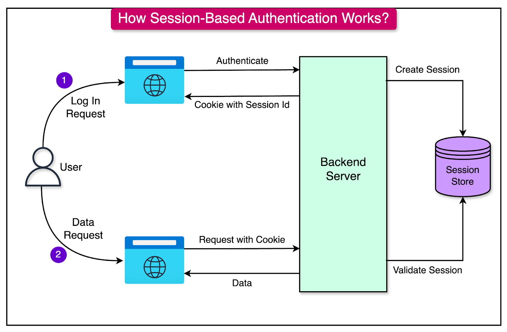

# Authentication & Login Systems

  https://deepwiki.com/expressjs/express/7-application-patterns-and-examples#authentication-pattern

## Knowing Who the User Is

  > CRUD applications manage data.
  >
  > Real applications manage people.

  Up until now, anyone can:

  ```text 
  Create Products
  Edit Products
  Delete Products
  Upload Images
  ```

  This is convenient.

  It's also a complete security disaster.

  Today we introduce:

  ```text 
  Authentication
  ```

  the process of verifying who a user is.

  This is the beginning of turning our CMS into a multi-user application.

# Learning Objectives

  By the end of this lesson, students will be able to:

  * Understand authentication fundamentals
  * Understand sessions
  * Understand cookies
  * Build login forms
  * Hash passwords securely
  * Verify user credentials
  * Create authenticated sessions
  * Protect routes
  * Implement logout functionality
  * Understand common authentication vulnerabilities

# Part 1 — Authentication vs Authorization

  These terms are often confused.

  **Authentication**

  Answers:

  ```text 
  Who are you?
  ```

  Example:

  ```text 
  Email
  Password
  ```

  **Authorization**

  Answers:

  ```text 
  What are you allowed to do?
  ```

  Example:

  ```text 
  Admin
  Editor
  Viewer
  ```

  Diagram:

  ```mermaid 
  flowchart LR

  A[Login]

  A --> B[Authentication]

  B --> C[Authorization]
  ```

  Today focuses on:

  ```text 
  Authentication
  ```

# Part 2 — Why Passwords Must Never Be Stored Directly

  ❌ Bad:

  ```sql 
  email

  password
  ```

  Stored:

  ```text 
  admin@example.com

  supersecret123
  ```

  Database leak:

  ```text 
  All passwords exposed
  ```

  Very bad.

  **Password Hashing**

  Instead:

  ```text 
  supersecret123
  ```

  becomes:

  ```text 
  $2b$10$...
  ```

  This process is called:

  ```text 
  Hashing
  ```

  Important:

  ```text 
  Hashes are one-way
  ```

  You can verify them.

  You cannot reverse them.

  Watch [this short video](https://www.youtube.com/watch?v=zt8Cocdy15c){:target="_blank"} to better understand password hashing. 

# Part 3 — Introducing bcrypt

  Most Express applications use:

  `bcrypt`

  Install:

  ```bash 
  npm install bcrypt
  ```

  Import:

  ```javascript 
  const bcrypt = require('bcrypt');
  ```

  Hash password:

  ```javascript 
  const hash = await bcrypt.hash(password, 10);
  ```

  Example result:

  ```text 
  $2b$10$...
  ```

  Store:

  ```text 
  Hash
  ```

  not:

  ```text 
  Password
  ```

# Part 4 — Creating a Users Table

  Schema:

  ```sql 
  CREATE TABLE users (
      id INTEGER PRIMARY KEY,
      email TEXT UNIQUE,
      password_hash TEXT
  );
  ```

  The [`UNIQUE` constraint](https://www.sqlitetutorial.net/sqlite-unique-constraint/){:target="_blank"} will ensure that no new user can be registered with an email that already exists in the database. 

  Example:

  ```text 
  admin@example.com

  $2b$10$...
  ```

  No plaintext passwords.

  Ever.

# Part 5 — Creating the First User

  Example:

  ```javascript 
  const hash = await bcrypt.hash('secret123', 10);
  ```

  Insert:

  ```sql 
  INSERT INTO users (
      email,
      password_hash
  )
  VALUES (?, ?)
  ```

  Store:

  ```text 
  admin@example.com

  hashed password
  ```

  You can update the database seeding script to create 3 sample user accounts just to play around:

  ```js
  // CREATE 3 SAMPLE USERS:
  db.exec(`
    INSERT INTO users (email, password_hash)
    VALUES
    ('user1@example.com', '$2b$10$GFfVuIolc8j.qa0qGTWUJuxt/aYgAS0aoQzwIyFlwne0Hl7DtmTwO'),
    ('user2@example.com', '$2b$10$aV4wATg2lRM1VpvuOAZT3ORuMMWI/BJf5bQ.F1sCH.cFp98dhfht.'),
    ('user3@example.com', '$2b$10$TOSxG1AFzCKZBMhGqrf8L.sS9SdgxDUwZ6BCVFUUY8AWDTcuC/x3W');
  `); 
  ```

  The 3 hashed passwords correspond to:

  - `$2b$10$GFfVuIolc8j.qa0qGTWUJuxt/aYgAS0aoQzwIyFlwne0Hl7DtmTwO` -> `password1`
  - `$2b$10$aV4wATg2lRM1VpvuOAZT3ORuMMWI/BJf5bQ.F1sCH.cFp98dhfht.` -> `password2`
  - `$2b$10$TOSxG1AFzCKZBMhGqrf8L.sS9SdgxDUwZ6BCVFUUY8AWDTcuC/x3W` -> `password3`

# Part 6 — Building the Login Form

  View: `views/login.ejs`:

  ```html 
  <h2>Login</h2>
  <form method="post" action="/login">
      <input type="email" name="email">
      <input type="password" name="password">
      <button>Login</button>
  </form>
  ```

  ```js
  app.get('/login', ( req, res )=>{
    res.render("login", {
      title: "Login"
    })
  });  
  ```

  Simple.

  Professional.

  Familiar.

# Part 7 — Verifying Credentials

  `db/userRepository.js`:

  ```js
  const db = require('./db');

  function findByEmail(email) {
    const stmt = db.prepare(`
        SELECT *
        FROM users
        WHERE email = ? 
      `);

    const result = stmt.get(email);
    return result;
  }

  module.exports = {
    findByEmail,
  };  
  ```

  Route:

  ```javascript 
  app.post('/login', async (req, res) => {

    const { email, password } = req.body;
    // Lookup user:
    const user = userRepository.findByEmail(email);

    if ( !user ){
      return res.send("User not found");
    }

    // Verify password:
    const valid = await bcrypt.compare(password, user.password_hash);

    // Invalid credentials
    if ( !valid ){
      return res.send("Unauthorized access");    
    }
    // Login succeeds.
    res.send("Logged in successfully");

  });
  ```

# Part 8 — Sessions

  After login:

  ```text 
  How does the server remember the user?
  ```

  Good question 🤔

  Answer:

  ```text 
  Sessions
  ```

  Without sessions:

  ```text 
  Login
  Refresh
  Logged Out
  ```

  Not ideal.

# Part 9 — Introducing express-session

  Install:

  `express-session`

  ```bash 
  npm install express-session 
  ```

  Configure:

  ```javascript 
  const { loadEnvFile } = require('node:process');
  const session = require('express-session');

  app.use(
      session({
          secret: process.env.SESSION_SECRET,
          resave: false,
          saveUninitialized: false
      })
  );
  ```

  Now:

  ```javascript 
  req.session
  ```
  
  exists. Make sure to `console.log` it and ensure that it has been correctly enabled.

  In order to set up `process.env.SESSION_SECRET`, you can create a `.env` file in the root of your project with the following content:

  ```env
  SESSION_SECRET=your_secret_key_here
  ```

  _(Just make sure to use a safe secret key)_

# Part 10 — Creating a Session

  Successful login:

  ```javascript 
  req.session.userId = user.id;
  ```

  Example:

  ```javascript 
  req.session.userId = 1;
  ```

  Server remembers:

  ```text 
  User #1
  ```

  between requests.

  Let's update the POST `/login` route and set the session once the user has logged in successfully:

  ```js
  app.post('/login', async (req, res) => {
    // ...
    req.session.userId = user.id; 
    res.send("Logged in successfully");
  });
  ```

  Check the `req.session` through a `console.log` after you have successfully logged in to ensure that everything works find up to this point.

# Part 11 — Cookies

  Sessions require cookies.

  Browser receives:

  ```text 
  session-id
  ```

  Future requests:

  ```text 
  session-id
  ```

  returned automatically.

  Diagram:

  ```mermaid 
  flowchart LR

  A[Browser]

  B[Cookie]

  C[Server Session]

  A --> B
  B --> C
  C --> B
  B --> A
  ```

  The browser stores:

  ```text 
  Session Identifier
  ```

  not user data.

  

  _(Diagram from [ByteByteGo](https://blog.bytebytego.com/p/mastering-modern-authentication-cookies){:target="_blank"})_

# Part 12 — Protecting Routes

  Current:

  ```text 
  /products/create
  ```

  accessible by everyone.

  Middleware (that will act as a protection layer):

  ```javascript 
  function requireAuth( req, res, next ) {
      if ( !req.session.userId ) {
          return res.redirect( '/login' );
      }
      next();
  }
  ```

  Usage:

  ```javascript 
  router.get('/create',
      requireAuth,
      (req,res) => {
          ...
      }
  );
  ```

  Now login is required.

# Part 13 — Logout

  Route:

  ```javascript 
  app.get('/logout', (req,res) => {
    req.session.destroy(() => {
      res.redirect(
          '/login'
      );
    });
    }
  );
  ```

  Session removed.

  User logged out.

  Simple.

  We just need to implement a button for the Logout now.

  And it would also be nice to provide a confirmation before logging out.

# Part 14 — Displaying User Information

  Middleware:

  ```javascript 
  app.use((req,res,next) => {
    res.locals.userId = req.session.userId;
    next();
  });
  ```

  View:

  ```html 
  <% if ( userId ) { %>
    Logged In
  <% } else { %>
    Logged out
  <% } %>
  ```

  Navigation can now adapt.

# Part 15 — Common Authentication Attacks

  **Plaintext Password Storage**

  Never.

  **Weak Passwords**

  ❌ Bad:

  ```text 
  123456
  ```

  ❌ Bad:

  ```text 
  password
  ```

  ❌ Bad:

  ```text 
  qwerty
  ```

  **Session Hijacking**

  Protect with:

  ```javascript 
  httpOnly: true
  ```

  cookies.

  **Brute Force Attacks**

  Eventually implement:

  ```text 
  Rate Limiting
  ```

  **User Enumeration**

  ❌ Bad:

  ```text 
  Email not found
  ```

  versus:

  ```text 
  Wrong password
  ```

  ✅ Better:

  ```text 
  Invalid credentials
  ```

  for both.

# Part 16 — Why Authentication Matters

  Without authentication:

  ```text 
  Anyone edits everything
  ```

  With authentication:

  ```text 
  Users identified
  ```

  Soon we'll add:

  ```text 
  Roles
  Permissions
  Ownership
  ```

  which build on today's foundation.

# Common Beginner Mistakes

  **Storing Passwords Directly**

  Never.

  Use `bcrypt` (password hashing).

  **Creating Your Own Hashing Algorithm**

  Don't.

  Use established libraries.

  **Trusting Cookies**

  Always verify sessions server-side.

  **Forgetting Logout**

  Sessions should be removable.

  **Protecting Only Frontend Pages**

  Backend routes must also enforce authentication.

  Always.

# Bonus Challenge

  Create:

  ```text 
  /register
  ```

  page.

  Workflow:

  ```text 
  Email
  Password
  Confirm Password
  Hash password.
  Create account.
  Automatically log user in.
  Redirect:
  /products
  ```

Warning: Make sure to stop users from registering an account with an email that already exists. This is where SQL `Constraints` protect the integrity of our Database.

Also, don't forget to handle the error cases where a use might try to register with an email that already exists. Gracefully handle the error and provide a good User eXperience to the user while not revealing too much sensitive information. For example, `Error registering user` might be a safer bet than `Email already exists`.

Congratulations.

You've just built the foundation of nearly every web application that exists.

# Key Takeaways

  Today you learned:

  * Authentication
  * Password hashing
  * bcrypt
  * Sessions
  * Cookies
  * Login workflows
  * Logout workflows
  * Route protection
  * Authentication middleware
  * Security fundamentals

  This is a major milestone. The CMS is no longer just a data management tool—it now understands users. That opens the door to permissions, roles, ownership, administration panels, and multi-user workflows that are common in professional web applications.

---

⚠️ A large part of the content of this module was created using Generative AI (ChatGPT). The synthetic (AI-generated) content was reviewed and curated by Kostas Minaidis.
