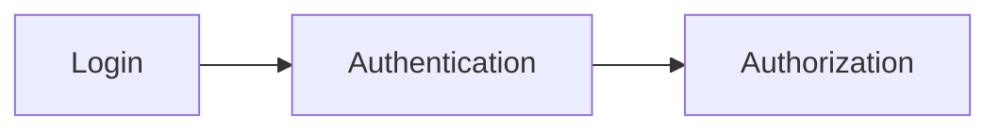
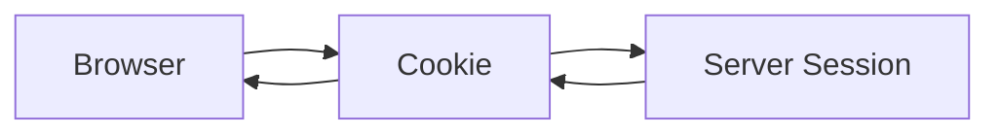

# Authentication & Login Systems

## Knowing Who the User Is

> CRUD applications manage data.
>
> Real applications manage people.

Up until now, anyone can:

```text id="k4n2vm"
Create Products
Edit Products
Delete Products
Upload Images
```

This is convenient.

It's also a complete security disaster.

Today we introduce:

```text id="v8m7xp"
Authentication
```

the process of verifying who a user is.

This is the beginning of turning our CMS into a multi-user application.

---

# Learning Objectives

By the end of this lesson, students will be able to:

* Understand authentication fundamentals
* Understand sessions
* Understand cookies
* Build login forms
* Hash passwords securely
* Verify user credentials
* Create authenticated sessions
* Protect routes
* Implement logout functionality
* Understand common authentication vulnerabilities

---

# Part 1 — Authentication vs Authorization

These terms are often confused.

---

## Authentication

Answers:

```text id="m3r8uw"
Who are you?
```

Example:

```text id="uv9k2s"
Email
Password
```

---

## Authorization

Answers:

```text id="t7d5jp"
What are you allowed to do?
```

Example:

```text id="z6w3fa"
Admin
Editor
Viewer
```

---

Diagram:



Today focuses on:

```text id="d2q4xs"
Authentication
```

---

# Part 2 — Why Passwords Must Never Be Stored Directly

Bad:

```sql id="h9w4zu"
email

password
```

Stored:

```text id="n5j2yt"
admin@example.com

supersecret123
```

---

Database leak:

```text id="a7r1mv"
All passwords exposed
```

---

Very bad.

---

# Password Hashing

Instead:

```text id="y4c7pe"
supersecret123
```

becomes:

```text id="x3b8qo"
$2b$10$...
```

---

This process is called:

```text id="u8n6wd"
Hashing
```

---

Important:

```text id="p4k2rc"
Hashes are one-way
```

You can verify them.

You cannot reverse them.

---

# Part 3 — Introducing bcrypt

Most Express applications use:

bcrypt

Install:

```bash id="j6r9pw"
npm install bcrypt
```

---

Import:

```javascript id="r5y2hf"
const bcrypt =
    require('bcrypt');
```

---

Hash password:

```javascript id="m7u1kn"
const hash =
    await bcrypt.hash(
        password,
        10
    );
```

---

Example result:

```text id="v1d7ma"
$2b$10$...
```

---

Store:

```text id="n9k3tx"
Hash
```

not:

```text id="h4q8ev"
Password
```

---

# Part 4 — Creating a Users Table

Schema:

```sql id="e8m5qp"
CREATE TABLE users (

    id INTEGER PRIMARY KEY,

    email TEXT UNIQUE,

    password_hash TEXT

);
```

---

Example:

```text id="v5p3wo"
admin@example.com

$2b$10$...
```

---

No plaintext passwords.

Ever.

---

# Part 5 — Creating the First User

Example:

```javascript id="p9w7jt"
const hash =
    await bcrypt.hash(
        'secret123',
        10
    );
```

---

Insert:

```sql id="f4k6un"
INSERT INTO users (

    email,
    password_hash

)
VALUES (?, ?)
```

---

Store:

```text id="r8m2cx"
admin@example.com

hashed password
```

---

# Part 6 — Building the Login Form

View:

```html id="t2q5vh"
<h2>

Login

</h2>

<form
    method="post"
>

    <input
        type="email"
        name="email"
    >

    <input
        type="password"
        name="password"
    >

    <button>

        Login

    </button>

</form>
```

---

Simple.

Professional.

Familiar.

---

# Part 7 — Verifying Credentials

Route:

```javascript id="k7v1nf"
router.post(
    '/login',
    async (
        req,
        res
    ) => {

        const {
            email,
            password
        } = req.body;

    }
);
```

---

Lookup user:

```javascript id="y5u2zb"
const user =
    userRepository
        .findByEmail(
            email
        );
```

---

Verify password:

```javascript id="u9h4qs"
const valid =
    await bcrypt.compare(
        password,
        user.password_hash
    );
```

---

If:

```javascript id="m4r8kn"
valid === true
```

Login succeeds.

---

Otherwise:

```text id="d7c3pw"
Invalid credentials
```

---

# Part 8 — Sessions

After login:

```text id="e1x7ty"
How does the server remember the user?
```

Good question.

---

Answer:

```text id="g8n2mw"
Sessions
```

---

Without sessions:

```text id="q5u1hk"
Login
Refresh
Logged Out
```

---

Not ideal.

---

# Part 9 — Introducing express-session

Install:

express-session

```bash id="w3r8ku"
npm install express-session
```

---

Configure:

```javascript id="v6m4np"
const session =
    require(
        'express-session'
    );

app.use(

    session({

        secret:
            process.env
                .SESSION_SECRET,

        resave: false,

        saveUninitialized:
            false

    })

);
```

---

Now:

```javascript id="z7t2mw"
req.session
```

exists.

---

# Part 10 — Creating a Session

Successful login:

```javascript id="f8p4qy"
req.session.userId =
    user.id;
```

---

Example:

```javascript id="y1n6rd"
req.session.userId = 1;
```

---

Server remembers:

```text id="b3k9va"
User #1
```

between requests.

---

# Part 11 — Cookies

Sessions require cookies.

---

Browser receives:

```text id="s5q1wm"
session-id
```

---

Future requests:

```text id="v8n4ku"
session-id
```

returned automatically.

---

Diagram:



---

The browser stores:

```text id="m6q5pe"
Session Identifier
```

not user data.

---

# Part 12 — Protecting Routes

Current:

```text id="u1r7vk"
/products/create
```

accessible by everyone.

---

Middleware:

```javascript id="w4k9tx"
function requireAuth(
    req,
    res,
    next
) {

    if(
        !req.session.userId
    ) {

        return res.redirect(
            '/login'
        );

    }

    next();

}
```

---

Usage:

```javascript id="r7p3mw"
router.get(

    '/create',

    requireAuth,

    (
        req,
        res
    ) => {

        ...
    }

);
```

---

Now login is required.

---

# Part 13 — Logout

Route:

```javascript id="x2m7kp"
router.post(
    '/logout',
    (
        req,
        res
    ) => {

        req.session.destroy(
            () => {

                res.redirect(
                    '/login'
                );

            }
        );

    }
);
```

---

Session removed.

User logged out.

Simple.

---

# Part 14 — Displaying User Information

Middleware:

```javascript id="y8n1fq"
app.use(
    (
        req,
        res,
        next
    ) => {

        res.locals.userId =
            req.session.userId;

        next();

    }
);
```

---

View:

```html id="m1p8zw"
<% if(userId) { %>

Logged In

<% } %>
```

---

Navigation can now adapt.

---

# Part 15 — Common Authentication Attacks

## Plaintext Password Storage

Never.

---

## Weak Passwords

Bad:

```text id="k2v6jd"
123456
```

---

Bad:

```text id="w8q3rn"
password
```

---

Bad:

```text id="x5n9mv"
qwerty
```

---

## Session Hijacking

Protect with:

```javascript id="r1m4kx"
httpOnly: true
```

cookies.

---

## Brute Force Attacks

Eventually implement:

```text id="n7w2vp"
Rate Limiting
```

---

## User Enumeration

Bad:

```text id="a4r9cu"
Email not found
```

versus:

```text id="z8k5mh"
Wrong password
```

---

Better:

```text id="c3p7wy"
Invalid credentials
```

for both.

---

# Part 16 — Why Authentication Matters

Without authentication:

```text id="e6m1kn"
Anyone edits everything
```

---

With authentication:

```text id="u9r5px"
Users identified
```

---

Soon we'll add:

```text id="f4k7jd"
Roles

Permissions

Ownership
```

which build on today's foundation.

---

# Common Beginner Mistakes

## Storing Passwords Directly

Never.

Use bcrypt.

---

## Creating Your Own Hashing Algorithm

Don't.

Use established libraries.

---

## Trusting Cookies

Always verify sessions server-side.

---

## Forgetting Logout

Sessions should be removable.

---

## Protecting Only Frontend Pages

Backend routes must also enforce authentication.

---

# Assignment

## Exercise 1

Create:

```text id="u5n2kw"
users
```

table.

---

## Exercise 2

Create:

```text id="v7m4xp"
/login
```

form.

---

## Exercise 3

Hash passwords using bcrypt.

---

## Exercise 4

Verify passwords using:

```javascript id="z2q8mf"
bcrypt.compare()
```

---

## Exercise 5

Protect:

```text id="g6p3rw"
/products/create

/products/edit

/products/delete
```

using authentication middleware.

---

# Bonus Challenge

Create:

```text id="y1k7vu"
/register
```

page.

---

Workflow:

```text id="v4m2px"
Email

Password

Confirm Password
```

---

Hash password.

Create account.

Automatically log user in.

Redirect:

```text id="k9r6wd"
/products
```

---

Congratulations.

You've just built the foundation of nearly every web application that exists.

---

# Key Takeaways

Today you learned:

* Authentication
* Password hashing
* bcrypt
* Sessions
* Cookies
* Login workflows
* Logout workflows
* Route protection
* Authentication middleware
* Security fundamentals

This is a major milestone. The CMS is no longer just a data management tool—it now understands users. That opens the door to permissions, roles, ownership, administration panels, and multi-user workflows that are common in professional web applications.

---

# Suggested Syllabus Improvements

At this point, I would strongly recommend inserting a dedicated day on:

```text id="m8n5qx"
Environment Variables
Configuration
Secrets
```

before authentication.

Students should understand:

```text id="w3r7vk"
.env

process.env

SESSION_SECRET

DATABASE_URL
```

before storing session secrets and credentials.

I'd also introduce:

Helmet

and

express-rate-limit

immediately after authentication rather than near the end of the course. Security concepts tend to stick better when introduced alongside the features they protect rather than weeks later.

---

⚠️ A large part of the content of this module was created using Generative AI (ChatGPT). The synthetic (AI-generated) content was reviewed and curated by Kostas Minaidis.
