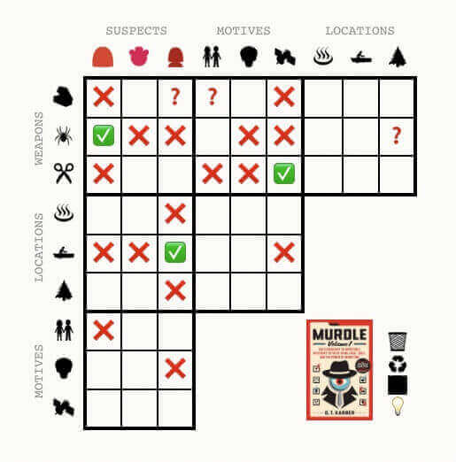
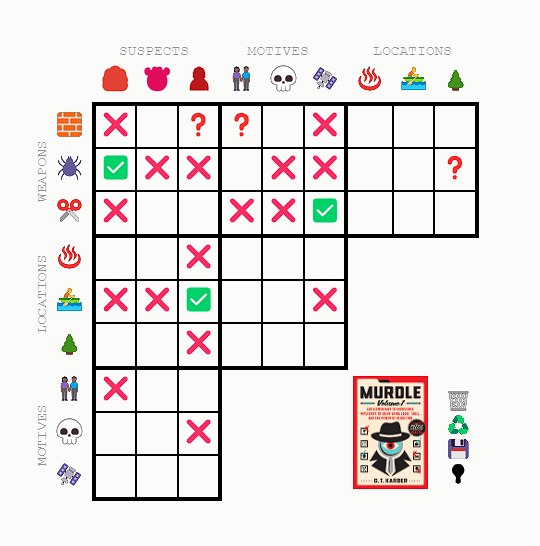

# Challenge: Recreate Murdle Table

Greetings **fellow detectives** 🕵️!

You have got your hands dirty on the murder-solving mystery game [Murdle Table](https://murdle.com/){:target="_blank"}!

However, finding the murderer and completing the game, is not enough for us 😎! 

As you may have noticed, the implementation of this game is phenomenal and can hide a lot of mini-challenges for a future web developer like yourself!

In this challenge, we want you to **recreate a functional version** of the infamous table!

## Instructions

- Download all images/icons on the table (lights on and off)
- Find the font used
- Create the table layout
- Each table square should have 4 different states (blank, cross, tick, question mark)
- Implement the bottom right buttons functionality
  - Trash🗑️: clears the table
  - Recycle♻️: returns to last saved layout
  - Save💾: saves the current layout
  - Lightbulb💡: turns on/off the light
- Include the Murdle book image with the correct link
- (**Extra**): All outer icons (motives, weapons, etc.) should open a [modal](../../../html/modals/index.md){:target="_blank"}, where the card description is displayed
  - Each card description can be found after you click on any icon on the online version of the Murdle Table, e.g. [gardening shears](./assets/gardening-shears-description.png){:target="_blank"}

<table>
  <tr>
    <td>
      
    </td>
    <td>
      
    </td>
  </tr>
</table>