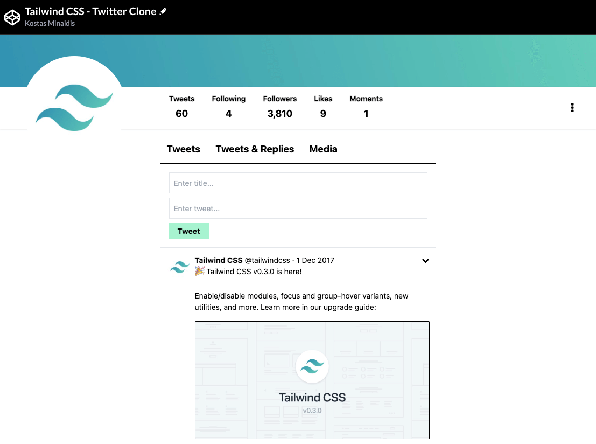
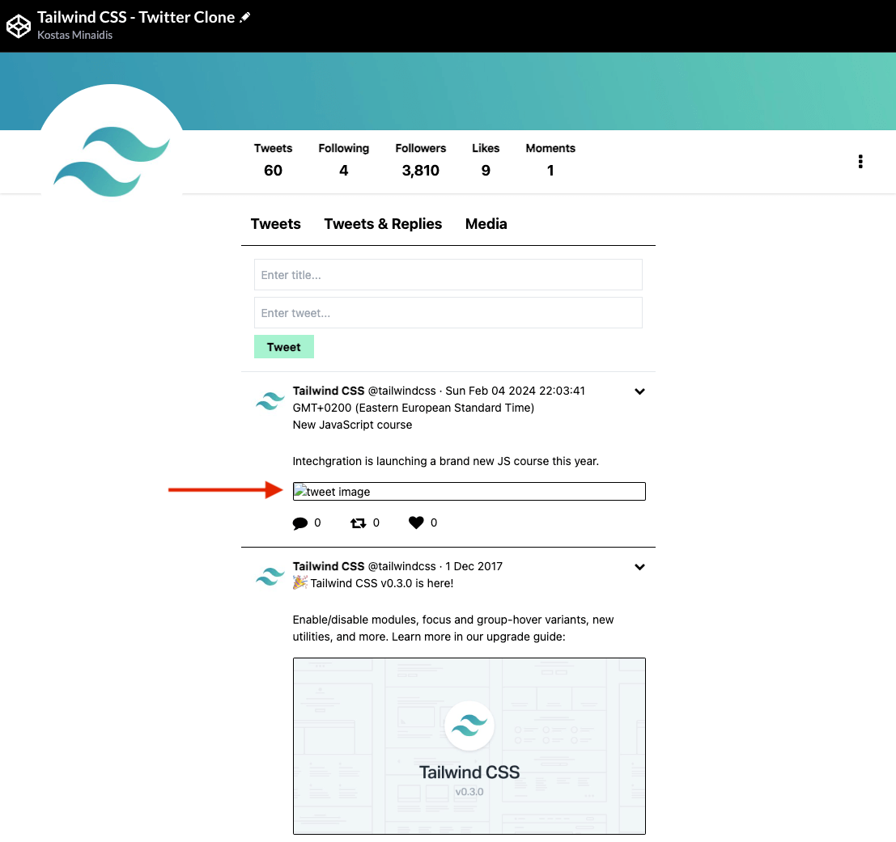
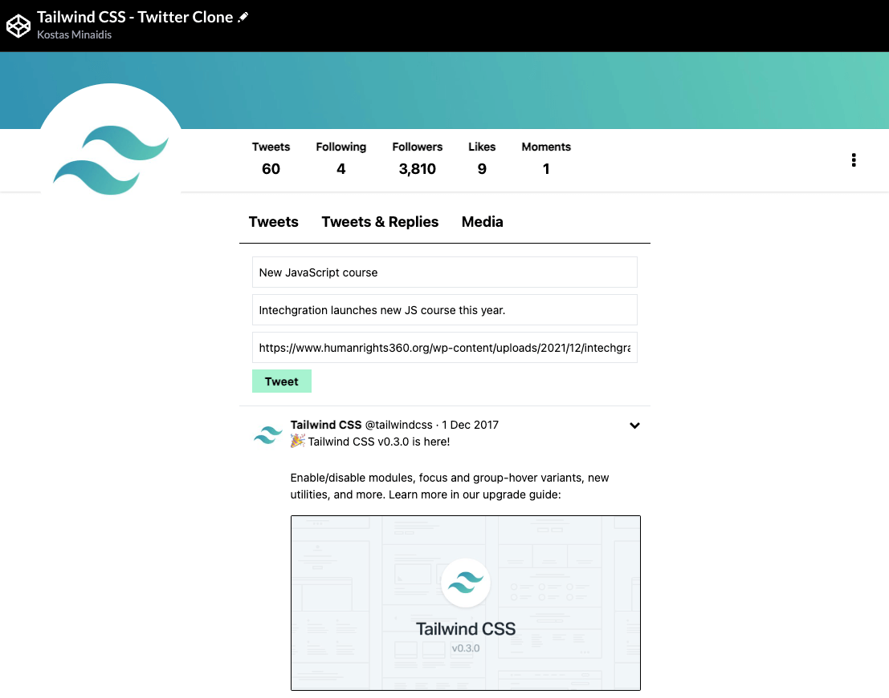
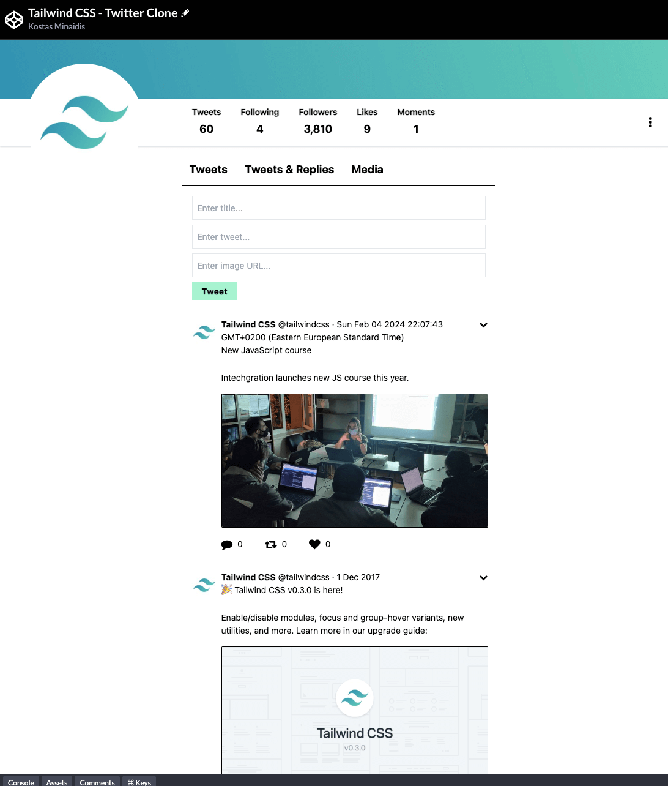
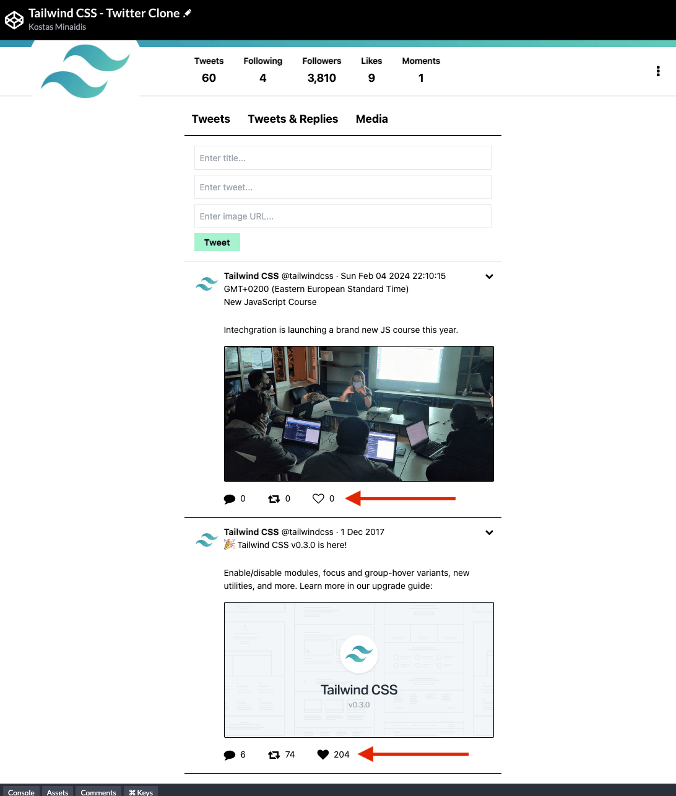

# The Tweeter Frontend Challenge


Welcome to the **Tweeter Frontend Challenge**!

**Prerequisites:**

- Fundamental knowledge of HTML, CSS and JavaScript
- Familiarity with the `Tailwind` CSS framework. 

---

Here's the steps you should follow for completing this challenge:

1) Download the [source code](https://github.com/in-tech-gration/WDX-180/raw/main/curriculum/modules/javascript/misc/tweeter_practice/code.zip)

2) Use a code editor (like [`VSCode`](https://code.visualstudio.com/)) to load the code and launch a local web server (e.g. [`Live Server`](https://marketplace.visualstudio.com/items?itemName=ritwickdey.LiveServer))

3) Complete the following tasks, one step at a time:

- **Form submission:** Add an event handler on the Tweet form so that when a user clicks the 'Tweet' button or presses Enter, a new tweet message is added to the thread, containing the title and tweet message.



- **Conditional image rendering:** Make sure that when an image is missing, the HTML img element is not displayed. 



- **Image URL input:** Add one more input field to the Tweet form so that users can paste an image URL that will be used as the thumbnail for the tweet message. 




- **Likes icon conditional rendering:** Update the code, so that when a tweet has 0 likes, the icon is displayed differently (using the `fa-heart-o` class instead of `fa-heart`).

- **Likes interaction:** Implement a Like interaction that updates the likes (increments on click, decrements on next click, increments on next click and so forth).



- **Event Delegation:** Try using a single event listener for the `likes` icon. The [`closest`](https://developer.mozilla.org/en-US/docs/Web/API/Element/closest) DOM API method will turn out handy for this task.

- **Function parameter refactoring:** Refactor the `renderTweet` function so that instead of multiple parameters (e.g. `name`, `handle`, `date`, etc.) it has only one parameter whose type is an object. The arguments will be passed as properties to that object. For example, the function will be called like this:

```js
renderTweet({
  name: "Ada Lovelace",
  handle: "@ada_lovelace",
  date: "10/12/1815",
  title: "Let's invent programming, shall we?"
  ...
})
```

Make sure to handle the default values for the arguments that are missing. For example, if the `comments`, `retweets` and `likes` are not passed, a default value of 0 should be used instead. Of course, no tweet should be rendered if there's no content., so act accordingly for the other properties as well. 

**Good luck!**

> **Questions, comments, suggestions? Please leave them on the comment section below.**

<script src="https://utteranc.es/client.js"
        repo="in-tech-gration/WDX-180"
        issue-term="pathname"
        theme="github-dark"
        crossorigin="anonymous"
        async>
</script>
