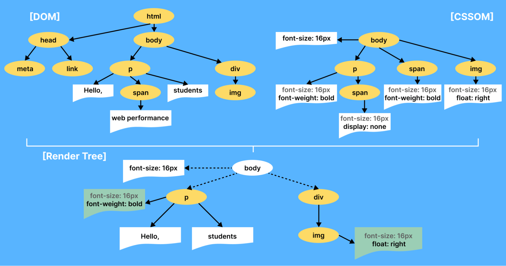

### Schedule

  - [Study](#study-plan-NN)
  - [Exercises](#exercises-NN)
  - [Extra Resources](#extra-resources-NN)

### Study Plan

  Let's learn the **CSS Object Model**

  > "The CSS Object Model is a set of APIs allowing the manipulation of CSS from JavaScript. 
  >
  > It is much like the DOM, but for the CSS rather than the HTML. 
  >
  > It allows users to read and modify CSS style dynamically."

  - Slowly go through this lengthy article: [**A Beginner’s Guide To CSS Object Model (CSSOM)**](https://www.lambdatest.com/blog/css-object-model/){:target="_blank"}

  

  In this article you'll find the word `Interface` mentioned quite a lot, so let's ask `ChatGPT` to explain this to us:

  **What is an Interface?**

  > "In the world of programming and computer science, an "interface" refers to a set of rules or specifications that define how different software components can interact with each other. It's like a contract that outlines what methods or functions an object or component should have and how they should behave.
  >
  > Think of it as a way for different parts of a program to communicate with each other without needing to know all the nitty-gritty details of how each part is implemented. **It's a bit like using a remote control to interact with your TV. You don't need to know exactly how the TV works internally; you just need to know the buttons on the remote control and what they do (that's the interface).**
  >
  > In the context of MDN documentation, when you see terms like "CSSStyleSheet", "Event interface", "FocusEvent interface," "UIEvent interface," etc., they are referring to specific sets of rules that describe what properties and methods an object (e.g. an Event object) should have. These interfaces tell developers what they can expect from these objects and how they can work with them."

  **CAUTION:** The ChatGPT response was reviewed and curated by our staff of professional developers. Never trust AI-generated responses 100%.

  Here is a list of the main concepts that you will learn in this article:

  - The `HTMLElement.style.*` set of properties
  - The `window.getComputedStyle(Element)` method
  - The `CSSStyleDeclaration Interface` and its properties:
    - `getPropertyValue()`
    - `getPropertyPriority()`
    - `setProperty(propertyName, value, priority)`
    - `removeProperty(property)`
    - `item()`
    - `length`
  - The `StyleSheet & StyleSheetList Interfaces` and their properties:
    - `disabled`
    - `href`
    - `media`
    - `ownerNode`
    - `parentStyleSheet`
    - `title`
    - `type`
    - `document.styleSheets.length`
  - The `CSSStyleSheet & CSSRule Interfaces`
    - `cssRules`
    - `deleteRule()`
    - `insertRule()`
    - `cssText`
    - `parentRule`
    - `parentStyleSheet`
  - The `CSSMediaRule & CSSKeyframeRule Interfaces`
    - `media`
    - `keyText`

  **FAQ**

  > Here are some questions that we've accumulated from students going over the topics covered in this module.

  - **Question:** _What does "paint" mean? Is it a feature of the browser? Does the browser use `Canvas` to paint the DOM? How does it "paint" the pixels?_
    - **Answer:** The term "paint" refers to an internal Browser feature. The way browsers "paint" everything on the main browser window is something that is hidden away from us. It is not to be confused with the `Canvas API` which is an HTML element with drawing/painting capabilities and an accompanying JavaScript API, and a topic that we will covered in a future Module.
  
  - **Question:** _Is `CSSStyleDeclaration` a special type of object? I feel like I don't fully understand the object model in JS._
    - **Answer:** `CSSStyleDeclaration` is actually an [`Interface`](https://developer.mozilla.org/en-US/docs/Web/API/CSSStyleDeclaration){:target="_blank"}, a kind of a blueprint, if you will, based on which a special type of Object is created. This is a concept that will be covered in upcoming Modules of the Intermediate and Advanced parts of the course.

  - **Question:** _When we use JavaScript, are the CSS styles applied inline? Because it seems so. If we have a rule in our project not to use inline styling, how are we going to handle this? Should we use CSS classes instead?_
    - **Answer:** When you use the `.style` Element property, you are actually applying inline styling to the Element. But, that's not always a bad thing, and it's a widely used pattern when styling must be updated dynamically (via JS).

  - _Should we use CSS classes instead?_: That's another approach that you can use if you definitely want to avoid inline styling for some reason. Here's one way of injecting CSS styling by dynamically creating a `<style>` element and appending it to the `<head>` element of our page:

  ```js
  const style = document.createElement("style");
  style.textContent = `
    .someClass { 
      background: black;
      color: white;
    }
  `
  document.head.appendChild(style);
  ```

### Summary

### Exercises

### Extra Resources

  <!-- TODO: INTEGRATE: https://github.com/in-tech-gration/web.dev/blob/main/src/site/content/en/blog/critical-rendering-path-constructing-the-object-model/index.md -->
  - [Constructing the Object Model](https://web.dev/articles/critical-rendering-path/constructing-the-object-model){:target="_blank"}

### Sources and Attributions

  - [CSS Object Model (CSSOM) @MDN](https://developer.mozilla.org/en-US/docs/Web/API/CSS_Object_Model){:target="_blank"}