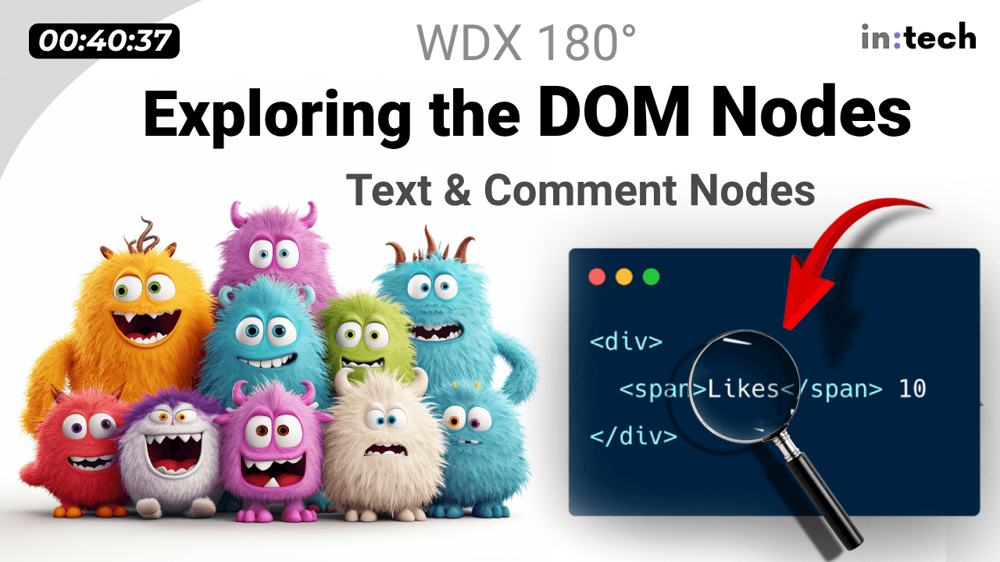

### Schedule

  - **Watch the lectures**
  - **Study the suggested material**
  - **Practice on the topics and share your questions**

### Study Plan

  Watch the lecture (40min) to learn more about DOM Nodes
  and specifically about the `Text` and `Comment` Nodes.

  - Video: [Let's learn JavaScript: DOM Nodes and other furry creatures](https://www.youtube.com/watch?v=p2o0fXSzVWc){:target="_blank"}

  {:target="_blank"}
  
  - Study:
    - [DOM Node Interface](https://developer.mozilla.org/en-US/docs/Web/API/Node){:target="_blank"}
    - [Text Node Interface](https://developer.mozilla.org/en-US/docs/Web/API/Text){:target="_blank"}
    - [Comment Node Interface](https://developer.mozilla.org/en-US/docs/Web/API/Comment){:target="_blank"}
    - [Node: nodeType property](https://developer.mozilla.org/en-US/docs/Web/API/Node/nodeType){:target="_blank"}

### Summary

### Exercises

### Extra Resources
