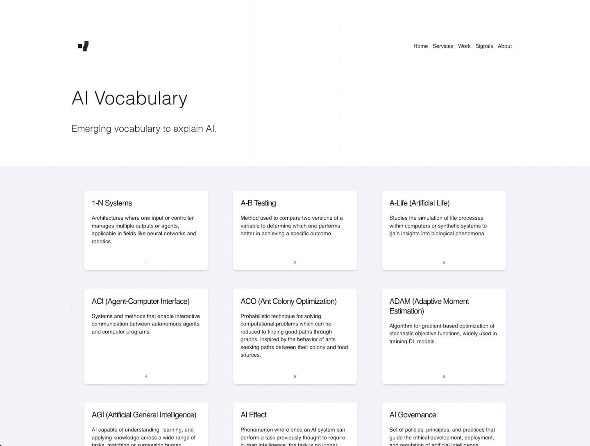
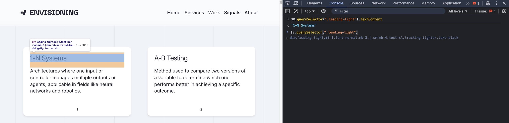

## JavaScript Challenge:
# Web Scraping for AI

  

  Let's scrape a web page using our JavaScript DOM manipulation skills and create a list of AI terminology in JSON format.

  **Level:** Beginner

  **Prerequisites:**

  - Fundamental knowledge of HTML and CSS
  - Fundamental knowledge of JavaScript
  - Fundamental knowledge of DOM API methods for querying and manipulating the DOM, e.g. `document.querySelector`, `Element.textContent`, etc.
  - Serving web content (HTML) using a local web server

  <details markdown="1">
  <summary><h2>Instructions</h2></summary>

  **1) Download the [zip file](./assets/exercise-starter.zip)**

  **2) Unzip the contents of the file.**

  You will find a folder named `Envisioning _ AI Index_files/` along with and HTML file named `Envisioning _ AI Index_files.html`. This was saved from the [`Envisioning` website](https://www.envisioning.io/vocab){:target="_blank"} and contains hundreds of AI-related terms in the form of clickable cards.

  You will need to serve the contents using a local web server software. You can try using [LiveServer](https://marketplace.visualstudio.com/items?itemName=ritwickdey.LiveServer){:target="_blank"}, the [serve npm package](https://www.npmjs.com/package/serve){:target="_blank"} or any other similar web serving software.

  Once your web server is up and running, you will need to open the `Envisioning _ AI Index_files.html` file and you'll be looking at the web page containing the list of AI-related terms.

  [](./assets/ai-vocabulary-page.jpg){:target="_blank"}

  Your task is to use your [DOM querying and manipulation skills](./assets/DOM.Inspector.jpg){:target="_blank"}, traverse the web page and gather all the AI `terms` along with their corresponding `description` and accompanying `link` that's included in each card.

  [](./assets/DOM.Inspector.access.jpg){:target="_blank"}

  You will need to store all the information in JSON format and save it in a file called `AI-vocab.json`. The JSON object must include all 633 entries.

  Here's an idea of how the file structure will look like:

  ```json
  {
    "1-N Systems": {
        "title": "1-N Systems",
        "content": "Architectures where one input or controller manages multiple outputs or agents, applicable in fields like neural networks and robotics.",
        "link": "https://www.envisioning.io/vocab/1-n-systems"
    },
    "A-B Testing": {
        "title": "A-B Testing",
        "content": "Method used to compare two versions of a variable to determine which one performs better in achieving a specific outcome.",
        "link": "https://www.envisioning.io/vocab/a-b-testing"
    },
    {
      ...
    }
  }
  ``` 

  You can also [download the final JSON](./assets/AI-vocab.json){:target="_blank"} and have a look at what your code needs to produce from the content of the page.

  **3) Requirements**

  You must create a function named `createJSON()` that will traverse the web page, find the appropriate HTML elements and gather all the required content in a well-structured JSON object. Ideally, the code should display the result in the console and automatically download the JSON file to your computer.

  As always, `Google` and `StackOverflow` are your friends!

  Good luck!

  </details>

---

**Questions, comments, suggestions? Please leave them on the comment section below.**

<script src="https://utteranc.es/client.js"
  repo="in-tech-gration/WDX-180"
  issue-term="pathname"
  theme="github-dark"
  crossorigin="anonymous"
  async>
</script>
