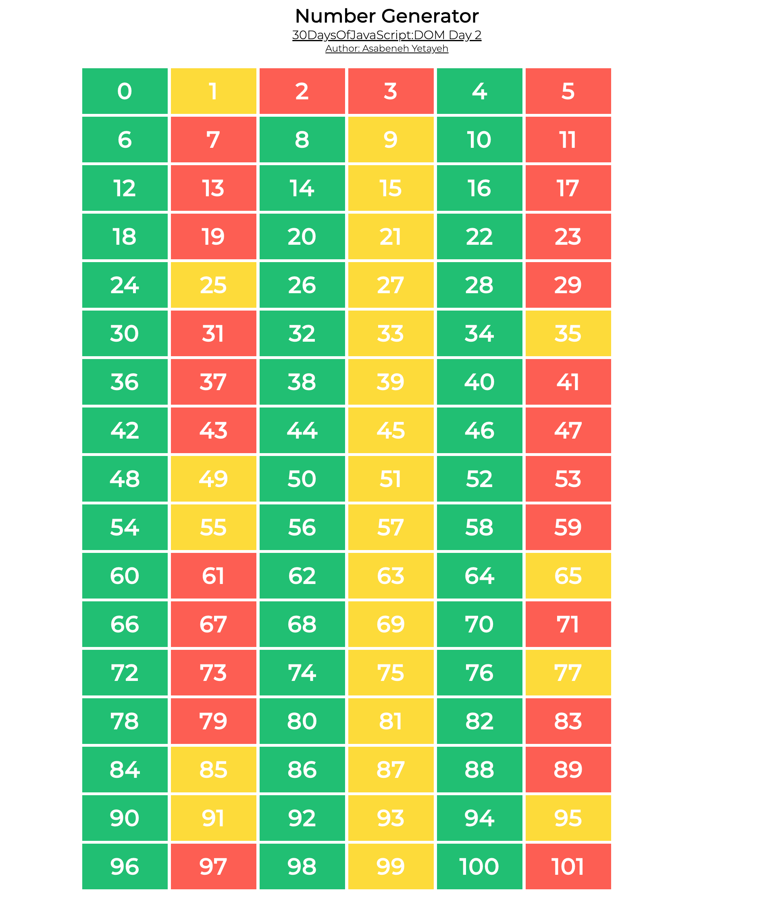
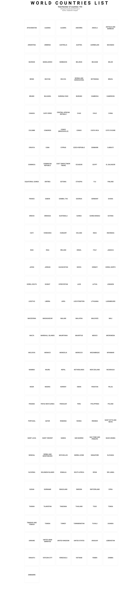

### Schedule

  - [Study](#study-plan-NN)
  - [Exercises](#exercises-NN)
  - [Extra Resources](#extra-resources-NN)

### Study Plan

  ## Document Object Model (DOM) Manipulation - Part 03

  ### Creating an Element

  To create an HTML element we use tag name. Creating an HTML element using JavaScript is very simple and straight forward. We use the method _document.createElement()_. The method takes an HTML element tag name as a string parameter.

  ```js
  // syntax
  document.createElement('tagname')
  ```

  ```html
  <!DOCTYPE html>
  <html>

  <head>
      <title>Document Object Model:30 Days Of JavaScript</title>
  </head>

  <body>

      <script>
          let title = document.createElement('h1')
          title.className = 'title'
          title.style.fontSize = '24px'
          title.textContent = 'Creating HTML element DOM Day 2'

          console.log(title)
      </script>
  </body>

  </html>
  ```

  ### Creating elements

  To create multiple elements we should use loop. Using loop we can create as many HTML elements as we want.
  After we create the element we can assign value to the different properties of the HTML object.

  ```html
  <!DOCTYPE html>
  <html>

  <head>
      <title>Document Object Model:30 Days Of JavaScript</title>
  </head>

  <body>

      <script>
          let title
          for (let i = 0; i < 3; i++) {
              title = document.createElement('h1')
              title.className = 'title'
              title.style.fontSize = '24px'
              title.textContent = i
              console.log(title)
          }
      </script>
  </body>

  </html>
  ```

  ### Appending child to a parent element

  To see a created element on the HTML document we should append it to the parent as a child element. We can access the HTML document body using *document.body*. The *document.body* support the *appendChild()* method. See the example below.

  ```html
  <!DOCTYPE html>
  <html>

  <head>
      <title>Document Object Model:30 Days Of JavaScript</title>
  </head>

  <body>

      <script>
          // creating multiple elements and appending to parent element
          let title
          for (let i = 0; i < 3; i++) {
              title = document.createElement('h1')
              title.className = 'title'
              title.style.fontSize = '24px'
              title.textContent = i
              document.body.appendChild(title)
          }
      </script>
  </body>
  </html>
  ```

  ### Removing a child element from a parent node

  After creating an HTML, we may want to remove element or elements and we can use the *removeChild()* method.

  **Example:**

  ```html
  <!DOCTYPE html>
  <html>

  <head>
      <title>Document Object Model:30 Days Of JavaScript</title>
  </head>

  <body>
      <h1>Removing child Node</h1>
      <h2>Asabeneh Yetayeh challenges in 2020</h1>
      <ul>
          <li>30DaysOfPython Challenge Done</li>
          <li>30DaysOfJavaScript Challenge Done</li>
          <li>30DaysOfReact Challenge Coming</li>
          <li>30DaysOfFullStack Challenge Coming</li>
          <li>30DaysOfDataAnalysis Challenge Coming</li>
          <li>30DaysOfReactNative Challenge Coming</li>
          <li>30DaysOfMachineLearning Challenge Coming</li>
      </ul>

      <script>
          const ul = document.querySelector('ul')
          const lists = document.querySelectorAll('li')
          for (const list of lists) {
              ul.removeChild(list)

          }
      </script>
  </body>

  </html>
  ```

  As we have see in the previous section there is a better way to eliminate all the inner HTML elements or the children of a parent element using the method *innerHTML* properties.

  ```html
  <!DOCTYPE html>
  <html>

  <head>
      <title>Document Object Model:30 Days Of JavaScript</title>
  </head>

  <body>
      <h1>Removing child Node</h1>
      <h2>Asabeneh Yetayeh challenges in 2020</h1>
      <ul>
          <li>30DaysOfPython Challenge Done</li>
          <li>30DaysOfJavaScript Challenge Done</li>
          <li>30DaysOfReact Challenge Coming</li>
          <li>30DaysOfFullStack Challenge Coming</li>
          <li>30DaysOfDataAnalysis Challenge Coming</li>
          <li>30DaysOfReactNative Challenge Coming</li>
          <li>30DaysOfMachineLearning Challenge Coming</li>
      </ul>

      <script>
          const ul = document.querySelector('ul')
          ul.innerHTML = ''
      </script>
  </body>

  </html>
  ```

  The above snippet of code cleared all the child elements.  

### Summary

  🌕 You are so special, you are progressing everyday. Now, you knew how to destroy a created DOM element when it is needed. You learned DOM and now you have the capability to build and develop applications. You are left with only eight days to your way to greatness. Now do some exercises for your brain and for your muscle.


### Exercises

  <!-- TODO: Finish exercises -->
  <!-- SGEN:META:PROGRESS:task=Complete the exercise 'Simple Manipulation - Part 01'|user_folder=dom_manipulation_part_01 -->
  <!-- SGEN:META:TESTS:name=Test Exercise: 'Simple Manipulation - Part 01'|type=exist|user_folder=dom_manipulation_part_01|files=simple-manipulation.html,script.js -->
  ### Exercises: Level 1

  1. Create a div container on HTML document and create 100 to 100 numbers dynamically and append to the container div. 
    - Even numbers background is green
    - Odd numbers background is yellow
    - Prime numbers background is red

  

  ### Exercises: Level 2

  1. Use the countries array to display all the countries.See the design

  

  ### Exercises: Level 3

  Check the requirement of this project from both images(jpg and gif). All the data and CSS has been implemented using JavaScript only. The data is found on starter folder project_3. The drop down button has been created using [*details*](https://www.w3schools.com/tags/tag_details.asp){:target="_blank"} HTML element.

  

### Extra Resources

  _(Nothing here yet. Feel free to contribute if you've found some useful resources.)_

### Sources and Attributions

  **Content is based on the following sources:**

  - [30 Days Of JavaScript: Document Object Model(DOM)](https://github.com/in-tech-gration/30-Days-Of-JavaScript/blob/master/22_Day_Manipulating_DOM_object/22_day_manipulating_DOM_object.md){:target="_blank"} [(Permalink)](https://github.com/in-tech-gration/30-Days-Of-JavaScript/blob/55d8e3dbc0410d64c1dc3ea5915e015a7950cf2a/22_Day_Manipulating_DOM_object/22_day_manipulating_DOM_object.md){:target="_blank"}