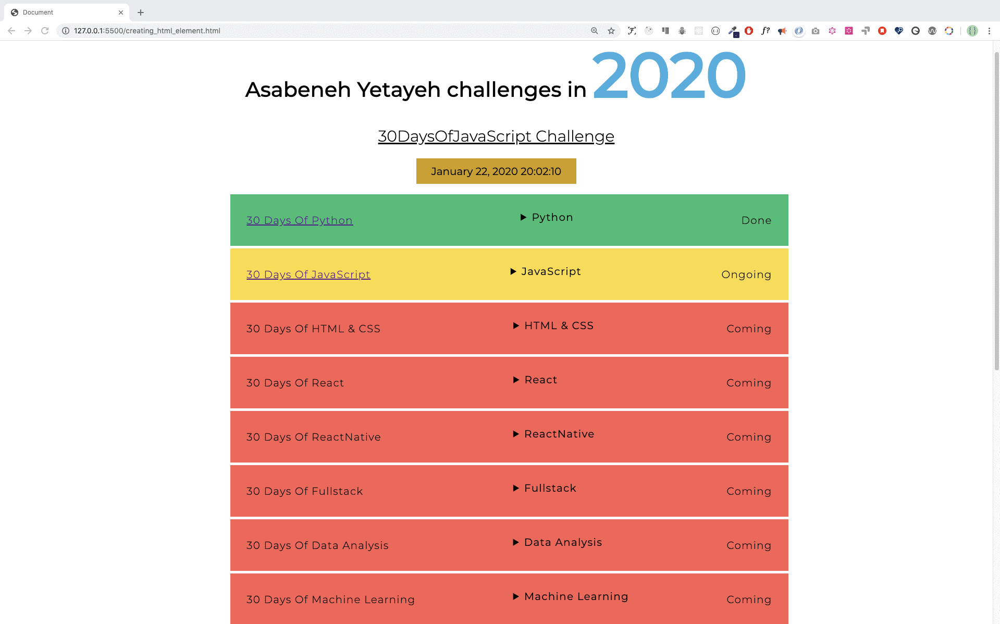

### Schedule

  - [Study](#study-plan-NN)
  - [Exercises](#exercises-NN)
  - [Extra Resources](#extra-resources-NN)

### Study Plan

  <!-- SGEN:META:PROGRESS:task=Read 'Document Object Model (DOM) Manipulation - Part 03' -->
  [Read: **Document Object Model (DOM) Manipulation - Part 03**](../modules/javascript/web_apis/dom/manipulation/part-03/content/index.md){:target="_blank"}

### Summary

  Now, you know how to destroy a created DOM element when it is needed. You learned DOM and now you have the capability to build and develop applications. Now do some exercises for your brain and for your muscle.

### Exercises

  **Number Generator**

  <!-- SGEN:META:PROGRESS:task=Complete the exercise 'Number Generator'|user_folder=number_generator -->
  <!-- SGEN:META:TESTS:name=Test Exercise: 'Number Generator'|type=exist|user_folder=number_generator|files=index.html,script.js -->
  Copy the folder `curriculum/week{{ SGEN:WEEK_NUM }}/exercises/number_generator/` inside folder `user/week{{ SGEN:WEEK_NUM }}/exercises/day{{ SGEN:DAY_NUM }}/` and compete all the challenges found below:
  
  - Inside the div container with class name `wrapper` on the HTML document, create **dynamically** 102 `div` container, each one containing a number from 0 to 101.
  - Append style to each number as described below:
    - Even numbers background is green
    - Odd numbers background is yellow
    - Prime numbers background is red
  
  The expected output should be as shown in the image below. 

  

  **Countries List**

  <!-- SGEN:META:PROGRESS:task=Complete the exercise 'Countries List'|user_folder=countries_list -->
  <!-- SGEN:META:TESTS:name=Test Exercise: 'Countries List'|type=exist|user_folder=countries_list|files=index.html,script.js -->
  Copy the folder `curriculum/week{{ SGEN:WEEK_NUM }}/exercises/countries_list/` inside folder `user/week{{ SGEN:WEEK_NUM }}/exercises/day{{ SGEN:DAY_NUM }}/` and use the countries array provided to display **dynamically** all countries as shown in the image below:

  

  **Asabeneh's Challenge**

  <!-- SGEN:META:PROGRESS:task=Complete the exercise 'Asabeneh's Challenge'|user_folder=asabeneh_challenge -->
  <!-- SGEN:META:TESTS:name=Test Exercise: 'Asabeneh's Challenge'|type=exist|user_folder=asabeneh_challenge|files=index.html,script.js -->
  Copy the folder `curriculum/week{{ SGEN:WEEK_NUM }}/exercises/asabeneh_challenge/` inside folder `user/week{{ SGEN:WEEK_NUM }}/exercises/day{{ SGEN:DAY_NUM }}/` and use the asabenehChallenges2020 array provided to display **dynamically** its content as show in the image below: 

  

  > Note: The drop down button has been created using [*details*](https://www.w3schools.com/tags/tag_details.asp){:target="_blank"} HTML element.

### Extra Resources

  _(Nothing here yet. Feel free to contribute if you've found some useful resources.)_

### Sources and Attributions

  **Content is based on the following sources:**

  - [30 Days Of JavaScript: Document Object Model(DOM)](https://github.com/in-tech-gration/30-Days-Of-JavaScript/blob/master/22_Day_Manipulating_DOM_object/22_day_manipulating_DOM_object.md){:target="_blank"} [(Permalink)](https://github.com/in-tech-gration/30-Days-Of-JavaScript/blob/55d8e3dbc0410d64c1dc3ea5915e015a7950cf2a/22_Day_Manipulating_DOM_object/22_day_manipulating_DOM_object.md){:target="_blank"}

  Don't forget to star this awesome [repo](https://github.com/Asabeneh/30-Days-Of-JavaScript){:target="_blank"}!