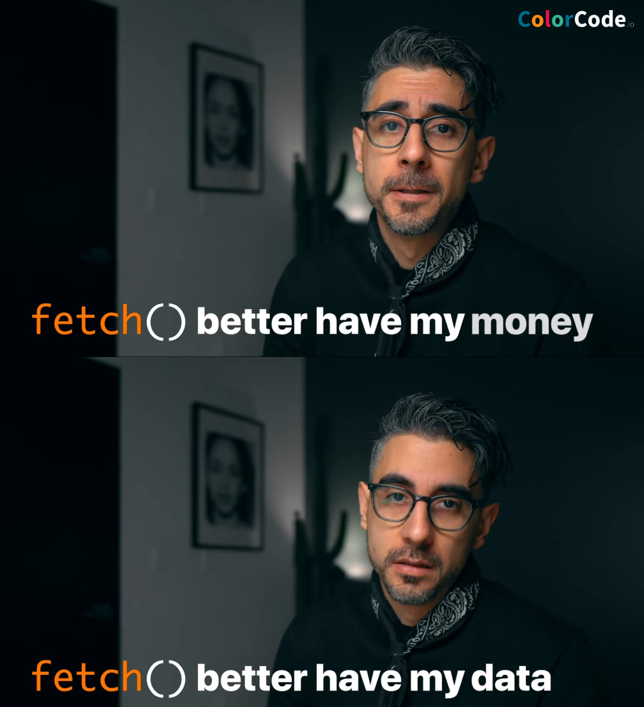

### Schedule

  - [Study](#study-plan-NN)
  - [Exercises](#exercises-NN)
  - [Extra Resources](#extra-resources-NN)

### Study Plan

  

  <!-- SGEN:META:PROGRESS:task=Watch 'JavaScript Fetch API 👨🏻‍💻 in 1 Minute' -->
  - [Watch: **JavaScript Fetch API 👨🏻‍💻 in 1 Minute**](https://www.youtube.com/watch?v=3ySZQXVjCoM){:target="_blank"}
    - Level: Beginner
    - Duration: 1min
    - Captions: Yes

  <!-- SGEN:META:PROGRESS:task=Read 'Fetch API and Async/Await' -->
  - [Read: **Fetch API and Async/Await**](../modules/javascript/web_apis/fetch/30-days-of-javascript/index.md){:target="_blank"}

  <!-- SGEN:META:PROGRESS:task=Watch 'Fetch API' -->
  - [Watch **Fetch API**](https://www.youtube.com/watch?v=ubw2hdQIl4E){:target="_blank"}
    - Level: Beginner
    - Duration: 30min
    - Caption: Yes

### Summary

### Exercises

  **Fetch Basics**

  <!-- SGEN:META:PROGRESS:task=Complete the exercise 'Fetch Basics'|user_folder=fetch_basics -->
  <!-- SGEN:META:TESTS:name=Test Exercise: 'Fetch Basics'|type=exist|user_folder=fetch_basics|files=fetch.html,fetch.js -->
  Copy the folder `curriculum/week{{ SGEN:WEEK_NUM }}/exercises/fetch_basics/` inside folder `user/week{{ SGEN:WEEK_NUM }}/exercises/day{{ SGEN:DAY_NUM }}/` and compete all the challenges found inside the JavaScript file.

### Extra Resources

  _(Nothing here yet. Feel free to contribute if you've found some useful resources.)_

### Sources and Attributions

  **Content is based on the following sources:**

  - [30 Days Of JavaScript: Promises](https://github.com/in-tech-gration/30-Days-Of-JavaScript/blob/master/18_Day_Promises/18_day_promises.md){:target="_blank"} [(Permalink)](https://github.com/in-tech-gration/30-Days-Of-JavaScript/blob/55d8e3dbc0410d64c1dc3ea5915e015a7950cf2a/18_Day_Promises/18_day_promises.md){:target="_blank"}

  Don't forget to star this awesome [repo](https://github.com/Asabeneh/30-Days-Of-JavaScript){:target="_blank"}!