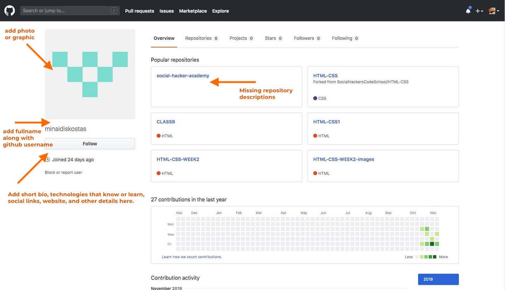

# GitHub Profile

  If you are applying for a software developer job, chances are that your future employers or recruiters will visit your GitHub account and check on your profile.

  They will be assessing and evaluating your skills and activity on the Web's most popular platform for coders. It is therefore crucially important to **take good care** of your GitHub profile and update it regularly.

  In this module, we provide some advice, tips and suggestions on how to improve your GitHub profile.

  Please, pay close attention. The important thing is to **show that your case**.

## Building a better profile

   

  Here are is a checklist that can be used to improve your online presence as a software developer in a step-by-step manner:

  - **Pick a good Avatar:** Add a relevant and high-quality photo, avatar or logo on your GitHub account. **Don't leave the default GitHub generated logo** for too long. Taking care of your profile image, means that you do care for your online presence. You wouldn't go on a conference wearing pajamas, would you?

  - **Add a bio section:** underneath your profile avatar. People that take an interest in you, should be able to quickly check on what your are actually working on and what your skills are.

  - **Add relevant information:** GitHub allows your to add many useful information about your professional profile. Make sure to include: **location**, **email**, **website** and **social accounts**. People will be able to find more about you through these links and also reach out to you in case they are fond of your skills. Make sure to stick with professional networks and social media, e.g. LinkedIn, StackOverflow, etc.

  - **Update each repository:** Make sure to include a proper name and description underneath each and every repository of yours. Especially the ones [pinned](https://docs.github.com/en/account-and-profile/setting-up-and-managing-your-github-profile/customizing-your-profile/pinning-items-to-your-profile){:target="_blank"} on your profile. You should definitely pin your favorite and most popular repositories.

  - **Invite colleagues to your profile:** reach out to colleagues and class mates to your profile and invite them to follow you and star your repos.

  - **Make sure to include a personal profile README:** follow [this link](https://docs.github.com/en/account-and-profile/setting-up-and-managing-your-github-profile/customizing-your-profile/managing-your-profile-readme){:target="_blank"} to learn how to include a personal profile README that includes more information about what you do and what you are looking for (e.g. open for work). Check the link below for some awesome GitHub profile READMEs:

  - [Awesome GitHub Profiles](https://zzetao.github.io/awesome-github-profile/){:target="_blank"}

## Impress your employers with your projects

  One of the best ways to showcase your software skills is through open-source projects. One of the best ways to do this is through GitHub.

  The plan is simple:

  - Start with an idea
  - Implement
  - Upload on GitHub and include a short summary of what your application is all about and what technologies are used
  - Always include a link to the live demo. Usually, this means that you will need to enable [GitHub Pages](https://pages.github.com/){:target="_blank"} on your repository. 
  
  You can watch this [video](https://www.youtube.com/watch?v=htJDbolH7T8){:target="_blank"} to learn more about GitHub Pages and how to deploy your web application through it.

  

  Here's an example of a GitHub repository that includes a brief summary of what the app is actually doing accompanied with an online demo (please give it a Star):

  - [Grocery List App](https://chridas.github.io/grocery-list/){:target="_blank"}
  - [Demo](https://github.com/Chridas/grocery-list){:target="_blank"}

