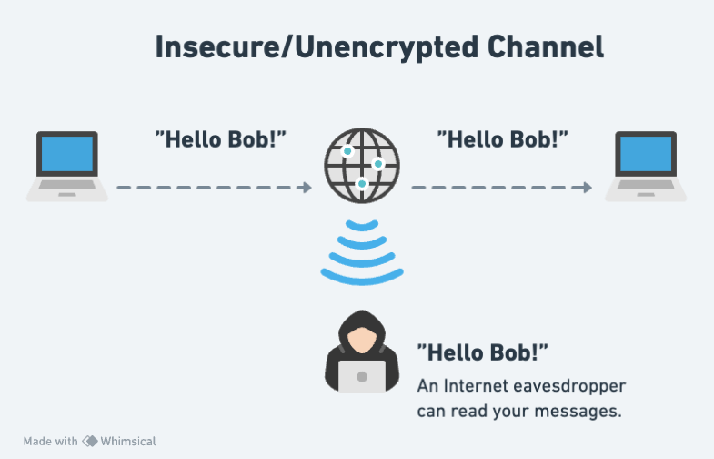
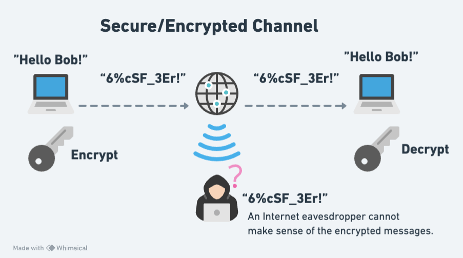

# Git Introduction

  **What you'll learn:**

  - Basic Git concepts
  - Basic Git commands
  - Connecting to GitHub securely using SSH keys
  - Create a GitHub repository

  ---

  💡 **TIP OF THE DAY:** How to display hidden (system) files and folders?

  - **Windows (Powershell):** Run `ls -Force` to show hidden files and folders
  - **Windows (Command Prompt):** Run `dir /a:h` to show hidden files and folders
  - **Mac:** Press `Cmd + Shift + .` to toggle system files/folders view on and off
  - **Linux/Unix:** Run `ls -a` to list all files and folders (including hidden ones) 
  - **VSCode:** How to show particular hidden folders: File > Preferences > Settings: type "exclude" > Hover over the `**/.git` and click X to delete
  - **Windows 11 (File Explorer):**
    - Open `File Explorer` from the taskbar
    - Select `View > Show > Hidden items` 
  - **Windows 10 (File Explorer):** 
    - Open `File Explorer` from the taskbar 
    - Select `View > Options > Change folder and search options`
    - Select the `View` tab and, in `Advanced settings`, select `Show hidden files, folders, and drives` and OK.
  - **References:**
    - [View hidden files and folders in Windows](https://support.microsoft.com/en-us/windows/view-hidden-files-and-folders-in-windows-97fbc472-c603-9d90-91d0-1166d1d9f4b5){:target="_blank"}

  ---

  **What is Version Control and why do we need it? Why do most professional developers and teams use Git and GitHub?**

  - Let's find out with this [**What is Git and Github? Source Control —Coding For Beginners**](https://www.youtube.com/watch?v=3bchX_7ANQc){:target="_blank"} video.

  ---

  On the Internet, it's pretty easy for someone to intercept the data going from one place to another.

  

  That's why it's crucial to always use some form of encryption and decryption, in order for your data to be securely transported through the Internet. 

  

  The same goes, of course, for the data that you exchange with **GitHub**. In order to open up a secure connection with **GitHub** and be able to download (`git pull`) or upload (`git push`) data, we can use the **SSH** protocol along with a pair of keys to lock and unlock data going back and forth.

  > [About SSH](https://docs.github.com/en/authentication/connecting-to-github-with-ssh/about-ssh){:target="_blank"}: "SSH, which stands for Secure Shell, is a protocol used to open up a secure communication channel between computers. Using the SSH protocol, you can connect and authenticate to remote servers and services. With SSH keys, you can connect to GitHub without supplying your username and personal access token at each visit."

<!-- SGEN:META:PROGRESS:task=Sign up with GitHub|instructions=Paste GitHub username -->

<!-- SGEN:META:PROGRESS:task=Set up SSH keys for GitHub -->

<!-- SGEN:META:PROGRESS:task=Create a (demo-repo) GitHub repository|instructions=Paste GitHub repository URL -->

<!-- SGEN:META:PROGRESS:task=Create a profile README on GitHub following this guide: https://docs.github.com/en/account-and-profile/setting-up-and-managing-your-github-profile/customizing-your-profile/managing-your-profile-readme|instructions=Paste GitHub readme URL e.g. https://github.com/kostasx/kostasx -->

  - **Set up SSH keys for GitHub.** Complete the following 4 steps in order to be able to access GitHub without using a username and password.

  1. [**Set up SSH keys for GitHub**](https://docs.github.com/en/authentication/connecting-to-github-with-ssh/generating-a-new-ssh-key-and-adding-it-to-the-ssh-agent){:target="_blank"}

  2. [**Check for SSH keys**](https://docs.github.com/en/authentication/connecting-to-github-with-ssh/checking-for-existing-ssh-keys){:target="_blank"}

  3. [**Add SSH keys to your GitHub account**](https://docs.github.com/en/authentication/connecting-to-github-with-ssh/adding-a-new-ssh-key-to-your-github-account){:target="_blank"}

  4. [**Test your SSH connection**](https://docs.github.com/en/authentication/connecting-to-github-with-ssh/testing-your-ssh-connection){:target="_blank"}

  **TASK: Set up SSH keys for GitHub**. Once you have successfully completed all 4 steps, make sure to update your [progress sheet](../../user/progress.draft.60.csv) and mark the ` Set up SSH keys for GitHub` task as completed by switching the COMPLETED column from `FALSE` to `TRUE`.

<!-- SGEN:META:PROGRESS:task=Watch 'Git Tutorial For Dummies' and code along -->

<!-- SGEN:META:PROGRESS:task=Follow the steps mentioned in the 'Git Tutorial For Dummies' video and recreate the repository under your GitHub account|instructions=Paste the full GitHub URL of the gitVideo repository -->
  - [Watch: **Git Tutorial For Dummies**](https://www.youtube.com/watch?v=mJ-qvsxPHpY){:target="_blank"}
    - **Notes**: Make sure to **follow along** and run the git commands on your own repo. ⚠️ **IMPORTANT:** The repository you will create under your GitHub account, **must be named: `gitVideo`**. Also, even though the author is using the old **master** convention for his repo branch names, you should use **main** instead: `git checkout main`, `git push -u origin main`, etc.
    - **Duration**: 20min 
    - **Level**: Beginner
    - 

        
What you'll learn:

        <ul>
          <li>mkdir</li>
          <li>cd</li>
          <li>rm</li>
          <li>ls</li>
          <li>touch</li>
          <li>git init</li>
          <li>git add .</li>
          <li>git add index.html</li>
          <li>git commit -m "MESSAGE"</li>
          <li>git log</li>
          <li>git checkout BRANCH_NAME</li>
          <li>git checkout -b NEW_BRANCH_NAME</li>
          <li>git checkout COMMIT_HASH</li>
          <li>git, detached state</li>
          <li>git switch</li>
          <li>git branch</li>
          <li>git remote add origin GITHUB_URL</li>
          <li>git push origin master</li>
        </ul>
      

  **One important point to remember** is that the main branch in a git repository these days is called, ...well `main`. A few years back, the main branch used to be called `master`, so expect to see this term in various videos and tutorials. You should stick with `main`, by the way. There are no masters here. 🙂

  - **⏰ Time for a short break** (~5-10min) before the next longer video.

  **Repetitio est mater studiorum:** "Repetition is the mother of learning". Let's recap those git concepts by revisiting them through another (longer) and more in-depth video about Git. 

<!-- SGEN:META:PROGRESS:task=Watch 'Git and GitHub for Beginners - Crash Course -->
  - [Watch: **Git and GitHub for Beginners - Crash Course**](https://www.youtube.com/watch?v=RGOj5yH7evk){:target="_blank"}
    - **Duration**: 69min
    - **Level**: Beginner
    - 

        
What you'll learn:

        <ul>
          <li>(0:00) Introduction</li>
          <li>(1:10) What is git?</li>
          <li>(1:30) What is version control?</li>
          <li>(2:10) Terms to be learn in video</li>
          <li>(5:20) Git commands</li>
          <li>(7:05) sign up in GitHub</li>
          <li>(11:32) using git in local machine</li>
          <li>(11:54) git install</li>
          <li>(12:48) getting code editor</li>
          <li>(13:30) inside VS Code</li>
          <li>(14:30) cloning through VS Code</li>
          <li>(17:30) git commit command</li>
          <li>(18:15) git add command</li>
          <li>(19:15) committing</li>
          <li>(20:20) git push command</li>
          <li>(20:30) SSH Keys</li>
          <li>(25:25) git push</li>
          <li>(30:21) Review workflow so far</li>
          <li>(31:40) Compare between GitHub workflow and local git workflow</li>
          <li>(32:42) git branching</li>
          <li>(56:30) Undoing in git</li>
          <li>(1:01:50) Forking in git</li>
          <li>(1:07:55) Ending</li>
        </ul>
      

  - You can find a nice reference to the git commands mentioned in the videos [here](resources/git-commands.html). _(Also, in [markdown format](resources/git-commands.md))_

## Summary

  - **What is Version Control?** The management of changes to documents, computer programs, large web sites, and other collections of information.
  - **What is Git?** A free and open source version control system.

## Sources and Attributions

  **Content is based on the following sources:**

  - [Git SSH keys simplified and how to setup on GitHub](https://inspirezone.tech/git-ssh-keys-simplified/)