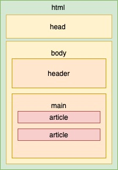

# Semantic HTML

There are no semantic tags or attributes being used in the messages for this example. Let's improve it by changing the tags and attributes to semantic HTML code, so that computers can understand what kind of information is being presented.
Take a look at the picture, which shows an example of a semantic HTML structure.



Complete the following changes in the `index.html` file:

1. Replace an existing tag with the `<header role="banner">` tag to specify the site's header area.

2. Replace an existing tag with the `<main role="main">` tag to specify the main content on the site.

3. Replace existing tags with the `<article>` tag to group information relating to a single message.

4. Extra challenge: read [this article about the `<time>` tag](https://developer.mozilla.org/en-US/docs/Web/HTML/Element/time) and the `datetime=""` attribute. Use this to specify the time of each message.

5. You'll have to copy the files existing in the folder and place them in the corresponding folder inside your `user/` folder.

6. When you are finished, use git to add, commit and push your changes.

For example:

- Copy all files in folder `3-semantic-html`
- Paste them inside folder `user/week01/exercises/day03/3-semantic-html/`
- Work on the copied files and complete the exercise.
- Upload (push) to your repo.

```bash
git add user/week01/exercises/day03/3-semantic-html/
git commit -m "Completed 1-parent-child exercise"
git push
```

_Hint: To complete this exercise, you should modify the HTML tags without removing the attributes that are already there. For example, if you wanted to change `<div class="article></div>` to an `<article>` tag, you would use `<article class="article"></article>`. The `class` attribute should not be removed._

If you are having trouble, you can review [read this guide to the semantic tags](https://developer.mozilla.org/en-US/docs/Glossary/Semantics#Semantic_elements).

----

### Sources and Attributions

**Content is based on the following sources:**

- [Semantic HTML CYF exercise (Permalink)](https://github.com/CodeYourFuture/html-css-git-exercises/tree/283fe52ba1dbafcdc84a3c0b59942003bd09b675/week-1/3-semantic-html)