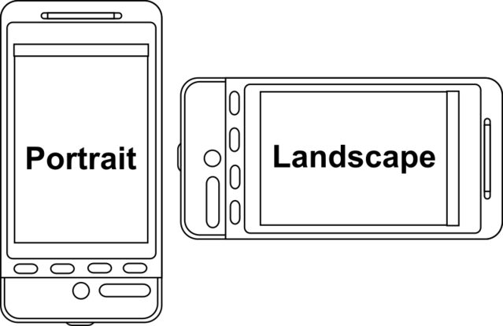

# Exercises: JavaScript First Steps

---

## 1) Largest Number Checker: Create a function that returns the largest number

  Copy and paste the code below in a file named `largest-number.html`, and try to update the JS part:

  **largest-number.html**:

  ```html
  <!DOCTYPE html>
  <html lang="en">
  <head>
    <meta charset="UTF-8">
    <meta name="viewport" content="width=device-width, initial-scale=1.0">
    <title>Largest Number</title>
  </head>
  <body>
    <h1>Largest Number</h1>
    <script src="largest-number.js"></script>
  </body>
  </html>
  ```

  **largest-number.js**:

  ```js
  function findMaxNumber(num1, num2){
    // YOUR CODE HERE >>
    // << YOUR CODE HERE
  }

  // RUNNING & TESTING OUR findMaxNumber() FUNCTION:
  // Don't worry about the code below. It's just there to test your code above.
  const checkMax1 = findMaxNumber(10, 5);
  console.log('Max Number 1:',checkMax1);

  const checkMax2 = findMaxNumber(10, 15);
  console.log('Max Number 2:',checkMax2);

  const checkMax3 = findMaxNumber(100, 100);
  console.log('Max Number 3:',checkMax3);

  console.assert( checkMax1 === 10, "Ops, was expecting 10, got ", checkMax1);
  console.assert( checkMax2 === 15, "Ops, was expecting 15, got ", checkMax2);
  console.assert( checkMax3 === 100, "Ops, was expecting 100, got ", checkMax3);

  try {
    if ( global ){ global.findMaxNumber = findMaxNumber; }
  } catch(e){}
  ```

  When you're ready, move the 2 files (`largest-number.html`, `largest-number.js`) in the following path `user/week01/exercises/day05/javascript-first-steps/` and run the git commands below to submit your exercise:

  - `git add user/week01/exercises/day05/javascript-first-steps/`
  - `git commit -m "javascript-largest-number"`
  - `git push`

## 2) Landscape Mode Checker: Create a function that detects landscape mode 

  "Page orientation is the way in which a rectangular page is oriented for normal viewing. The two most common types of orientation are portrait and landscape."

  

  Create a function that accepts two arguments, a picture's `width` and `height` and returns a Boolean (`true/false`) depending on whether the picture is in landscape mode or not.

  Copy and paste the code below in a file named `landscape-mode.html`, and try to update the JS part:

  ```html
  <!DOCTYPE html>
  <html lang="en">
  <head>
    <meta charset="UTF-8">
    <meta name="viewport" content="width=device-width, initial-scale=1.0">
    <title>Landscape Mode Checker</title>
  </head>
  <body>
    <h1>Landscape Mode Checker</h1>
    <script src="landscape-mode.js"></script>  
  </body>
  </html>
  ```

  **landscape-mode.js**:

  ```js
  function isLandscape(width, height){
  // YOUR CODE HERE >>

  // << YOUR CODE HERE
  }

  // Don't worry about the code below. It's just there to test your code above.

  // RUNNING & TESTING OUR isLandscape() FUNCTION:
  console.assert( isLandscape, "Expecting isLandscape to be defined" );
  console.assert( typeof isLandscape === "function", "Expecting isLandscape to be a function" );

  const checkWidthHeight1 = isLandscape(800, 600);
  console.log('Landscape:',checkWidthHeight1); // Should be true

  const checkWidthHeight2 = isLandscape(600, 800);
  console.log('Landscape:',checkWidthHeight2); // Should be false
  
  const checkWidthHeight3 = isLandscape(600, 600);
  console.log('Landscape:',checkWidthHeight3); // Should be false

  const checkWidthHeight4 = isLandscape(1024, 768);
  console.log('Landscape:',checkWidthHeight4); // Should be true

  console.assert( checkWidthHeight1 === true, "Ops! Was expecting true.")
  console.assert( checkWidthHeight2 === false, "Ops! Was expecting false.")
  console.assert( checkWidthHeight3 === false, "Ops! Was expecting false.")
  console.assert( checkWidthHeight4 === true, "Ops! Was expecting true.")

  try {
    if ( global ){ global.isLandscape = isLandscape; }
  } catch(e){}
  ```

  When you're ready, move the files in the following path `user/week01/exercises/day05/javascript-first-steps/` and run the git commands below to submit your exercise:

  - `git add user/week01/exercises/day05/javascript-first-steps/`
  - `git commit -m "javascript-landscape-mode"`
  - `git push`

## 3) Simple Quiz: Create a simple multiple choice game

  In this exercise, you must `prompt` the user for an answer to the following question:

  ```
  Question: Who created JavaScript?

  A) Brendan Eich
  B) Bill Gates
  C) Mark Zuckerberg

  Please select the correct option (A, B, or C).
  ```

  The user is given 3 choices. Once they have given in their response, you must check it and `alert` the following messages according to the answer they've given:

  "Correct! Not only did he create JS, the prototype of the language was ready in 10 days!"

  Or

  "Nope. He lead the development of the Windows Operating System."

  "Nope. He just came up with the idea for a social network idea."

  Caution: be careful when dealing with user input. In this case we want to leverage the power of the String methods (e.g. trim, toLowerCase, etc.) and make sure to handle appropriately input that contains leading or trailing spaces and also accept an answer regardless the casing, e.g. "A", "a ", " B ", " b", are all valid answers.

  Copy and paste the code below in a file named `simple-quiz.html`, and try to update the JS part:

  ```html
  <!DOCTYPE html>
  <html lang="en">
  <head>
    <meta charset="UTF-8">
    <meta name="viewport" content="width=device-width, initial-scale=1.0">
    <title>Simple Quiz</title>
  </head>
  <body>
    <h1>Simple Quiz</h1>
    <script src="simple_quiz.js"></script>  
  </body>
  </html>
  ```

  **simple-quiz.js**:

  ```js
  // YOUR CODE HERE >>
  // << YOUR CODE HERE
  ```

  When you're ready, move the files in the following path `user/week01/exercises/day05/javascript-first-steps/` and run the git commands below to submit your exercise:

  - `git add user/week01/exercises/day05/javascript-first-steps/`
  - `git commit -m "javascript-simple-quiz"`
  - `git push`

## 4) Schnick-Schnack-Schnuck: Create a simple Rock-Paper-Scissors Game

  For this exercise, we want you to recreate a simple game of [Rock, Paper, Scissors](https://en.wikipedia.org/wiki/Rock_paper_scissors).

  Use the `prompt()` method to accept an input from the user and the `alert()` method to display whether they have won or lost. We have already created two functions to start with, but feel free to add as many functions as you need.

  In order to draw a random number (which will be used to let the program choose a move) you can use the following code:

  ```js
  Math.floor( Math.random() * 3 ); // Will return a random number between 0, 1 and 2
  ```

  Copy and paste the code below in a file named `rock-paper-scissors.html`, and try to update the JS part:

  ```html
  <!DOCTYPE html>
  <html lang="en">
  <head>
    <meta charset="UTF-8">
    <meta name="viewport" content="width=device-width, initial-scale=1.0">
    <title>Schnick-Schnack-Schnuck</title>
  </head>
  <body>
    <h1>Schnick-Schnack-Schnuck</h1>
    <script src="rock-paper-scissors.js"></script>  
  </body>
  </html>
  ```

  **rock-paper-scissors.js**:

  ```js
  // YOUR CODE HERE >>

  // Function that returns a random move, e.g. rock, paper, scissors:
  function getRandomMove(){

  }

  // Given a move, (e.g. rock, paper, scissors) and a random computer move. Returns the result which must be strictly one of the following: "won", "lost", "draw"
  function checkMove( move, computerMove ){

  }

  // Rest of your code here...

  // << YOUR CODE HERE

  // Don't worry about the code below. It's just there to test your code above.
  const drawn = new Set();
  for ( let i = 0; i < 100; i++ ){
    const randomMove = getRandomMove();
    drawn.add(randomMove);
    const oneOfTheThreeMoves = randomMove === 'rock' || randomMove === 'paper' || randomMove === 'scissors';
    if ( !oneOfTheThreeMoves ){
      throw new Error("Ops! Expected rock, paper or scissors, instead got " + randomMove);
    }
  }

  if ( !drawn.has("rock") || !drawn.has("paper") || !drawn.has("scissors") ){
    throw new Error("Ops! Did not find all three moves in the results!");
  }

  const gameResult1 = checkMove("rock", "rock");
  console.log("Game Result 1: ", gameResult1); // Should be draw

  const gameResult2 = checkMove("rock", "paper");
  console.log("Game Result 2: ", gameResult2); // Should be lost

  const gameResult3 = checkMove("rock", "scissors");
  console.log("Game Result 3: ", gameResult3); // Should be won
  
  const gameResult4 = checkMove("paper", "paper");
  console.log("Game Result 4: ", gameResult4); // Should be draw

  const gameResult5 = checkMove("paper", "scissors");
  console.log("Game Result 5: ", gameResult5); // Should be lost

  const gameResult6 = checkMove("paper", "rock");
  console.log("Game Result 6: ", gameResult6); // Should be won

  const gameResult7 = checkMove("scissors", "scissors");
  console.log("Game Result 7: ", gameResult7); // Should be draw

  const gameResult8 = checkMove("scissors", "rock");
  console.log("Game Result 8: ", gameResult8); // Should be lost

  const gameResult9 = checkMove("scissors", "paper");
  console.log("Game Result 9: ", gameResult9); // Should be won

  const gameResult10 = checkMove("pencil", "rock");
  console.log("Game Result 10: ", gameResult10); // Should be invalid move

  try {
    if (global) {
      global.getRandomMove = getRandomMove;
      global.checkMove = checkMove;
    }
  } catch (e) {}
  ```

  When you're ready, move the files in the following path `user/week01/exercises/day05/javascript-first-steps/` and run the git commands below to submit your exercise:

  - `git add user/week01/exercises/day05/javascript-first-steps/`
  - `git commit -m "javascript-rock-paper-scissors"`
  - `git push`

----

### Sources and Attributions

**Content is based on the following sources:**

- [Wikipedia: Page orientation](https://en.wikipedia.org/wiki/Page_orientation)
