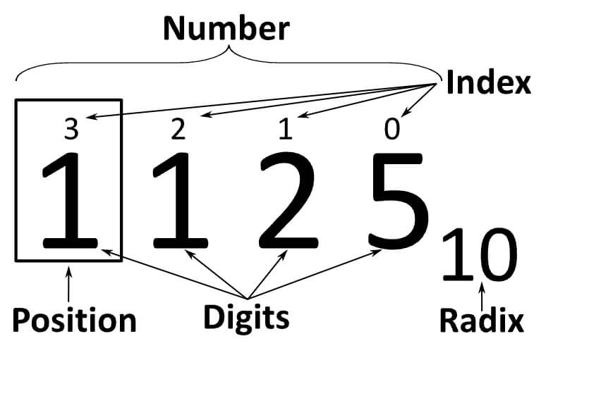

# Positional Notation, Binary, Octal and Hexadecimal Numeric Systems

Positional notation (or place-value notation, or positional numeral system) usually denotes the extension to any **base** [1] of the Hindu–Arabic numeral system (or decimal system). More generally, a positional system is a numeral system in which the contribution of a digit to the value of a number is the value of the digit multiplied by a factor determined by the position of the digit. In early numeral systems, such as Roman numerals, a digit has only one value: I means one, X means ten and C a hundred (however, the value may be negated if placed before another digit). In modern positional systems, such as the decimal system, the position of the digit means that its value must be multiplied by some value: in 555, the three identical symbols represent five hundreds, five tens, and five units, respectively, due to their different positions in the digit string.

In computing, the **binary** (base-2), **octal** (base-8) and **hexadecimal** (base-16) bases are most commonly used. Computers, at the most basic level, deal only with sequences of conventional zeroes and ones, thus it is easier in this sense to deal with powers of two. The hexadecimal system is used as "shorthand" for binary—every 4 binary digits (bits) relate to one and only one hexadecimal digit. In hexadecimal, the six digits after 9 are denoted by A, B, C, D, E, and F (and sometimes a, b, c, d, e, and f).

The octal numbering system is also used as another way to represent binary numbers. In this case the base is 8 and therefore only digits 0, 1, 2, 3, 4, 5, 6, and 7 are used. When converting from binary to octal every 3 bits relate to one and only one octal digit.

Hexadecimal, decimal, octal, and a wide variety of other bases have been used for **binary-to-text encoding** [2], implementations of **arbitrary-precision arithmetic**, and other applications.

---

**[1] base:** In a positional numeral system, the radix or base is the number of unique digits, including the digit zero, used to represent numbers. For example, for the decimal system the radix is ten, because it uses the ten digits from 0 through 9._

**[2] A binary-to-text encoding** is encoding of data in plain text. More precisely, it is an encoding of binary data in a sequence of printable characters. These encodings are necessary for transmission of data when the channel does not allow binary data or is not 8-bit clean. PGP documentation &hellip;

**[3] arbitrary-precision arithmetic** : In computer science, arbitrary-precision arithmetic, also called bignum arithmetic, multiple-precision arithmetic, or sometimes infinite-precision arithmetic, indicates that calculations are performed on numbers whose digits of precision are limited only by the availab&hellip;

----

### Sources and Attributions

**Content is based on the following sources:**

- [Wikipedia: Positional notation](https://en.wikipedia.org/wiki/Positional_notation)