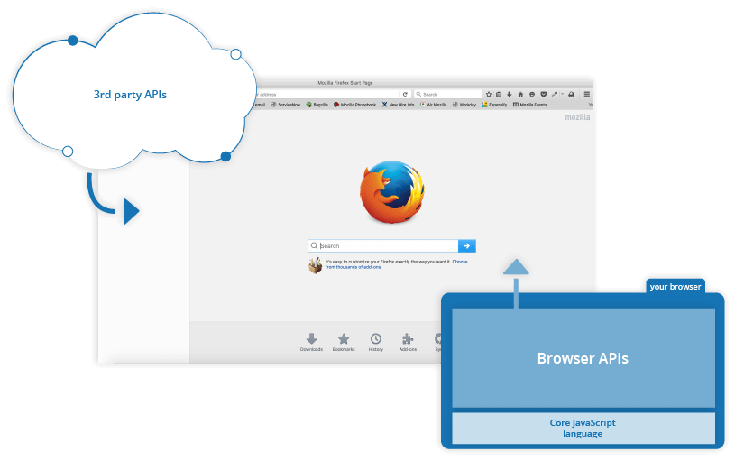
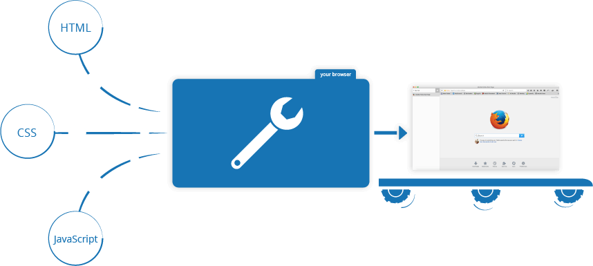

# What is JavaScript 

**Prerequisites:**

- A general understanding of the Internet and the World Wide Web
- Basic computer literacy, a basic understanding of HTML and CSS.

**Objective:**

- To gain familiarity with what JavaScript is, what it can do, and how it
        fits into a website.

_(Updated: 19/08/2023)_

JavaScript is a programming language that adds interactivity to your website. This happens in games, in the behavior of responses when buttons are pressed or with data entry on forms; with dynamic styling; with animation, etc.
This article helps you get started with JavaScript and furthers your understanding of what is possible.

[JavaScript](https://developer.mozilla.org/en-US/docs/Glossary/JavaScript) is a powerful programming language that can add interactivity to a website.
It was invented by Brendan Eich.

JavaScript is versatile and beginner-friendly.
With more experience, you'll be able to create games, animated 2D and 3D graphics, comprehensive database-driven apps, and much more!

JavaScript itself is relatively compact, yet very flexible. Developers have written a variety of tools on top of the core JavaScript language, unlocking a vast amount of functionality with minimum effort. These include:

- Browser Application Programming Interfaces ([APIs](https://developer.mozilla.org/en-US/docs/Glossary/API)) built into web browsers, providing functionality such as dynamically creating HTML and setting CSS styles; collecting and manipulating a video stream from a user's webcam, or generating 3D graphics and audio samples.

- Third-party APIs that allow developers to incorporate functionality in sites from other content providers, such as Twitter or Facebook.

- Third-party frameworks and libraries that you can apply to HTML to accelerate the work of building sites and applications.

It's outside the scope of this article—as a light introduction to JavaScript—to present the details of how the core JavaScript language is different from the tools listed above. You can learn more in MDN's [JavaScript learning area](https://developer.mozilla.org/en-US/docs/Learn/JavaScript), as well as in other parts of MDN.

The section below introduces some aspects of the core language and offers an opportunity to play with a few browser API features too. Have fun!

---

JavaScript (or "JS") is a programming language used most often for dynamic and interactive content on webpages, but it is also often used on the **server***-side, using software such as [Node.js](https://nodejs.org/).

> A [**server**](../../../../resources/glossary/Server.md) is a software or hardware offering a service to a user, usually referred to as client. Services are provided generally over local area networks or wide area networks such as the internet.
> 
> For example:
> 
> An Internet-connected Web server is sending a [HTML](https://developer.mozilla.org/en-US/docs/Glossary/HTML) file to your browser software so that you can read this page

JavaScript **should not** be confused with the [Java programming language](<https://en.wikipedia.org/wiki/Java_(programming_language)>). Although _"Java"_ and _"JavaScript"_ are trademarks (or registered trademarks) of Oracle in the U.S. and other countries, the two programming languages are significantly different in their syntax, semantics, and use cases.

JavaScript is primarily used in the browser, enabling developers to manipulate webpage content and data, draw graphics, interact with the device running the browser through various [APIs](https://developer.mozilla.org/en-US/docs/Glossary/API), and more. JavaScript is one of the world's most commonly-used languages, owing to the recent growth and performance improvement of [APIs](https://developer.mozilla.org/en-US/docs/Glossary/API) available in browsers.

## Origins and History

Conceived as a server-side language by Brendan Eich (then employed by the Netscape Corporation), JavaScript soon came to Netscape Navigator 2.0 in September 1995. JavaScript enjoyed immediate success and [Internet Explorer 3.0](https://developer.mozilla.org/en-US/docs/Glossary/Microsoft_Internet_Explorer) introduced JavaScript support under the name JScript in August 1996.

In November 1996, Netscape began working with [Ecma International](https://www.ecma-international.org/) to make JavaScript an industry standard. Since then, the standardized JavaScript is called **ECMAScript** and specified under ECMA-262, whose latest (twelfth, ES2021) edition is available as of June 2021.

Recently, JavaScript's popularity has expanded even further through the successful [Node.js](https://nodejs.org/) platform—the most popular cross-platform JavaScript runtime environment outside the browser. Node.js - built using [Chrome's V8 JavaScript Engine](<https://en.wikipedia.org/wiki/V8_(JavaScript_engine)>) - allows developers to use JavaScript as a scripting language to automate things on a computer and build fully functional servers.

## A high-level definition

JavaScript is a scripting or programming language that allows you to implement complex features on web pages — every time a web page does more than just sit there and display static information for you to look at — displaying timely content updates, interactive maps, animated 2D/3D graphics, scrolling video jukeboxes, etc. — you can bet that JavaScript is probably involved.
It is the third pillar of the standard web technologies, along with ([HTML](https://developer.mozilla.org/en-US/docs/Learn/HTML) and [CSS](https://developer.mozilla.org/en-US/docs/Learn/CSS)).

- [HTML](https://developer.mozilla.org/en-US/docs/Glossary/HTML) is the markup language that we use to structure and give meaning to our web content, for example defining paragraphs, headings, and data tables, or embedding images and videos in the page.

- [CSS](https://developer.mozilla.org/en-US/docs/Glossary/CSS) is a language of style rules that we use to apply styling to our HTML content, for example setting background colors and fonts, and laying out our content in multiple columns.

- [JavaScript](https://developer.mozilla.org/en-US/docs/Glossary/JavaScript) is a scripting language that enables you to create dynamically updating content, control multimedia, animate images, and pretty much everything else. (Okay, not everything, but it is amazing what you can achieve with a few lines of JavaScript code.)

The three layers build on top of one another nicely. 

## So what can it really do?

The **core client-side JavaScript language** consists of some common programming features that allow you to do things like:

- Store useful values inside variables. 

- Operations on pieces of text (known as "strings" in programming). For example, turning lowercase `text` into uppercase `TEXT`, replacing specific characters or series of characters, and more.

- Running code in response to certain events occurring on a web page. For example, we can run some code when the user has clicked on a button or a specific part of the web page.

- And much more!

What is even more exciting however is the functionality built on top of the client-side JavaScript language. So-called **Application Programming Interfaces** (**APIs**) provide you with extra superpowers to use in your JavaScript code.

**APIs are ready-made sets of code building blocks** that allow a developer to implement programs that would otherwise be hard or impossible to implement.
They do the same thing for programming that ready-made furniture kits do for home building — it is much easier to take ready-cut panels and screw them together to make a bookshelf than it is to work out the design yourself, go and find the correct wood, cut all the panels to the right size and shape, find the correct-sized screws, and _then_ put them together to make a bookshelf.

They generally fall into two categories.



**Browser APIs** are built into your web browser, and are able to expose data from the surrounding computer environment, or do useful complex things. For example:

- The [DOM (Document Object Model) API](https://developer.mozilla.org/en-US/docs/Web/API/Document_Object_Model/undefined) allows you to manipulate HTML and CSS, creating, removing and changing HTML, dynamically applying new styles to your page, etc.
  Every time you see a popup window appear on a page, or some new content displayed (as we saw above in our simple demo) for example, that's the DOM in action.

- The [Geolocation API](https://developer.mozilla.org/en-US/docs/Web/API/Geolocation/undefined) retrieves geographical information.
  This is how [Google Maps](https://www.google.com/maps) is able to find your location and plot it on a map.

- The [Canvas](https://developer.mozilla.org/en-US/docs/Web/API/Canvas_API/undefined) and [WebGL](https://developer.mozilla.org/en-US/docs/Web/API/WebGL_API/undefined) APIs allow you to create animated 2D and 3D graphics.
  People are doing some amazing things using these web technologies — see [Chrome Experiments](https://experiments.withgoogle.com/collection/chrome) and [webglsamples](https://webglsamples.org/).

- [Audio and Video APIs](https://developer.mozilla.org/en-US/docs/Web/Guide/Audio_and_video_delivery) like [HTMLMediaElement](https://developer.mozilla.org/en-US/docs/Web/API/HTMLMediaElement/undefined) and [WebRTC](https://developer.mozilla.org/en-US/docs/Web/API/WebRTC_API) allow you to do really interesting things with multimedia, such as play audio and video right in a web page, or grab video from your web camera and display it on someone else's computer (try our simple [Snapshot demo](https://chrisdavidmills.github.io/snapshot/) to get the idea).

> **Note:** Many of the above demos won't work in an older browser — when experimenting, it's a good idea to use a modern browser like Firefox, Chrome, Edge or Opera to run your code in.
> You will need to **consider [cross browser testing](https://developer.mozilla.org/en-US/docs/Learn/Tools_and_testing/Cross_browser_testing)** in more detail when you get closer to delivering production code (i.e. real code that real customers will use).

**Third party APIs** are not built into the browser by default, and you generally have to grab their code and information from somewhere on the Web. For example:

- The [Twitter API](https://developer.twitter.com/en/docs) allows you to do things like displaying your latest tweets on your website.
- The [Google Maps API](https://developers.google.com/maps/) and [OpenStreetMap API](https://wiki.openstreetmap.org/wiki/API) allows you to embed custom maps into your website, and other such functionality.

There's a lot more available, too! However, don't get over excited just yet. You won't be able to build the next Facebook, Google Maps, or Instagram after studying JavaScript for 24 hours — there are a lot of basics to cover first. 

## What is JavaScript doing on your page?

Let's explore what actually happens when you run some JavaScript in your page.

Let's briefly recap the story of what happens when you load a web page in a browser. When you load a web page in your browser, you are running your code (the HTML, CSS, and JavaScript) inside an execution environment (the browser tab). This is like a factory that takes in raw materials (the code) and outputs a product (the web page).



A very common use of JavaScript is to dynamically modify HTML and CSS to update a user interface, via the Document Object Model API (as mentioned above).
Note that the code in your web documents is generally loaded and executed in the order it appears on the page.
Errors may occur if JavaScript is loaded and run before the HTML and CSS that it is intended to modify.

### Browser security

Each browser tab has its own separate bucket for running code in (these buckets are called "execution environments" in technical terms) — this means that in most cases the code in each tab is run completely separately, and the code in one tab cannot directly affect the code in another tab — or on another website.
This is a good security measure — if this were not the case, then pirates could start writing code to steal information from other websites, and other such bad things.

> **Note:** There are ways to send code and data between different websites/tabs in a safe manner, but these are advanced techniques that will be covered in another module.

### JavaScript running order

When the browser encounters a block of JavaScript, it generally runs it in order, from top to bottom.
This means that you need to be careful what order you put things in.

> **Note:** This is a very common error — you need to be careful that the objects referenced in your code exist before you try to do stuff to them.

### Server-side versus client-side code

You might also hear the terms **server-side** and **client-side** code, especially in the context of web development.
Client-side code is code that is run on the user's computer — when a web page is viewed, the page's client-side code is downloaded, then run and displayed by the browser.
In this module we are explicitly talking about **client-side JavaScript**.

Server-side code on the other hand is run on the server, then its results are downloaded and displayed in the browser.
Examples of popular server-side web languages include PHP, Python, Ruby, ASP.NET, and even JavaScript!
JavaScript can also be used as a server-side language, for example in the popular Node.js environment.

### Dynamic versus static code

The word **dynamic** is used to describe both client-side JavaScript, and server-side languages — it refers to the ability to update the display of a web page/app to show different things in different circumstances, generating new content as required.
Server-side code dynamically generates new content on the server, e.g. pulling data from a database, whereas client-side JavaScript dynamically generates new content inside the browser on the client, e.g. creating a new HTML table, filling it with data requested from the server, then displaying the table in a web page shown to the user.
The meaning is slightly different in the two contexts, but related, and both approaches (server-side and client-side) usually work together.

A web page with no dynamically updating content is referred to as **static** — it just shows the same content all the time.

## Getting started with JavaScript

A very useful tool for exploring JavaScript is the JavaScript Console (sometimes called the Web Console, or just the console): this is a tool which enables you to enter JavaScript and run it in the current page.

The screenshots here show the [Firefox Web Console](https://firefox-source-docs.mozilla.org/devtools-user/web_console/), but all modern browsers ship with a console that works in a similar way.

### Opening the console

The exact instructions for opening the console vary from one browser to another:

- [Opening the console in Firefox](https://firefox-source-docs.mozilla.org/devtools-user/web_console/#opening-the-web-console)
- [Opening the console in Chrome](https://developer.chrome.com/docs/devtools/open)
- [Opening the console in Microsoft Edge](https://learn.microsoft.com/en-us/microsoft-edge/devtools-guide-chromium/console/)

### Entering and running JavaScript

The console appears at the bottom of the browser window. Along the bottom of the console is an input line that you can use to enter JavaScript, and the output appears in the panel above:


### Multi-line input in the console

By default, if you press <kbd>Enter</kbd> (or <kbd>Return</kbd>, depending on your keyboard) after entering a line of code, then the string you typed is executed. To enter multi-line input:

- If the string you typed was incomplete (for example, you typed `function foo() {`) then the console will treat <kbd>Enter</kbd> as a line break, and let you type another line.

- If you hold down <kbd>Shift</kbd> while pressing <kbd>Enter</kbd>, then the console will treat this as a line break, and let you type another line.

- In Firefox only, you can activate [multi-line input mode](https://firefox-source-docs.mozilla.org/devtools-user/web_console/the_command_line_interpreter/index.html#multi-line-mode), in which you can enter multiple lines in a mini-editor, then run the whole thing when you are ready.

To get started with writing JavaScript, open the console, copy the following code, and paste it in at the prompt:

```js
alert(`Hello World!`);
```

Press <kbd>Enter</kbd> to watch it unfold in your browser!

## How do you add JavaScript to your page?

JavaScript is applied to your HTML page in a similar manner to CSS.
Whereas CSS uses [`<link>`](https://developer.mozilla.org/en-US/docs/Web/HTML/Element/link) elements to apply external stylesheets and [`<style>`](https://developer.mozilla.org/en-US/docs/Web/HTML/Element/style) elements to apply internal stylesheets to HTML, JavaScript only needs one friend in the world of HTML — the [`<script>`](https://developer.mozilla.org/en-US/docs/Web/HTML/Element/script) element. Let's learn how this works.

### Internal vs External JavaScript

You can either declare a `<script></script>` element and insert the JavaScript code inside opening and closing tags:

  ```html
  <script>
    // JavaScript goes here
  </script>
  ```

Or, you can store the JavaScript code in an external file, e.g. named `script.js` and load it via the `src` attribute of the `<script>` tag.

  ```html
  <script src="script.js"></script>
  ```

## Comments

As with HTML and CSS, it is possible to write comments into your JavaScript code that will be ignored by the browser, and exist to provide instructions to your fellow developers on how the code works (and you, if you come back to your code after six months and can't remember what you did).
Comments are very useful, and you should use them often, particularly for larger applications.
There are two types:

- A single line comment is written after a double forward slash (//), e.g.

  ```js
  // I am a comment
  ```

- A multi-line comment is written between the strings /\* and \*/, e.g.

  ```js
  /*
    I am also
    a comment
  */
  ```

> **Note:** In general more comments are usually better than less, but you should be careful if you find yourself adding lots of comments to explain what variables are (your variable names perhaps should be more intuitive), or to explain very simple operations (maybe your code is overcomplicated).

## Summary

- JavaScript is a popular high-level programming language

- JavaScript can run on various `host` environments, but most commonly it is found inside the Browser or running on a server through the popular `Node.js`

- **ECMAScript** is the standardized version of JavaScript

- JavaScript contains a standard library of objects, such as `Array`, `Date`, and `Math`, and a **core set of language elements** such as operators, control structures, and statements

- **Core JavaScript can be extended** through various APIs for a variety of purposes by supplementing it with additional objects; for example:

 - **Client-side JavaScript** extends the core language by supplying objects to control a browser and its _Document Object Model_ (DOM). Through the DOM API, JavaScript is able to manipulate HTML content, change the CSS of various elements, respond to user events such as mouse clicks, etc. Other Browser APIs, such as the Geolocation, Canvas and other, further extend the core language allowing JavaScript to retrieve information about the user's location on the world, draw on the page and much more.    
 
  - **Server-side JavaScript** extends the core language by supplying objects relevant to running JavaScript on a server. For example, server-side extensions allow an application to communicate with a database, receive network requests from browsers, perform file manipulations on a server and more.

- **Dynamic vs Static Content**

  - A web page with no dynamically updating content is referred to as `static` — it just shows the same content all the time.
  
  - Content generated on the fly (when requested) through code is called `dynamic` content.

- When developing web pages and web applications, careful **cross-browser testing** must take place to ensure that the code runs smoothly and consistently across different browsers. 

### Sources and Attributions

- **MDN**:
    - [JavaScript basics](https://developer.mozilla.org/en-US/docs/Learn/Getting_started_with_the_web/JavaScript_basics) [(Permalink)](https://github.com/mdn/content/blob/51af37123c2eec86e517e6a4cea5e3c30d534a5e/files/en-us/learn/getting_started_with_the_web/javascript_basics/index.md)

    - [JavaScript](https://developer.mozilla.org/en-US/docs/Glossary/JavaScript) [(Permalink)](https://github.com/mdn/content/blob/b96d97e59de4ad4194060f9d41ac009c7a96a18d/files/en-us/glossary/javascript/index.md)

    - [What_is_JavaScript](https://developer.mozilla.org/en-US/docs/Learn/JavaScript/First_steps/What_is_JavaScript) [(Permalink)](https://github.com/mdn/content/blob/main/files/en-us/learn/javascript/first_steps/what_is_javascript/index.md)

    - [Introduction](https://developer.mozilla.org/en-US/docs/Web/JavaScript/Guide/Introduction) [(Permalink)](https://github.com/mdn/content/blob/b96d97e59de4ad4194060f9d41ac009c7a96a18d/files/en-us/web/javascript/guide/introduction/index.md)

    - [Server](https://developer.mozilla.org/en-US/docs/Glossary/Server) [(Permalink)](https://github.com/mdn/content/blob/33d5043bcdf26f6ab99389f21260ab35476e4fb6/files/en-us/glossary/server/index.md)