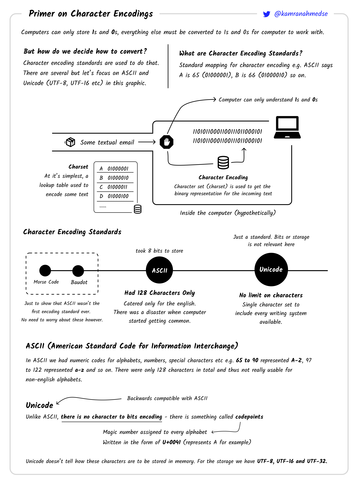

<hr class="mb-0">

<h1 id="{{ Week 01-Introduction to the Web and Web Technologies | slugify }}">
  <span class="week-prefix">Week 01 |</span> Introduction to the Web and Web Technologies
</h1>

{{ SGEN:HEADER_IMAGE }}

<div class="week-controls">

  

  <h2 class="week-controls__previous_week">

    

      

      <a href="../week{{ previous_week_num }}">Week {{ previous_week_num }} &#8678;</a>
    

  </h2>

  <span>Updated: 25/09/2025</span>

  <h2 class="week-controls__next_week">

    

      

      <a href="../week{{ next_week_num }}">&#8680; Week {{ next_week_num }}</a>
    

  </h2>

</div>

<hr style="margin-bottom:0" />

<div class="center opacity-50 opacity-100:hover">

  You are viewing v1.0 of this content. To see v2.0 click <a href="index.html">this link</a>.

</div>

---

<!-- BEFORE SECTION:START -->


**Welcome to the first part of our curriculum, WDX 60°!** 

The goal of this first part, that will span 60 days, is to give you a basic understanding of how computers and the Internet work, how the World Wide Web _(or Web for short)_ which is built on top of them works and connects people and ideas together through the use of these **3 building blocks: HTML, CSS and JavaScript**. By the end of this part of the course, you'd be able to code in these 3 languages and deploy your websites and web applications on the Web.  

Before you dive in, **make sure that you have your notebook** and colored pens besides your computer, in order to pause and take those invaluable notes as you move along the curriculum.


At this point, it's extremely important to let you know that **sharing solutions** on Slack is **not allowed** and will be removed upon first notice. 

We encourage you to **help and support each other** but in a constructive and helpful manner: guiding other participants towards the right direction by asking questions, providing hints, suggesting alternatives and generally cultivating a problem solving mindset instead of depriving others of the capacity to process a problem by handing them a ready-made solution. 

### Setting up

**Required extension:** Before you start your week, make sure to install the following Extension for VSCode: [VSCode WDX Extension Pack](https://marketplace.visualstudio.com/items?itemName=kostasx.vscode-wdx-extension-pack){:target="_blank"}. 

This is an `Extension Pack`, which automatically installs various extensions that are recommended for your first steps. Check the **Included Extensions** section to find out more about the extensions.

Please, don't forget to star our [GitHub repo](https://github.com/in-tech-gration/VSCode-WDX-Extension-Pack){:target="_blank"} and subscribe to our [YouTube Channel](https://www.youtube.com/@in-tech-gration){:target="_blank"}. 🙏

**Let's get started!**

<!-- BEFORE SECTION:END -->

<!-- Week 01 - Day 1 | Onboarding and Basics of Computing -->
<details markdown="1">
  <summary>
    <h2>
      <span class="summary-day">Week 01 - Day 1</span> | Onboarding and Basics of Computing</h2>
  </summary>

### Schedule

  > Inspirational Quote of the Day: _"If you fail, never give up because F.A.I.L. means FIRST ATTEMPT IN LEARNING"_


  - Welcome Session _(*enrolled students)_
  - Setting up and getting to know each other
  - [Study](#study-plan)
  - [Exercises](#exercises)
  - [Extra Resources](#extra-resources)

### Study Plan

  Watch [this video](https://youtu.be/CAek8fVB70M){:target="_blank"} that will guide you through the process of keeping your forked WDX-180 repo up-to-date with our latest content and curriculum updates.

  Next, watch the following videos which give a brief introduction to the 0s and 1s that make computers tick. The total duration of these videos is around 31 minutes.

  **YouTube Tips - (1) grabbing screenshots and (2) customizing the playback speed:** 

  (1) Sometimes you want to easily grab screenshots from particular segments of a video, e.g. a nice diagram, a frame that contains a code sample or a part that contains links. You can install and use [this Chrome extension](https://chrome.google.com/webstore/detail/screenshot-youtube/gjoijpfmdhbjkkgnmahganhoinjjpohk){:target="_blank"} to easily grab a screenshot at any point.  

  (2) When watching YouTube videos that are either too slow or too fast for you to follow along, remember these speed shortcuts:

  

  **What you'll learn:**

  - Binary digits (bits)
  - How we represent text, images, video and audio using binary
  - ASCII, Unicode & UTF-8
  - Pixels (picture elements)
  - Digital file compression
  - How we calculate storage in computers 
  - Hexadecimal number system

  **Some of the questions you'll be able to answer:**

  - How many numbers can you store with 8 bits?
  - What is Lossy and Lossless Compression?
  - How is color stored and represented in computers?
  - What is the difference between a Kilobyte and a Kibibyte?
  - What is ASCII?
  - What is the standard text encoding for the Web?
  - How do computers deal with large numbers?
  - How do computers deal with negative numbers?
  - How do computers deal with floating point numbers?

  **Here's the watch list:**

  - [Watch: **How Computers Work: Binary & Data**](https://www.youtube.com/watch?v=USCBCmwMCDA){:target="_blank"}
    - Duration: 6min
    - Level: Beginner 
    - Captions: Yes

  - [Watch: **Representing Numbers and Letters with Binary: Crash Course Computer Science #4**](https://www.youtube.com/watch?v=1GSjbWt0c9M){:target="_blank"}
    - Duration: 11min
    - Level: Beginner
    - Captions: EN

  **Demo time:** take a short break before the next video and play around with this cool [ASCII-to-Binary](https://mothereff.in/binary-ascii){:target="_blank"} tool! _(Don't forget to star the [GitHub repo](https://github.com/mathiasbynens/mothereff.in){:target="_blank"} if you found this tool helpful.)_

  - [Watch: **Characters, Symbols and the Unicode Miracle - Computerphile**](https://www.youtube.com/watch?v=MijmeoH9LT4){:target="_blank"}
    - Duration: 10min
    - Level: Beginner

  - [Download: **Primer on Character Encodings** Guide](https://roadmap.sh/guides/character-encodings){:target="_blank"}

  

  - [Watch: **Images, Pixels and RGB**](https://www.youtube.com/watch?v=15aqFQQVBWU){:target="_blank"}
    - Duration: 6min
    - Level: Beginner
    - Captions: Yes

  - [Watch: **Digital Compression explained by Aloe Blacc**](https://www.youtube.com/watch?v=By30SCp-Tsw){:target="_blank"}
    - Duration: 4min
    - Level: Beginner
    - Captions: Yes

  - [Read: **Why do computers understand only 0 & 1 logic?**](https://www.quora.com/Why-do-computers-understand-only-0-1-logic/answers/92646682){:target="_blank"} to understand why digital computers* are limited to and revolve around the binary system.
    - _(*[Quantum computers](https://www.youtube.com/watch?v=OWJCfOvochA){:target="_blank"} on the other hand, work in a much different way.)_

  - [Watch: **Tutorial 1 About Bits & Bytes**](https://www.youtube.com/watch?v=H2kTzmJJ79E){:target="_blank"}
    - Duration: 5min
    - Level: Beginner

  - [Read: **Positional Notation, Binary, Octal and Hexadecimal numeric systems**](../modules/computer_science/misc/hexadecimal/)

### Summary

  _"There are 10 types of people in this world, those who understand binary and those who don't."_

### Exercises

  - **Decode the secret message**: watch this [video](https://www.youtube.com/watch?v=OSZOf9pyepc) from an episode of [Silicon Valley](https://www.imdb.com/title/tt2575988/) series and try to find and decode the hidden geeky message.

  **IMPORTANT:** Make sure to complete all the tasks found in the **daily Progress Sheet** and update the sheet accordingly. Once you've updated the sheet, don't forget to `commit` and `push`. The progress draft sheet for this day is: **/user/week01/progress/progress.draft.w01.d01.csv**

  You should **NEVER** update the `draft` sheets directly, but rather work on a copy of them according to the instructions [found here](../modules/curriculum/progress_workflow.md).


### Extra Resources

  - [**Computer Science Crash Course**](https://www.youtube.com/playlist?list=PL8dPuuaLjXtNlUrzyH5r6jN9ulIgZBpdo){:target="_blank"}. 
    - **Description:** A YouTube playlist that provides an introduction to the history of computers, the basic elements of programming and the basic components of computer hardware.
    - **Duration:** 8h (40 videos)

  - [Listen: **#How have User Interfaces Evolved?** Kopec Explains Software Podcast](http://kopec.live/episode/39fd279799594649/how-have-uis-evolved-){:target="_blank"}
    - **Description:** _"Through the history of computing, user interfaces (UIs) have evolved from punch cards to voice interaction. In this episode we track that evolution, discussing each paradigm and the machine that popularized it."_ 
    - **Duration:** 24min
    - **Level:** Beginner
    - [Download in .mp3 format](https://pdcn.co/e/pinecast.com/listen/39fd2797-9959-4649-987e-e61dff48ccc8.mp3?source=direct&download&ext=asset.mp3){:target="_blank"}

  - [Listen: **What is a Character Encoding?** Kopec Explains Software Podcast](http://kopec.live/episode/d8ae81cf7d314abe/what-is-a-character-encoding-){:target="_blank"}
    - **Description:** _"Computers are not just great for calculating, they’re also great for storing, manipulating, and viewing text. In fact, the majority of the work we do on a computer is “text work.” But, how does a computer actually store text? How is text represented in software? In this episode we dive into the world of character encodings, the way that software represents text."_
    - **Duration:** 24min
    - **Level:** Beginner
    - **Download:** [in .mp3 format](https://pdcn.co/e/pinecast.com/listen/d8ae81cf-7d31-4abe-baf6-0da95eecdcfe.mp3?source=direct&download&ext=asset.mp3){:target="_blank"}

<!-- Sources and Attributions -->
  
</details>

<hr class="mt-1">

<!-- Week 01 - Day 2 | How the Internet & the World Wide Web works -->
<details markdown="1">
  <summary>
    <h2>
      <span class="summary-day">Week 01 - Day 2</span> | How the Internet & the World Wide Web works</h2>
  </summary>

### Schedule

  - [Study](#study-plan-1)
  - [Exercises](#exercises-1)
  - [Extra Resources](#extra-resources-1)

### Study Plan

  Watch the following videos from the [How the Internet Works](https://www.youtube.com/playlist?list=PLzdnOPI1iJNfMRZm5DDxco3UdsFegvuB7) YouTube Playlist.

  In total, the duration of these videos is around 58min, which means that it will probably take you 1.5x to 2x times the time (90min~120min) to go through them, keep notes and questions and re-watch parts that were hard to grasp.

  For every single resources, make sure to keep notes, write down questions about parts of the content that seem unclear or difficult to grasp and update the progress Google Sheet accordingly.

  **What you'll learn:**

  - What is the Internet and how it works
  - What is the World Wide Web (web for short)
  - Internet Protocols
  - Internet communication
  - Public Key Cryptography
  - Internet Protocol (IPv4, IPv6)
  - DNS
  - Packets
  - Search engine crawlers (spiders)

  **Some of the questions you'll be able to answer:**

  - What is the Internet and who owns it?
  - How does the Internet share information?
  - What are the shortcomings of wireless communication?
  - Why is IPv6 better than IPv4?
  - What is DNS and how does the DNS servers work?
  - What are packets?
  - How can a single image be sent through the internet?
  - How to prevent hackers from snooping and tampering websites?
    - What are security protocols?
  - What is public key and private key?
  - What is a spider program?
    - What is the use of AI/ML to search a page?
  - What are the technologies that underlay the Web?

  **Here's the watch list:**

  - [Watch: **What is the Internet?**](https://www.youtube.com/watch?v=Dxcc6ycZ73M){:target="_blank"}
    - Duration: 4min
    - Level: Beginner
    - Captions: Yes

  - [Watch: **The Internet: Wires, Cables & Wifi**](https://www.youtube.com/watch?v=ZhEf7e4kopM){:target="_blank"}
    - Duration: 7min
    - Level: Beginner
    - Captions: Yes

  - [Watch: **The Internet: IP Addresses & DNS**](https://www.youtube.com/watch?v=5o8CwafCxnU){:target="_blank"}
    - Duration: 7min
    - Level: Beginner
    - Captions: Yes

  - [Watch: **The Internet: Packets, Routing & Reliability**](https://www.youtube.com/watch?v=AYdF7b3nMto){:target="_blank"}
    - Duration: 7min
    - Level: Beginner
    - Captions: Yes

  - [Read: **How the Internet works**](../modules/computer_science/internet/how_the_internet_works/index.md) to get some additional information and another perspective on how the Internet works.
    - Reading time: 5min
    - Level: Beginner

  Before we dive into a more detailed description of the Internet's most interesting part, the Web, let's do a quick recap on how the Internet works by [**watching this short video**](https://www.youtube.com/embed/7_LPdttKXPc?start=29&end=272){:target="_blank"} that summarizes the concepts you've learned so far and contains some really nice visuals that will help you create a mental model of the Internet backbone. 

  The nice diagrams that show how devices on the Internet are connected and communicate with each other, along with the [cool animation](https://www.youtube.com/embed/7_LPdttKXPc?start=161&end=176){:target="_blank"} showing how various media files are moved across the Internet as small packets, are a great way to keep these concepts in your mind.

  After you've watched the video, **make sure to take a short break**, stretch your legs, arms and neck, give your eyes a break by looking at a distance for at least 20 seconds and briefly describe the main concepts that you've learned to yourself.

  - [Watch: **The Internet: HTTP & HTML**](https://www.youtube.com/watch?v=kBXQZMmiA4s){:target="_blank"}
    - Duration: 7min
    - Level: Beginner
    - Captions: Yes

  - [Read:**How the web works**](../modules/computer_science/internet/how_the_web_works/index.md)
    - Level: Beginner

  - [Read: **What is a web server?**](../modules/computer_science/internet/what_is_a_web_server/index.md)
    - Level: Beginner

  - [Read: **What is a URL?**](../modules/computer_science/internet/what_is_a_url/index.md)
    - Level: Beginner

  - [Read: **What is a Domain Name?**](../modules/computer_science/internet/what_is_a_domain_name/index.md)
    - Level: Beginner

  - [Watch: **What is Localhost? \| Explained**](https://www.youtube.com/watch?v=m98GX51T5dI){:target="_blank"}
    - Duration: 4min
    - Level: Beginner
    - <details>
        <summary>What you'll learn:</summary>
          <ul>
            <li>00:00 - Introduction</li>
            <li>00:09 - What is localhost</li>
            <li>01:15 - What is localhost used for</li>
            <li>02:58 - Outro</li>
          </ul>
      </details>

  If you want another take on the localhost subject, take a look at the `Networking - What is Localhost, 127.0.0.1, and Loopback in TCPIP?` video found in the [Extras](EXTRAS.md#day-02---internet--the-web)

  ---


  **Practice time!**

  Let's take a few minutes to learn more about what `Site Blocking` through localhost really means.

  Follow the instructions found in the following posts and try to block the [https://budgetsaresexy.com/](https://budgetsaresexy.com/) domain on your machine by **carefully** manipulating the `hosts` file.

  - [How to Block Certain Websites From the /etc/hosts File](https://www.baeldung.com/linux/etc-hosts-block-specific-websites){:target="_blank"} 
  - [How to Edit Hosts File in Linux, Windows, or Mac](https://phoenixnap.com/kb/how-to-edit-hosts-file-in-windows-mac-or-linux){:target="_blank"}

  ---


  - [Take the test: **Absolute vs Relative URLs**](exercises/Absolute_vs_Relative_URLs/index.md)
    - Level: Beginner

  - [Watch: **How a web browser builds and displays a web page**](https://www.youtube.com/watch?v=DuSURHrZG6I){:target="_blank"}
    - Duration: 10min
    - Level: Beginner

  - [Watch: **The Internet: Encryption & Public Keys**](https://www.youtube.com/watch?v=ZghMPWGXexs){:target="_blank"}
    - Duration: 7min
    - Captions: Yes

  - [Watch: **The Internet: Cybersecurity & Crime**](https://www.youtube.com/watch?v=AuYNXgO_f3Y){:target="_blank"}
    - Duration: 5min
    - Captions: Yes

  - [Watch: **The Internet: How Search Works**](https://www.youtube.com/watch?v=LVV_93mBfSU){:target="_blank"}
    - Duration: 5min
    - Captions: Yes

### Summary

  You've just uncovered the marvelous world of the Internet and the (World Wide) Web! Pat yourself in the back, as you went through a lot of concepts which are quite hard to grasp. 

  At this point, you should have a high level overview of how Internet and the Web are working and are interrelated. The Internet is basically a way to connect all of the world's computers and digital devices together, whereas the Web allows for some of these devices to share documents (called web pages) with other devices based on some common language and standards.

### Exercises

<!-- EXERCISES -->


  **IMPORTANT:** Make sure to complete all the tasks found in the **daily Progress Sheet** and update the sheet accordingly. Once you've updated the sheet, don't forget to `commit` and `push`. The progress draft sheet for this day is: **/user/week01/progress/progress.draft.w01.d02.csv**

  You should **NEVER** update the `draft` sheets directly, but rather work on a copy of them according to the instructions [found here](../modules/curriculum/progress_workflow.md).


### Extra Resources

  - Watch: [ALOHAnet: Grandfather of All Computer Networks - Computerphile](https://www.youtube.com/watch?v=oKrUGRVwFBI){:target="_blank"}

  - Watch: [Behind the Scenes with your Browser (Scott Hanselman)](https://www.youtube.com/watch?v=CGgTuCH4V6U){:target="_blank"}

#### The Internet & the World Wide Web


  - [**40 maps that explain the internet**](https://www.vox.com/a/internet-maps){:target="_blank"}

  - [**The (expansion of the) Internet: 1997 - 2021**](https://www.youtube.com/watch?v=-L1Zs_1VPXA){:target="_blank"} (2min). This video takes you through a journey of the Internet's astonishing growth.
    - Duration: 2min

  - [**How the hyperlink changed everything \| TED series**](https://www.youtube.com/watch?v=3Va3oY8pfSI){:target="_blank"}
    - Duration: 4min

  - [Listen: **How does the Internet work?**](http://kopec.live/episode/5a9a3bbb4411493a/how-does-the-internet-work-){:target="_blank"}
    - Description: _"The Internet is not a single technology—it’s a combination of networking technologies including protocols, physical devices, and software. In this episode we delve into its many layers and try to provide an intuitive understanding about how they all fit together. We cover topics like routing, packets, application protocols, and encryption."_
    - Duration: 30min
    - Level: Beginner
    - Download: [in .mp3 format](https://pdcn.co/e/pinecast.com/listen/5a9a3bbb-4411-493a-9fe3-30336c4abf3c.mp3?source=direct&download&ext=asset.mp3){:target="_blank"}

  - [Listen: **#6 How does the Web work?** (Kopec Explains Software Podcast)](http://kopec.live/episode/faffaffb63e34c2c/how-does-the-web-work-){:target="_blank"}
    - Description: _"What are the technologies that underly the Web? We discuss Web Browsers and Web Servers. We touch on: the protocols they use to communicate (HTTP and HTTPS), the languages they use to render web pages (HTML, CSS, JavaScript), and server-side technologies like databases and server-side programming languages."_
    - Duration: 22min
    - Level: Beginner
    - Download: [in .mp3 format](https://pdcn.co/e/pinecast.com/listen/faffaffb-63e3-4c2c-a0fb-72c11fed390c.mp3?source=direct&download&ext=asset.mp3){:target="_blank"}

  - [Watch: **Networking - What is Localhost, 127.0.0.1, and Loopback in TCPIP?**](https://www.youtube.com/watch?v=MDu6hWknk70){:target="_blank"}
    - Duration: 5min

  - [Read: **HTTP**](../modules/computer_science/internet/http/), a nice and simple explanation of the HTTP protocol, written by the [Ruby Monstas](https://rubymonstas.org/){:target="_blank"}.

#### Public Key Cryptography


  - [Watch: **Public key cryptography - Diffie-Hellman Key Exchange (full version)**](https://www.youtube.com/watch?v=YEBfamv-_do){:target="_blank"}
    - Duration: 9min

  - [Watch: **How does public key cryptography work – Gary explains**](https://www.youtube.com/watch?v=rLiEA06Bcic){:target="_blank"}
    - Duration: 16min

  - [Watch: **Asymmetric Encryption** (By Simply explained)](https://www.youtube.com/watch?v=AQDCe585Lnc){:target="_blank"} to learn more about `public-key cryptography` and related concepts such as `private` and `public keys`, `asymmetric` and `symmetric encryption`. (A big thanks to [Mubashra Irshad](https://github.com/mubashra21c/) for reviewing and suggesting this resource.)

<!-- Sources and Attributions -->
  
</details>

<hr class="mt-1">

<!-- Week 01 - Day 3 | HTML & Markdown in a Day -->
<details markdown="1">
  <summary>
    <h2>
      <span class="summary-day">Week 01 - Day 3</span> | HTML & Markdown in a Day</h2>
  </summary>

### Schedule

  - [Study](#study-plan-2)
  - [Exercises](#exercises-2)
  - [Extra Resources](#exercises-2)

### Study Plan

  **What you'll learn: Getting started with the web: HTML**

  It's a lot of work to create a professional website, so if you're new to web development, we encourage you to start small. You won't build another Facebook right away, but it's not hard to make your own simple website online, so we'll start there.

  By studying the material and following the instructions, you will go from nothing to getting your first webpage online. Let's begin our journey!

  - [Read: **HTML**](../modules/html/intro/index.md){:target="_blank"} to get a quick introduction to HTML. 

  - [Read: **What will your website look like?**](../modules/html/misc/what_will_your_website_look_like/index.md){:target="_blank"}

  - [Read: **HTML Basics**](../modules/html/misc/html_basics/index.md){:target="_blank"}
    - <details>
        <summary>What you'll learn</summary>
        <ul>
          <li>What is HTML?</li>
          <li>What is an Element?</li>
          <li>What is a Tag?</li>
          <li>What is the difference between a Tag and an Element?</li>
          <li>Anatomy of an HTML Element</li>
          <li>Attributes</li>
          <li>Nesting Elements</li>
          <li>Void Elements</li>
          <li>Anatomy of an HTML document
            <ul>
              <li>DOCTYPE</li>
              <li>html</li>
              <li>head</li>
              <li>meta</li>
              <li>title</li>
              <li>body</li>
            </ul>
          </li>
          <li>Images</li>
          <li>Headings</li>
          <li>Paragraphs</li>
          <li>Whitespace in HTML</li>
          <li>Lists</li>
          <li>Links</li>
          <li>HTML Entities</li>
        </ul>
      </details>

  Now, that we have a good grasp of HTML, let's learn a little bit about another markup language called **Markdown**, that is going to come in handy in a lot of situations.

  - [Read: **Getting Started with Markdown**](https://www.markdownguide.org/getting-started/){:target="_blank"}
    - If you found this article helpful, don't forget to give it a [GitHub star](https://github.com/mattcone/markdown-guide){:target="_blank"}.

  - [Take a look at this nice Markdown cheatsheet](https://commonmark.org/help/){:target="_blank"}
    - Take the [10 Minute Markdown tutorial](https://commonmark.org/help/tutorial/){:target="_blank"}
    - Don't forget to [give it a star](https://github.com/commonmark/commonmark-web){:target="_blank"}!

  Now it's a good time to bookmark this really useful website: [**htmlreference.io**](https://htmlreference.io/) is a free online guide to HTML. 

  Take a few minutes to browse through some of the available HTML elements, see them in action, check their syntax and the attributes they support. 

  Yes, they're quite a few of them (113), but don't worry too much though, as most of the times, you are probably going to need only a handful of them. 

### Summary

  Wow! You've covered quite a lot of ground right there! Through this module you've uncovered one of the most basic building blocks of the Web: HTML. The language that provides the content and gives structure to our web documents.

  You should be able to tell the difference between an HTML element and a tag, understand how HTML attributes are placed within the opening tags to provide extra functionality to the HTML elements and how nesting and hierarchy are important factors for a clean and well-formatted HTML documents.

  On top of HTML, you also learned about a very handy format, called `Markdown` which you are going to be seeing and using a lot in upcoming weeks.

### Exercises

  **TIP:** Before starting to with the HTML exercises, perhaps, you can spend a few minutes to watch [this video](https://www.youtube.com/watch?v=n7wkAp9_bqw){:target="_blank"} which walks you through the process of setting up VSCode to efficiently work with the exercises.

  ---


  - Complete the following exercises and update the progress CSV files accordingly:

  - [Complete: **Parent-Child Relationships** exercise](./exercises/1-parent-child/instructions.md)
    - You can find this exercise, in the following path in your forked repository: `curriculum/week01/exercises/1-parent-child/`

  - [Complete: **HTML Attributes** exercise](./exercises/2-html-attributes/instructions.md)
    - You can find this exercise, in the following path in your forked repository: `curriculum/week01/exercises/2-html-attributes/`

  - [Complete: **Semantic HTML** exercise](./exercises/3-semantic-html/instructions.md)
    - You can find this exercise, in the following path in your forked repository: `curriculum/week01/exercises/3-semantic-html/`

  - [Complete the **Markdown Tutorial** exercise](https://www.markdowntutorial.com/)

  **IMPORTANT:** Make sure to complete all the tasks found in the **daily Progress Sheet** and update the sheet accordingly. Once you've updated the sheet, don't forget to `commit` and `push`. The progress draft sheet for this day is: **/user/week01/progress/progress.draft.w01.d03.csv**

  You should **NEVER** update the `draft` sheets directly, but rather work on a copy of them according to the instructions [found here](../modules/curriculum/progress_workflow.md).


### Extra Resources

  - [Watch: **HTML Tutorial for Beginners: HTML Crash Course**](https://www.youtube.com/watch?v=qz0aGYrrlhU){:target="_blank"}
    - **Duration:** 1h9min
    - **Level:** Beginner
    - **Description:** HTML Tutorial for Beginners - Learn HTML for a career in web development. This HTML tutorial teaches you everything you need to get started.
    <details>
    <summary>Table of Content</summary>
    <ul>
      <li>What You Need </li>
      <li>Languages and Tools of Web Development </li>
      <li>How the Web Works</li>
      <li>Inspecting HTTP Requests and Responses </li>
      <li>HTML Basics</li>
      <li>CSS Basics</li>
      <li>Formatting Code</li>
      <li>Inspecting Pages Using DevTools</li>
      <li>Validating Web Pages</li>
      <li>The Head Section</li>
      <li>Text</li>
      <li>Entities</li>
      <li>Hyperlinks</li>
      <li>Images</li>
    </ul>
    </details>

### Sources and Attributions

  **Content is based on the following sources:**

  - **MDN:**
    - [Getting started with the web](https://developer.mozilla.org/en-US/docs/Learn/Getting_started_with_the_web)
  
</details>

<hr class="mt-1">

<!-- Week 01 - Day 4 | CSS in a Day -->
<details markdown="1">
  <summary>
    <h2>
      <span class="summary-day">Week 01 - Day 4</span> | CSS in a Day</h2>
  </summary>

### Schedule

  - [Study](#study-plan-3)
  - [Exercises](#exercises-3)
  - [Extra Resources](#exercises-3)

### Study Plan

  **What you'll learn:**

  - Introduction to CSS
  - Publishing your website

  - [Read: **CSS Basics**](../modules/css/misc/css_basics/index.md){:target="_blank"}
  - [Read: **Publishing your website**](../modules/html/misc/publishing_your_website/index.md){:target="_blank"}

### Summary

Congratulations! You now know how to spice up your HTML using CSS. 

You should by now have a good understanding of how CSS uses various selectors to target HTML elements and apply various CSS rules to them and style them.

Apart from creating HTML content and styling it with CSS, you also have some insight on how to publish and deploy your web pages on the Internet.

### Exercises

  **Styling the world's first website**: Visit this [link](https://info.cern.ch/hypertext/WWW/TheProject.html){:target="_blank"} to see the world's first web page created by the inventor of the Web and HTML, [Tim Berners Lee](https://en.wikipedia.org/wiki/Tim_Berners-Lee){:target="_blank"}! 

  You can use Chrome's `View Source` functionality _(right-click anywhere on the web page to see the option appear)_ to check the source code. As you can see, this is a pretty old HTML standard! 

  **Your task is to rewrite the code** of this webpage in modern HTML (v5) and style it using CSS! Once everything is ready, make sure that your code lives under the `user/week01/exercises/day04/cern/` directory, commit and push to submit your solution to your forked repository.

  **IMPORTANT:** Make sure to complete all the tasks found in the **daily Progress Sheet** and update the sheet accordingly. Once you've updated the sheet, don't forget to `commit` and `push`. The progress draft sheet for this day is: **/user/week01/progress/progress.draft.w01.d04.csv**

  You should **NEVER** update the `draft` sheets directly, but rather work on a copy of them according to the instructions [found here](../modules/curriculum/progress_workflow.md).


### Extra Resources

  _(Nothing here yet. Feel free to contribute if you've found some useful resources.)_

<!-- Sources and Attributions -->
  
</details>

<hr class="mt-1">

<!-- Week 01 - Day 5 | JavaScript in a Day -->
<details markdown="1">
  <summary>
    <h2>
      <span class="summary-day">Week 01 - Day 5</span> | JavaScript in a Day</h2>
  </summary>

### Schedule

  - [Study](#study-plan-4)
  - [Exercises](#exercises-4)
  - [Extra Resources](#exercises-4)

### Study Plan

  This is one of the toughest modules on the curriculum, so make sure to arm yourself with plenty of coffee and concentration!

  Don't worry if this feels overwhelming and probably too much for a single day. It is intended to be so. Just go through the material, pick up as many concepts as you can, try things out and get a first taste of one of the most popular programming languages in the world. You'll have plenty of time later on during this course to learn all about this language.

  **What you'll learn:**

  - How to install the **Live Server** VSCode extension and develop using a local web server

  - [Read: **What is JavaScript?**](../modules/javascript/misc/what_is_javascript/index.md){:target="_blank"}

  - [Watch: **JavaScript Tutorial for Beginners: Quick Start**](https://www.youtube.com/watch?v=SajRjc9KKUE){:target="_blank"}
    - Duration: 8min
    - <details>
        <summary>What you'll learn</summary>
        <ul>
          <li>How to open Chrome Dev Tools</li>
          <li>How to put Chrome Dev Tools into dark mode</li>
          <li>How to use the console tab in Chrome Dev Tools to enter JavaScript statements</li>
          <li>Four JS data types: 1) String 2) Number 3) Boolean 4) Undefined</li>
          <li>How to check data types with the keyword `typeof`</li>
          <li>How to create variable with the keyword `let`</li>
          <li>How to name variables with `camelCase`</li>
          <li>How to use basic mathematical operators to perform mathematic operations, to concatenate string data, and to compare data types</li>
          <li>How to compare data</li>
        </ul>
      </details>

  > **TIP: Variables are NOT placeholders for values!**
  > 
  > You will often find several sources (videos, blog posts, tutorials, etc.) describing **variables as placeholders** or boxes that store values. Even though this mental model might help someone who goes through this important programming concept for the first time, it is actually **a flawed way of thinking** about variables, as [Felienne Hermans](https://www.linkedin.com/in/felienne/) points out in her book ["The Programmer's Brain"](https://www.manning.com/books/the-programmers-brain):
  > 
  > _"Thinking of a variable as a box that holds a value does not adequately support thinking about reassignment. Will the second value fit in the box with the first value? Or will the first value be pushed out?"_ 
  > 
  > _"When we learn to program, thinking of a variable like a box that holds a value is helpful. However, after a while, we realize that a variable cannot hold more than one value, so alternatively, you might think of a variable like a name tag or label you attach to a value."_
  > 
  > Even though, the author also points out that _"Both mental models can exist at the same time and might have benefits in different situations."_ it is recommended to stick with the notion that "a variable in JS is a label that references a value in memory somewhere". This notion also coincides with how programming languages actually work under the hood.


  > **TIP #2:** Wondering if you can use a given string as a variable name in JavaScript? Use [this tool](https://mothereff.in/js-variables) to find out! 
  >
  > _(Don't forget to star the [GitHub repo](https://github.com/mathiasbynens/mothereff.in) if you found this tool helpful.)_
  >
  > Some names you thought couldn't be used but are valid names:
  >
  > `const το_όνομά_μου = "My name in greek";`
  >
  > `const こんにちは = "Hello in Japanese";`
  >
  > `const _______ = "WTF?";`
  >
  > Names you thought were valid, but aren't:
  >
  > `const 123vroom = "Nope`;
  >
  > `const delete = "Nope`;
  >
  > `const continue = false`;
  >
  > `const default = 10`;
  >
  > `const package = "Delivered"`;
  >
  > `const protected = "Area"`;
  >
  > `const private = "Area"`;
  >
  > `const ¯\_(ツ)_/¯ = "Nope`;


  ---


  - [Watch: **Where do I put my JavaScript? How to link Javascript to HTML**](https://www.youtube.com/watch?v=JMy6z1GricM){:target="_blank"}
    - Duration: 8min
    - <details>
        <summary>What you'll learn</summary>
        <ul>
          <li>(0:15) Setting up your DEV environment</li>
          <li>(0:20) Where to find and install Visual Studio Code</li>
          <li>(0:50) Create a directory (aka folder) for your files</li>
          <li>(1:28) Opening a folder in VS Code</li>
          <li>(1:45) Create an HTML document in VS Code</li>
          <li>(1:55) Emmett abbreviation to quickly code basic HTML</li>
          <li>(2:07) Add semantic elements to your HTML code</li>
          <li>(2:23) Save your HTML document in VS Code (Ctrl+S)</li>
          <li>(2:38) The style element for adding CSS to your HTML</li>
          <li>(3:00) Creating a new folder from within VS Code</li>
          <li>(3:05) Creating a CSS file</li>
          <li>(3:15) Adding styles to your CSS file</li>
          <li>(3:38) Linking to a CSS file from your HTML document</li>
          <li>(4:00) Where to put your JavaScript: script tags</li>
          <li>(4:05) How to link your JavaScript file to your HTML file: src attribute</li>
          <li>(4:20) Or put your JavaScript inside of the script element</li>
          <li>(4:30) How to print to the Chrome Dev Tools console window from your JS file</li>
          <li>(4:50) How to open up Chrome Dev Tools to see the console window</li>
          <li>(5:25) How to open your HTML file in Chrome</li>
          <li>(5:40) Creating a folder for your JavaScript file</li>
          <li>(5:50) Creating a Javascript file</li>
          <li>(6:20) Linking to your JavaScript file </li>
          <li>(7:00) Adding more JavaScript code to your file</li>
          </ul>  
      </details>

  - [Watch: **JavaScript String Methods and Properties \| JavaScript Tutorial for Beginners**](https://www.youtube.com/watch?v=LiuzigJldNo){:target="_blank"}
    - Duration: 8min
    - Level: Beginner
    - <details>
        <summary>What you'll learn</summary>
          <ul>
            <li>(00:00) Intro</li> 
            <li>(0:12) Dev Environment</li>
            <li>(0:43) VS Code Live Server Extension</li>
            <li>(1:48) Starting with a string variable</li>
            <li>(2:08) The string length property</li>
            <li>(2:10) Dot notation</li>
            <li>(2:55) String Methods</li>
            <li>(3:00) charAt() method</li>
            <li>(3:30) indexOf() method</li>
            <li>(4:13) lastIndexOf() method</li>
            <li>(4:30) slice() method</li>
            <li>(5:18) toUpperCase method</li>
            <li>(5:30) toLowerCase method</li>
            <li>(5:35) includes() method</li>
            <li>(5:53) split() method</li>
            <li>(6:47) Where to find more string methods</li>
          </ul>
      </details>

  ---


  **Demo time:** visit this [Codesandbox](https://codesandbox.io/embed/github/kostasx/LearnJavascript/tree/master/resources/youtube/coding.an.interactive.string.length.counter?fontsize=14&hidenavigation=1&theme=dark&view=preview){:target="_blank"} and update the string value (`Hello World!`) to see how the `.length` property of the String data type corresponds to the number of characters found in the String.

  ---


  **Template Literals:** Apart from the familiar "double" and 'single' quotes to define a String in JavaScript, there's also the \`backtick\` characters that are used to define a String value. Also, called template literals, this format allows us to define plain text values inside a String along with dynamic values enclosed in a special dollar sign brackes syntax: `${}`:

  ```js
  const name = "Brendan";
  const last = "Eich";
  const string = `${name} ${last} created JavaScript.`
  // Output: "Brendan Eich created JavaScript."
  ``` 

  - [Watch: **JavaScript Numbers, Number Methods, isNaN \| JavaScript Tutorial for Beginners**](https://www.youtube.com/watch?v=3Ul9gYweEPs){:target="_blank"}
    - Duration: 6min
    - Level: Beginner
    - <details>
        <summary>What you'll learn</summary>
          <ul>
            <li>(00:00) Intro </li>
            <li>(0:08) Dev Environment</li>
            <li>(0:30) Integers</li>
            <li>(0:42) Floats</li>
            <li>(0:50) When JavaScript shows decimals</li>
            <li>(1:10) Number data vs String data in the console window</li>
            <li>(1:20) Comparing Integers and Floats</li>
            <li>(1:47) Equations with Strings vs Numbers</li>
            <li>(2:05) The Number() function</li>
            <li>(2:33) "Not a Number" aka NaN</li>
            <li>(2:50) Boolean data represented as Numbers</li>
            <li>(2:58) 0 === false</li>
            <li>(3:06) isInteger() method</li>
            <li>(3:21) parseFloat() method</li>
            <li>(3:47) toFixed() method</li>
            <li>(4:04) parseInt() method </li>
            <li>(4:17) toString() method</li>
            <li>(4:35) Chaining methods using dot notation</li>
            <li>(5:00) Number.isNaN() method vs global isNaN() function</li>
          </ul>
      </details>

  **Tip:** You are probably a bit confused at this point about the difference between `isNaN` and `Number.isNaN` when checking for equality with the `NaN` value. You will read more about this in upcoming modules. For now, to keep things simple, just remember to stick `Number.isNaN`, as it is safer and more reliable.

  ---


  > **What's up with number 42?** You probably see a lot of tutorials and blog posts using number 42 as the value for various examples, and wondering what's the deal with this number. 
  >
  > According to Wikipedia: "The number 42 is, in _The Hitchhiker's Guide to the Galaxy_ by Douglas Adams, the "Answer to the Ultimate Question of Life, the Universe, and Everything", calculated by an enormous supercomputer named Deep Thought over a period of 7.5 million years. Unfortunately, no one knows what the question is." [Source](https://en.wikipedia.org/wiki/42_(number)) 


  ---


  - [Watch: **Math Methods and How to Generate a Random Number with JavaScript \| JavaScript Tutorial for Beginners**](https://www.youtube.com/watch?v=vzLdq3b0w3Y){:target="_blank"}
    - Duration: 6min
    - Level: Beginner
    - <details>
        <summary>What you'll learn</summary>
        <ul>
          <li>(00:00) Intro</li>
          <li>(0:06) MDN Resources</li>
          <li>(0:25) Dev Environment</li>
          <li>(0:48) Math.PI property</li>
          <li>(1:05) Math.trunc() method</li>
          <li>(1:25) Math.round() method</li>
          <li>(1:48) Math.ceil() method</li>
          <li>(2:02) Math.floor() method</li>
          <li>(2:15) Math.pow() method</li>
          <li>(2:36) Math.min() method</li>
          <li>(2:49) Math.max() method</li>
          <li>(3:12) Math.random() method</li>
          <li>(3:28) How to generate a random number with JavaScript</li>
          <li>(4:21) Choose Math.floor() instead of Math.ceil() in your random number expression and Why!</li>
        </ul>
      </details>

  **Tip:** Here's a nice diagram to help you understand the difference between `floor` and `ceiling` when using the corresponding `Math` object methods.

  

  - [Watch: **If Statements in Javascript \| Tutorial for Beginners**](https://www.youtube.com/watch?v=9Ykz2_PhdfE){:target="_blank"}
    - Duration: 7min
    - Level: Beginner
    - <details>
        <summary>What you'll learn</summary>
          <ul>
            <li>(00:00) Intro</li>
            <li>(0:11) If Statements are Conditionals</li>
            <li>(0:19) Basic Syntax</li>
            <li>(0:35) Else clauses</li>
            <li>(0:45) Example If Statement #1</li>
            <li>(2:15) Else If clauses</li>
            <li>(2:30) Consider the Logical Order</li>
            <li>(2:55) Checking for Two Conditions at Once</li>
            <li>(3:25) Example If Statement #2</li>
            <li>(3:55) "Waterfall" Logical Order</li>
            <li>(4:45) Nested If Statements</li>
            <li>(5:10) Decision Tree Thinking: Rock - Paper - Scissors</li>
          </ul>
      </details>

  - [Watch: **Switch Statements in Javascript \| Tutorial for Beginners**](https://www.youtube.com/watch?v=3q7sk03ehOs){:target="_blank"}
    - Duration: 4min
    - Level: Beginner
    - <details>
        <summary>What you'll learn</summary>
          <ul>
            <li>(00:00) Intro </li>
            <li>(0:13) Switch Statements are Conditionals</li>
            <li>(0:17) Basic Syntax</li>
            <li>(0:20) Value or Expression followed by Case evaluation</li>
            <li>(0:28) Logical Order is important</li>
            <li>(0:33) Use break keyword</li>
            <li>(0:38) Default option</li>
            <li>(0:50) Example #1</li>
            <li>(1:20) Switch statements use strict equality matches</li>
            <li>(1:32) Example #2: Evaluate numbers</li>
            <li>(2:12) Example #3: Rock - Paper - Scissors Decision Tree</li>
          </ul>
      </details>

  - [Watch: **Ternary Operator in Javascript \| Tutorial for Beginners**](https://www.youtube.com/watch?v=ib8MHSMwtYg){:target="_blank"}
    - Duration: 6min
    - Level: Beginner
    - <details>
        <summary>What you'll learn</summary>
          <ul>
            <li>(00:00) Intro</li>
            <li>(0:13) What is a Ternary Operator?</li>
            <li>(0:18) Ternary Operator Statement Syntax</li>
            <li>(0:48) Example Ternary Statement</li>
            <li>(1:50) Example of Chaining Ternary Operator Statements</li>
            <li>(3:05) A Grading Scale Example with Chained Ternary Statements</li>
            <li>(4:10) Rock - Paper - Scissors with Ternary Operator Statements</li>
          </ul>
      </details>

  **Tip:** Nested ternary operators are hard to read and even harder to maintain, so try to avoid them as much as possible.

  ```js
  const test = 54;
  const grade = test > 90 ? "A" : test > 70 ? "B" : "C";

  // Instead, write it like this:

  const isAbove90 = test > 90;
  const isAbove70 = test > 70;

  let grade = "C";

  if ( isAbove70 ){
    grade = "B";
  }

  if ( isAbove90 ){
    grade = "A";
  }
  ```

  As you can see, the second example is more verbose, but nevertheless it's much easier to read and reason about. In order to test whether one syntax is more reliable and maintainable than the other, try to update both versions of the code with the next 2 new requirements. After you've updated the code, compare the resulting code. Which one makes more sense and is more readable?

  - All test scores above 97 should be graded "A+"
  - All test scores above 80 should be graded "B+"
 
  - [Watch: **User Input in Javascript \| Tutorial for Beginners**](https://www.youtube.com/watch?v=94UM0Ss3uoU){:target="_blank"}
    - Duration: 11min
    - Level: Beginner
    - <details>
        <summary>What you'll learn</summary>
          <ul>
            <li>(00:00) Intro </li>
            <li>(0:15) Dev Environment</li>
            <li>(0:45) alert notifications</li>
            <li>(1:45) confirm notifications with boolean data</li>
            <li>(2:35) Receiving data input from the user </li>
            <li>(3:10) prompt notifications with string data</li>
            <li>(4:05) Possible null values returned</li>
            <li>(4:43) Nullish Coalescing Operator</li>
            <li>(6:10) How to check for an empty string</li>
            <li>(7:15) An easy mistake to make!</li>
            <li>(7:20) How to check data before accessing properties and methods</li>
            <li>(8:50) Eliminating extra white space from user input</li>
          </ul>
      </details>

  - [Watch: **For Loops, While Loops, Do While Loops \| Javascript Loop Tutorial for Beginners**](https://www.youtube.com/watch?v=zO5-OnRA5lA){:target="_blank"}
    - Duration: 17min
    - Level: Beginner
    - <details>
        <summary>What you'll learn</summary>
          <ul>
            <li>(00:00) Intro</li>
            <li>(0:13) While Loops</li>
            <li>(3:28) Do not create an endless loop (but don't feel bad if you do..it happens)</li>
            <li>(4:33) Do While Loops</li>
            <li>(5:07) The difference of a Do While Loop</li>
            <li>(6:35) For Loops</li>
            <li>(6:52) Initialize the counter variable</li>
            <li>(7:10) Conditional statement</li>
            <li>(7:18) Increment the counter</li>
            <li>(9:15) Using the length property of a variable in a for loop</li>
            <li>(9:45) While (true)</li>
            <li>(12:20) Break Statements</li>
            <li>(14:15) Continue Statements</li>
          </ul>
      </details>

  - [Watch: **Functions in Javascript \| Javascript Functions Tutorial**](https://www.youtube.com/watch?v=u_lLNH38n5E){:target="_blank"}
    - Duration: 13min
    - Level: Beginner
    - <details>
        <summary>What you'll learn</summary>
          <ul>
            <li>(00:00) Intro</li>
            <li>(0:15) Built-in Functions</li>
            <li>(0:55) Functions are reusable code blocks</li>
            <li>(1:12) Function Declaration Syntax</li>
            <li>(1:20) Creating a Basic Function: sum()</li>
            <li>(2:09) Calling a Function into action</li>
            <li>(2:50) Passing Parameters to a Function</li>
            <li>(3:30) Creating Reusable Code with Functions</li>
            <li>(3:50) Missing Parameters</li>
            <li>(4:30) Handling Missing Parameters</li>
            <li>(5:20) Another Function Example: getUserNameFromEmail()</li>
            <li>(7:10) Is it reusable? Yes!</li>
            <li>(7:30) Anonymous Functions</li>
            <li>(8:30) Arrow Functions</li>
            <li>(9:05) Creating One More Function: toProperCase()</li>
          </ul>
      </details>

### Summary

  - The JavaScript programming language can be found running on several environments (e.g. inside a browser, on an operating system via Node.js, etc.)

  - The core features of the language covered in this brief introduction were:
    - Data and data types (string, number, boolean, undefined)
    - Defining, accessing and modifying variables
    - Conditionals: if/else/switch create a logical branching in our code, directing our program to different code paths depending on some or several conditions.
    - Working with numbers
    - The null coalescing operator (??)
    - Defining, accessing and manipulating Strings through:
      - The `.length` property
      - The `charAt()` method
      - The `indexOf()` method
      - The `slice()` method
      - The `toLowerCase()` method
      - The `toUpperCase()` method
      - The `trim()` method
    - Looping over some code using do/while/for loops
      - BE CAREFUL NOT TO CREATE an endless/infinite loop
    - Functions
    - Some Browser technologies (APIs) were also introduced:
      - The `alert()` method
      - The `confirm()` method
      - The `prompt()` method

  As you are embarking on your journey to harness the power of computers through programming and become a software developer, you must always remind to yourself that:

  - ***"The best part of programming is finding mistakes."***
  - ***"You will fail often, and it will be frustrating."***
  - ***"Never be afraid to mess around and experiment."***

### Exercises

  - Try to solve all the exercises found [here](./exercises/javascript-first-steps/index.md)

  **IMPORTANT:** Make sure to complete all the tasks found in the **daily Progress Sheet** and update the sheet accordingly. Once you've updated the sheet, don't forget to `commit` and `push`. The progress draft sheet for this day is: **/user/week01/progress/progress.draft.w01.d05.csv**

  You should **NEVER** update the `draft` sheets directly, but rather work on a copy of them according to the instructions [found here](../modules/curriculum/progress_workflow.md).


### Extra Resources

  - In case you are wondering whether to place your `<script>` tag inside the `<head>` or the `<body>` tag of the HTML document, this [**live Q&A**](https://youtu.be/NVKPOL8O_YU){:target="_blank"} recording will help answer this common question. Watch the recording to learn how placing the `<script>` tag in different places in your HTML document can affect performance and cause problems with JavaScript programs that need access to the page's HTML content.

  In case you want to give JavaScript another go, here is another great introductory playlist by the amazing [Mosh Hamedani](https://codewithmosh.com/){:target="_blank"}:

  - [Mosh: JavaScript Tutorial for Beginners: Learn JavaScript in 1 Hour](https://www.youtube.com/watch?v=W6NZfCO5SIk){:target="_blank"}
    - **Duration:** 48min
    - **Description:** An introductory JS screencast that covers the following concepts: 
    - <details>
        <summary>Table of Content</summary>
        <ul>
          <li>What is JavaScript</li>
          <li>Setting Up the Development Environment </li>
          <li>JavaScript in Browsers</li>
          <li>Separation of Concerns</li>
          <li>JavaScript in Node</li>
          <li>Variables</li>
          <li>Constants</li>
          <li>Primitive Types </li>
          <li>Dynamic Typing </li>
          <li>Objects</li>
          <li>Arrays</li>
          <li>Functions</li>
          <li>Types of Functions </li>
        </ul>
      </details>

  - [Mosh: JavaScript if else (tutorial)](https://www.youtube.com/watch?v=IsG4Xd6LlsM){:target="_blank"}
    - **Duration:** 7min
    
  - [Mosh: JavaScript Loops](https://www.youtube.com/watch?v=s9wW2PpJsmQ){:target="_blank"}
    - **Duration:** 7min
    - **Description:** Here's one comment that should give you an idea about the educational quality of the video: _"Wow, I never thought I could understand loops this easily. I've struggled to understand this concept for 7 months. Thanks, Mosh!"_

### Sources and Attributions

  - [How to read complex code - Felienne Hermans](https://www.youtube.com/watch?v=GUtfW7SHMc4){:target="_blank"}

  
</details>


<hr class="mt-1">

**Weekly feedback:** Hey, it's really important for us to know how your experience with the course has been so far, so don't forget to fill in and submit your [**mandatory** feedback form](https://forms.gle/S6Zg3bbS2uuwsSZF9){:target="_blank"} before the day ends. Thanks you!

## Week 01 - Weekend Suggestions

If you are in the mood of enjoying related content during the weekend, check out our weekly recommendations [here](WEEKEND.md).

---

<!-- COMMENTS: -->
<script src="https://utteranc.es/client.js"
  repo="in-tech-gration/WDX-180"
  issue-term="pathname"
  theme="github-dark"
  crossorigin="anonymous"
  async>
</script>