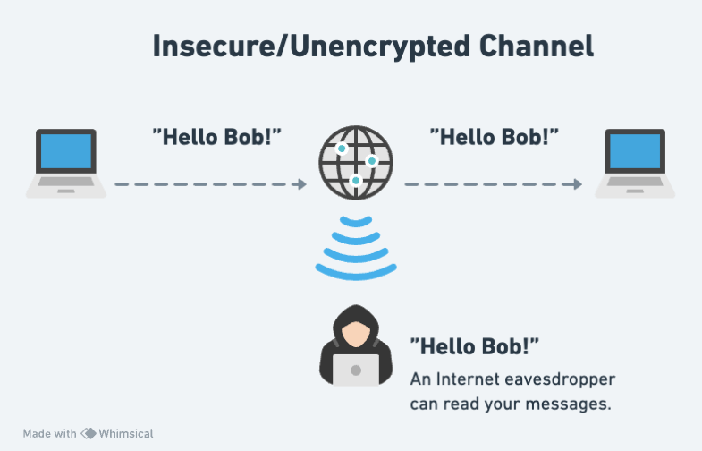
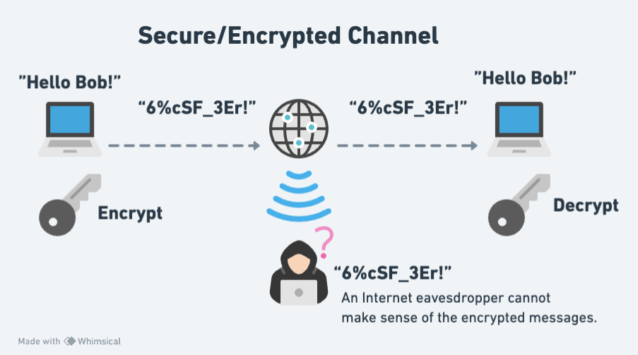
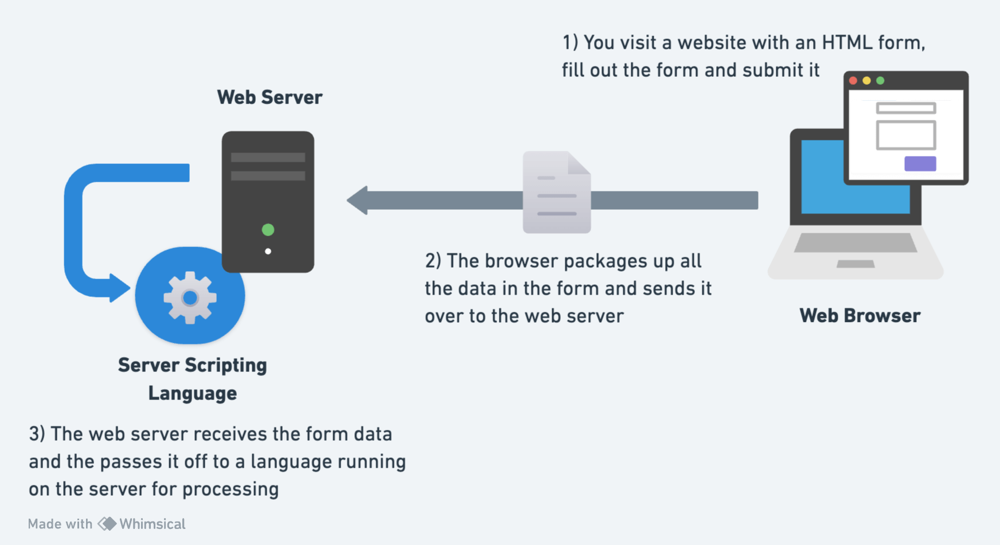
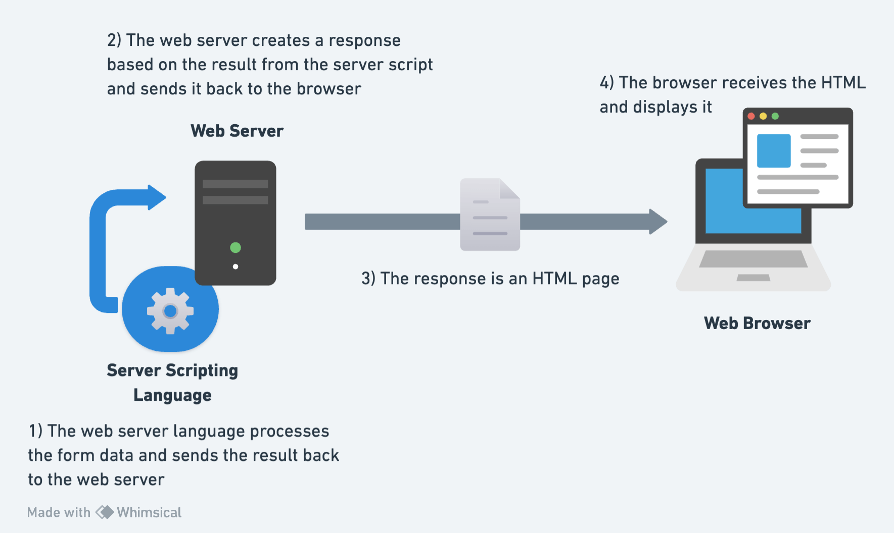
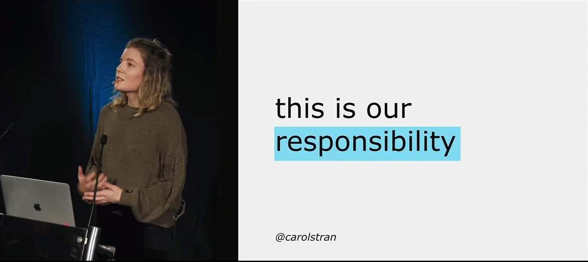

<h1 id="{{ Week 16-Intermediate JavaScript | slugify }}">
  Week 2 | HTML, Accessibility & Git
</h1>

  

  <h2 class="week-controls__previous_week">

    

      

      <a href="../week{{ previous_week_num }}">Week {{ previous_week_num }} &#8678;</a>
    

  </h2>

  Updated: 30/06/2025

  <h2 class="week-controls__next_week">

    

      

      <a href="../week{{ next_week_num }}">&#8680; Week {{ next_week_num }}</a>
    

  </h2>

<!-- VERSION -->

  You are viewing v1.0 of this content. To see v2.0 click <a href="index.html">this link</a>.

<!-- VERSION -->

---

<!-- Week 2 - Day 1 | Git -->

  
<h2>Week 2 - Day 1 | Git</h2>

### Schedule

  - [Study](#study-plan)
  - [Exercises](#exercises)
  - [Extra Resources](#extra-resources)

### Study Plan

  **What you'll learn:**

  - Basic Git concepts
  - Basic Git commands
  - Connecting to GitHub securely using SSH keys
  - Create a GitHub repository

  ---

  💡 **TIP OF THE DAY:** How to display hidden (system) files and folders?

  - **Windows (Powershell):** Run `ls -Force` to show hidden files and folders
  - **Windows (Command Prompt):** Run `dir /a:h` to show hidden files and folders
  - **Mac:** Press `Cmd + Shift + .` to toggle system files/folders view on and off
  - **Linux/Unix:** Run `ls -a` to list all files and folders (including hidden ones) 
  - **VSCode:** How to show particular hidden folders: File > Preferences > Settings: type "exclude" > Hover over the `**/.git` and click X to delete
  - **Windows 11 (File Explorer):**
    - Open `File Explorer` from the taskbar
    - Select `View > Show > Hidden items` 
  - **Windows 10 (File Explorer):** 
    - Open `File Explorer` from the taskbar 
    - Select `View > Options > Change folder and search options`
    - Select the `View` tab and, in `Advanced settings`, select `Show hidden files, folders, and drives` and OK.
  - **References:**
    - [View hidden files and folders in Windows](https://support.microsoft.com/en-us/windows/view-hidden-files-and-folders-in-windows-97fbc472-c603-9d90-91d0-1166d1d9f4b5){:target="_blank"}

  ---

  **What is Version Control and why do we need it? Why do most professional developers and teams use Git and GitHub?**

  - Let's find out with this [**What is Git and Github? Source Control —Coding For Beginners**](https://www.youtube.com/watch?v=3bchX_7ANQc){:target="_blank"} video.

  ---

  On the Internet, it's pretty easy for someone to intercept the data going from one place to another.

  

  That's why it's crucial to always use some form of encryption and decryption, in order for your data to be securely transported through the Internet. 

  

  The same goes, of course, for the data that you exchange with **GitHub**. In order to open up a secure connection with **GitHub** and be able to download (`git pull`) or upload (`git push`) data, we can use the **SSH** protocol along with a pair of keys to lock and unlock data going back and forth.

  > [About SSH](https://docs.github.com/en/authentication/connecting-to-github-with-ssh/about-ssh){:target="_blank"}: "SSH, which stands for Secure Shell, is a protocol used to open up a secure communication channel between computers. Using the SSH protocol, you can connect and authenticate to remote servers and services. With SSH keys, you can connect to GitHub without supplying your username and personal access token at each visit."

  - **Set up SSH keys for GitHub.** Complete the following 4 steps in order to be able to access GitHub without using a username and password.

  1. [**Set up SSH keys for GitHub**](https://docs.github.com/en/authentication/connecting-to-github-with-ssh/generating-a-new-ssh-key-and-adding-it-to-the-ssh-agent){:target="_blank"}

  2. [**Check for SSH keys**](https://docs.github.com/en/authentication/connecting-to-github-with-ssh/checking-for-existing-ssh-keys){:target="_blank"}

  3. [**Add SSH keys to your GitHub account**](https://docs.github.com/en/authentication/connecting-to-github-with-ssh/adding-a-new-ssh-key-to-your-github-account){:target="_blank"}

  4. [**Test your SSH connection**](https://docs.github.com/en/authentication/connecting-to-github-with-ssh/testing-your-ssh-connection){:target="_blank"}

  **TASK: Set up SSH keys for GitHub**. Once you have successfully completed all 4 steps, make sure to update your [progress sheet](../../user/progress.draft.60.csv) and mark the ` Set up SSH keys for GitHub` task as completed by switching the COMPLETED column from `FALSE` to `TRUE`.

  - [Watch: **Git Tutorial For Dummies**](https://www.youtube.com/watch?v=mJ-qvsxPHpY){:target="_blank"}
    - **Notes**: Make sure to **follow along** and run the git commands on your own repo. ⚠️ **IMPORTANT:** The repository you will create under your GitHub account, **must be named: `gitVideo`**. Also, even though the author is using the old **master** convention for his repo branch names, you should use **main** instead: `git checkout main`, `git push -u origin main`, etc.
    - **Duration**: 20min 
    - **Level**: Beginner
    - 

        
What you'll learn:

        <ul>
          <li>mkdir</li>
          <li>cd</li>
          <li>rm</li>
          <li>ls</li>
          <li>touch</li>
          <li>git init</li>
          <li>git add .</li>
          <li>git add index.html</li>
          <li>git commit -m "MESSAGE"</li>
          <li>git log</li>
          <li>git checkout BRANCH_NAME</li>
          <li>git checkout -b NEW_BRANCH_NAME</li>
          <li>git checkout COMMIT_HASH</li>
          <li>git, detached state</li>
          <li>git switch</li>
          <li>git branch</li>
          <li>git remote add origin GITHUB_URL</li>
          <li>git push origin master</li>
        </ul>
      

  **One important point to remember** is that the main branch in a git repository these days is called, ...well `main`. A few years back, the main branch used to be called `master`, so expect to see this term in various videos and tutorials. You should stick with `main`, by the way. There are no masters here. 🙂

  - **⏰ Time for a short break** (~5-10min) before the next longer video.

  **Repetitio est mater studiorum:** "Repetition is the mother of learning". Let's recap those git concepts by revisiting them through another (longer) and more in-depth video about Git. 

  - [Watch: **Git and GitHub for Beginners - Crash Course**](https://www.youtube.com/watch?v=RGOj5yH7evk){:target="_blank"}
    - **Duration**: 69min
    - **Level**: Beginner
    - 

        
What you'll learn:

        <ul>
          <li>(0:00) Introduction</li>
          <li>(1:10) What is git?</li>
          <li>(1:30) What is version control?</li>
          <li>(2:10) Terms to be learn in video</li>
          <li>(5:20) Git commands</li>
          <li>(7:05) sign up in GitHub</li>
          <li>(11:32) using git in local machine</li>
          <li>(11:54) git install</li>
          <li>(12:48) getting code editor</li>
          <li>(13:30) inside VS Code</li>
          <li>(14:30) cloning through VS Code</li>
          <li>(17:30) git commit command</li>
          <li>(18:15) git add command</li>
          <li>(19:15) committing</li>
          <li>(20:20) git push command</li>
          <li>(20:30) SSH Keys</li>
          <li>(25:25) git push</li>
          <li>(30:21) Review workflow so far</li>
          <li>(31:40) Compare between GitHub workflow and local git workflow</li>
          <li>(32:42) git branching</li>
          <li>(56:30) Undoing in git</li>
          <li>(1:01:50) Forking in git</li>
          <li>(1:07:55) Ending</li>
        </ul>
      

  - You can find a nice reference to the git commands mentioned in the videos [here](resources/git-commands.html). _(Also, in [markdown format](resources/git-commands.md))_

### Summary

  - **What is Version Control?** The management of changes to documents, computer programs, large web sites, and other collections of information.
  - **What is Git?** A free and open source version control system.

### Exercises

  Make sure to complete all the tasks found in the **daily Progress Sheet** and update the sheet accordingly. Once you've updated the sheet, don't forget to `commit` and `push`. The progress draft sheets are found in the `/user/weekXX/progress` folder, for example `user/week01/progress/progress.draft.w01.d01.csv`. You should **NEVER** update the `draft` sheets directly, but rather work on a copy of them according to the instructions [found here](../modules/curriculum/progress_workflow.md).

### [Extra Resources](EXTRAS.md)

### Sources and Attributions

  **Content is based on the following sources:**

  - [Git SSH keys simplified and how to setup on GitHub](https://inspirezone.tech/git-ssh-keys-simplified/)

<!-- Week 2 - Day 2 | HTML -->

  
<h2>Week 2 - Day 2 | HTML</h2>

### Schedule

  - [Study](#study-plan-1)
  - [Exercises](#exercises-1)
  - [Extra Resources](#extra-resources-1)

### Study Plan

  **What you'll learn:**

  During Week 1, we covered some of the [basics of HTML](../modules/html/misc/html_basics/). 
  Now, it's time to dive deeper into HTML. 

  HTML elements can be distinguished by default into 2 broad categories, **block** and **inline** elements. This fundamental display property of HTML elements, affects their placement on the page and how they stack against each other. 

  Check this [short video](https://www.youtube.com/watch?v=XHjoohto2-w) to learn about this display property of HTML elements and then head over to [**https://htmlreference.io/**](https://htmlreference.io/) to discover various block and inline elements, by unchecking all categories at the top, and selecting either the **inline** or **block** checkboxes. Once you've checked either of these categories to filter HTML elements, open up a couple of those elements and have a look at their syntax, use cases, available attributes and how they are displayed on a web page.

  - [Read: **What's in the head? Metadata in HTML**](resources/the_head_metadata_in_html/index.md)
    - Description: The `<head>` of an HTML document is the part that is not displayed in the web browser when the page is loaded. In this article, you'll learn all about the information it contains.
    - Exercises: Make sure to practice by completing all the **Active learning** sections of this article and then pasting all the files that you've created in the `user/week02/exercises/day02/the_head_metadata_in_html/` folder for submission.
      - [Active learning: Inspecting a simple example](./resources/the_head_metadata_in_html/index.md#active-learning-inspecting-a-simple-example)

      - [Active learning: Experiment with character encoding](./resources/the_head_metadata_in_html/index.md#active-learning-experiment-with-character-encoding)

      - [Active learning: The description's use in search engines](./resources/the_head_metadata_in_html/index.md#active-learning-the-descriptions-use-in-search-engines)

      - [Active learning: applying CSS and JavaScript to a page](./resources/the_head_metadata_in_html/index.md#active-learning-applying-css-and-javascript-to-a-page)

  - [Read: **HTML text fundamentals**](resources/html_text_fundamentals/index.md)
    - Description: This article explains the way HTML can be used to structure a page of text by adding headings and paragraphs, emphasizing words, creating lists, and more.
    - Exercises: 
      - Make sure to complete all the **Active learning** sections along with the 3 Tasks found under the 'Test your skills!' section of the tutorial and submit your code under the `user/week02/exercises/day02/html_text_fundamentals/` folder.

  - [Read: **Creating hyperlinks**](https://developer.mozilla.org/en-US/docs/Learn/HTML/Introduction_to_HTML/Creating_hyperlinks){:target="_blank"}
    - Description: You already know [**how the hyperlink changed everything**](https://www.youtube.com/watch?v=3Va3oY8pfSI){:target="_blank"}. Now it's time to dive into the more technical aspects of it.
    - What you'll learn:
      - What is a hyperlink?
      - Anatomy of a link
      - Image links
      - About URLs and paths
      - Document fragments
      - Absolute versus relative URLs
      - Link best practices
      - The `download` attribute
      - Email links
    - Exercises:       
      - Make sure to complete all the **Active learning** sections along with the 3 Tasks found under the 'Test your skills!' section of the tutorial and submit your code under the `user/week02/exercises/day02/Creating_hyperlinks/` folder:
      - [Active learning: creating your own example link](https://developer.mozilla.org/en-US/docs/Learn/HTML/Introduction_to_HTML/Creating_hyperlinks#active_learning_creating_your_own_example_link){:target="_blank"}
      - [Active learning: creating a navigation menu](https://developer.mozilla.org/en-US/docs/Learn/HTML/Introduction_to_HTML/Creating_hyperlinks#active_learning_creating_a_navigation_menu){:target="_blank"}
      - [Test your skills: Links (3x Tasks)](https://developer.mozilla.org/en-US/docs/Learn/HTML/Introduction_to_HTML/Test_your_skills:_Links){:target="_blank"}

<!-- ### Summary -->

### Exercises

  Make sure to complete all the tasks found in the **daily Progress Sheet** and update the sheet accordingly. Once you've updated the sheet, don't forget to `commit` and `push`. The progress draft sheets are found in the `/user/weekXX/progress` folder, for example `user/week01/progress/progress.draft.w01.d01.csv`. You should **NEVER** update the `draft` sheets directly, but rather work on a copy of them according to the instructions [found here](../modules/curriculum/progress_workflow.md).

### [Extra Resources](EXTRAS.md)

### Sources and Attributions

<!-- Week 2 - Day 3 | HTML Tables -->

  
<h2>Week 2 - Day 3 | HTML Tables</h2>

### Schedule

  - [Study](#study-plan-2)
  - [Exercises](#exercises-2)
  - [Extra Resources](#extra-resources-2)

### Study Plan

  **What you'll learn:**

  - Structuring Tabular Data using HTML Tables
  - Accessibility considerations for HTML Tables

  **HTML Tables**

  A very common task in HTML is structuring tabular data, and it has a number of elements and attributes for just this purpose. Coupled with a little [CSS](https://developer.mozilla.org/en-US/docs/Learn/CSS){:target="_blank"} for styling, HTML makes it easy to display tables of information on the web such as your school lesson plan, the timetable at your local swimming pool, or statistics about your favorite dinosaurs or football team. This module takes you through all you need to know about structuring tabular data using HTML.

  **Prerequisites**

  Before starting this module, you should already have covered the basics of HTML _(see previous Modules)_. 

  **Guides**

  <!-- - [HTML table basics](./resources/html_table_basics/index.md){:target="_blank"}
    - Description: This article gets you started with HTML tables, covering the very basics such as rows and cells, headings, making cells span multiple columns and rows, and how to group together all the cells in a column for styling purposes. (COMPLETED) -->

  This module contains the following articles, which will take you through all the fundamentals of creating tables in HTML.

  - [HTML table basics](https://developer.mozilla.org/en-US/docs/Learn/HTML/Tables/Basics){:target="_blank"}
    - **Description:** This article gets you started with HTML tables, covering the very basics such as rows and cells, headings, making cells span multiple columns and rows, and how to group together all the cells in a column for styling purposes.
    - **Exercises:** You should place the files related to the exercises found in this module, in the `user/week02/exercises/day03/html_table_basics/` folder.

  - [HTML table advanced features and accessibility](https://developer.mozilla.org/en-US/docs/Learn/HTML/Tables/Advanced){:target="_blank"}
    - **Description:** This article looks at some more advanced features of HTML tables — such as captions/summaries and grouping your rows into table head, body and footer sections — as well as looking at the accessibility of tables for visually impaired users.
    - **Exercises:** You should place the files related to the exercises found in this module, in the `user/week02/exercises/day03/html_table_basics/` folder.

  - **Exercise: Recreate the table** shown on [this video frame (02:40)](https://www.youtube.com/watch?v=H2kTzmJJ79E&t=159s)
    - For this exercise, create an HTML file and save it in `user/week02/exercises/day03/bits_and_bytes_table/index.html`

  <!-- - [Styling tables](https://developer.mozilla.org/en-US/docs/Learn/CSS/Building_blocks/Styling_tables)
    - Description: This article provides a guide to making HTML tables look good, with some specific table styling techniques highlighted. -->

<!-- ### Summary -->

### Exercises

  The following assessment will test your understanding of the HTML table techniques covered in the guides above.

  - [Structuring planet data](https://developer.mozilla.org/en-US/docs/Learn/HTML/Tables/Structuring_planet_data){:target="_blank"}
    - **Description:** In our table assessment, we provide you with some data on the planets in our solar system, and get you to structure it into an HTML table.
    - **Submission:** You should place the files related to this exercise in the `user/week02/exercises/day03/Structuring_planet_data` folder.

  Make sure to complete all the tasks found in the **daily Progress Sheet** and update the sheet accordingly. Once you've updated the sheet, don't forget to `commit` and `push`. The progress draft sheets are found in the `/user/weekXX/progress` folder, for example `user/week01/progress/progress.draft.w01.d01.csv`. You should **NEVER** update the `draft` sheets directly, but rather work on a copy of them according to the instructions [found here](../modules/curriculum/progress_workflow.md).

### [Extra Resources](EXTRAS.md)

### Sources and Attributions

  **Content is based on the following sources:**

  - **MDN**:
    - [HTML tables](https://developer.mozilla.org/en-US/docs/Learn/HTML/Tables){:target="_blank"} / [Permalink](https://github.com/mdn/content/blob/7073233dfed28e7c2fb325d2bb378075763d81b9/files/en-us/learn/html/tables/index.md){:target="_blank"}

<!-- Week 2 - Day 4 | HTML Forms -->

  
<h2>Week 2 - Day 4 | HTML Forms</h2>

### Schedule

  - [Study](#study-plan-3)
  - [Exercises](#exercises-3)
  - [Extra Resources](#extra-resources-3)

### Study Plan

  **What you'll learn:**

  - (Almost) all about HTML Forms!

  **Web forms — Working with user data**

  This module provides a series of articles that will help you master the essentials of web forms. Web forms are a very powerful tool for interacting with users — most commonly they are used for collecting data from users, or allowing them to control a user interface. However, for historical and technical reasons, it's not always obvious how to use them to their full potential. In the articles listed below, we'll cover most of the essential aspects of Web forms.

  **Prerequisites**

  - HTML

  **High level overview:**

  

  

  **Introductory guides:**

  - [Read: **Your first form**](https://developer.mozilla.org/en-US/docs/Learn/Forms/Your_first_form) and complete all the challenges _(e.g. Active Learning sections, etc.)_.
    - **Description:** The first article in our series provides you with your very first experience of creating a web form, including designing a simple form, implementing it using the right HTML form controls and other HTML elements, adding some very simple styling via CSS, and describing how data is sent to a server. 
    - **Level:** Beginner

  - [Read: **How to structure a web form**](https://developer.mozilla.org/en-US/docs/Learn/Forms/How_to_structure_a_web_form) and complete all the challenges _(e.g. Active Learning sections, etc.)_.
    - **Description:** With the basics out of the way, we'll now look in more detail at the elements used to provide structure and meaning to the different parts of a form.
    - **Level:** Beginner

  - [Complete the: **Test your skills: Form structure** challenge](https://developer.mozilla.org/en-US/docs/Learn/Forms/How_to_structure_a_web_form)

  **The different form controls:**

  - [Read: **Basic native form controls**](https://developer.mozilla.org/en-US/docs/Learn/Forms/Basic_native_form_controls)
    - **Description:** In this particular article, we will look at the original set of form controls, available in all browsers since the early days of the web.
    - **Level:** Beginner

  - [Complete the: **Test your skills: Basic controls** challenge](https://developer.mozilla.org/en-US/docs/Learn/Forms/Test_your_skills:_Basic_controls)

<!-- ### Summary -->

### Exercises

  Make sure to complete all the tasks found in the **daily Progress Sheet** and update the sheet accordingly. Once you've updated the sheet, don't forget to `commit` and `push`. The progress draft sheets are found in the `/user/weekXX/progress` folder, for example `user/week01/progress/progress.draft.w01.d01.csv`. You should **NEVER** update the `draft` sheets directly, but rather work on a copy of them according to the instructions [found here](../modules/curriculum/progress_workflow.md).

### [Extra Resources](EXTRAS.md)

### Sources and Attributions

  **Content is based on the following sources:**

  - **MDN**:
    - [Web forms — Working with user data](https://developer.mozilla.org/en-US/docs/Learn/Forms) / [(Permalink)](https://github.com/mdn/content/blob/26f68076bcd8e3d5893cffcd9c1c01ff949318a9/files/en-us/learn/forms/index.md)
    - [Accessibility](https://developer.mozilla.org/en-US/docs/Learn/Accessibility) / [Permalink](https://github.com/mdn/content/blob/26f68076bcd8e3d5893cffcd9c1c01ff949318a9/files/en-us/learn/accessibility/index.md)

<!-- Week 2 - Day 5 | HTML Form Controls & Accessibility -->

  
<h2>Week 2 - Day 5 | HTML Form Controls & Accessibility</h2>

### Schedule

  - [Study](#study-plan-4)
  - [Exercises](#exercises-4)
  - [Extra Resources](#extra-resources-4)

### Study Plan

  **What you'll learn:**

  - More HTML Form controls
  - Using your web dev skills responsibly to create accessible websites

  **More form controls:**

  - [Read: **The HTML5 input types**](https://developer.mozilla.org/en-US/docs/Learn/Forms/HTML5_input_types)
    - **Description:** Now we'll look at the functionality of newer form controls in detail, including some new input types, which were added in HTML5 to allow the collection of specific types of data.
    - **Level:** Beginner

  - [Complete the: **Test your skills: HTML5 controls** challenge](https://developer.mozilla.org/en-US/docs/Learn/Forms/Test_your_skills:_HTML5_controls)

  - [Read: **Other form controls**](https://developer.mozilla.org/en-US/docs/Learn/Forms/Other_form_controls)
    - **Description:** We now look at the functionality of non-`<input>` form elements in detail.
    - **Level:** Beginner

  - [Complete the: **Test your skills: Other controls** challenge](https://developer.mozilla.org/en-US/docs/Learn/Forms/Test_your_skills:_Other_controls)

  **Accessibility**

  Learning some HTML, CSS, and JavaScript is useful if you want to become a web developer. Beyond mechanical use, it's important to learn how to use these technologies **responsibly** so that all readers might use your creations on the web. To help you achieve this, this module will cover general best practices (which are demonstrated throughout the HTML, CSS and JavaScript topics), [cross browser testing](https://developer.mozilla.org/en-US/docs/Learn/Tools_and_testing/Cross_browser_testing){:target="_blank"}, and some tips on enforcing accessibility from the start. We'll cover accessibility in special detail. This is probably the **most important aspect of web development**.

  Before moving forward, some important facts about disabilities and some disturbing facts about the state of the Web:

  > "More than **1 billion**" of the world's population are estimated to live with some form of disability. **110 million** have very highly significant difficulties in functioning."

  > "In 2021, out of 1 million websites tested, 97.4% home pages had detectable accessibility failures." ~ Source: WebAIM

  Let these facts be a constant reminder for our responsibility and ethical obligations as Web developers.

  **Overview**

  When building `User Interfaces` with Frontend technologies such as HTML, CSS and JavaScript, developers must strive for usability and accessibility. 

  According to [W3C](https://www.w3.org/WAI/fundamentals/accessibility-intro/), _"Web accessibility means that websites, tools, and technologies are designed and developed so that people with disabilities can use them."_

  Web accessibility also benefits people without disabilities, for example:

  - People using mobile phones, smart watches, smart TVs, and other devices with small screens, different input modes, etc.

  - Older people with changing abilities due to ageing

  - People with “temporary disabilities” such as a broken arm or lost glasses

  - People with “situational limitations” such as in bright sunlight or in an environment where they cannot listen to audio

  - People using a slow Internet connection, or who have limited or expensive bandwidth

  _"Making the web accessible benefits individuals, businesses, and society. International web standards define what is needed for accessibility."_

  When someone describes a site as "accessible", they mean that any user can use all its features and content, regardless of how the user accesses the web — even and especially users with physical or mental impairments.

  - Sites should be accessible to keyboard, mouse, and touch screen users, and any other way users access the web, including screen readers and voice assistants like Alexa and Google Home.
  - Applications should be understandable and usable by people regardless of auditory, visual, physical, or cognitive abilities.
  - Sites should also not cause harm: web features like motion can cause migraines or epileptic seizures.

  - Watch the [**The Internet's Accessibility Problem — and How To Fix It**](https://www.youtube.com/watch?v=QWPWgaDqbZI){:target="_blank"} TED talk by Clive Loseby to understand how serious the problem of accessible Web is.

  There are good news also. **By default, HTML is accessible, if used correctly.** Web accessibility involves ensuring that content remains accessible, regardless of who and how the web is accessed.

  The Browser Accessibility developer tools (like for example the Firefox Accessibility Inspector or the Chrome DevTools Accessibility panel) are very useful tools for checking out accessibility issues on web pages. The following video provides a nice introduction to the Firefox Accessibility Inspector:

  - [Watch: **Understand Website Accessibility with the Firefox Accessibility Inspector**](https://www.youtube.com/watch?v=7mqqgIxX_NU)
    - Description: When building a website, understanding what's happening with accessibility can help you make certain your site can be used by everyone. Firefox DevTools now has a new Accessibility Inspector that shows an outline of the accessibility tree, and lists problems with contrast or missing labels, and much more. Jen Simmons gives you a tour.
    - Duration: 8min

  - [Watch: **Which airline apps fail blind people? - Which?**](https://www.youtube.com/watch?v=TUfM2IeZp54) to understand more about why Accessibility matters and why your responsibility as a web developer is crucial to the well-being of other human beings.

  - [Read: **What is accessibility?**](https://developer.mozilla.org/en-US/docs/Learn/Accessibility/What_is_accessibility){:target="_blank"}
    - Description: This article starts off the module with a good look at what accessibility is — this includes what groups of people we need to consider and why, what tools different people use to interact with the web, and how we can make accessibility part of our web development workflow.

  - [HTML: A good basis for accessibility](https://developer.mozilla.org/en-US/docs/Learn/Accessibility/HTML){:target="_blank"}
    - Description: A great deal of web content can be made accessible just by making sure the correct HTML elements are always used for the correct purpose. This article looks in detail at how HTML can be used to ensure maximum accessibility.

  - Watch as many lessons as you can from the [Start Building Accessible Web Applications Today](https://egghead.io/courses/start-building-accessible-web-applications-today){:target="_blank"} excellent excellent series of video tutorials by Marcy Sutton.

  
  
  **See also:**

  Check out the following resources and make sure to cover the material included in there as you progress in this course and your web development journey:

  - [Deque University resources](https://dequeuniversity.com/resources/){:target="_blank"} — includes code examples, screen reader references, and other useful resources.

  - [WebAIM resources](https://webaim.org/resources/){:target="_blank"} — includes guides, checklists, tools, and more.

  - [Web Accessibility Evaluation Tools List](https://www.w3.org/WAI/ER/tools/){:target="_blank"} — includes a list of web accessibility evaluation tools.

<!-- ### Summary -->

### Exercises

  Now it's time to gather all this knowledge around HTML _(and GitHub)_, build your own (accessible) Blog and take it online. Follow the instructions found [here](./exercises/lets_create_a_weblog/index.md). You might need to spend a few extra hours during the weekend to improve and finalize your Blog.

  Make sure to complete all the tasks found in the **daily Progress Sheet** and update the sheet accordingly. Once you've updated the sheet, don't forget to `commit` and `push`. The progress draft sheets are found in the `/user/weekXX/progress` folder, for example `user/week01/progress/progress.draft.w01.d01.csv`. You should **NEVER** update the `draft` sheets directly, but rather work on a copy of them according to the instructions [found here](../modules/curriculum/progress_workflow.md).

### [Extra Resources](EXTRAS.md)

### Sources and Attributions

**Weekly feedback:** Hey, it's really important for us to know how your experience with the course has been so far, so don't forget to fill in and submit your [**mandatory** feedback form](https://forms.gle/S6Zg3bbS2uuwsSZF9){:target="_blank"} before the day ends. Thanks you! 

## Week 2 - Weekend Suggestions

If you are in the mood of enjoying related content during the weekend, check out our weekly recommendations [here](WEEKEND.md).

---

<!-- COMMENTS: -->
