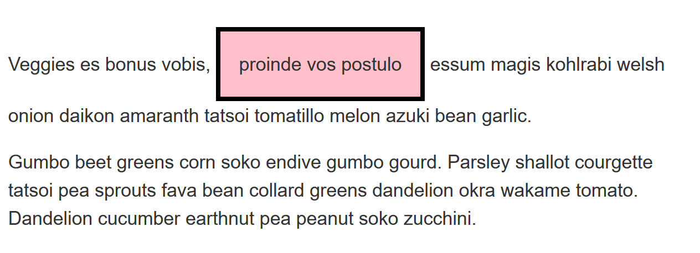

# Test your skills: The box model

_(Updated: 10/10/2023)_

The aim of this skill test is to assess whether you understand the [CSS box model](../../resources/css_building_blocks/the_box_model/index.md).

> **Note:** If you get stuck, then ask us for help!

## Task 1

In this task, there are two boxes below, one is using the standard box model, the other the alternate box model. Change the width of the second box by adding declarations to the `.alternate` class, so that it matches the visual width of the first box.

Copy and paste the code below in a file named `box-models.html`.

```html
<!DOCTYPE html>
<html lang="en">
  <head>
    <meta charset="utf-8"/>
    <title>Box Model Task 1: Standard and Alternate Box Models</title>
    <link rel="stylesheet" href="../styles.css"/>

    <style>
      body {
        background-color: #fff;
        color: #333;
        font: 1.2em / 1.5 Helvetica Neue, Helvetica, Arial, sans-serif;
        padding: 1em;
        margin: 0;
      }
      
      .box {
        border: 5px solid rebeccapurple;
        background-color: lightgray;
        padding: 40px;
        margin: 40px;
        width: 300px;
        height: 150px;
      }

      .alternate {
        box-sizing: border-box;
      }
    </style>
  </head>

  <body>

    <div class="box">I use the standard box model.</div>
    <div class="box alternate">I use the alternate box model.</div>

  </body>
</html>
```

Your final result should look like the image below:


When you're ready, move the files in the following path `user/week03/exercises/day04/box_model_tasks/task01/` and run the git commands below to submit your exercise:

- `git add user/week03/exercises/day04/box_model_tasks/task01/`
- `git commit -m "box_model_tasks_task01"`
- `git push`

## Task 2

In this task, add to the box:

- A 5px, black, dotted border.
- A top margin of 20px.
- A right margin of 1em.
- A bottom margin of 40px.
- A left margin of 2em.
- Padding on all sides of 1em.

Copy and paste the code below in a file named `mbp.html`.

```html
<!DOCTYPE html>
<html lang="en">
  <head>
    <meta charset="utf-8"/>
    <title>Box Model Task 2: Margin, Border, and Padding</title>
    <link rel="stylesheet" href="../styles.css"/>

    <style>
      body {
        background-color: #fff;
        color: #333;
        font: 1.2em / 1.5 Helvetica Neue, Helvetica, Arial, sans-serif;
        padding: 1em;
        margin: 0;
      }
      .box {
        }
    </style>
  </head>

  <body>

    <div class="box">I use the standard box model.</div>

  </body>

</html>
```

Your final result should look like the image below:


When you're ready, move the files in the following path `user/week03/exercises/day04/box_model_tasks/task02/` and run the git commands below to submit your exercise:

- `git add user/week03/exercises/day04/box_model_tasks/task02/`
- `git commit -m "box_model_tasks_task02"`
- `git push`

## Task 3

In this task, the inline element has a margin, padding and border. However, the lines above and below are overlapping it. What can you add to your CSS to cause the size of the margin, padding, and border to be respected by the other lines, while still keeping the element inline?

Copy and paste the code below in a file named `inline-block.html`.

```html
<!DOCTYPE html>
<html lang="en">
  <head>
    <meta charset="utf-8"/>
    <title>Box Model Task 3: Inline Block</title>
    <link rel="stylesheet" href="../styles.css"/>

    <style>
      body {
        background-color: #fff;
        color: #333;
        font: 1.2em / 1.5 Helvetica Neue, Helvetica, Arial, sans-serif;
        padding: 1em;
        margin: 0;
      }

      .box span {
        background-color: pink;
        border: 5px solid black;
        padding: 1em;
      }
    </style>
  </head>

  <body>
    <div class="box">
      <p>Veggies es bonus vobis,
        <span>proinde vos postulo</span>
        essum magis kohlrabi welsh onion daikon amaranth tatsoi tomatillo melon azuki bean garlic.</p>

      <p>Gumbo beet greens corn soko endive gumbo gourd. Parsley shallot courgette tatsoi pea sprouts fava bean collard greens dandelion okra wakame tomato. Dandelion cucumber earthnut pea peanut soko zucchini.</p>
    </div>

  </body>

</html>
```

Your final result should look like the image below:



When you're ready, move the files in the following path `user/week03/exercises/day04/box_model_tasks/task03/` and run the git commands below to submit your exercise:

- `git add user/week03/exercises/day04/box_model_tasks/task03/`
- `git commit -m "box_model_tasks_task03"`
- `git push`

### Sources and Attributions

**Content is based on the following sources:**

- **MDN**
  - [Test your skills: The box model](https://developer.mozilla.org/en-US/docs/Learn/CSS/Building_blocks/Box_Model_Tasks){:target="_blank"} [(Permalink)](https://github.com/mdn/content/blob/529a4466f00f0f29e11716313a3ceb1f9ce5ce76/files/en-us/learn/css/building_blocks/box_model_tasks/index.md){:target="_blank"}