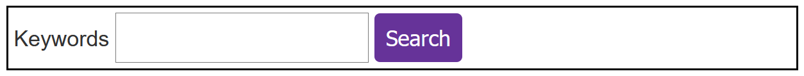

# Test your skills: Images and form elements

_(Updated: 13/09/2023)_

The aim of this skill test is to assess whether you understand how special elements like [images, media and form elements are treated in CSS](../../resources/css_building_blocks/images_media_form_elements/index.md).

> **Note:** If you get stuck, then ask us for help!

## Task 1

In this task, you have an image that is overflowing the box. We want the image to scale down to fit inside the box without any extra white space, but we do not mind if some part of the image is cropped.

[Download the starting point for this task](assets/object-fit-download.html) to work in your own editor or in an online editor.

Your final result should look like the image below:

## Task 2

In this task, you have a simple form. Your task is to make the following changes:

- Use attribute selectors to target the search field and button inside `.myform`.
- Make the form field and button use the same text size as the rest of the form.
- Give the form field and button 10 px of padding.
- Give the button a background of `rebeccapurple`, white foreground, no border and rounded corners of 5px.

[Download the starting point for this task](assets/form-download.html) to work in your own editor or in an online editor.

Your final result should look like the image below:

### Sources and Attributions

**Content is based on the following sources:**

- **MDN:**
  - [Test your skills: Images and form elements](https://developer.mozilla.org/en-US/docs/Learn/CSS/Building_blocks/Images_tasks){:target="_blank"} [(Permalink)](https://github.com/mdn/content/blob/bffe6c3486fa8cbaa2291a5e1cd67f704cf483bf/files/en-us/learn/css/building_blocks/images_tasks/index.md){:target="_blank"}