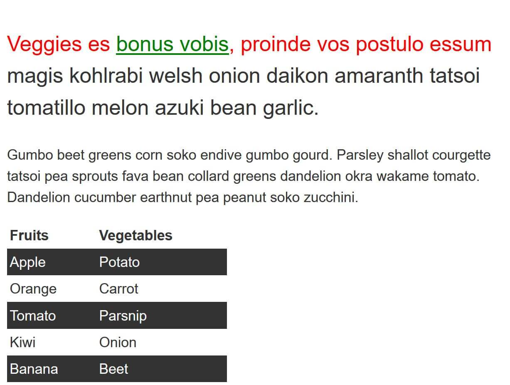

# CSS selectors

_(Updated: 07/09/2023)_

The aim of this skill test is to assess whether you understand [CSS selectors](../../resources/css_building_blocks/css_selectors/index.md).

> **Note:** If you get stuck, then ask us for help!

## Task 1

In this task, use CSS to do the following things, without changing the HTML:

- Make `<h1>` headings blue.
- Give `<h2>` headings a blue background and white text.
- Cause text wrapped in a `` to have a font-size of 200%.

[Download the starting point for this task](assets/type-download.html) to work in your own editor or in an online editor.

Your final result should look like the image below:

## Task 2

In this task, we want you to make the following changes to the look of the content in this example, without changing the HTML:

- Give the element with an id of `special` a yellow background.
- Give the element with a class of `alert` a 1px grey border.
- If the element with a class of `alert` also has a class of `stop`, make the background red.
- If the element with a class of `alert` also has a class of `go`, make the background green.

[Download the starting point for this task](assets/class-id-download.html) to work in your own editor or in an online editor.

Your final result should look like the image below:

## Task 3

In this task, we want you to make the following changes without adding to the HTML:

- Style links, making the link-state orange, visited links green, and remove the underline on hover.
- Make the first element inside the container font-size: 150% and the first line of that element red.
- Stripe every other row in the table by selecting these rows and giving them a background color of #333 and foreground of white.

Your final result should look like the image below:

[Download the starting point for this task](assets/pseudo-download.html) to work in your own editor or in an online editor.

## Task 4

In this task, we want you to do the following:

- Make any paragraph that directly follows an `<h2>` element red.
- Remove the bullets and add a 1px grey bottom border only to list items that are a direct child of the ul with a class of `list`.

Your final result should look like the image below:

[Download the starting point for this task](assets/combinators-download.html) to work in your own editor or in an online editor.

## Task 5

In this task, add CSS using attribute selectors to do the following:

- Target the `<a>` element with a `title` attribute and make the border pink (`border-color: pink`).
- Target the `<a>` element with an `href` attribute that contains the word `contact` somewhere in its value and make the border orange (`border-color: orange`).
- Target the `<a>` element with an `href` value starting with `https` and give it a green border (`border-color: green`).

Your final result should look like the image below:

[Download the starting point for this task](assets/attribute-links-download.html) to work in your own editor or in an online editor.

### Sources and Attributions

**Content is based on the following sources:**

- **MDN:**
  - [Test your skills: Selectors](https://developer.mozilla.org/en-US/docs/Learn/CSS/Building_blocks/Selectors/Selectors_Tasks){:target="_blank"} [(Permalink)](https://github.com/mdn/content/blob/a77137e6239ef445ac67b2ffb7067d6332907910/files/en-us/learn/css/building_blocks/selectors/selectors_tasks/index.md){:target="_blank"}