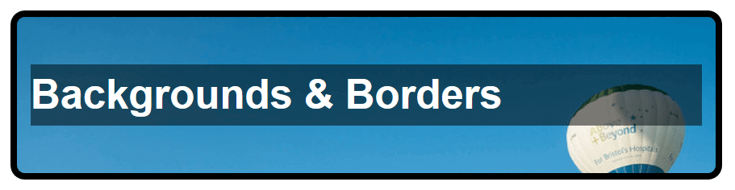

# Test your skills: Backgrounds and borders

_(Updated: 12/09/2023)_

The aim of this skill test is to assess whether you understand [backgrounds and borders of boxes in CSS](../../resources/css_building_blocks/backgrounds_and_borders/index.md).

> **Note:** If you get stuck, then ask us for help!

## Task 1

In this task, we want you to add a background, border, and some simple styling to a page header:

1. Give the box a 5px black solid border, with rounded corners of 10px.
2. Add a background image (use the URL `balloons.jpg`) and size it so that it covers the box.
3. Give the `<h2>` a semi-transparent black background color, and make the text white.

[Download the starting point for this task](assets/backgrounds1-download.html) to work in your own editor or in an online editor.

Your final result should look like the image below:

## Task 2

In this task, we want you to add background images, a border, and some other styling to a decorative box:

- Give the box a 5px lightblue border and round the top left corner 20px and the bottom right corner 40px.
- The heading uses the `star.png` image as a background image, with a single centered star on the left and a repeating pattern of stars on the right.
- Make sure that the heading text does not overlay the image, and that it is centered — you will need to use techniques learned in previous lessons to achieve this.

[Download the starting point for this task](assets/backgrounds2-download.html) to work in your own editor or in an online editor.

Your final result should look like the image below:

### Sources and Attributions

**Content is based on the following sources:**

- **MDN**
  - [Test your skills: Backgrounds and borders](https://developer.mozilla.org/en-US/docs/Learn/CSS/Building_blocks/Test_your_skills_backgrounds_and_borders){:target="_blank"} [(Permalink)](https://github.com/mdn/content/blob/529a4466f00f0f29e11716313a3ceb1f9ce5ce76/files/en-us/learn/css/building_blocks/test_your_skills_backgrounds_and_borders/index.md){:target="_blank"}