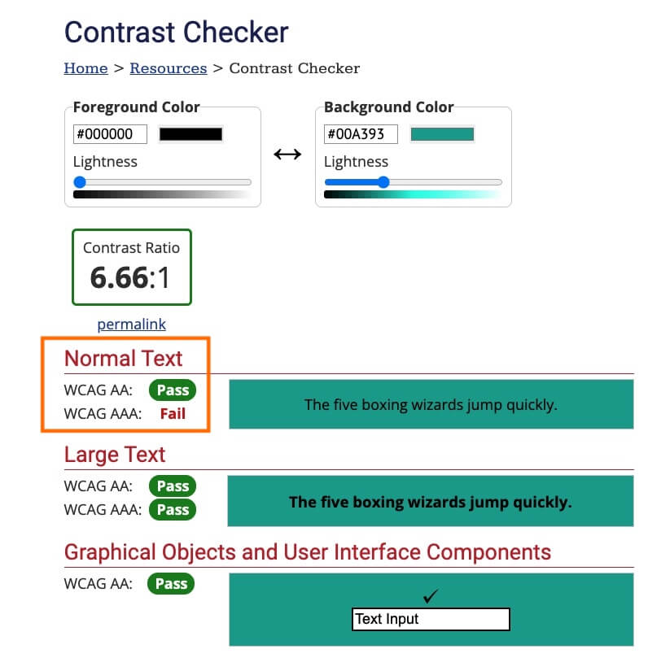
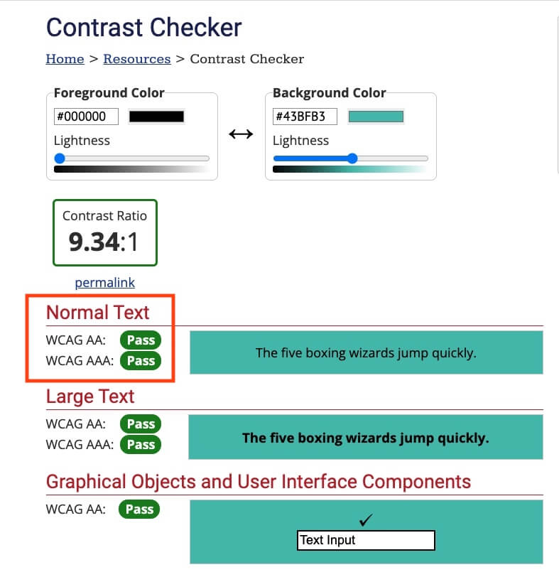
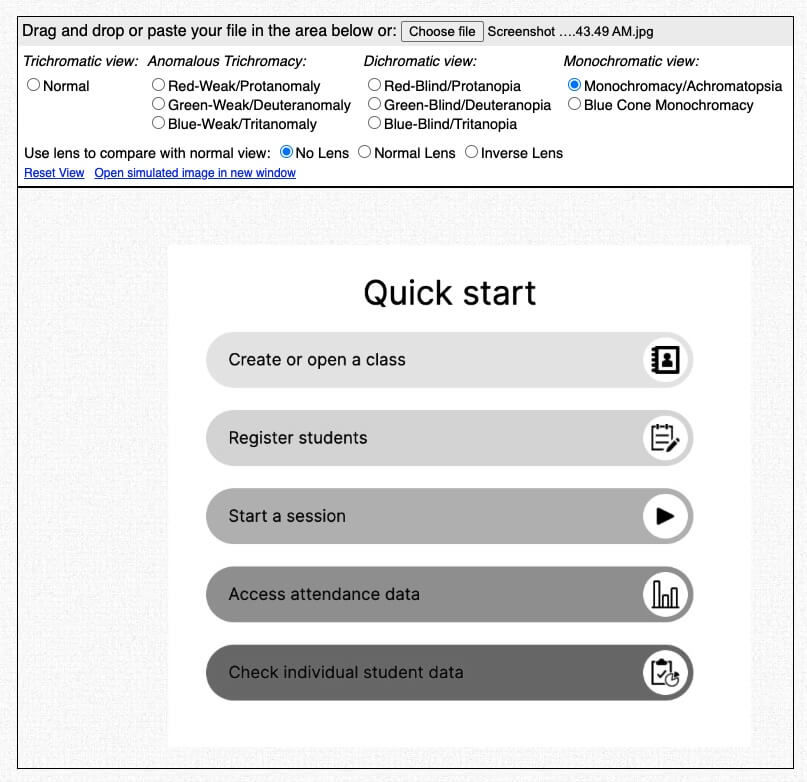
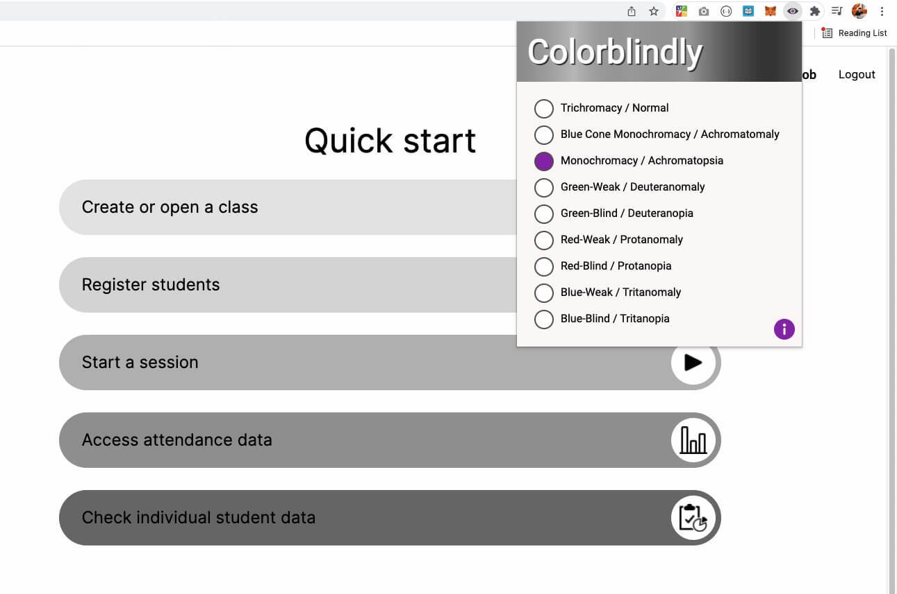
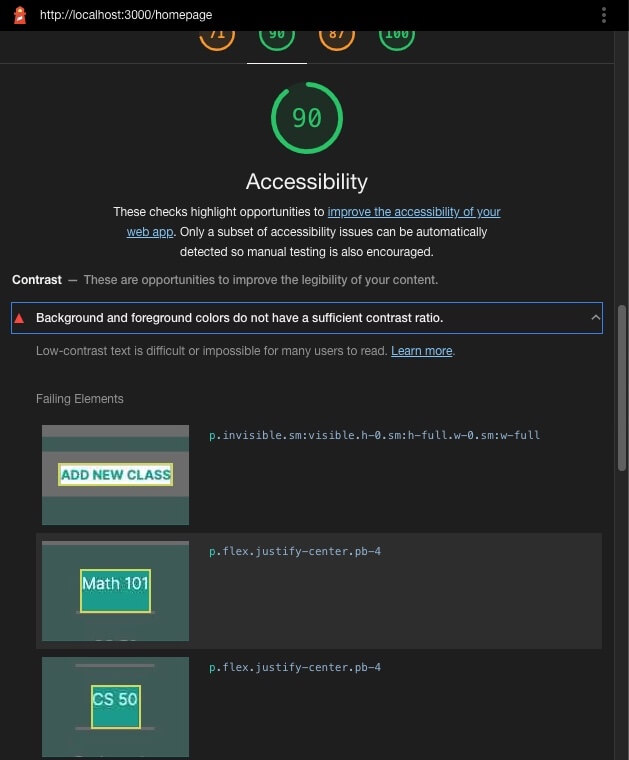

# Web Accessibility (A11y) and Color Contrast 

## Color Contrast

Among the things that a Frontend developer must always check, to ensure web accessibility, is `Color Contrast`.

Most of the times, this means that the background (the `background-color` property in CSS) and foreground color (the `color` property in CSS) combination used on our HTML elements must ideally pass the WCAG AA and/or AAA tests.

> WCAG stands for Web Content Accessibility Guidelines and it is developed by the World Wide Web Consortium (W3C) Web Accessibility Initiative (WAI). AA and AAA are defined as the WCAG conformance levels. There are three levels: A, AA and AAA. See [this page](https://www.w3.org/WAI/WCAG2AA-Conformance) for more.

## Examples

In the following example, we examine the background/foreground color of the last two buttons. As the background color gets darker (and thus closer to the foreground color) we must check if the combination of these two passes the WCAG AA/AAA tests. We are going to use the following free online tool [WebAIM Contrast Checker Tool](https://webaim.org/resources/contrastchecker/) to do the checks by manually inputting the color values.

---

The last button fails on the AAA test, when used with `Normal Text Size` as you can see in the tests that follow.

---

Whereas the previous button (second from last), successfully passes all the tests.

All the tests were done manually, using the [WebAIM Contrast Checker Tool](https://webaim.org/resources/contrastchecker/). It is highly recommended that you bookmark this link if you seriously think about becoming a Frontend developer.

---

## Tools

To get a better understanding of how color contrast might affect users' ability to read text on a screen, check out the following two pictures which depict the same interface as viewed by people affected by various forms of color impairment: **Monochromasy/Achromatopsia** and **Blue Cone Achromasy** among others.

---

It is easy for a team of developers or testers to check a website for such mistakes by using a Browser Extension like [Colorblindly](https://chrome.google.com/webstore/detail/colorblindly/floniaahmccleoclneebhhmnjgdfijgg/related?hl=en)

---

## Chrome Lighthouse

Another Developer Tool that can help you detect A11y (short for A[ccessibilit.length === 11 ]y, ) issues is the [Chrome Lighthouse](https://developers.google.com/web/tools/lighthouse) tool found in the Developer Toolset of Chrome Browser. 

**Keep in mind** that pages that score low on the `Performance`, `SEO` and `Accessibility` scale are given a low priority on the Search Results pages of all major Search Engines! This means that striving for A11y is a also good way to improve the visibility and search ranking of your web pages. 

---

## Color Picker

Another way to quickly check the color contrast and pick a more appropriate color combination is the Chrome color picker which includes a nice indicator of the AA and AAA conformance levels right on the color palette. You can use this tool when you click on the color box of an element. In some cases the contrast check won't be there if the browser cannot detect the background/foreground color successfully.

--- 

## CSS: color-contrast()

In the future, browsers will start supporting the [`color-contrast`](https://developer.mozilla.org/en-US/docs/Web/CSS/color_value/color-contrast()) CSS property which automatically selects the color with the highest contrast automatically.

You can regularly check for its support using the [caniuse.com website](https://caniuse.com/?search=color-contrast) or the MDN `Browser Compatibility` table found at the bottom of the page.

## Closing Remarks

If you serious about Web Development, then Web Accessibility must be priority number 1 for you. You can start by going through the `Web Accessibility` free course at `Coursera` (see Resources section below).

---

## Resources

- [Web Accessibility **Free course** at Coursera](https://www.udacity.com/course/web-accessibility--ud891)

- [Web Accessibility Perspectives - Compilation of 10 Topics/Videos (YouTube video / 8 minutes)](https://www.youtube.com/watch?v=3f31oufqFSM)

- [Web Content Accessibility Guidelines (WCAG) 2 Level AA Conformance](https://www.w3.org/WAI/WCAG2AA-Conformance)

- [CSS Tips for Better Color and Contrast Accessibility](https://webdesign.tutsplus.com/articles/css-tips-for-better-color-and-contrast-accessibility--cms-34472)

- [WebAIM Contrast Checker](https://webaim.org/resources/contrastchecker/)

- [Coblis — Color Blindness Simulator](https://www.color-blindness.com/coblis-color-blindness-simulator/)

- [Monochromacy](https://www.wikiwand.com/en/Monochromacy)

- [Blue Cone Monochromacy](https://www.wikiwand.com/en/Blue_cone_monochromacy)