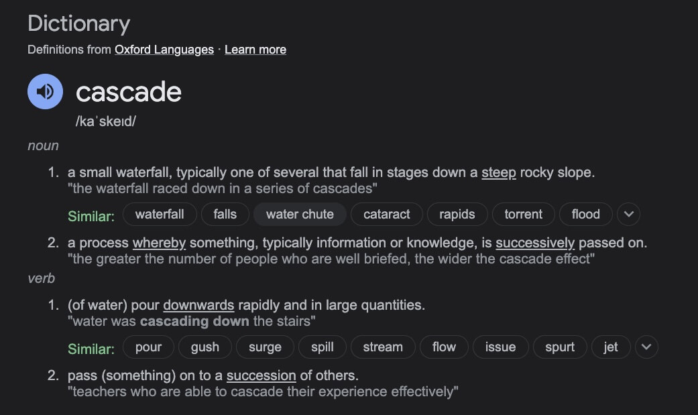
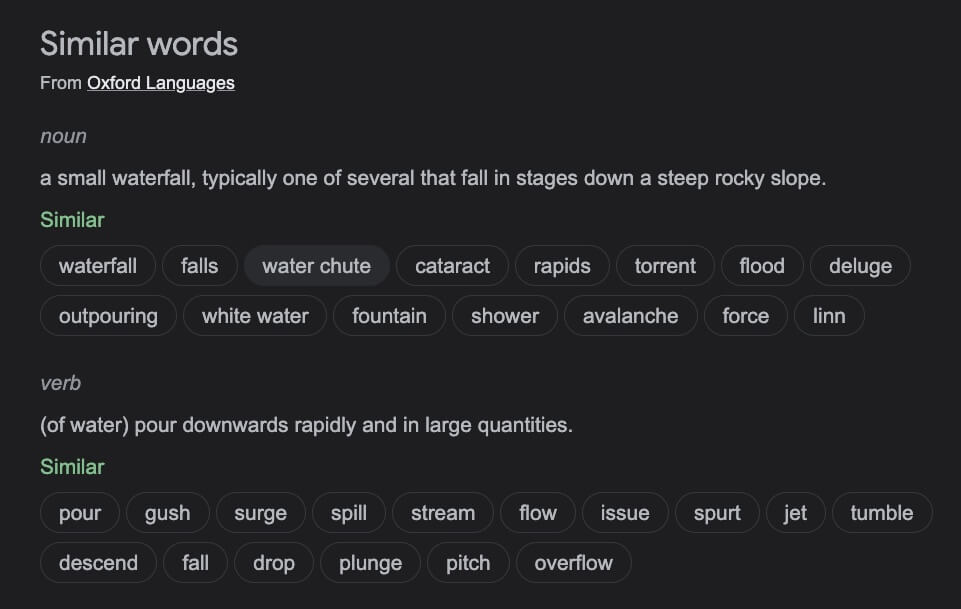

# Cascade, specificity and Inheritance

  _(Updated: 15/10/2023)_

  The aim of this lesson is to develop your understanding of some of the most fundamental concepts of CSS — the cascade, specificity, and inheritance — which control how CSS is applied to HTML and how conflicts between style declarations are resolved.

  While working through this lesson may seem less relevant immediately and a little more academic than some other parts of the course, an understanding of these concepts will save you from a lot of pain later on! We encourage you to work through this section carefully and check that you understand the concepts before moving on.

  **Prerequisites:**

  - Basic computer literacy
  - Basic software installed
  - Basic knowledge of working with files
  - HTML basics
  - How CSS works

  **Objective:**

  - To learn about the cascade and specificity, and how inheritance works in CSS.

## Conflicting rules

  CSS stands for **Cascading Style Sheets**, and that first word _cascading_ is incredibly important to understand — the way that the cascade behaves is key to understanding CSS.

  At some point, you will be working on a project and you will find that the CSS you thought should be applied to an element is not working. Often, the problem is that you create two rules that apply different values of the same property to the same element. [**Cascade**](https://developer.mozilla.org/en-US/docs/Web/CSS/Cascade){:target="_blank"} and the closely-related concept of [**specificity**](https://developer.mozilla.org/en-US/docs/Web/CSS/Specificity){:target="_blank"} are mechanisms that control which rule applies when there is such a conflict. The rule that's styling your element may not be the one you expect, so you need to understand how these mechanisms work.

  Also significant here is the concept of [**inheritance**](https://developer.mozilla.org/en-US/docs/Web/CSS/Inheritance){:target="_blank"}, which means that some CSS properties by default inherit values set on the current element's parent element and some don't. This can also cause some behavior that you might not expect.

  Let's start by taking a quick look at the key things we are dealing with, then we'll look at each in turn and see how they interact with each other and your CSS. These can seem like a tricky set of concepts to understand. As you get more practice writing CSS, the way it works will become more obvious to you.

### Cascade

  **TIP:** Before diving into a technical concept, it's always a good practice to learn more about what the term means in a more general context. For example, `cascade` –not a pretty common word for most non-native english speakers– will become more clear in its technical context once we get to know its original meaning. 

  The first step to learn more about an english word, is to Google for its definition using the `define <word>` syntax. For example, `define cascade` will result in the following definitions:

  

  

  Probably, the most relevant definitions that we need to keep in mind, as we move on to understand `cascade` in the CSS context, are the following:

  _"a process whereby something [...] is successively passed on."_

  _"pass (something) on to a succession of others."_

  Sometimes, checking the `similar words` section, provides an even deeper understanding of the word.

  

  ---

  Stylesheets [**cascade**](https://developer.mozilla.org/en-US/docs/Web/CSS/Cascade){:target="_blank"} — at a very simple level, this means that the origin, the cascade layer, and the order of CSS rules matter. When two rules from the same cascade layer apply and both have equal specificity, **the one that is defined last in the stylesheet is the one that will be used**.

  In the below example, we have two rules that could apply to the `<h1>` element. The `<h1>` content ends up being colored blue. This is because both the rules are from the same source, have an identical element selector, and therefore, carry the same specificity, but the last one in the source order wins.

  <iframe 
              class="EmbedGHLiveSample" 
              loading="lazy"
              src="https://in-tech-gration.github.io/css-examples/learn/cascade/cascade-simple.html" 
              width="100%" 
              height="500"></iframe>
  

    <a href="https://in-tech-gration.github.io/css-examples/learn/cascade/cascade-simple.html" target="_blank">
      [ External link ]
    </a>
  

  

  [Watch Travis Neilson and Carlos Montoya explain CSS Cascades](https://www.youtube.com/watch?v=tZhmjgLQgXU) before moving on to the reading section. 

### Specificity

  **Watch: [Learn CSS Specificity In 11 Minutes](https://www.youtube.com/watch?v=CHyPGSpIhSs)** to get a basic understanding of this hugely important CSS rule.

  [Specificity](https://developer.mozilla.org/en-US/docs/Web/CSS/Specificity){:target="_blank"} is the algorithm that the browser uses to decide which property value is applied to an element. If multiple style blocks have different selectors that configure the same property with different values and target the same element, specificity decides the property value that gets applied to the element. Specificity is basically a measure of how specific a selector's selection will be:

  - An element selector is less specific; it will select all elements of that type that appear on a page, so it has less weight. Pseudo-element selectors have the same specificity as regular element selectors.
  - A class selector is more specific; it will select only the elements on a page that have a specific `class` attribute value, so it has more weight. Attribute selectors and pseudo-classes have the same weight as a class.

  Below, we again have two rules that could apply to the `<h1>` element. The `<h1>` content below ends up being colored red because the class selector `main-heading` gives its rule a higher specificity. So even though the rule with the `<h1>` element selector appears further down in the source order, the one with the higher specificity, defined using the class selector, will be applied.

  <iframe 
              class="EmbedGHLiveSample" 
              loading="lazy"
              src="https://in-tech-gration.github.io/css-examples/learn/cascade/specificity-simple.html" 
              width="100%" 
              height="600"></iframe>
  

    <a href="https://in-tech-gration.github.io/css-examples/learn/cascade/specificity-simple.html" target="_blank">
      [ External link ]
    </a>
  

  We'll explain the specificity algorithm later on.

### Inheritance

  Inheritance also needs to be understood in this context — some CSS property values set on parent elements are inherited by their child elements, and some aren't.

  For example, if you set a `color` and `font-family` on an element, every element inside it will also be styled with that color and font, unless you've applied different color and font values directly to them.

  <iframe 
              class="EmbedGHLiveSample" 
              loading="lazy"
              src="https://in-tech-gration.github.io/css-examples/learn/cascade/inheritance-simple.html" 
              width="100%" 
              height="650"></iframe>
  

    <a href="https://in-tech-gration.github.io/css-examples/learn/cascade/inheritance-simple.html" target="_blank">
      [ External link ]
    </a>
  

  Some properties do not inherit — for example, if you set a [`width`](https://developer.mozilla.org/en-US/docs/Web/CSS/width){:target="_blank"} of 50% on an element, all of its descendants do not get a width of 50% of their parent's width. If this was the case, CSS would be very frustrating to use!

  > **Note:** On MDN CSS property reference pages, you can find a technical information box called "Formal definition", which lists a number of data points about that property, including whether it is inherited or not. See the [color property Formal definition section](https://developer.mozilla.org/en-US/docs/Web/CSS/color#formal_definition){:target="_blank"} as an example.

---

## Understanding how the concepts work together

  These three concepts (cascade, specificity, and inheritance) together control which CSS applies to what element. In the sections below, we'll see how they work together. It can sometimes seem a little bit complicated, but you will start to remember them as you get more experienced with CSS, and you can always look up the details if you forget! Even experienced developers don't remember all the details.

  The following video shows how you can use the Firefox DevTools to inspect a page's cascade, specificity, and more:

  <iframe 
    width="560" 
    height="315" 
    src="https://www.youtube-nocookie.com/embed/Sp9ZfSvpf7A" 
    allow="accelerometer; autoplay; clipboard-write; encrypted-media; gyroscope; picture-in-picture" 
    allowfullscreen="" 
    loading="lazy">
  </iframe>
  

    <a href="https://www.youtube.com/watch?v=Sp9ZfSvpf7A" target="_blank">
      [ Watch on <strong>YouTube</strong> ]
    </a>
  

---

## Understanding inheritance

  We'll start with inheritance. In the example below, we have a [`<ul>`](https://developer.mozilla.org/en-US/docs/Web/HTML/Element/ul){:target="_blank"} element with two levels of unordered lists nested inside it. We have given the outer `<ul>` a border, padding, and font color.

  The `color` property is an inherited property. So, the `color` property value is applied to the direct children and also to the indirect children — the immediate child `<li>`s and those inside the first nested list. We have then added the class `special` to the second nested list and applied a different color to it. This then inherits down through its children.

  <iframe 
              class="EmbedGHLiveSample" 
              loading="lazy"
              src="https://in-tech-gration.github.io/css-examples/learn/cascade/inheritance.html" 
              width="100%" 
              height="1100"></iframe>
  

    <a href="https://in-tech-gration.github.io/css-examples/learn/cascade/inheritance.html" target="_blank">
      [ External link ]
    </a>
  

  Properties like `width` (as mentioned earlier), `margin`, `padding`, and `border` are not inherited properties. If a border were to be inherited by the children in this list example, every single list and list item would gain a border — probably not an effect we would ever want!

  Though every CSS property page lists whether or not the property is inherited, you can often guess the same intuitively if you know what aspect the property value will style.

### Controlling inheritance

  CSS provides five special universal property values for controlling inheritance. Every CSS property accepts these values.

  - [`inherit`](https://developer.mozilla.org/en-US/docs/Web/CSS/inherit){:target="_blank"}
    - : Sets the property value applied to a selected element to be the same as that of its parent element. Effectively, this "turns on inheritance".
  - [`initial`](https://developer.mozilla.org/en-US/docs/Web/CSS/initial){:target="_blank"}
    - : Sets the property value applied to a selected element to the [initial value](https://developer.mozilla.org/en-US/docs/Web/CSS/initial_value){:target="_blank"} of that property.
  - [`revert`](https://developer.mozilla.org/en-US/docs/Web/CSS/revert){:target="_blank"}
    - : Resets the property value applied to a selected element to the browser's default styling rather than the defaults applied to that property. This value acts like [`unset`](https://developer.mozilla.org/en-US/docs/Web/CSS/unset){:target="_blank"} in many cases.
  - [`revert-layer`](https://developer.mozilla.org/en-US/docs/Web/CSS/revert-layer){:target="_blank"}
    - : Resets the property value applied to a selected element to the value established in a previous [cascade layer](https://developer.mozilla.org/en-US/docs/Web/CSS/@layer){:target="_blank"}.
  - [`unset`](https://developer.mozilla.org/en-US/docs/Web/CSS/unset){:target="_blank"}
    - : Resets the property to its natural value, which means that if the property is naturally inherited it acts like `inherit`, otherwise it acts like `initial`.

  > **Note:** See [Origin types](https://developer.mozilla.org/en-US/docs/Web/CSS/Cascade#origin_types){:target="_blank"} for more information on each of these and how they work.

  We can look at a list of links and explore how universal values work. The live example below allows you to play with the CSS and see what happens when you make changes. Playing with code really is the best way to better understand HTML and CSS.

  For example:

  1. The second list item has the class `my-class-1` applied. This sets the color of the `<a>` element nested inside to `inherit`. If you remove the rule, how does it change the color of the link?
  2. Do you understand why the third and fourth links are the color that they are? The third link is set to `initial`, which means it uses the initial value of the property (in this case black) and not the browser default for links, which is blue. The fourth is set to `unset` which means that the link text uses the color of the parent element, green.
  3. Which of the links will change color if you define a new color for the `<a>` element — for example `a { color: red; }`?
  4. After reading the next section on resetting all properties, come back and change the `color` property to `all`. Notice how the second link is on a new line and has a bullet. What properties do you think were inherited?

  <iframe 
              class="EmbedGHLiveSample" 
              loading="lazy"
              src="https://in-tech-gration.github.io/css-examples/learn/cascade/keywords.html" 
              width="100%" 
              height="800"></iframe>
  

    <a href="https://in-tech-gration.github.io/css-examples/learn/cascade/keywords.html" target="_blank">
      [ External link ]
    </a>
  

### Resetting all property values

  The CSS shorthand property [`all`](https://developer.mozilla.org/en-US/docs/Web/CSS/all){:target="_blank"} can be used to apply one of these inheritance values to (almost) all properties at once. Its value can be any one of the inheritance values (`inherit`, `initial`, `revert`, `revert-layer`, or `unset`). It's a convenient way to undo changes made to styles so that you can get back to a known starting point before beginning new changes.

  In the below example, we have two blockquotes. The first has styling applied to the blockquote element itself. The second has a class applied to the blockquote, which sets the value of `all` to `unset`.

  <iframe 
              class="EmbedGHLiveSample" 
              loading="lazy"
              src="https://in-tech-gration.github.io/css-examples/learn/cascade/all.html" 
              width="100%" 
              height="800"></iframe>
  

    <a href="https://in-tech-gration.github.io/css-examples/learn/cascade/all.html" target="_blank">
      [ External link ]
    </a>
  

  Try setting the value of `all` to some of the other available values and observe what the difference is.

---

## Understanding the cascade

  We now understand that inheritance is why a paragraph nested deep in the structure of your HTML is the same color as the CSS applied to the body. From the introductory lessons, we have an understanding of how to change the CSS applied to something at any point in the document — whether by assigning CSS to an element or by creating a class. We will now look at how cascade defines which CSS rules apply when more than one style block apply the same property, but with different values, to the same element.

  There are three factors to consider, listed here in increasing order of importance. Later ones overrule earlier ones:

  1. **Source order**
  2. **Specificity**
  3. **Importance**

  We will look at these to see how browsers figure out exactly what CSS should be applied.

### Source order

  We have already seen how source order matters to the cascade. If you have more than one rule, all of which have exactly the same weight, then the one that comes last in the CSS will win. You can think of this as: the rule that is nearer the element itself overwrites the earlier ones until the last one wins and gets to style the element.

  Source order only matters when the specificity weight of the rules is the same, so let's look at specificity:

### Specificity

  You will often run into a situation where you know that a rule comes later in the stylesheet, but an earlier, conflicting rule is applied. This happens because the earlier rule has a **higher specificity** — it is more specific, and therefore, is being chosen by the browser as the one that should style the element.

  As we saw earlier in this lesson, a class selector has more weight than an element selector, so the properties defined in the class style block will override those defined in the element style block.

  Something to note here is that although we are thinking about selectors and the rules that are applied to the text or component they select, it isn't the entire rule that is overwritten, only the properties that are declared in multiple places.

  This behavior helps avoid repetition in your CSS. A common practice is to define generic styles for the basic elements, and then create classes for those that are different. For example, in the stylesheet below, we have defined generic styles for level 2 headings, and then created some classes that change only some of the properties and values. The values defined initially are applied to all headings, then the more specific values are applied to the headings with the classes.

  <iframe 
              class="EmbedGHLiveSample" 
              loading="lazy"
              src="https://in-tech-gration.github.io/css-examples/learn/cascade/mixing-rules.html" 
              width="100%" 
              height="1000"></iframe>
  

    <a href="https://in-tech-gration.github.io/css-examples/learn/cascade/mixing-rules.html" target="_blank">
      [ External link ]
    </a>
  

  Let's now have a look at how the browser will calculate specificity. We already know that an element selector has low specificity and can be overwritten by a class. Essentially a value in points is awarded to different types of selectors, and adding these up gives you the weight of that particular selector, which can then be assessed against other potential matches.

  The amount of specificity a selector has is measured using three different values (or components), which can be thought of as ID, CLASS, and ELEMENT columns in the hundreds, tens, and ones place:

  - **Identifiers**: Score one in this column for each ID selector contained inside the overall selector.
  - **Classes**: Score one in this column for each class selector, attribute selector, or pseudo-class contained inside the overall selector.
  - **Elements**: Score one in this column for each element selector or pseudo-element contained inside the overall selector.

  > **Note:** The universal selector ([`*`](https://developer.mozilla.org/en-US/docs/Web/CSS/Universal_selectors)){:target="_blank"}, [combinators](https://developer.mozilla.org/en-US/docs/Learn/CSS/Building_blocks/Selectors/Combinators){:target="_blank"} (`+`, `>`, `~`, ' '), and specificity adjustment selector ([`:where()`](https://developer.mozilla.org/en-US/docs/Web/CSS/:where)){:target="_blank"} along with its parameters, have no effect on specificity.

  The negation ([`:not()`](https://developer.mozilla.org/en-US/docs/Web/CSS/:not)){:target="_blank"}, relational selector ([`:has()`](https://developer.mozilla.org/en-US/docs/Web/CSS/:has)){:target="_blank"}, and the matches-any ([`:is()`](https://developer.mozilla.org/en-US/docs/Web/CSS/:is)){:target="_blank"} pseudo-classes themselves don't have effect on specificity, but their parameters do. The specificity that each contributes to the specificity algorithm is the specificity of the selector in the parameter that has the greatest weight.

  The following table shows a few isolated examples to get you in the mood. Try going through these, and make sure you understand why they have the specificity that we have given them. We've not covered selectors in detail yet, but you can find details of each selector on the MDN [selectors reference](https://developer.mozilla.org/en-US/docs/Web/CSS/CSS_selectors/Selectors_and_combinators){:target="_blank"}.

  | Selector                                  | Identifiers | Classes | Elements | Total specificity |
  | ----------------------------------------- | ----------- | ------- | -------- | ----------------- |
  | `h1`                                      | 0           | 0       | 1        | 0-0-1             |
  | `h1 + p::first-letter`                    | 0           | 0       | 3        | 0-0-3             |
  | `li > a[href*="en-US"] > .inline-warning` | 0           | 2       | 2        | 0-2-2             |
  | `#identifier`                             | 1           | 0       | 0        | 1-0-0             |
  | `button:not(#mainBtn, .cta`)              | 1           | 0       | 1        | 1-0-1             |

  Before we move on, let's look at an example in action.

  <iframe 
              class="EmbedGHLiveSample" 
              loading="lazy"
              src="https://in-tech-gration.github.io/css-examples/learn/cascade/specificity-boxes.html" 
              width="100%" 
              height="800"></iframe>
  

    <a href="https://in-tech-gration.github.io/css-examples/learn/cascade/specificity-boxes.html" target="_blank">
      [ External link ]
    </a>
  

  So what's going on here? First of all, we are only interested in the first seven rules of this example, and as you'll notice, we have included their specificity values in a comment before each one.

  - The first two selectors are competing over the styling of the link's background color. The second one wins and makes the background color blue because it has an extra ID selector in the chain: its specificity is 2-0-1 vs. 1-0-1.
  - Selectors 3 and 4 are competing over the styling of the link's text color. The second one wins and makes the text white because although it has one less element selector, the missing selector is swapped out for a class selector, which has more weight than infinity element selectors. The winning specificity is 1-1-3 vs. 1-0-4.
  - Selectors 5–7 are competing over the styling of the link's border when hovered. Selector 6 clearly loses to selector 5 with a specificity of 0-2-3 vs. 0-2-4; it has one fewer element selectors in the chain. Selector 7, however, beats both selectors 5 and 6 because it has the same number of sub-selectors in the chain as selector 5, but an element has been swapped out for a class selector. So the winning specificity is 0-3-3 vs. 0-2-3 and 0-2-4.

  > **Note:** Each selector type has its own level of specificity that cannot be overwritten by selectors with a lower specificity level. For example, a _million_ **class** selectors combined would not be able to overwrite the specificity of _one_ **id** selector.
  >
  > The best way to evaluate specificity is to score the specificity levels individually starting from the highest and moving on to the lowest when necessary. Only when there is a tie between selector scores within a specificity column do you need to evaluate the next column down; otherwise, you can disregard the lower specificity selectors since they can never overwrite the higher specificity selectors.

### Inline styles

  Inline styles, that is, the style declaration inside a [`style`](https://developer.mozilla.org/en-US/docs/Web/HTML/Global_attributes#style){:target="_blank"} attribute, take precedence over all normal styles, no matter the specificity. Such declarations don't have selectors, but their specificity can be construed as 1-0-0-0; always more than any other specificity weight no matter how many IDs are in the selectors.

### !important

  There is a special piece of CSS that you can use to overrule all of the above calculations, even inline styles - the `!important` flag. However, you should be very careful while using it. This flag is used to make an individual property and value pair the most specific rule, thereby overriding the normal rules of the cascade, including normal inline styles.

  > **Note:** It is useful to know that the `!important` flag exists so that you know what it is when you come across it in other people's code. **However, we strongly recommend that you never use it unless you absolutely have to.** The `!important` flag changes the way the cascade normally works, so it can make debugging CSS problems really hard to work out, especially in a large stylesheet.

  Take a look at this example where we have two paragraphs, one of which has an ID.

  <iframe 
              class="EmbedGHLiveSample" 
              loading="lazy"
              src="https://in-tech-gration.github.io/css-examples/learn/cascade/important.html" 
              width="100%" 
              height="800"></iframe>
  

    <a href="https://in-tech-gration.github.io/css-examples/learn/cascade/important.html" target="_blank">
      [ External link ]
    </a>
  

  Let's walk through this to see what's happening — try removing some of the properties to see what happens if you are finding it hard to understand:

  1. You'll see that the third rule's [`color`](https://developer.mozilla.org/en-US/docs/Web/CSS/color){:target="_blank"} and [`padding`](https://developer.mozilla.org/en-US/docs/Web/CSS/padding){:target="_blank"} values have been applied, but the [`background-color`](https://developer.mozilla.org/en-US/docs/Web/CSS/background-color){:target="_blank"} hasn't. Why? Really, all three should surely apply because rules later in the source order generally override earlier rules.
  2. However, the rules above it win because class selectors have higher specificity than element selectors.
  3. Both elements have a [`class`](https://developer.mozilla.org/en-US/docs/Web/HTML/Global_attributes#class){:target="_blank"} of `better`, but the 2nd one has an [`id`](https://developer.mozilla.org/en-US/docs/Web/HTML/Global_attributes#id){:target="_blank"} of `winning` too. Since IDs have an _even higher_ specificity than classes (you can only have one element with each unique ID on a page, but many elements with the same class — ID selectors are _very specific_ in what they target), the red background color and the 1px black border should both be applied to the 2nd element, with the first element getting the gray background color, and no border, as specified by the class.
  4. The 2nd element _does_ get the red background color, but no border. Why? Because of the `!important` flag in the second rule. Adding the `!important` flag after `border: none` means that this declaration will win over the `border` value in the previous rule, even though the ID selector has higher specificity.

  > **Note:** The only way to override an important declaration is to include another important declaration with the _same specificity_ later in the source order, or one with higher specificity, or to include an important declaration in a prior cascade layer (we haven't covered cascade layers yet).

  One situation in which you may have to use the `!important` flag is when you are working on a CMS where you can't edit the core CSS modules, and you really want to override an inline style or an important declaration that can't be overridden in any other way. But really, don't use it if you can avoid it.

---

## The effect of CSS location

  Finally, it is important to note that the precedence of a CSS declaration depends on what stylesheet and cascade layer it is specified in.

  It is possible for users to set custom stylesheets to override the developer's styles. For example, a visually impaired user might want to set the font size on all web pages they visit to be double the normal size to allow for easier reading.

  It is also possible to declare developer styles in cascade layers: you can make non-layered styles override styles declared in layers or you can make styles declared in later layers override styles from earlier declared layers. For example, as a developer you may not be able to edit a third-party stylesheet, but you can import the external stylesheet into a cascade layer so that all of your styles easily override the imported styles without worrying about third-party selector specificity.

### Order of overriding declarations

  Conflicting declarations will be applied in the following order, with later ones overriding earlier ones:

  1. Declarations in user agent style sheets (e.g., the browser's default styles, used when no other styling is set).
  2. Normal declarations in user style sheets (custom styles set by a user).
  3. Normal declarations in author style sheets (these are the styles set by us, the web developers).
  4. Important declarations in author style sheets.
  5. Important declarations in user style sheets.
  6. Important declarations in user agent style sheets.

  > **Note:** The order of precedence is inverted for styles flagged with `!important`. It makes sense for web developers' stylesheets to override user stylesheets, so the design can be kept as intended; however, sometimes users have good reasons to override web developer styles, as mentioned above, and this can be achieved by using `!important` in their rules.

### Order of cascade layers

  Even though [cascade layers](https://developer.mozilla.org/en-US/docs/Web/CSS/@layer){:target="_blank"} is an advanced topic and you may not use this feature right away, it's important to understand how layers cascade.

  When you declare CSS in cascade layers, the order of precedence is determined by the order in which the layers are declared. CSS styles declared outside of any layer are combined together, in the order in which those styles are declared, into an unnamed layer, as if it were the last declared layer. With competing normal (not important) styles, later layers take precedence over earlier defined layers. For styles flagged with `!important`, however, the order is reversed, with important styles in earlier layers taking precedence over important styles declared in subsequent layers or outside of any layer. Inline styles take precedence over all author styles, no matter the layer.

  When you have multiple style blocks in different layers providing competing values for a property on a single element, the order in which the layers are declared determines the precedence. Specificity between layers doesn't matter, but specificity within a single layer still does.

  <iframe 
              class="EmbedGHLiveSample" 
              loading="lazy"
              src="https://in-tech-gration.github.io/css-examples/learn/cascade/cascade-layers.html" 
              width="100%" 
              height="800"></iframe>
  

    <a href="https://in-tech-gration.github.io/css-examples/learn/cascade/cascade-layers.html" target="_blank">
      [ External link ]
    </a>
  

  Let's discuss a few things from the above example to understand what's happening. Two layers have been declared, `firstLayer` and `secondLayer`, in that order. Even though the specificity in `secondLayer` is the highest, no properties from that declaration are used. Why? Because non-layered normal styles take precedence over layered normal styles, no matter the specificity, and important layered styles take precedence over important styles declared in later layers, again, no matter the specificity.

  If you change the first line of CSS in this example to read `@layer secondLayer, firstLayer;`, you will change the layer declaration order, and all the important styles from `firstLayer` will be changed to their respective values in `secondLayer`.

## Summary

  If you understood most of this article, then well done — you've started getting familiar with the fundamental mechanics of CSS.

  If you didn't fully understand the cascade, specificity, and inheritance, then don't worry! This is definitely the most complicated thing we've covered so far in the course and is something that even professional web developers sometimes find tricky. We'd advise that you return to this article a few times as you continue through the course, and keep thinking about it.

  Refer back here if you start to come across strange issues with styles not applying as expected. It could be a specificity issue.

### Sources and Attributions

  **Content is based on the following sources:**

  - **MDN**
    - [Cascade, specificity, and inheritance](https://developer.mozilla.org/en-US/docs/Learn/CSS/Building_blocks/Cascade_and_inheritance){:target="_blank"} [(Permalink)](https://github.com/mdn/content/blob/529a4466f00f0f29e11716313a3ceb1f9ce5ce76/files/en-us/learn/css/building_blocks/cascade_and_inheritance/index.md){:target="_blank"}
