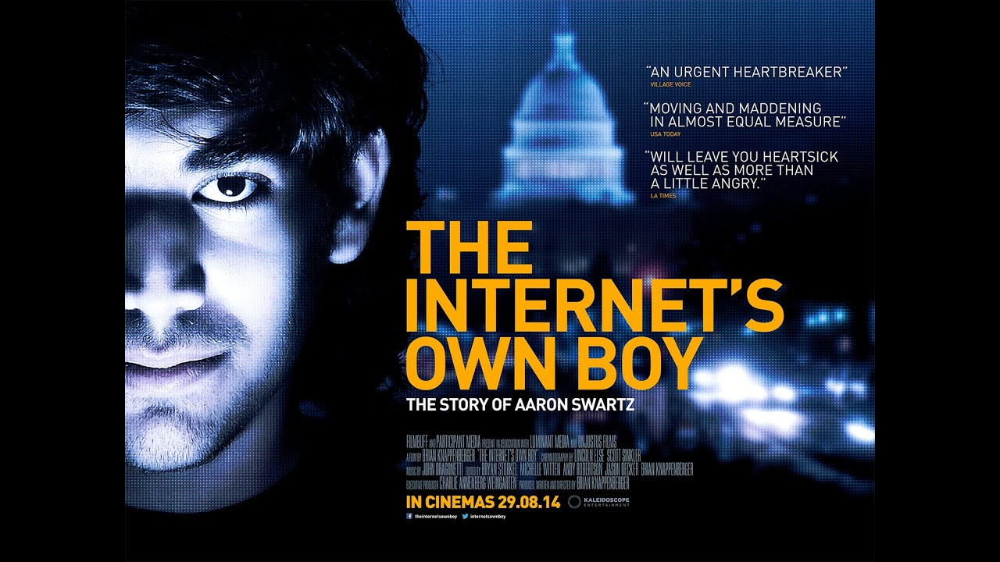

These are some recommendations for a more relaxing but still insightful and informative weekend. Enjoy!

This weekend, meet the genius (and unfortunately tragic) figure of Aaron Swartz and get inspired:

{:target="_blank"}

- [The Internet's Own Boy: The Story of Aaron Swartz](https://www.imdb.com/title/tt3268458/){:target="_blank"}

- [Watch it here: **The Internet's Own Boy: The Story of Aaron Swartz \| full movie (2014)**](https://www.youtube.com/watch?v=9vz06QO3UkQ){:target="_blank"} _(or search on YouTube for a full-length version available online)_

> "What is the most important thing you could be working on in the world right now? And if you're not working on that, why aren't you? ― Aaron Swartz"

Get inspired by more quotes from Aaron Swartz [here](https://www.brainyquote.com/authors/aaron-swartz-quotes) and also [here](https://www.goodreads.com/author/quotes/6893150.Aaron_Swartz).