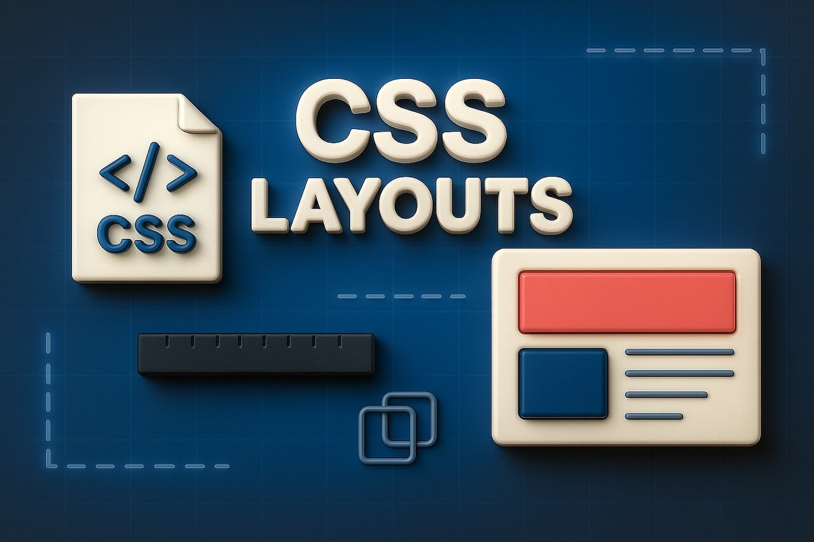
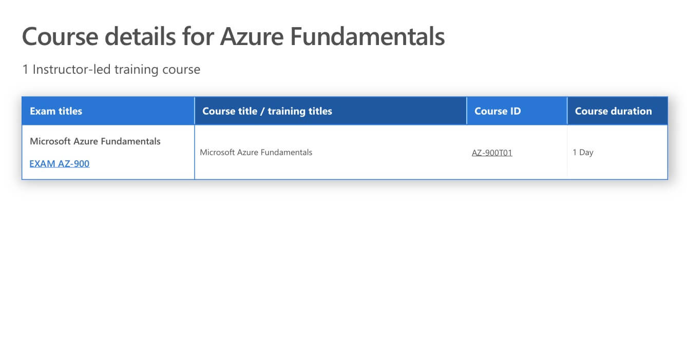
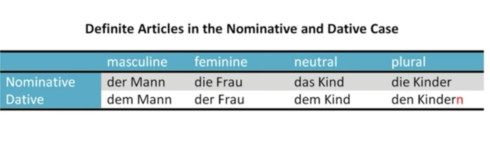

<h1 id="{{ Week 04-CSS 2 & Performance | slugify }}">
  Week 04 | CSS 2 & Performance
</h1>

  

  <h2 class="week-controls__previous_week">

    

      

      <a href="../week{{ previous_week_num }}">Week {{ previous_week_num }} &#8678;</a>
    

  </h2>

  Updated: 30/6/2025

  <h2 class="week-controls__next_week">

    

      

      <a href="../week{{ next_week_num }}">&#8680; Week {{ next_week_num }}</a>
    

  </h2>

---

<!-- Week 04 - Day 1 | Styling Tables, Debugging and Organizing CSS -->

  

    <h2>
      Week 04 - Day 1 | Styling Tables, Debugging and Organizing CSS</h2>
  

### Schedule

  - [Study](#study-plan)

### Study Plan

> **Important**
> As you'll notice, after finishing an MDN article, there are suggestions on what to study next.
> We strongly advise you to ignore this part and follow our curriculum's flow that you'll find on this document.

  - [Read: **Styling tables**](https://developer.mozilla.org/en-US/docs/Learn/CSS/Building_blocks/Styling_tables){:target="_blank"}
    - Level: Beginner

  - [Read: **Debugging CSS**](https://developer.mozilla.org/en-US/docs/Learn/CSS/Building_blocks/Debugging_CSS){:target="_blank"}
    - Level: Beginner

  - [Read: **Organizing your CSS**](https://developer.mozilla.org/en-US/docs/Learn/CSS/Building_blocks/Organizing){:target="_blank"}
    - Level: Beginner

<!-- Summary -->

### Exercises

  - Create a file named `azure_table.html` and try to recreate the table below using your HTML and CSS skills.

  

  - Create a file named `german_table.html` and try to recreate the table below using your HTML and CSS skills.

  

  - [MDN's Assessment: **Test your skills: Tables**](https://developer.mozilla.org/en-US/docs/Learn/CSS/Building_blocks/Tables_tasks){:target="_blank"}

  - [MDN's Assessment: **Fundamental CSS comprehension**](https://developer.mozilla.org/en-US/docs/Learn/CSS/Building_blocks/Fundamental_CSS_comprehension){:target="_blank"}

  **IMPORTANT:** Make sure to complete all the tasks found in the **daily Progress Sheet** and update the sheet accordingly. Once you've updated the sheet, don't forget to `commit` and `push`. The progress draft sheet for this day is: **/user/week04/progress/progress.draft.w04.d01.csv**

  You should **NEVER** update the `draft` sheets directly, but rather work on a copy of them according to the instructions [found here](../modules/curriculum/progress_workflow.md).

### Extra Resources

  - [MDN's Assessment: **Creating fancy letterheaded paper**](https://developer.mozilla.org/en-US/docs/Learn/CSS/Building_blocks/Creating_fancy_letterheaded_paper){:target="_blank"}

  - [MDN's Assessment: **A cool-looking box**](https://developer.mozilla.org/en-US/docs/Learn/CSS/Building_blocks/A_cool_looking_box){:target="_blank"}

<!-- Sources and Attributions -->
  

<!-- Week 04 - Day 2 | Styling Text -->

  

    <h2>
      Week 04 - Day 2 | Styling Text</h2>
  

### Schedule

  - [Study](#study-plan-1)

### Study Plan

  > Inspirational quote of the day: How learning works.
  > 
  > **One fourth 1/4 from the teacher**
  > 
  > **One fourth 1/4 from your own intelligence**
  > 
  > **One fourth 1/4 from your classmates**
  > 
  > **One fourth 1/4 from time**

  ---

  With the basics of the CSS language covered, the next CSS topic for you to concentrate on is styling text — one of the most common things you'll do with CSS. Here we look at text styling fundamentals including setting font, boldness, italics, line and letter spacing, drop shadows, and other text features. We round off the module by looking at applying custom fonts to your page, and styling lists and links.

  - [Read : **Fundamental text and font styling**](https://developer.mozilla.org/en-US/docs/Learn/CSS/Styling_text/Fundamentals){:target="_blank"}
    - Level: Beginner

  - [Read : **Styling lists**](https://developer.mozilla.org/en-US/docs/Learn/CSS/Styling_text/Styling_lists){:target="_blank"}
    - Level: Beginner

  - [Read : **Styling links**](https://developer.mozilla.org/en-US/docs/Learn/CSS/Styling_text/Styling_links){:target="_blank"}
    - Level: Beginner

  - [Read : **Web fonts**](https://developer.mozilla.org/en-US/docs/Learn/CSS/Styling_text/Web_fonts){:target="_blank"}
    - Level: Beginner

<!-- Summary -->

### Exercises

  - [MDN's Assessment: **Typesetting a community school homepage**](https://developer.mozilla.org/en-US/docs/Learn/CSS/Styling_text/Typesetting_a_homepage){:target="_blank"}

  **IMPORTANT:** Make sure to complete all the tasks found in the **daily Progress Sheet** and update the sheet accordingly. Once you've updated the sheet, don't forget to `commit` and `push`. The progress draft sheet for this day is: **/user/week04/progress/progress.draft.w04.d02.csv**

  You should **NEVER** update the `draft` sheets directly, but rather work on a copy of them according to the instructions [found here](../modules/curriculum/progress_workflow.md).

<!-- Extra Resources -->

<!-- Sources and Attributions -->
  

<!-- Week 04 - Day 3 | CSS Layout Part 1 -->

  

    <h2>
      Week 04 - Day 3 | CSS Layout Part 1</h2>
  

### Schedule

  - [Study](#study-plan-2)

### Study Plan

  - [Read: **Introduction to CSS layout**](https://developer.mozilla.org/en-US/docs/Learn/CSS/CSS_layout/Introduction){:target="_blank"}
    - **Level:** Beginner

  - [Read: **Normal Flow**](https://developer.mozilla.org/en-US/docs/Learn/CSS/CSS_layout/Normal_Flow){:target="_blank"}
    - **Level:** Beginner

  - [Read: **Positioning**](https://developer.mozilla.org/en-US/docs/Learn/CSS/CSS_layout/Positioning){:target="_blank"}
    - **Level:** Beginner

  **CSS Flexbox**

  - Watch our [**CSS for Beginners: Making Sense of Flexbox**](https://www.youtube.com/watch?v=sgQVwd2IL9A){:target="_blank"} video to learn about one of the most powerful CSS technologies, allowing you to create 90% of the layouts that you see out there.

  - [Complete the interactive **Learn Flexbox** tutorial](https://scrimba.com/learn/flexbox){:target="_blank"}
    - **Level:** Beginner
    - **Duration:** 1h
    - **Tip:** You can bookmark this [**really neat visual guide**](https://www.samanthaming.com/flexbox30/){:target="_blank"} to Flexbox and use it to quickly see a description and a visual overview of each property. If you find this useful, please don't forget to [star the repo](https://github.com/samanthaming/Flexbox30){:target="_blank"}.

  - Learn about the [**CSS Flexbox debugging tools**](https://www.youtube.com/watch?v=J5n2aS37rpE) available in Google Chrome that will help you work with Flexbox and debug any related issues more easily.
    - **Level:** Beginner
    - **Duration:** 4min

  > **Reminder:** If it feels too much at this point, don't worry. It takes time, lots and lots of practice and constantly going back to the concepts again and again in order to build confidence and become comfortable with the multitude of Flexbox properties. 

<!-- Summary -->

### Exercises

  - [MDN's Assessment: **Test your skills: Positioning**](https://developer.mozilla.org/en-US/docs/Learn/CSS/CSS_layout/Position_skills){:target="_blank"}

  - [Play: **Flexbox Defense**](http://flexboxdefense.com/){:target="_blank"}
    - Tower Defense with a twist: all towers must be positioned with CSS Flexbox.
    - Level: Beginner

  - [Play: **Flexbox Froggy**](https://flexboxfroggy.com/){:target="_blank"}
    - A game for learning CSS flexbox called Flexbox Froggy. The goal of the game is to help the frogs get to their lily pads by writing CSS code. See if you can beat all the levels!
    - Level: Beginner, Intermediate, Expert (check settings at the bottom of the page)
    - Lots of languages available, but we suggest playing it in English.

  - [MDN's Assessment: **Test your skills: Flexbox**](https://developer.mozilla.org/en-US/docs/Learn/CSS/CSS_layout/Flexbox_skills){:target="_blank"}

  As for the Flexbox Defense(1) and Flexbox Froggy(2), if you've  enjoyed the experience and it has helped you learn something, do not forget to star (⭐) the repos ([1](https://github.com/channingallen/tower-defense){:target="_blank"} & [2](https://github.com/thomaspark/flexboxfroggy){:target="_blank"}) of these awesome games!

  **IMPORTANT:** Make sure to complete all the tasks found in the **daily Progress Sheet** and update the sheet accordingly. Once you've updated the sheet, don't forget to `commit` and `push`. The progress draft sheet for this day is: **/user/week04/progress/progress.draft.w04.d03.csv**

  You should **NEVER** update the `draft` sheets directly, but rather work on a copy of them according to the instructions [found here](../modules/curriculum/progress_workflow.md).

### Extra Resources

  - [**A Complete Guide to Flexbox**](https://css-tricks.com/snippets/css/a-guide-to-flexbox/){:target="_blank"} _(You **definitely** need to bookmark this page if you want to master Flexbox)_ 

  - [Read the MDN **Flexbox** documentation](https://developer.mozilla.org/en-US/docs/Learn/CSS/CSS_layout/Flexbox){:target="_blank"}
    - **Level:** Beginner

### Sources and Attributions

  - [Flexbox Defense](https://github.com/channingallen/tower-defense){:target="_blank"} 
  - [Flexbox Froggy](https://github.com/thomaspark/flexboxfroggy){:target="_blank"}

  

<!-- Week 04 - Day 4 | CSS Layout Part 2 -->

  

    <h2>
      Week 04 - Day 4 | CSS Layout Part 2</h2>
  

### Schedule

  - [Study](#study-plan-3)

### Study Plan

  - [Take a quick CSS refresher test](exercises/day04/quick-CSS-refresher/index.md)
    - Level: Beginner

  - [Read: **Responsive Design**](https://developer.mozilla.org/en-US/docs/Learn/CSS/CSS_layout/Responsive_Design){:target="_blank"}
    - Level: Beginner

  - [Read: **Beginner's guide to media queries**](https://developer.mozilla.org/en-US/docs/Learn/CSS/CSS_layout/Media_queries){:target="_blank"}
    - Level: Beginner

  - [Read: **Legacy layout methods**](https://developer.mozilla.org/en-US/docs/Learn/CSS/CSS_layout/Legacy_Layout_Methods){:target="_blank"}
    - Level: Beginner

  - [Read: **Supporting older browsers**](https://developer.mozilla.org/en-US/docs/Learn/CSS/CSS_layout/Supporting_Older_Browsers){:target="_blank"}
    - Level: Beginner

<!-- Summary -->

### Exercises

  - [MDN's Assessment: **Test your skills: Responsive web design and media queries**](https://developer.mozilla.org/en-US/docs/Learn/CSS/CSS_layout/rwd_skills){:target="_blank"}

  **IMPORTANT:** Make sure to complete all the tasks found in the **daily Progress Sheet** and update the sheet accordingly. Once you've updated the sheet, don't forget to `commit` and `push`. The progress draft sheet for this day is: **/user/week04/progress/progress.draft.w04.d04.csv**

  You should **NEVER** update the `draft` sheets directly, but rather work on a copy of them according to the instructions [found here](../modules/curriculum/progress_workflow.md).

### Extra Resources

  - [MDN's Assessment: **Fundamental layout comprehension**](https://developer.mozilla.org/en-US/docs/Learn/CSS/CSS_layout/Fundamental_Layout_Comprehension){:target="_blank"}

  - [**Conquering Responsive Layouts**](https://courses.kevinpowell.co/conquering-responsive-layouts): a free, 21-day challenge to learn all about responsive designs with the master of CSS Kevin Powell.

<!-- Sources and Attributions -->
  

<!-- Week 04 - Day 5 | Web Performance & CSS Pre-processors -->

  

    <h2>
      Week 04 - Day 5 | Web Performance & CSS Pre-processors</h2>
  

### Schedule

  - [Study](#study-plan-4)

### Study Plan

  - [Read: **The "why" of web performance**](https://developer.mozilla.org/en-US/docs/Learn/Performance/why_web_performance){:target="_blank"}
    - Level: Beginner

  - [Read: **What is web performance?**](https://developer.mozilla.org/en-US/docs/Learn/Performance/What_is_web_performance){:target="_blank"}
    - Level: Beginner

  

  - **TIP:** let's bookmark and use a really useful tool that will our compress images, cutting down their size oftentimes to more than 50% thus improving the loading times of our web pages. Find an old (group?) project, drag and drop all the images into the [**TinyPNG**](https://tinypng.com/){:target="_blank"} page, then download the compressed version and compare the difference in size and loading times. Keep in mind, that **TinyPNG** can compress all sorts of images types, not just `.png`.

  - [Read: **Perceived performance**](https://developer.mozilla.org/en-US/docs/Learn/Performance/Perceived_performance){:target="_blank"}
    - Level: Beginner

  - [Watch: **CSS Preprocessors**](https://www.youtube.com/watch?v=PJkWbezpHpE){:target="_blank"} to learn about an important Frontend family of tools called **CSS Preprocessors** such as LESS, SASS, Stylus, etc.
    - **Description:** In this video we look at the wonderful world of CSS Preprocessors and a few of the awesome things that you can do with CSS Preprocessors, and look at a few of the more popular ones; LESS, Sass (SCSS), and Stylus.
    - **Duration:** 12min
    - **Notes:** if you are wondering about the vendor prefixes mentioned in the video _(-webkit, -moz, etc.)_, make sure to check out the [related MDN article](https://developer.mozilla.org/en-US/docs/Glossary/Vendor_Prefix).

  - Let's add a powerful tool to our Web Dev toolset before moving on: install the [**Live Sass Compiler VSCode Extension**](https://marketplace.visualstudio.com/items?itemName=ritwickdey.live-sass){:target="_blank"}

  - Now watch the [**Learn Sass In 20 Minutes**](https://www.youtube.com/watch?v=Zz6eOVaaelI){:target="_blank"} video and code along in SASS!
    - **Duration:** 20min

<!-- Summary -->

### Exercises

  There a lot of tools that can help a web developer check how good the performance of a website is. One of the best out there, and open source, is **Google Lighthouse**. Check the video below that covers the absolute basics of this simple but helpful tool

  [Watch: **What Is Google Lighthouse and How to Use It?**](https://www.youtube.com/watch?v=VyaHwvPWuZU){:target="_blank"}

  After watching the video, it's time to give it a go by following these steps:

  <!-- TODO: Replace week01 + exercises-3 with dynamic links. There should be no references to particular Weeks or Days inside the Modules content -->

  - Head over to your GitHub Page where your solution from [the **Styling the world’s first website** exercise](/WDX-180/curriculum/week01/index.html#exercises-3){:target="_blank"} is published.
    - If you have not completed this exercise, now it's time to do so!
    <!-- TODO: Same as above. Replace references to weeks and days. -->
    - If you followed correctly the instructions provided you can find your solution following this link `https://<GITHUB_USERNAME>.github.io/WDX-180/user/week01/exercises/day04/cern/index.html` by replacing `<GITHUB_USERNAME>` with your username.
  - While on this page, open Lighthouse, in any way you prefer (we're suggesting using the Chrome Dev Tools), and initiate a report for `Desktop` device by checking the following categories: `Performance`, `Accessibility`, `Best Practices`, `SEO`.
  - After the report is finished, check thoroughly what changes can be made to increase the score in any of the 4 categories, and try to improve your site's performance as much as possible!

  The goal is to have a score on all categories over 90. **Let's start analyzing this webpage**!

  **IMPORTANT:** Make sure to complete all the tasks found in the **daily Progress Sheet** and update the sheet accordingly. Once you've updated the sheet, don't forget to `commit` and `push`. The progress draft sheet for this day is: **/user/week04/progress/progress.draft.w04.d05.csv**

  You should **NEVER** update the `draft` sheets directly, but rather work on a copy of them according to the instructions [found here](../modules/curriculum/progress_workflow.md).

<!-- Extra Resources -->

<!-- Sources and Attributions -->
  

**Weekly feedback:** Hey, it's really important for us to know how your experience with the course has been so far, so don't forget to fill in and submit your [**mandatory** feedback form](https://forms.gle/S6Zg3bbS2uuwsSZF9){:target="_blank"} before the day ends. Thanks you!

## Week 04 - Weekend Suggestions

If you are in the mood of enjoying related content during the weekend, check out our weekly recommendations [here](WEEKEND.md).

---

<!-- COMMENTS: -->
