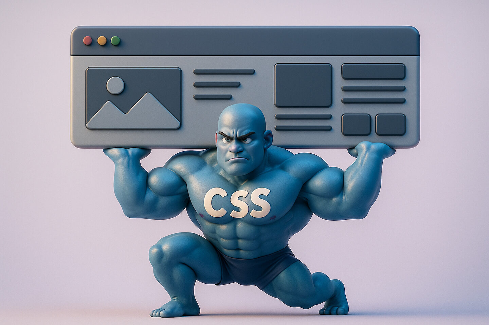
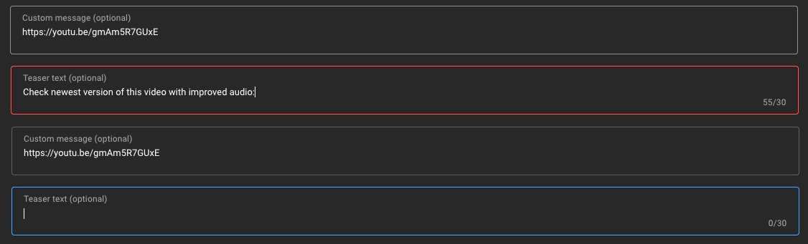
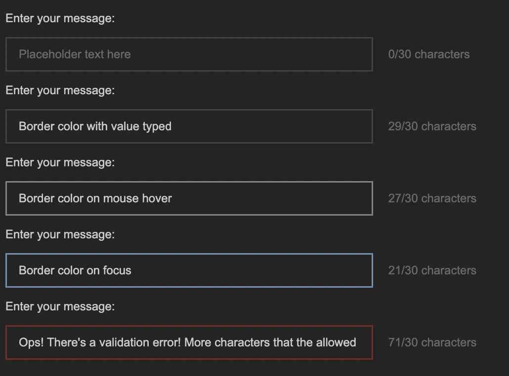
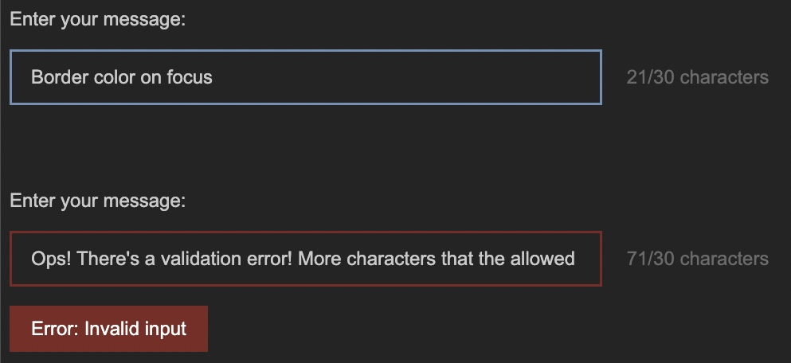

<h1 id="{{ Week 05-CSS Frameworks | slugify }}">
  Week 05 | CSS Frameworks
</h1>

  

  <h2 class="week-controls__previous_week">

    

      

      <a href="/WDX-180/curriculum/week{{ previous_week_num }}">Week {{ previous_week_num }} &#8678;</a>
    

  </h2>

  Updated: 2/11/2025

  <h2 class="week-controls__next_week">

    

      

      <a href="/WDX-180/curriculum/week{{ next_week_num }}">&#8680; Week {{ next_week_num }}</a>
    

  </h2>

<!-- VERSION -->

  You are viewing v2.0 of this content. To go back to v1.0 click <a href="v1.0">this link</a>.

<!-- VERSION -->

---

<!-- Week 05 - Day 1 | Practice with Form Input fields -->

  

    <h2>
      Week 05 - Day 1 | Practice with Form Input fields</h2>
  

### Schedule

  - [Study](#study-plan)
  - [Exercises](#exercises)
  - [Extra Resources](#extra-resources)

### Study Plan

  <!--  -->

  > Inspirational quote of the week:
  >
  > ___"If I ran a school, I’d give the average grade to the ones 
  > who gave me all the right answers, for being good parrots. 
  > I’d give the top grades to those who made a lot of mistakes 
  > and told me about them, and then told me what they learned from them."___
  >
  > R. Buckminster Fuller

  ---

  This Module is about replicating some real-life User Interfaces and specifically the form fields found in the [**YouTube Studio**](https://www.youtube.com/playlist?list=PLpjK416fmKwQ42eDY75Q05uM0g3N9WNXU){:target="_blank"} video editor page.

  {:target="_blank"}

  _(Click on the screenshot to see it in full scale)_

  The process, of course, involves coding but also doing some research to find out more about the required HTML and CSS to complete the project.

  Before starting the project, we have a tiny bit of theory for you. Check the next short video about the BEM CSS methodology before starting the exercise:

  - [Watch: **Why I use the BEM naming convention for my CSS**](https://www.youtube.com/watch?v=SLjHSVwXYq4){:target="_blank"}
    - **Duration:** 7min

  Now that you have rough idea about organizing CSS code using the BEM methodology, scroll down to the [**Exercises section**](#exercises) to find all the details and start the project. 

<!-- Summary -->

### Exercises

**What are you building?**

Take a close look at the screenshot below to understand what you are building:

We are basically creating a single `<input>` form field of type `text`. In the screenshot, you are seeing various states of this input field. You won't be creating 5 different input fields but just one. Check the Requirements below to learn more about the various states and behavior that we want this element to exhibit.

**Requirements**

- Here are the color you must use:
  - Background color for the page: `#282828`
  - The input text color (for the user values) is: `#d0d0d0`
  - The `placeholder` text color is: `#767676`
  - The border color is: `#4c4c4c`
  - The border color on hover is: `#8f8f8f`
  - The border color on focus is: `#7c9dbd`
  - When there is a validation error on some input, the border color is: `#862e2a`

1. For this project, we need all the CSS colors to be stored in [**CSS variables**](https://developer.mozilla.org/en-US/docs/Web/CSS/Using_CSS_custom_properties){:target="_blank"} that follow [**good naming practices**](https://stackoverflow.com/a/74253999/4861760){:target="_blank"}. 

2. The font family for all text should be: `Arial, Helvetica, sans-serif;`

3. There should be special validation rule for this input field, so that the only permitted characters are the following: `A-Z`, `a-z`, `0-9` and the special characters `!, @, _, -, $, (` and `)` along with whitespace of course. Also, there is a limit on how many characters should be permitted: **maximum 30 chars**. If the user has entered more than 30 characters or any non-permitted character, the input border should change to the error color (as seen in the last input example in the screenshot).

4. The input field must be accompanied by a special section that indicates the number of current characters along with the limit (30) as seen in the screenshot. This does not need to change dynamically. For now, you'll just want this element to contain the text: `0/30 characters`. Once you've learned about JavaScript, you'll be able to dynamically update these numbers.

5. The input field must also be accompanied by a `<label>` element (as depicted in the screenshot) with the informative text: `Enter your message`. The `<input>` and `<label>` elements **should be paired together** so that when the user clicks on the label, the input should receive focus. Also, when the user hovers over the label, the input should change its border color to the appropriate focus color (see list of colors above). The label should use the same color as the input text value.

6. You should validate your HTML code using the `W3C Validator` service and make sure to fix all warnings and errors.

7. You should check your web page using the Chrome [**Lighthouse**](https://developer.chrome.com/docs/lighthouse/overview/){:target="_blank"} checker and make sure that you have a green score (>90%) on the `Accessibility` checks. If the score is lower than 90%, make sure to do any necessary fixes.

**Extra Challenges**

- Whenever the input value is invalid, a specially crafted HTML element should appear beneath the input element, displaying an error notification: `("Error: Invalid input")`. You **do not need JavaScript** for this one to work. Do your research and come up with a plain HTML/CSS solution.

{:target="_blank"}

**Study Resources**

- [Naming CSS Stuff Is Really Hard](https://sparkbox.com/foundry/naming_css_stuff_is_really_hard){:target="_blank"}

- [Input pseudo-classes](https://developer.mozilla.org/en-US/docs/Web/CSS/Pseudo-classes#input_pseudo-classes){:target="_blank"}

  **IMPORTANT:** Make sure to complete all the tasks found in the **daily Progress Sheet** and update the sheet accordingly. Once you've updated the sheet, don't forget to `commit` and `push`. The progress draft sheet for this day is: **/user/week05/progress/progress.draft.w05.d01.csv**

  You should **NEVER** update the `draft` sheets directly, but rather work on a copy of them according to the instructions [found here](../modules/curriculum/progress_workflow.md).

<!-- Extra Resources -->

<!-- Sources and Attributions -->
  

<!-- Week 05 - Day 2 | Flappy App - Day 1 -->

  

    <h2>
      Week 05 - Day 2 | Flappy App - Day 1</h2>
  

### Schedule

  - [Study](#study-plan-NN)
  - [Exercises](#exercises-NN)
  - [Extra Resources](#extra-resources-NN)

### Study Plan

  

  **Flappy App**: Recreating a web page from a design mockup

  This is a project that should ideally be completed in 3 to 4 days. You will go through a series of videos, where we take a webpage mockup and turn it into HTML and CSS code.

  Below you'll find a list of videos that will take you through the process of decomposing the mockup into an HTML structure and gradually building and styling each section of the mockup. The total duration of the videos is around 3 hours. 

  **Here's how you should proceed:**

  - 1) **TAKE #1:** Watch each video once, without touching any code or running any commands. It's really important to pause from time to time and **take notes** during this first step. 

  - 2) **TAKE #2:** Go through the video a second time, but this time you should pause the video and code along, trying to exactly replicate the steps and commands shown in the video

  - 3) **TAKE #3:** This is the most important step. Start from scratch and try to replicate each step **without looking at the code or commands** in the video. This will help you recollect everything you've learned from the videos and the 2nd repetition (during which you coded along) and actually code by memory. Now, this part is going to be hard, so give yourself some time to recollect the commands, steps or code needed. You can freely Google or search the MDN documentation, but try not to cheat and go back to the video.

  At this step, the notes you took during the first run will help you move on and find what you need to complete each step. 

  If you get stuck and don't see the expected results, don't worry. Move on and you'll be able to compare your code with the video, after you've finished each step. You will then notice what went wrong, what misconceptions you've held and take notes.

  It's recommended that you create 2 separate folders and VSCode workspaces for these last 2 steps. 

  All the videos can be found on this [**YouTube playlist**](https://www.youtube.com/playlist?list=PLdo7hJB0agEmTY9xT7EvzUkClAeAHJr9G).

  Good luck!

  **The Videos**

  - [**Intro**](https://www.youtube.com/watch?v=mhTtjqa0a44){:target="_blank"}
    - **Duration:** 2min
    - **Description:** Brief description of the project.
    - **Repository:** [https://github.com/in-tech-gration/Flappy_App](https://github.com/in-tech-gration/Flappy_App){:target="_blank"}

  - Part 1: [**Setup**](https://www.youtube.com/watch?v=UYHiXrUOhk4){:target="_blank"} 
    - **Duration:** 3min
    - **Description:** Clone the git repository, set everything up before moving on to the next video and checking the mockups.
    - **What you'll learn:** 
      - Adding a local folder into your VSCode workspace via the command line using the `code -a .` command.

  - Part 2: [**Folder Structure**](https://www.youtube.com/watch?v=EW2T7T_hdCw){:target="_blank"} 
    - **Duration:** 5min
    - **Description:** All about the files and folders structure of the project.
    - **What you'll learn:** 
      - Using the `Live Server` VSCode extension to serve the HTML files.
      - What does the `missing favicon` 404 error mean.
      - Checking which resources are loaded through an HTML page using the Network Panel of DevTools

  - Part 3: [**Planning**](https://www.youtube.com/watch?v=UHCootaxTOs){:target="_blank"} 
    - **Duration:** 28min
    - **Description:** How do we go from a 2D design mockup to an actual website created using HTML and CSS? How do we start decomposing a static image into the actual HTML elements that will comprise the final web page?
    - **What you'll learn:** 
      - Thinking in boxes and containers
      - Using diagram tools (such as https://excalidraw.com/) to plan and turn a design into an HTML structure.
      - Destructuring a mockup in rows and columns
      - Properly commenting and indenting HTML code
      - Using Semantic HTML elements for your web page structure
      - Using the DevTools Color Picker to grab colors from an image
      - Organizing and managing the colors of a web page using CSS variables
      - Using the `Computed Panel` in DevTools to debug HTML and CSS and get a better overview of each HTML element's box model.
      - Using the `outline`, `background` and `border` CSS properties to debug CSS issues and get a better visual overview of where each HTML element's box model appears.
      - Learn about the very handy `vh` (viewport height) CSS unit.
      - Creating a basic HEADER/MAIN/FOOTER layout using Flexbox

  - Part 4: [**Google Web Fonts**](https://www.youtube.com/watch?v=KiyRDMBgDlY){:target="_blank"} 
    - **Duration:** 5min
    - **Description:** Follow the specs and load the appropriate font family defined in the mockup.
    - **What you'll learn:**
      - How to load [Google Web Fonts](https://fonts.google.com/specimen/Lato?query=Lato){:target="_blank"} into an HTML page.
      - Use the `Format Document` feature of VSCode to keep your code well-formatted

  - Part 5: [**Containers**](https://www.youtube.com/watch?v=qdP5WY0WWfw){:target="_blank"} 
    - **Duration:** 9min
    - **Description:** Define containers within the design to restrict the maximum width of the main content sections.
    - **What you'll learn:** 
      - Thinking about inner HTML elements that act as width limiters and restrict the content from going past a specific width

  - Part 6: [**Defining Columns**](https://www.youtube.com/watch?v=kNSRmEuwxnU){:target="_blank"} 
    - **Duration:** 25min
    - **Description:** After defining the rows in our design it's time to define the columns and start splitting our content vertical sections as well.
    - **What you'll learn:** 
      - Thinking in boxes, but this time in terms of columns instead of rows
      - Using `Semantic HTML` elements for sections that play a particular role in our page
      - Using `unordered lists` for the navigation menu items
      - Using the Emmet abbreviations for quickly creating sibling elements and multiple elements:
        - `selector+sibling+sibling`
        - `selector*NUMBER_OF_TIMES_TO_BE_CREATED`, e.g. `div*5`
    - Using utility classes in CSS for reusability and ease-of-use
    - Understanding the Flexbox axis rule: `justify-content` works (aligns items) horizontally when `flex-direction` is set to `row` and vertically when flex-direction is set to `column`. Likewise, `align-items` works vertically in `row` and horizontally in `column` `flex-direction`.

  - Part 7: [**Recreating the FlappyApp Logo**](https://www.youtube.com/watch?v=DHA6gf7m-5w){:target="_blank"} 
    - **Duration:** 17min
    - **Description:** Recreating the logo based on the mockup.
    - **What you'll learn:** 
      - Using an empty `alt=""` attribute when an image is just for decoration (best practice in Web Accessibility)
      - Using the `text-transform` CSS property
      - Using negative margins to position an element
      - All about the `line-height` property
      - Using `position: relative` to make an element overlap another element

  - Part 8: [**Navigation Menu**](https://www.youtube.com/watch?v=rgegTdHVCHk){:target="_blank"} 
    - **Duration:** 19min
    - **Description:** Recreating the navigation menu as depicted in the mockup
    - **What you'll learn:** 
      - Resetting the default `ul` styling
      - Displaying `li` elements horizontally with the help of `display: flex`
      - Debugging spacing issues using the `Inspector` Tool and `outline`
      - Setting hover color for the `li` elements using the `:hover` pseudo class
      - Changing the default cursor icon using the `cursor` CSS property

  - Part 9: [**Main Section: Scenery**](https://www.youtube.com/watch?v=6JiAJnJiB0Q){:target="_blank"} 
    - **Duration:** 7min
    - **Description:** Recreating the main game scenery area.
    - **What you'll learn:** 
      - [How to add a double border](https://stackoverflow.com/questions/3906983/two-color-borders){:target="_blank"} in an HTML element using both the `border` and `outline` CSS properties
      - Using the color picker to set a color and choose a different color format (e.g. switching from HSL to HEX)

  - Part 10: [**Main Section: Game Features Table**](https://www.youtube.com/watch?v=PD-nVpWBLys){:target="_blank"} 
    - **Duration:** 16min
    - **Description:** Recreating the Features table in the main section.
    - **What you'll learn:** 
      - Using the `first-child` and `nth-child` CSS pseudo classes to target and style specific children of a container element
      - Using `span` as a special-purpose inline container to style specific parts of a text.
      - Using `letter-spacing` to customize the space between word characters.

  - Part 11: [**Main Section: Lorem Ipsum Area**](https://www.youtube.com/watch?v=BwDuMkNHSX0){:target="_blank"} 
    - **Duration:** 3min
    - **Description:** Recreating the Lorem Ipsum area in the main mockup section.

  - Part 12: [**Fixing Navigation Alignment Issues**](https://www.youtube.com/watch?v=vdQsmHDNCj4){:target="_blank"} 
    - **Duration:** 9min
    - **Description:** Fixing some vertical alignment issues in the top navigation
    - **What you'll learn:** 
      - Using the Inspector tool along with the special `Flex` feature to debug Flexbox alignment and layout issues.
      - Get to know the different syntaxes of the `padding` shorthand property.

  - Part 13: [**Centering the Main Content**](https://www.youtube.com/watch?v=rC4FwmrV6_I){:target="_blank"} 
    - **Duration:** 5min
    - **Description:** Using Flexbox to center the main content
    - **What you'll learn:** 
      - More Utility CSS class to the rescue
      - Centering content vertically and horizontally using Flexbox

  - Part 14: [**Footer**](https://www.youtube.com/watch?v=H4NZXGN1dEo){:target="_blank"} 
    - **Duration:** 14min
    - **Description:** Recreating the Footer area of the mockup
    - **What you'll learn:** 
      - More Utility CSS classes
    - **Notes:** You'll see at some point in the video, that it's unclear whether the `padding` property applied in an `ul` element is inherited and applied to the children `li` elements. In order to find out whether a specific CSS property is inherited by the children, always check the appropriate MDN page, and specifically look for the **Inherited** property entry in the **Formal Definition** section. For example, `padding` is a [non-inheritable property](https://developer.mozilla.org/en-US/docs/Web/CSS/padding#formal_definition){:target="_blank"} whereas [color is inherited by the children of an element](https://developer.mozilla.org/en-US/docs/Web/CSS/color#formal_definition){:target="_blank"}.

  - Part 15: [**Adjusting for max-width**](https://www.youtube.com/watch?v=JsePsnojX3E){:target="_blank"} 
    - **Duration:** 16min
    - **Description:** Our design must adhere to the mockup specs which state that the main content areas should be limited to a width of 1100px 
    - **What you'll learn:** 
      - All about the `margin` `auto` value
      - Tricky `Specificity` styling and checking the Styles panel of Chrome DevTools to see which CSS rules are being overridden by other more specific CSS selectors 

  - Part 16: [**Ribbon Decoration using Background-Image**](https://www.youtube.com/watch?v=Z41buBbpMKs){:target="_blank"} 
    - **Duration:** 6min
    - **Description:** Adding some decoration to the Header and Footer via `background-image` CSS property
    - **What you'll learn:** 
      - `background-image`
      - `background-position`
      - `background-repeat`

  - **Extra Challenges:**
    - Try to make the game image fit nicely next to the `Features` table as depicted in the mockup. The height of the image should be properly aligned with the height of the `Features` table.
    - Try to use CSS (no image involved) to recreate the ribbon decoration of the header and footer.
    - Use the W3C Validator services to make sure that your HTML and CSS do not contain any warnings or errors.
      - [HTML Validator](https://validator.w3.org/){:target="_blank"}
      - [CSS Validator](https://jigsaw.w3.org/css-validator/){:target="_blank"}

  ---

  **Found a content problem with this page? Want to contribute?** 

  - [Join the discussion here](https://github.com/in-tech-gration/WDX-180/discussions/categories/flappyapp-challenge)
  - [View the source code](https://github.com/in-tech-gration/WDX-180/blob/main/curriculum/modules/css/misc/flappy_app_practice/index.md)
  - [Report an issue](https://github.com/in-tech-gration/WDX-180/issues)
  - [Edit the page on GitHub](https://github.com/in-tech-gration/WDX-180/blob/main/curriculum/modules/css/misc/flappy_app_practice/index.md)

### Summary

  **Insights**

  By going through the FlappyApp challenge, you'll be able to learn about how to think in boxes and more specifically how you can decompose a design mockup into the basic HTML elements that make up the layout. You'll gradually start to detect the basic rows and columns in each image or design that you see out there, then go deeper and find the nested rows and columns so you can use the power of CSS rules to lay out the various sections and elements of the design.

  You'll be able to understand the power and usefulness of utility classes, that will help you reuse your CSS styling across your HTML just by applying these classes as values to the HTML class attribute. Popular CSS libraries like Tailwind are based on this concept.

  Another insight that you'll probably gain from this project is the way to organize your HTML and CSS. Your CSS selectors should be laid out hierarchically and according to the HTML structure. If your page has a `<header>`, `<main>` and `<footer>` sections, then your CSS selectors must follow that order too so that you can quickly find the selectors that update the styling of each section in your HTML.

<!-- Exercises -->

<!-- Extra Resources -->

### Sources and Attributions

  - [Flappy App Project by the `devleague`](https://github.com/devleague/Flappy_App){:target="_blank"} (Make sure to star the repo if you liked this challenge)
  

<!-- Week 05 - Day 3 | Flappy App - Day 2 -->

  

    <h2>
      Week 05 - Day 3 | Flappy App - Day 2</h2>
  

### Schedule

  - [Study](#study-plan-NN)
  <!-- - [Exercises](#exercises-NN) -->
  <!-- - [Extra Resources](#extra-resources-NN) -->

### Study Plan

  

  This is Day 2 of the Flappy App practice. Just follow the instructions and continue where you've left off.

<!-- Summary -->

<!-- Exercises -->

<!-- Extra Resources -->

<!-- Sources and Attributions -->
  

<!-- Week 05 - Day 4 | Flappy App - Day 3 -->

  

    <h2>
      Week 05 - Day 4 | Flappy App - Day 3</h2>
  

### Schedule

  - [Study](#study-plan-NN)
  <!-- - [Exercises](#exercises-NN) -->
  <!-- - [Extra Resources](#extra-resources-NN) -->

### Study Plan

  

  This is Day 3 of the Flappy App practice. Just follow the instructions and continue where you've left off.

<!-- Summary -->

<!-- Exercises -->

<!-- Extra Resources -->

<!-- Sources and Attributions -->
  

<!-- Week 05 - Day 5 | Flappy App - Day 4 -->

  

    <h2>
      Week 05 - Day 5 | Flappy App - Day 4</h2>
  

### Schedule

  - [Study](#study-plan-NN)
  <!-- - [Exercises](#exercises-NN) -->
  <!-- - [Extra Resources](#extra-resources-NN) -->

### Study Plan

  

  This is Day 4 of the Flappy App practice. Just follow the instructions and continue where you've left off.

<!-- Summary -->

<!-- Exercises -->

<!-- Extra Resources -->

<!-- Sources and Attributions -->
  

**Weekly feedback:** Hey, it's really important for us to know how your experience with the course has been so far, so don't forget to fill in and submit your [**mandatory** feedback form](https://forms.gle/S6Zg3bbS2uuwsSZF9){:target="_blank"} before the day ends. Thanks you!

## Week 05 - Weekend Suggestions

If you are in the mood of enjoying related content during the weekend, check out our weekly recommendations [here](WEEKEND.md).

---

<!-- COMMENTS: -->
