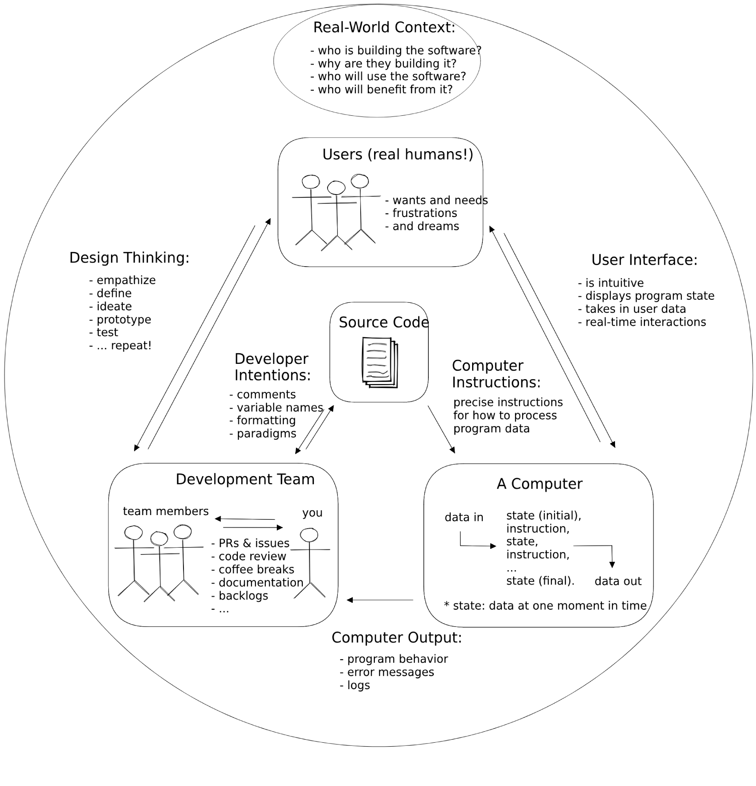
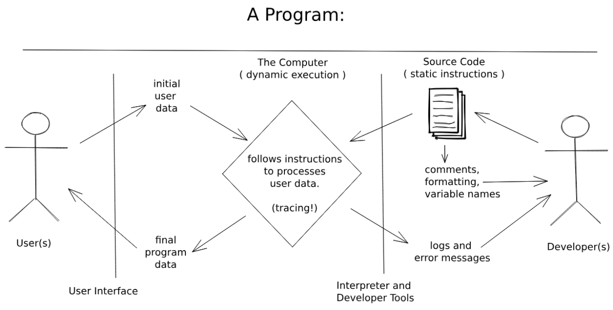

<hr class="mb-0">

<h1 id="{{ Week 06-CSS Frameworks & Intro to Programming | slugify }}">
  <span class="week-prefix">Week 06 |</span> CSS Frameworks & Intro to Programming
</h1>


<div class="week-controls">

  

  <h2 class="week-controls__previous_week">

    

      

      <a href="../week{{ previous_week_num }}">Week {{ previous_week_num }} &#8678;</a>
    

  </h2>

  <span>Updated: 10/11/2025</span>

  <h2 class="week-controls__next_week">

    

      

      <a href="../week{{ next_week_num }}">&#8680; Week {{ next_week_num }}</a>
    

  </h2>

</div>

<!-- VERSION -->
<hr style="margin-bottom:0" />
<div class="center opacity-50 opacity-100:hover">
  You are viewing v2.0 of this content. To go back to v1.0 click <a href="v1.0">this link</a>.
</div>
<!-- VERSION -->

---

<!-- Week 06 - Day 1 | Introduction to Tailwind CSS -->
<details markdown="1">
  <summary>
    <h2>
      <span class="summary-day">Week 06 - Day 1</span> | Introduction to Tailwind CSS</h2>
  </summary>

### Schedule

  - [Study](#study-plan-NN)
  - [Exercises](#exercises-NN)
  - [Extra Resources](#extra-resources-NN)

### Study Plan

  

  **What is a CSS Framework**

  A CSS framework is a prepped and ready-to-use CSS library (Cascading Style Sheets). The stylesheets collection makes the job of a UI developer **easier**. 

  Rather than starting every project from scratch, a CSS framework gives them tools to quickly create a user interface that they repeat and tweak during a project. They also **enable the creation** of more **standards-compliant** websites. 

  While quite challenging to use or ambiguous for beginners, senior developers who know the CSS framework sites’ descriptions and buzzwords find them extremely useful.

  **Why Do You Need A CSS Framework?**

  CSS frameworks **are designed for use in typical scenarios** such as establishing navigation bars, footers, sliders, hamburger menus, 3-column layouts, and more. 

  The frameworks also **enable expanding on JavaScript, SASS, and other technologies**. If designers are time-stressed, frameworks allow setting up web pages – not just homepages, without diving into some CSS.

  Other than time-saving, teams comprising several developers benefit from the standards offered by CSS frameworks. Rather than each developer on a project adding their own style of names, frameworks regulate layouts, easily read others’ code, and smooth the development cycle with fewer bugs and better team communication.

  All of the above are the two strongest **pros** of working with a CSS Framework: **Faster Development** and **Consistency**

  However, as you already know, every coin has 2 sides. Using any CSS Framework can have it's drawbacks and not be suitable for some cases as described below:

  1. **Bloated Code**

  CSS frameworks include a lot of pre-built styles and components, which can add unnecessary code to a website or application. This can slow down the website's loading time and negatively impact performance. Additionally, using pre-built components can limit the customization options available to developers and tempt developers to use them without fully understanding how they work.

  2. **Learning Curve**

  Each CSS framework has its own set of styles, components, and conventions that developers need to learn in order to use it effectively. This can take time and effort, especially for developers who are new to front-end development. Additionally, CSS frameworks may not always align with a developer's preferred workflow or coding style. This can make it challenging to use the framework effectively, especially if the developer is used to writing custom CSS from scratch.

  **How to use a CSS Framework**

  There are many different CSS Frameworks out there and they can be broken down to two categories:

  1. Pre-styled, prescriptive, all-in-one frameworks (e.g. Bootstrap)

  2. Hands-off, unopinionated, utility frameworks (e.g. TailwindCSS)

  In later modules we're going to dive deeper to each one of those two popular CSS frameworks, but first we must answer the one million dollar question: **What type of Framework do we need?**

  To begin, we must have some knowledge of our website. Is it even necessary to have a system? Structures are beneficial to most locations with a large number of pages. The ideal amount of pages can change, but if we find ourselves repeating the same HTML, CSS, or even JavaScript on one of our pages, a layout or structure can help.

  -  Framework Language

  We should be familiar with the computer language(s) that our framework employs. As previously stated, some simple frameworks are nothing more than basic HTML templates, while more complicated frameworks may include CSS and JavaScript. Some frameworks construct the CSS using LESS or SASS, while others utilize Ruby or other computer languages to compile the pages once they're built. It will be challenging to build our framework if we are unfamiliar with the language(s) it employs.

  - Framework Features

  A CSS framework, often known as a web framework, is a collection of web-based tools, libraries, and best practices. A CSS framework can be as simple as a one-page template that serves as the foundation for all of our site's pages, or it can be a complicated collection of CSS, HTML, JavaScript, and server-side programs and files that govern the entire site architecture.

  - Whether the Framework is Customizable and Modular
  Customizable frameworks allow us to add our own code to make our site look unique and different from other websites. However, if a framework is overly customized, its benefits are lost, and it will be better to start from scratch.

  After we've decided which type of Framework, and specifically which one we want to use, all we have to do it find their **Official Documentation** and follow their instructions! This can be scary for a new developer, but it can benefit us in the long run! 

  **Tailwind CSS**

  - Let's start by watching this quick introduction to [**Tailwind in 100 seconds**](https://www.youtube.com/watch?v=mr15Xzb1Ook){:target="_blank"}.

  - Watch this [**Tailwind CSS Introduction**](https://www.youtube.com/watch?v=pYaamz6AyvU){:target="_blank"} video by Dave Gray and follow along by coding and replicating the example he creates in the video. You will need to place all the files in the `user/week06/exercises/day01/tailwind_intro/` folder. Make sure to create the folder if it doesn't already exist.

  - More practice with utility classes! Watch [**this video**](https://www.youtube.com/watch?v=oU5ar0dmQEY){:target="_blank"} and code along. Place your file in the `user/week06/exercises/day01/utility_classes/` folder. Make sure to create the folder if it doesn't already exist.

### Summary

  CSS Frameworks are so popular these days and they get better and better as time goes by. However, just because they make things easier and faster for some cases, that does not mean that we should ditch plain CSS and restrain our options and imagination to what each CSS Framework has to offer.

  Finally, it's highly suggested that you take a look on the following link focused on [Understanding the spectrum of CSS frameworks](https://dev.to/bholmesdev/when-and-why-you-should-use-css-frameworks-4oe)

  > **Note:**
  >
  > You can have a look at this [video](https://www.youtube.com/watch?v=ufMqGkXL1Jw) if you're time stressed, but the article mentioned above is worth reading!


<!-- Exercises -->

### Extra Resources

  - [Tailwind CSS Tutorial for Beginners (2023)](https://www.youtube.com/watch?v=G5YDmWNU_tc){:target="_blank"} (YouTube, 45min)

### Sources and Attributions

  - [What Is A CSS Framework?](https://elementor.com/resources/glossary/what-is-a-css-framework/)

  - [The Pros and Cons of CSS Frameworks: A Comprehensive Review](https://dev.to/c0mmand3rj/the-pros-and-cons-of-css-frameworks-a-comprehensive-review-13db)
  
  - [Guide to CSS Framework](https://www.simplilearn.com/tutorials/css-tutorial/css-framework)

  - Thanks to [Mubashra Irshad](https://github.com/mubashra21c){:target="_blank"} for reviewing and suggesting the `Tailwind CSS Tutorial for Beginners`.

  _Photo by [SevenStorm JUHASZIMRUS](https://www.pexels.com/photo/green-and-yellow-crane-439416/)_
  
</details>

<hr class="mt-1">

<!-- Week 06 - Day 2 | How to Make A Website With Tailwind CSS -->
<details markdown="1">
  <summary>
    <h2>
      <span class="summary-day">Week 06 - Day 2</span> | How to Make A Website With Tailwind CSS</h2>
  </summary>

### Schedule

  - [Study](#study-plan-05)
  - [Exercises](#exercises-05)
  - [Extra Resources](#extra-resources-05)

### Study Plan

  

  - [Watch: **How To Make A Website With Tailwind CSS**](https://www.youtube.com/watch?v=8eQwgc9nc64){:target="_blank"}
    - **Duration:** 32min
    - **Level:** Beginner

  - Now, go through the video again, pause and code along. Below, you can find all the images needed to complete the tutorial _(just click the links, then right click and select "Save Image as")_:
    - [**cart.png**](./assets/cart.png){:target="_blank"}
    - [**grocery-image.png**](./assets/grocery-image.png){:target="_blank"}
    - [**Image.png**](./assets/Image.png){:target="_blank"}
    - [**logo.png**](./assets/logo.png){:target="_blank"}

  You will need to create a repository named **grocify** under your GitHub account and enable GitHub Pages on that. Once you have finished recreating the website in the video, update the progress sheet with your GitHub repository's Pages URL, that would look something like this: `https://YOUR_USERNAME.github.io/grocify`

  While working with Tailwind CSS, it's probably a good idea to install the following VSCode extension that will help you deal with the large list of utility classes provided by the library:

  - [Tailwind CSS IntelliSense](https://marketplace.visualstudio.com/items?itemName=bradlc.vscode-tailwindcss){:target="_blank"}

<!-- Summary -->

### Exercises

  - Complete the **How to Make a Website with Tailwind CSS** challenge and update the progress sheet.

  **IMPORTANT:** Make sure to complete all the tasks found in the **daily Progress Sheet** and update the sheet accordingly. Once you've updated the sheet, don't forget to `commit` and `push`. The progress draft sheet for this day is: **/user/week06/progress/progress.draft.w06.d02.csv**

  You should **NEVER** update the `draft` sheets directly, but rather work on a copy of them according to the instructions [found here](../week01/resources/PROGRESS-WORKFLOW.md).


### Extra Resources

  <!-- Web server is down -->


  <!-- - [Read: **The Pros And Cons Of Utility First CSS**](https://thesassway.com/the-pros-and-cons-of-utility-first-css/){:target="_blank"} -->


  - [Read: **10 Reasons To Use TailwindCSS In Your Next Project**](https://hackernoon.com/10-reasons-to-use-tailwindcss-in-your-next-project){:target="_blank"}

<!-- Sources and Attributions -->
  
</details>

<hr class="mt-1">

<!-- Week 06 - Day 3 | What is Programming? -->
<details markdown="1">
  <summary>
    <h2>
      <span class="summary-day">Week 06 - Day 3</span> | What is Programming?</h2>
  </summary>

### Schedule

  - [Study](#study-plan-NN)
  - [Exercises](#exercises-NN)
  - [Extra Resources](#extra-resources-NN)

### Study Plan

#### What is Programming?


  Programming is communication. It's also a lot of other things, but this
  introduction will focus on the different ways you communicate with your code.

  When you write code you are really just writing a text document, exactly like
  you might write an email or a note. The biggest difference between an email and a computer program is _who you are writing for_.

  When you write an email you're writing for the person who will be reading it.
  When you write a computer program you are writing for 3 very different audiences at the same time! One single document (your code) needs to be understandable to:

  - **Developers**: A developer needs to read your code and understand what you
    were trying to do and why.
  - **Computers**: Your code needs to have _perfect_ syntax so the computer can
    parse it, and you must write instructions that are allowed by the programming language or the computer will throw an error.
  - **Users**: The instructions you give to the computer must create an intuitive and pleasant experience for the user.

  Being a developer means understanding how all these characters interact, and
  then communicating with everyone involved to deliver quality software within
  your project's constraints. This diagram shows the different channels of
  communication in a software project:

  

#### Thinking like a Computer


  In the following video, Evan Cole guides you through the basic concepts of programming and explains the feedback loop that continuously runs through the software cycle as source code is written by developers, subsequently read and executed by the computer which eventually displays the output back to the users.

  - [Watch: **Thinking like a Computer**](https://youtu.be/Lc68CtuMuTM){:target="_blank"}
    - **Duration:** 45min
    - **Level:** Beginner

  ---


  **Programming Languages**

  High-level programming languages like JavaScript are a compromise between how
  people think and how a computer works. Programming languages are not always easy for people to learn but they're definitely easier than directly telling a
  computer what to do (writing 1's and 0's).

  Because humans are so much better at learning and understanding than computers
  are (for now), programming languages have been designed to leave all the hard
  work for us. It's our job to make sure our instructions for the computer are
  perfectly structured and do exactly what we want. The computer just _parses_
  (interprets) our code and follows the instructions without any understanding or thinking.

  You can think of a programming language as the developer's UI for the computer.
  Because this UI isn't very intuitive you will need to spend a lot of time
  studying syntax and other details before you can program with ease. This is why you will be focusing on _understanding_ programs before writing them.

  [**_Learnable Programming_**](http://worrydream.com/LearnableProgramming/){:target="_blank"} said it best:

  > - **Programming is a way of thinking, not a rote skill**. Learning about "for"
  >   loops is not learning to program, any more than learning about pencils is
  >   learning to draw.
  > - **People understand what they can see**. If a programmer cannot see what a
  >   program is doing, she can't understand it.
  >
  > Thus, the goals of a programming system should be:
  >
  > - to support and encourage powerful ways of thinking
  > - to enable programmers to see and understand the execution of their programs
  >
  > ...
  >
  > _How do we get people to understand programming?_
  >
  > We change programming. We turn it into something that's understandable by
  > people.


  Until the future when computers are designed to understand us, we're stuck with programming systems where we do the hard work of understanding computers. 

  Hopefully these Modules can make this journey easier.

  ---


<!-- Summary -->

### Exercises

  **Installing Study Lenses**

  Follow the instructions from [**Setting up Study Lenses (v2)**](../modules/javascript/denepo/setting-up-study-lenses/index.md){:target="_blank"} to set up Study Lenses (v2) on your System.

  **Watch a short introduction to Study Lenses**

  - Watch the [**WDX180 - Study Lenses Guide**](https://youtu.be/5uCJBiQ7MkA){:target="_blank"} video to get familiar with the `study-lenses` tool that you'll be using to study code and explore various aspects of JavaScript programs.
    - **Duration:** 12min

  **Running Study Lenses on WDX-180 material**

  Let's now check whether `study-lenses` is available globally and try to use it to study a simple JavaScript program. 

  - Open the terminal and stop any other instance of `study-lenses` that might be running, e.g. the `npm run test-content` from previous steps. You can press `Ctrl+C` on the terminal to stop the currently running process.

  - Change to the following directory inside your local `WDX-180` repo: `cd curriculum/week06/exercises`.

  - Run `lenses2` command on the terminal and check whether the app opens up in the browser.

  - If the app opens up in the browser, click on the `hello-world.js` file and start exploring some lenses like `flowchart`, `pseudo`, `variables`, `blanks`, `parsons`, etc.

  **Give the Study Lenses repo a ⭐ Star!**

  - Visit the [original repo](https://github.com/DeNepo/study-lenses){:target="_blank"} and give it a star as a gesture of appreciation for the hard work that these guys have put to make this great open source learning tool.

  **IMPORTANT:** Make sure to complete all the tasks found in the **daily Progress Sheet** and update the sheet accordingly. Once you've updated the sheet, don't forget to `commit` and `push`. The progress draft sheet for this day is: **/user/week06/progress/progress.draft.w06.d03.csv**

  You should **NEVER** update the `draft` sheets directly, but rather work on a copy of them according to the instructions [found here](../week01/resources/PROGRESS-WORKFLOW.md).


<!-- Extra Resources -->

### Sources and Attributions

  - **DeNepo**:
    - [What is Programming](https://github.com/in-tech-gration/welcome-to-js/tree/main/1-what-is-programming){:target="_blank"} [(Permalink)](https://github.com/in-tech-gration/welcome-to-js/tree/9239360311e64cb81658105b674c7fdfec97bed8/1-what-is-programming)
  
  - [CodeCademy](https://www.codecademy.com/articles/what-is-programming){:target="_blank"}
  
  - [Khan Academy](https://www.khanacademy.org/computing/computer-programming/programming/intro-to-programming/v/programming-intro){:target="_blank"}
  
  - [The Coding Train](https://www.youtube.com/watch?v=AImF__7FyzM){:target="_blank"}
  
  - [Practical Introduction to JS](https://shawnr.gitbooks.io/practical-introduction-to-javascript/content/what-is-programming/){:target="_blank"}

  
</details>

<hr class="mt-1">

<!-- Week 06 - Day 4 | What is JavaScript? -->
<details markdown="1">
  <summary>
    <h2>
      <span class="summary-day">Week 06 - Day 4</span> | What is JavaScript?</h2>
  </summary>

### Schedule

  - [Study](#study-plan-NN)
  - [Exercises](#exercises-NN)
  - [Extra Resources](#extra-resources-NN)

### Study Plan

#### JavaScript


  JavaScript is the only programming language supported by web browsers, this
  makes is a very common language. Every website that needs interactivity uses
  JavaScript alongside HTML & CSS. Because people across the world with all levels of programming experience are writing web pages, JavaScript has become something like the English of programming languages:

  - It's everywhere, most developers will know at least a little bit of
    JavaScript.
  - It's a messy and complicated language, full of exceptions and concepts
    borrowed from other languages.
  - It's easy enough to get started with the basics, and without too much
    experience you can already get your ideas across.

  So why learn JavaScript? Because it's quick to get started, you can do a lot
  with it, and there's lots of work for a good JavaScript developer.

  - Watch [this short video](https://www.youtube.com/watch?v=kB32-Cvj0X4){:target="_blank"} where Brendan Eich, the creator of the language, explains JavaScript.

  **Running JavaScript**

  There are many ways you can run JavaScript, for now you should know about these
  options:

  ---


  **1. Writing directly in the console**

  > This is closest to how you will be studying JS in this module.


  Writing JS in your browser's console is the simplest and quickest way to run
  some JavaScript, but is limited. It's perfect for doing little experiments to
  see how something works, but it's not possible to write and save a full program.

  > Try copy-pasting this code into your browser's console and pressing "enter"


  ```js
  /* --- for the computer --- */
  'use strict';

  /* --- for the developer --- */

  // log to the console for developers to read
  console.log('hello developer (console)');

  /* --- for the user --- */

  // alert hello for the user
  //  not a great UX, but easy to program
  //  you'll use this for now
  alert('hello user (alert)');
  ```

  [&#9658; Live coding](#flems-enable)

  ---


  **2. Writing directly in an HTML file**

  You can also write your code in a script tag of an HTML file then open the HTML
  file in your browser. The JavaScript will run automatically when the page is
  loaded. See this in action with [`./assets/1-inline-script-tag.html`](https://github.com/in-tech-gration/WDX-180/blob/main/curriculum/week06/assets/1-inline-script-tag.html){:target="_blank"}.

  <!-- TODO: The ./assets above pointing to a folder containing code, should be managed in some way, e.g. redirect to GitHub or local repo, display them inline or through a viewer (Flems/Codesandbox/other)  -->


  You will learn about this later in the course for examples and exercises that
  introduce how JavaScript interacts with the DOM. It's easier to understand "the
  big picture" when you can see everything in one document.

  ---


  **3. Loading JS files into HTML**

  You can also write your code in a separate `.js` file, then load the file into
  your HTML to execute the code. There are two different ways you can load a `.js` file into your HTML, you can see them in action with [`./assets/2-separate-script-file/index.html`](https://github.com/in-tech-gration/WDX-180/blob/main/curriculum/week06/assets/2-separate-script-file/index.html){:target="_blank"} and [`./assets/3-separate-module-files/index.html`](https://github.com/in-tech-gration/WDX-180/blob/main/curriculum/week06/assets/3-separate-module-files/index.html){:target="_blank"} (you'll learn more about scripts vs. modules later on).
  <!-- TODO: Same as above... -->

  <!-- TODO: INTEGRATE: https://stackoverflow.com/a/53821485/4861760 -->


  You will use this for larger projects and for collaboration. Separating code
  into smaller files each with a clear purpose makes your code base easier to
  understand, debug, and to divide into group tasks.

  ---


  **4. Specialized Browser Environments**

  There are also many specialized environments for writing and running JavaScript
  in a browser, each one has a specific use case:

  <!-- TODO: ADD LINK to online study-lenses or local npm script -->


  - **Study Lenses**: This is an environment specialized for studying JavaScript
    locally with your text editor and a browser. It has features for understanding
    different aspects of code and for visualizing what happens during execution.
    The "run" and "debug" buttons in Study Lenses execute your code directly in
    the browser just like if you loaded a script into an HTML file. This will help
    you learn your browser's DevTools and help you eventually transition away from
    the learning environment and towards professional devtools. (_the material in
    this repo is written for Study Lenses_)

  - **Online IDEs**: There are many online IDEs (Integrated Development
    Environments) designed for easy setup, collaboration, and sharing. Online IDEs
    try to match the developer experience of working on your local machine, but
    online. These are easy to use, but they're not beginner toys! You can use
    these to develop full projects with a wide variety of programming languages,
    libraries and frameworks. Some popular ones are [Repl.it](https://repl.it/){:target="_blank"},
    [CodeSandbox](https://codesandbox.io/){:target="_blank"},
    [Codespaces](https://github.com/features/codespaces){:target="_blank"} or
    [Glitch](https://glitch.com/){:target="_blank"}.

  - **Online Learning Environments**: There are also many online programming
    environments online designed for beginners that simplify the developer
    experience and allow you to focus on learning the basics without getting
    distracted by advanced features. Many of these come with built-in graphics
    libraries or support for game development. These include
    [code.org](https://code.org/){:target="_blank"} (develop and play games with JS),
    [editor.p5js.org](https://editor.p5js.org/){:target="_blank"} (create interactive artwork),
    [PencilCode](https://pencilcode.net/edit/myprogram){:target="_blank"} (write your code as blocks or text).

  ---


  **5. Beyond the Browser**

  You can also use JavaScript outside of the browser to create web servers,
  develop mobile apps, program a
  [Raspberry Pi](https://www.w3schools.com/nodejs/nodejs_raspberrypi.asp){:target="_blank"}, program
  IOT (Internet of Things) Devices, and much more.

  [Node.js](https://nodejs.org/) is the most popular non-browser runtime for
  JavaScript. [Deno](https://deno.land/){:target="_blank"} is a newer runtime developed as a more
  secure and developer-friendly alternative to Node.js.

  ---


  **References**

  - [javascript.info/intro](https://javascript.info/intro){:target="_blank"}
  - [The Net Ninja](https://www.youtube.com/watch?v=VB7y0yxZjro){:target="_blank"}
  - [Andrew Mosh](https://www.youtube.com/watch?v=W6NZfCO5SIk){:target="_blank"} \(first 5 minutes\)
  - [MDN: First Steps](https://developer.mozilla.org/en-US/docs/Learn/JavaScript/First_steps/What_is_JavaScript){:target="_blank"}
  - [Danielle Thé](https://www.youtube.com/watch?v=gT0Lh1eYk78){:target="_blank"}

  ---


  **Programs: Source Code**

  JavaScript is the language used to write the Source Code in this diagram:

  [](https://excalidraw.com/#json=_cj6JYwuO38PPGKxXN_cQ,3910Z7e2jGLZu4vjueG-Bg)

#### Some History


  JavaScript has an interesting history, it was originally created in 1 week
  during 1995 by Brendan Eich and since then has gone through many many changes.

  At first it was just a small language used for small interactions in web pages.
  Over the years as the internet has grown and browsers have become more powerful,
  JavaScript has evolved from a small language for small interactions to a huge
  programming language capable of building complex applications.

  As JavaScript grew, so did the number of developers who use it. All these
  developers pushed the limits of JavaScript, created new tooling, different
  conventions, and generally made the JS ecosystem a fascinating (and
  frustrating!) place to work. This human history of JavaScript is what makes it
  so interesting.

  - [simplilearn](https://www.youtube.com/watch?v=6ENWOVc-64c){:target="_blank"}
  - [weird history of js](https://dev.to/codediodeio/the-weird-history-of-javascript-2bnb){:target="_blank"}
  - [from Brendan Eich himself](https://www.youtube.com/watch?v=3-9fnjzmXWA){:target="_blank"}
  - [springboard](https://www.springboard.com/blog/data-science/history-of-javascript/){:target="_blank"}

  **Backwards Compatibility**

  > or "don’t break the internet!”


  An important concept for understanding the JavaScript language is "**Backwards
  Compatibility**". Backwards Compatibility means that any program ever written in
  JavaScript must _always_ work!

  Any time something is added to JavaScript or the language is changed in any way,
  older programs must still be valid JavaScript. This is important because people
  have been websites for decades now. It would be bad if one day every website
  written before 2003 no longer worked because of a recent change in JavaScript.

  Imagine if every word, sentence, and grammar in your native language's history
  needed to be understood by every native speaker for the rest of eternity! You
  would need to be just as comfortable reading a story written 4000 years ago as
  one written yesterday. This would make it very hard for languages to change and
  grow, but this is the case for JavaScript.

  - [You Don't Know JS](https://github.com/getify/You-Dont-Know-JS/blob/2nd-ed/get-started/ch1.md#backwards--forwards){:target="_blank"}
  - [Why is JavaScript backwards compatible to a fault?](https://stackoverflow.com/questions/4937245/why-is-javascript-backwards-compatible-to-a-fault){:target="_blank"}
  - [tonsky.me](https://tonsky.me/blog/compatibility/){:target="_blank"}
  - [rohitdhatrak](https://www.rohitdhatrak.com/backwards-forwards-compatibility/){:target="_blank"}
  - [Chrome Breaks the Web](https://www.theregister.com/2021/10/04/chrome_breaks_web/){:target="_blank"}

  **ES6**

  ES6 was a new version of JavaScript released in 2015, it contained major changes
  to the language that improved the developer experience. ES6 marked such a large
  change in JavaScript that it's fair to talk about the JS world before ES6 and
  after ES6 as different eras.

  You can learn more about ES6 another time, for now you just need to know it was
  such a big improvement that it belongs in every history of JS.

  **The Future of JavaScript**

  All new features for the JavaScript language are presented and discussed in the
  [tc39 github organization](https://github.com/tc39){:target="_blank"}. If you're curious looking
  through the [proposals repository](https://github.com/tc39/proposals){:target="_blank"} can be
  interesting to see how people plan and discuss additions to the JS language.

#### Developers


  Developers are the ones designing the software, writing the code, and fixing the
  bugs. As a developer you'll spend lots of time reading source code. So it's very
  important to make sure your code is easy to understand.

  You should think first of other developers who will need to understand your
  program, and second of yourself. Why is this more productive? First because
  working on a team is easier when everyone is looking out for each other. Second
  because one day you'll be someone else! After even half an hour your thoughts
  about a program are no longer fresh, you'll need to rely on what you wrote to
  figure out the details of your own program.

  ---


  **Programs: Developers**

  Users and on the left in this diagram, developers are on the right.

  - **For Developers**
    - **Static**: Comments, variable names and code formatting help developers
      read and understand source code.
    - **Dynamic**: Logs and error messages help developers understand what is
      happening inside the computer as it follows the code's instructions.
  <!-- TODO: Maybe this has to be removed. -->
  [](https://excalidraw.com/#json=40qMI89WByj9Yhhh94Ghg,4zpL-AmDgpnbyFJWJfNQhg)

#### The Computer


  You've been the user of many websites, you've even developed a few with HTML &
  CSS, but you haven't had to _be the computer_ yet. With HTML & CSS it's enough
  to learn what goes in and what comes out, you don't need to know what happens in
  between:

  - HTML/CSS goes into a browser -> ... ? ... -> a website is displayed

  With JavaScript it's the complete opposite. What the program _does_ (inputs ->
  outputs) is less important than _how it happens_. Your goal now isn't to amaze
  the user, it's to become the computer and understand what happens between the
  input and the output:

  - source code -> **a lot of important steps** -> final output

  **Computer Empathy**

  A program is just a series of instructions. If you follow the instructions
  _exactly_ like the computer would, you are actually running the program by hand!
  (just a lot slower.) There is no difference in theory between you following the
  code's instructions and a computer following the same instructions.

  So when you practice tracing think of it as building your _computer empathy_:
  understanding what it's like to be the computer as it runs your program. If the
  first rule in design is "know your user", then one of the first rule in coding
  should be "know your computer". After all, the computer is one of your code's
  users!

  **Predict, not Explain**

  So what does it mean to "know JavaScript"? How do you know when you've
  understood some code? When you can **predict** _exactly_ what will happen at
  each step of execution!

  Explaining a program in plain english is helpful but it's easy to be a little
  bit wrong and not know it. When you focus on _predicting_ what happens at each
  step and you check your predictions with a trace or JS Tutor, then you really
  know if you understood.

  This approach is also helpful because not only will you know if you're right,
  but if you're wrong the computer will tell you the right answer! Then you know
  exactly which line you didn't understand, and you know what to study next.

  ---


  **Programs: The Computer**

  The computer is in the center of this diagram. It interpreting the developers
  source code, processing the user's data, and logging information for the
  developer.

  Tracing code is a very good way to begin understanding how the computer follows
  your instructions one step at a time:
  <!-- TODO: Maybe this has to be removed. -->
  [](https://excalidraw.com/#json=_cj6JYwuO38PPGKxXN_cQ,3910Z7e2jGLZu4vjueG-Bg)

#### Users


  Users will use your running programs, but will never see your source code. When
  writing for a user you need to think of their needs and their experience using
  your program.

  For now the user experience of your programs will be limited to pop-up boxes,
  but that doesn't mean you can't think of UX (User Experience). A user always
  appreciates  clear instructions, helpful feedback and a friendly tone in your
  messages.

  How does thinking of a user help you write code that they will never see? It's
  about keeping the big picture in mind and making priorities. It's easy to get
  caught up in the details of your code, taking a step back to remember who you're
  developing for and why they need this program keeps your priorities in
  perspective.

  ---


  **Programs: Users**

  Users and on the left in this diagram, developers are on the right.

  - **For Users**
    - **Inputting Data**: `prompt` is a simple way for users to input data to a
      JavaScript program.
    - **Outputting Data**: `alert` is a simple way for the computer to display
      data to a user.
  <!-- TODO: Maybe this has to be removed. -->
  [](https://excalidraw.com/#json=40qMI89WByj9Yhhh94Ghg,4zpL-AmDgpnbyFJWJfNQhg)

#### Data In, Data Out: I/O


  So what is a program? It's something like this:

  

  The basic job of a computer program is to process data. Even the most beautiful
  and interactive programs are just processing data behind the scenes. One of the
  biggest tricks to programming is figuring out how to _model_ your problem using
  data so computer can help you solve the problem.

  The programs you'll be studying in this module are focused on processing _text
  data_ ("strings" in JavaScript). This is a good place to start because you are
  already used to reading and working with text so it shouldn't be too hard to
  understand what's happening inside the computer:

  1. The user inputs some text data into a pop-up.
  2. The program processes the data. (_tracing_!)
  3. Some new data is displayed to the user in a pop-up.

  Later on you'll learn how to make better user interfaces than just a pop-up, but
  the main idea will remain the same: The user interface is just a human-friendly
  way for the user to interact with your program, the actual program is running
  behind the scenes processing their data and producing new data.

  ---


  **JavaScript Strings**

  What is data? In the simplest sense, data is just information. This information
  can be represented or stored in many different ways. JavaScript has several data
  types, the one that matters most for now are _strings_. Strings are how
  JavaScript stores and manipulates text:

  ```js
  'use strict';

  // strings are any text wrapped in quotation marks

  console.log('this is a string');

  // you can check type of some data using `typeof`
  //  you'll learn a lot more about this later
  //  for now just know that it's possible
  console.log(typeof 'hello'); // "string"
  console.log(typeof 5); // "number"
  console.log(typeof '5'); // "string

  // you can find the length of a string with `.length`
  console.log('abc'.length); // 3
  console.log('ab'.length); // 2
  console.log('a'.length); // 1
  console.log(''.length); // 0

  // string concatenation:
  //  you can combine two strings using concatenation
  console.log('a' + 'b' + 'c'); // 'abc'
  ```

  [&#9658; Live coding](#flems-enable)

  You don't need to understand very much about JavaScript types for now, just that
  the programs in this folder are all processing _text data_ represented in
  JavaScript by _strings_.

  ---


  **Programs to Study**

  A very important skill to learn as a programmer is not being afraid of code you don't understand. There is always _something_ you can understand and there is always a way to understand the rest. You aren't expected understand all the syntax in this folder just yet.

  Instead focus on what you _can_ understand about each program at a higher level, like in the diagram at the top of this README. For all of these examples and exercises try running the program many times inputting different data and seeing what comes out.

<!-- Summary -->

### Exercises

  **Explore Study Lenses**

  Continue your exploration of the `study-lenses` tool. Follow the [instructions here](https://in-tech-gration.github.io/WDX-180/curriculum/modules/javascript/denepo/setting-up-study-lenses/) to set up Study Lenses (v2) on your System (if you haven't done that already).

  Then the following commands on your local copy of the `WDX-180` repo:

  - `lenses2 curriculum/week06/exercises/exploring-study-lenses`

  Once the `study-lenses` is up and running on your browser, click on the **README.md** link to open up the slides. Browse through the slides _(using the left and right arrow keys on your keyboard or just by pressing space)_, click on the **load** buttons to load the file and follow the study guide on each of them.

  Explore these with your team.

  ---


  **Practice Program Explaining**

  Practice explaining what is happening in each program using these terms:

  - **Program Behavior**: You can answer these questions just by comparing inputs
    and outputs! You don't need to read a single line of code:
    - What does the program do?
    - What happens to the user data, how is it transformed or processed in the
      program?
  - **Data In**: What data does the program expect? Try to say this in a normal
    human sentence.
  - **Data Out**: What data does the program expect? Try to say this in a normal
    human sentence.
  - **Test Cases**: Specific examples of data that goes in and the data that comes
    out.

 In the `curriculum/week06/assets/examples/` folder you will find a few programs with a comment describing the **behavior**, **data in** and **data out**. Your challenge in `curriculum/week06/exercises/practice_explaining/` is to fill in the same information for new programs.

  Be _very careful_ about your formatting! Study the example comments closely and
  do your best to format yours _exactly_ the same:

  ```js
  'use strict';

  /* Program Title

    Description of program's behavior.

    Data In:
      Describe the data that goes in.

    Data Out:
      Describe the data that comes out.

    Test Cases:
      'an example input' -> 'the matching output'
      'another input' -> 'the other output'
      ...

  */

  // ... the rest of the code
  ```

  **IMPORTANT:** Make sure to complete all the tasks found in the **daily Progress Sheet** and update the sheet accordingly. Once you've updated the sheet, don't forget to `commit` and `push`. The progress draft sheet for this day is: **/user/week06/progress/progress.draft.w06.d04.csv**

  You should **NEVER** update the `draft` sheets directly, but rather work on a copy of them according to the instructions [found here](../week01/resources/PROGRESS-WORKFLOW.md).


### Extra Resources

  - [Watch: **A Brief History of JavaScript, talk by Brendan Eich (creator of JavaScript)**](https://www.youtube.com/watch?v=qKJP93dWn40){:target="_blank"}

### Sources and Attributions

  - **DeNepo**:
    - [What is Programming](https://github.com/in-tech-gration/welcome-to-js/tree/main/1-what-is-programming) [(Permalink)](https://github.com/in-tech-gration/welcome-to-js/tree/9239360311e64cb81658105b674c7fdfec97bed8/1-what-is-programming)
  
  - [CodeCademy](https://www.codecademy.com/articles/what-is-programming){:target="_blank"}
  
  - [Khan Academy](https://www.khanacademy.org/computing/computer-programming/programming/intro-to-programming/v/programming-intro){:target="_blank"}
  
  - [The Coding Train](https://www.youtube.com/watch?v=AImF__7FyzM){:target="_blank"}
  
  - [Practical Introduction to JS](https://shawnr.gitbooks.io/practical-introduction-to-javascript/content/what-is-programming/){:target="_blank"}

  
</details>

<hr class="mt-1">

<!-- Week 06 - Day 5 | Predictive Stepping -->
<details markdown="1">
  <summary>
    <h2>
      <span class="summary-day">Week 06 - Day 5</span> | Predictive Stepping</h2>
  </summary>

### Schedule

  - [Study](#study-plan-NN)
  - [Exercises](#exercises-NN)
  - [Extra Resources](#extra-resources-NN)

### Study Plan

  **Predictive Stepping:** Practice predicting each step of program execution, using your browser's debugger to check your predictions every step of the way.

  In order to follow the material, you will need to install and use the `study-lenses` tool. Follow the instructions from [**Setting up Study Lenses (v2)**](../modules/javascript/denepo/setting-up-study-lenses/index.md){:target="_blank"} to set up Study Lenses (v2) on your System (if you haven't done that already).

  **Launching Study Lenses and following the material**

  Once `lenses2` is properly installed on your system, clone the [repository that contains the study material](https://github.com/in-tech-gration/predictive-stepping){:target="_blank"} on your system and run `lenses2` to go follow the material:

  - `git clone git@github.com:in-tech-gration/predictive-stepping.git`
  - `cd predictive-stepping`
  - `lenses2`

  - [Watch: **Predictive Stepping** (Part 1)](https://youtu.be/GAjQbsqTt4A){:target="_blank"}
    - **Duration:** 50min
    - **Level:** Beginner

  - [Watch: **Predictive Stepping & Debugging** (Part 2)](https://youtu.be/5K1qIa_fCgc){:target="_blank"}
    - **Duration:** 55min
    - **Level:** Beginner

  Use the study material [found here](https://github.com/in-tech-gration/predictive-stepping){:target="_blank"} and work on the exercises.

<!-- Summary -->

<!-- Exercises -->

<!-- Extra Resources -->

<!-- Sources and Attributions -->
  
</details>


<hr class="mt-1">

**Weekly feedback:** Hey, it's really important for us to know how your experience with the course has been so far, so don't forget to fill in and submit your [**mandatory** feedback form](https://forms.gle/S6Zg3bbS2uuwsSZF9){:target="_blank"} before the day ends. Thanks you!


---

<!-- COMMENTS: -->
<script src="https://utteranc.es/client.js"
  repo="in-tech-gration/WDX-180"
  issue-term="pathname"
  theme="github-dark"
  crossorigin="anonymous"
  async>
</script>