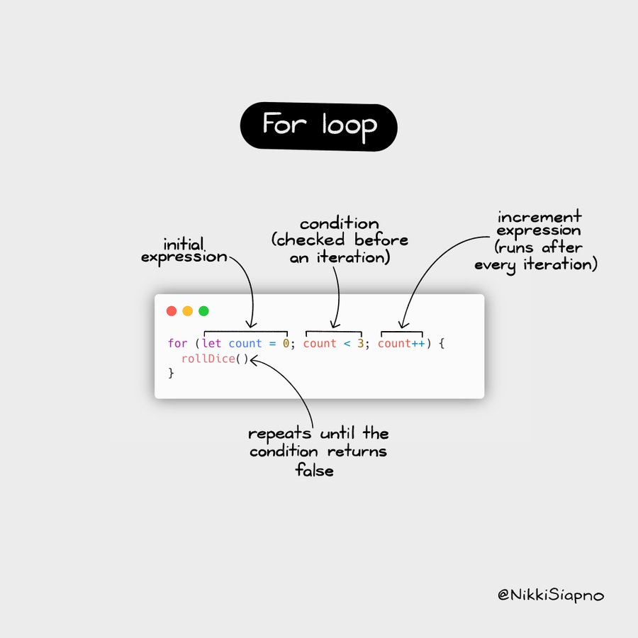

<h1 id="{{ Week 06-JavaScript Core 1 | slugify }}">
  <span class="week-prefix">Week 06 |</span> JavaScript Core 1
</h1>

_(Updated: 7/11/2023)_

---

<!-- Week 06 - Day 1 | Introduction to JavaScript -->
<details markdown="1">
  <summary>
    <h2>
      <span class="summary-day">Week 06 - Day 1</span> | Introduction to JavaScript</h2>
  </summary>

### Schedule

  - [Study](#study-plan)
  - [Exercises](#exercises)
  - [Extra Resources](#extra-resources)

### Study Plan

  **JavaScript! This is where things really start getting interesting.**

  

#### JavaScript Intro


  This is a tough section to teach because the needs of the students vary quite widely here. Some of you are programmers from other languages coming here to learn front-end coding. Some of you are totally new to coding and JavaScript will be your first programming language. Just like if you know Spanish already, learning Italian becomes much easier since you take the same concepts and express them with minor variances. This workshop is optimized for those totally new to coding and thus we assume no prior knowledge. If you do know another programming language, we invite you instead to skim this section to familiarize yourself with how JavaScript looks. The next sections will also be aimed at you.

#### What is code?


  A dumb question but its answer may surprise you. Code is for humans first and computers second. You can think of writing code as essentially writing notes on how to solve a particular problem that just happens to be in a way that a computer can understand.

  Wait, why? The why is that you or someone else will have to go back and re-read that code sometime in the future, maybe tomorrow or maybe in ten years (I've worked on code older than 10 years old, it's not fun.) As such, it's important to write code in such a way that it can understood as quickly as is reasonable. Think of it like a textbook: you don't want to read the entire textbook every time you want to review a concept, you want to jump right to the page and learn just the thing you're looking for. Same with code: you want to jump right to the bit of code in question and understand it at a glance without re-reading the whole codebase.

  You will spend far longer maintaining this code than you will writing it the first time. Be explicit. Be deliberate. The point here is not to be clever but to be simple and to communicate clearly. Code is communication.

  Okay, given this, let's frame how this code works then. When you write code, the computer breaks it down into smaller pieces it can understand and then executes those one bit at a time. With JavaScript, only one thing is ever happening at a time (this is called being _single-threaded_ but that is not a term you need to know.) In general, this means it executes line 1, then line 2, then line 3, etc. Let's that in action:

  ```javascript
  const monthlyRent = 500;

  const yearlyRent = monthlyRent * 12;
  console.log(yearlyRent);
  ```

  The first thing that happens above is that we declare a variable, `monthlyRent`. The `const` keyword is how we let JavaScript know we're declaring a variable. Variable names always have to have no spaces in them, which is why we squish the words "monthly rent" together. In order to make this more readable, we use what's called _camel casing_, so-called because the capital letters in the middle make it look like humps on a camel. You can also use other styles of capitalization, there's no rule it must be camel case in JavaScript; everyone just happens to do camel casing in JavaScript.

  Notice the `;` at the end of every line. This semi-colon lets JavaScript know you've completed your thought. Think of this as the period/full-stop of the programming world.

  A variable can be called _almost_ anything. You **can't** use keywords. An example would be `const const = 15`. `const` is a keyword so it can't be used as a variable name. You do want to give your variables good names, even if they end up being long sometimes. Imagine we have a huge file and 200 lines below we see the variable named `monthlyRent`: we'll know instantly what this variable does and we won't have to go try to read other parts of the code to figure it out. Always, always, always use good variable names. Seriously. Put time into it. Naming things is hard and it's a big part of your job.

  Okay, so after line one, I have a variable named `monthlyRent` that I can use as much as I want. In this case, it represents the number of `500` but it also semantically represents monthlyRent. Imagine if I had 1000 lines between where `monthlyRent` is declared and where `yearlyRent` is calculated. I could have just put `500` directly in `yearlyRent` but I don't because I now understand how that's calculated just by reading the code. Use variables. Use them everywhere. It makes your code way easier to read. Also, later, if my monthly rent changes, I can change it to one place and everywhere I reference `monthlyRent` and `yearlyRent` get updated automatically. Powerful stuff.

  Okay, I want to calculate `yearlyRent`. I use the `*` to represent multiplication. I'm also mixing variables and numbers which is just fine. I also could have said `const yearlyRent = monthlyRent * monthsInAYear;` (assuming I put `const monthsInAYear = 12;` somewhere else) too and that would be a good idea. I would argue the two are roughly the same since it's obvious there are 12 months in a year. But you do what you think is most clear. That's your job.

  `console.log(yearlyRent);` is going to print whatever is stored in `yearlyRent` to the JavaScript console. The JavaScript Console is a part of the dev tools. If you need help finding them, [see here][devtools]. We'll explain how it works in a bit but for now, just know that anything you put between the parentheses gets logged out to your JavaScript console.

  Let's get this little snippet working in our browser. Make a new folder (I'll just put it on my desktop) and add an index.html file with the following in it:

  ```html
  <!DOCTYPE html>
  <html lang="en">
    <head>
      <title>JavaScript Experiments</title>
    </head>
    <body>
      <h1>JavaScript Experiments!</h1>
      <script src="./experiments.js"></script>
    </body>
  </html>
  ```

  That `script` tag is going to let us load JavaScript code into our HTML page. So make another file in the same folder called `experiments.js` (it really can be called anything as long as the script tag matches it.) Then in the JS file put our code from above:

  ```javascript
  const monthlyRent = 500;

  const yearlyRent = monthlyRent * 12;
  console.log(yearlyRent);
  ```

  Now, if you open your **HTML** file, not the JS file, in your browser and open your console, you should see the number `6000` being printed. Congrats! You just wrote your first code!

---


#### Numbers, Strings and Booleans


  So far we've just dealt with numbers. Let's go further and start working with words and characters. In programming, we refer to these things are strings, as in a string of one-letter characters. An example of this would be

  ```javascript
  const myName = "Brian Holt";
  console.log(myName);
  ```

  You can see I use the " (double quote) to enclose everything I want to be in the string. In JavaScript, you can also use ' (single quote) and ` (backtick) as well to demarcate strings.

  Strings, as you may imagine, are everywhere in programming. We're constantly keeping track of names, addresses, names of products, cities, etc. and thus constantly need strings.

  Let's go further. Strings let you connect them together through string concatenation. If I want to be able to greet someone based on their name, I might have something like this:

  ```javascript
  const firstName = "Brian";
  const lastName = "Holt";

  const sentence = "Hello " + firstName + " " + lastName + "! How are you!?";
  const sentenceWithTemplate = `Hello ${firstName} ${lastName}! How are you!?`;

  console.log(sentence);
  console.log(sentenceWithTemplate);
  ```

  The first way is the old way. We can use the `+` to tell JavaScript to connect two strings. Notice how we have inserted the space between `firstName` and `lastName`. The computer only does exactly what you tell it to do. If you don't insert that space, it doesn't get out there.

  The second line is the new way of doing this. JavaScript got a large update in 2015 and it made things a lot easier. Now you can use the backtick (notice the first uses a double quote) to do template strings. If you do that, anything inside of `${yourVariableHere}` gets output in the string. Cool, right?

  Sometimes you just need a simple true or false. These are where booleans are useful. Something like a light switch's state is best represented by a boolean. A light is either on (true) or off (false). You'd have something like `const lightIsOn = true;`. Useful and you'll see them everywhere.

  Some languages separate integers (whole numbers, like 1, 2, 3, 4, 500, 1000) and floats (1.2, 3.14159, 14.01, etc.) differently but not JavaScript. JavaScript just has one type of number, Number. A number is a number.

---


#### Control Flow


  Sometimes I want to modify the flow of how my program works, or in other words, sometimes I only want to run code if some condition is true. This is where `if` statements are very useful. Imagine if we tried this.

  ```javascript
  const skyIsBlue = true;

  if (skyIsBlue) {
    console.log("The sky is blue!");
  } else {
    console.log("The sky is … not blue?");
  }
  ```

  In the above example, the condition inside of the parentheses is evaluated and if it's true, the first block is run and the second is skipped. If it is false, the second block is run and the first block is skipped. Paste that code into your experiments and play with it. You also do not have to have an else block. Okay, let's go further.

  ```javascript
  // if you see three lines, it's just three = in a row, ===. the font just combines them into one big character
  if (2 + 2 === 4) {
    console.log(
      "Oh thank god, the fundamental principles of mathematics still hold true."
    );
  } else {
    console.log("Uh, panic?");
  }
  ```

  You can put any expression (a technical term, means anything you can stick on the right side of an equal sign, we'll explore it more as we go) inside of the if statement. In this case, we are asking, if two plus two is still equal to four. If this is true (I hope so) then again the first block will be run. If not, the second will be.

  Let's talk about `===` for a second. If you use just one `=` in JavaScript, it means **is assigned to**. So when we have `const isBrianCool = true;` you can verbalize that as "The variable isBrianCool is assigned to true". Thus we can't use that inside of the if statement because that's not we mean. We're trying to ask a question, not assign something. We're trying to ask "is two plus two equal to four." Enter the triple equals. Triple equals is the same as asking "is this equal to that." We use the triple equals instead of the double equals because double equals do a lot of funny business that usually we don't want them to do. It does what's called coercion and we'll talk about that below. But in an example `2 == "2"` but it does not `2 === "2"`. String 2 is double equal to number 2 but string 2 is not triple equal to number 2.

  There's also `!==`. This is asking "is this not equal to that". Lastly, you can ask with numbers `>` `>=` `<` `<=` as well to ask if numbers less than or greater than too. For another example:

  ```javascript
  const friendsAtYourParty = 10;

  if (friendsAtYourParty === 0) {
    console.log("Cool, now I have a lot of nachos to myself.");
  } else if (friendsAtYourParty <= 4) {
    console.log("Perfect amount to play some Mario Kart.");
  } else {
    console.log("Wooooo turn on the dance music!");
  }
  ```

  This also demonstrates the `else if` if you have more than just two different conditions.

---


#### Loops: behavior that repeats


  In programming, we often times need to repeat part of our code, again and again. This repeating behavior is called a **Loop** in programming lingo.

  The more geeky term for looping _(which you will also encounter again and again in programming manuals)_ is **iteration**.

  - Watch a Microsoft engineer explain loops in the first part of [this video](https://www.youtube.com/embed/G8hfAk4PfOM?si=8N2UnFsPaim5YmTr&amp;start=0&end=109){:target="_blank"} and then move on.

  ---


  Okay so now what if I want to do one thing multiple times? I could do something like this

  ```javascript
  let friendsAtYourParty = 0;
  friendsAtYourParty = friendsAtYourParty + 1;
  friendsAtYourParty = friendsAtYourParty + 1;
  friendsAtYourParty = friendsAtYourParty + 1;
  friendsAtYourParty = friendsAtYourParty + 1;
  friendsAtYourParty = friendsAtYourParty + 1;
  friendsAtYourParty = friendsAtYourParty + 1;
  friendsAtYourParty = friendsAtYourParty + 1;
  friendsAtYourParty = friendsAtYourParty + 1;
  friendsAtYourParty = friendsAtYourParty + 1;
  friendsAtYourParty = friendsAtYourParty + 1;
  console.log(friendsAtYourParty);
  ```

  That's annoying though. I wish there was a better way. Before we explore that, let's chat about this example a tad more.

  We used `let` instead of `const`. Things that are `const` cannot be reassigned later. In general, I find this to be of minor help but others do not so I leave you to make your own judgment call. In general, one should try to follow the "principle of least power." You should always choose the least powerful "thing" to accomplish whatever you're trying to do. Things with less power tend to be simpler and simple things are less prone to having or causing bugs. Why don't you cut your hair with garden shears? You could, it'd work, but it's way easier to screw it up and has worse consequences. The same general idea is here. The right tool for the right job.

  We instead use `let` here because you can see on the subsequent lines we do reassign `friendsAtYourParty` to be a different number. If you used `const` your code would crash because `const` won't let you do that. Thus here we use `let`. There's another one called `var` that is the old way of doing JavaScript. There are differences but I don't see a reason to use `var` at all anymore. It behaves more similarly to `let`.

  Okay, so, we want to do this better, let's explore a few ways to do that using loops.

  ```javascript
  let friendsAtYourParty = 0;
  while (friendsAtYourParty < 10) {
    friendsAtYourParty = friendsAtYourParty + 1;
  }
  console.log(friendsAtYourParty);
  ```

  This is a while loop. The first part works similarly to an `if` statement: as long as what's inside that statement is **true** it will continue running and re-running the body (what's between the `{ }`) until that statement is false. Once that statement is false, it'll break the loop and continue on. In this case, we add 1 to `friendsAtYourParty` until it's 10, and then the next loop, when it's 10, it'll stop because 10 is not less than 10.

  Also, let's just show you a few shortcuts for adding one to a thing

  ```javascript
  let friendsAtYourParty = 0;
  friendsAtYourParty = friendsAtYourParty + 1;
  friendsAtYourParty += 1;
  friendsAtYourParty++;
  ++friendsAtYourParty;
  console.log(friendsAtYourParty);
  ```

  Those four lines are equivalent. They all do the exact same thing: they add one to the existing total. The second one, the plus-equals line, you can put any number there and it'll add that amount to the total, so `friendsAtYourParty += 15;` would add 15 to the total. It also works with `-=` (subtraction,) as well as `*=` (multiplication,) `/=` (division,) and `**=` (exponent.) Two last two lines (`++` before or after) just signify add one. They more-or-less mean the same thing (there's a subtle difference of _when_ it adds one that should never matter to you) but suffice it to say everyone in the JavaScript community _always_ does the `++` after; I've never seen anyone do it before in JavaScript. `--` Works as well to subtract one as well.

  Okay, so now let's see a second kind of loop to achieve the same effect as above.

  ```javascript
  let friendsAtYourParty = 0;
  for (let i = 0; i <= 10; i++) {
    friendsAtYourParty++;
  }
  console.log(friendsAtYourParty);
  ```

  [](./assets/nikkisiapno.for.loop.jpeg){:target="_blank"}

  This is a for loop which is likely the most common kind of loop. Inside the parentheses are three statements and you need all of them. The `let i = 0;` is you defining your control variable that will control the loop. For some reason, people always use `i`, not sure why. It's just that way. It really could be anything. The second statement `i <= 10` is just like the while loop, is that's the statement that as soon as it's false it breaks the loop. The last statement, `i++` happens at the end of every loop. In our case, we increment the control variable `i` so that it creeps closer to the end of the loop each time.

  An important note: in coding, we start counting from 0. In English, we count `1, 2, 3, 4, 5, etc.` but in coding, we count `0, 1, 2, 3, 4, etc.`. So the fifth element of a string is index 4 (where index is how we'd refer to where that item is in the string). Index 0 is the first element. It's weird but you get used to it and it makes a lot of things easier.

  Sometimes, if you mess up what's inside the control condition for the loop, you'll get a runaway loop that'll never complete. This is called an **infinite loop** and it'll lock up and crash your code. Something like this:

  ```display-javascript
  let friendsAtYourParty = 1;
  while (friendsAtYourParty > 0) {
    friendsAtYourParty = friendsAtYourParty + 1;
  }
  console.log(friendsAtYourParty);
  ```

  Since you're adding one to `friendsAtYourParty` each time, and the loop will continue each time until it's less than zero, that condition will never happen. Thus it'll continue going until it crashes your code. Be careful of these. Nasty bugs.

<!-- Summary -->

### Exercises

  The following exercises are just to get you to flex your newly-gained muscles a bit. This code itself wouldn't be super useful but it'll be useful for you to try to take an idea in words and translate that into workable code.

#### Task 1: Booleans in JavaScript


  In this task, we want you to load the [booleans.js file](./exercises/booleans.js){:target="_blank"} from an HTML named `booleans.html` and complete the challenges found inside. 

#### Task 2: Creating Variables


  In this task, we want you to load the [creating-variables.js file](./exercises/creating-variables.js){:target="_blank"} from an HTML named `creating-variables.html` and complete the challenges found inside. 

#### Task 3: JavaScript Numbers


  In this task, we want you to load the [numbers.js file](./exercises/numbers.js){:target="_blank"} from an HTML named `numbers.html` and complete the challenges found inside. 

#### Task 4: JavaScript Strings


  In this task, we want you to load the [strings.js file](./exercises/strings.js){:target="_blank"} from an HTML named `strings.html` and complete the challenges found inside.

#### Task 5: JavaScript Variables


  In this task, we want you to load the [variables.js](./exercises/variables.js){:target="_blank"} from an HTML named `variables.html` and complete the challenges found inside.

#### Task 6: JavaScript Loops


  In this task, we want you to load the [loops.js](./exercises/loops.js){:target="_blank"} from an HTML named `loops.html` and complete the challenges found inside.

  **IMPORTANT:** Make sure to complete all the tasks found in the **daily Progress Sheet** and update the sheet accordingly. Once you've updated the sheet, don't forget to `commit` and `push`. The progress draft sheet for this day is: **/user/week06/progress/progress.draft.w06.d01.csv**

  You should **NEVER** update the `draft` sheets directly, but rather work on a copy of them according to the instructions [found here](../week01/resources/PROGRESS-WORKFLOW.md).


<!-- Extra Resources -->

### Sources and Attributions

  **Content is based on the following sources:**

  - [Intro](https://github.com/btholt/complete-intro-to-web-dev-v3/blob/main/lessons/04-javascript/A-intro.md){:target="_blank"} [(Permalink)](https://github.com/btholt/complete-intro-to-web-dev-v3/blob/a46a32bb9d641523163d74c28340ec686c5be2f9/lessons/04-javascript/A-intro.md){:target="_blank"}

  - [Numbers, Strings and Booleans](https://github.com/btholt/complete-intro-to-web-dev-v3/blob/main/lessons/04-javascript/B-numbers-strings-and-booleans.md){:target="_blank"} [(Permalink)](https://github.com/btholt/complete-intro-to-web-dev-v3/blob/a46a32bb9d641523163d74c28340ec686c5be2f9/lessons/04-javascript/B-numbers-strings-and-booleans.md){:target="_blank"}

  - [Control Flow](https://github.com/btholt/complete-intro-to-web-dev-v3/blob/main/lessons/04-javascript/C-control-flow.md){:target="_blank"} [(Permalink)](https://github.com/btholt/complete-intro-to-web-dev-v3/blob/a46a32bb9d641523163d74c28340ec686c5be2f9/lessons/04-javascript/C-control-flow.md){:target="_blank"}

  - [Loops](https://github.com/btholt/complete-intro-to-web-dev-v3/blob/main/lessons/04-javascript/D-loops.md){:target="_blank"} [(Permalink)](https://github.com/btholt/complete-intro-to-web-dev-v3/blob/a46a32bb9d641523163d74c28340ec686c5be2f9/lessons/04-javascript/D-loops.md){:target="_blank"}

  - [Experiment exercise](https://github.com/btholt/complete-intro-to-web-dev-v3/blob/main/lessons/04-javascript/E-exercise.md){:target="_blank"} [(Permalink)](https://github.com/btholt/complete-intro-to-web-dev-v3/blob/a46a32bb9d641523163d74c28340ec686c5be2f9/lessons/04-javascript/E-exercise.md){:target="_blank"}

  Please do not forget to ⭐ the [repo](https://github.com/btholt/complete-intro-to-web-dev-v3){:target="_blank"}!

  **Tasks 1 through 4 are based on the following sources:**

  - [TeachMeJavaScriptLikeIm5 booleans](https://github.com/inspirezonetech/TeachMeJavaScriptLikeIm5/blob/main/2-variables/booleans.js){:target="_blank"} [(Permalink)](https://github.com/inspirezonetech/TeachMeJavaScriptLikeIm5/blob/bcbe160a29718c0eb832fbf7af113b896ff06deb/2-variables/booleans.js){:target="_blank"}

  - [TeachMeJavaScriptLikeIm5 creating-variables](https://github.com/inspirezonetech/TeachMeJavaScriptLikeIm5/blob/main/2-variables/creating-variables.js){:target="_blank"} [(Permalink)](https://github.com/inspirezonetech/TeachMeJavaScriptLikeIm5/blob/bcbe160a29718c0eb832fbf7af113b896ff06deb/2-variables/creating-variables.js){:target="_blank"}

  - [TeachMeJavaScriptLikeIm5 numbers](https://github.com/inspirezonetech/TeachMeJavaScriptLikeIm5/blob/main/2-variables/numbers.js){:target="_blank"} [(Permalink)](https://github.com/inspirezonetech/TeachMeJavaScriptLikeIm5/blob/bcbe160a29718c0eb832fbf7af113b896ff06deb/2-variables/numbers.js){:target="_blank"}

  - [TeachMeJavaScriptLikeIm5 strings](https://github.com/inspirezonetech/TeachMeJavaScriptLikeIm5/blob/main/2-variables/strings.js){:target="_blank"} [(Permalink)](https://github.com/inspirezonetech/TeachMeJavaScriptLikeIm5/blob/bcbe160a29718c0eb832fbf7af113b896ff06deb/2-variables/strings.js){:target="_blank"}

  Please do not forget to ⭐ the [repo](https://github.com/inspirezonetech/TeachMeJavaScriptLikeIm5){:target="_blank"}!
  
</details>

<hr class="mt-1">

<!-- Week 06 - Day 2 | Intro to Functions -->
<details markdown="1">
  <summary>
    <h2>
      <span class="summary-day">Week 06 - Day 2</span> | Intro to Functions</h2>
  </summary>

### Schedule

  - [Study](#study-plan-NN)
  - [Exercises](#exercises-NN)
  - [Extra Resources](#extra-resources-NN)

### Study Plan

#### Functions


  A function is a bit of reusable code. Just as we like to re-use CSS classes, we love to re-use code. Let's start with an example:

  ```javascript
  function addTwo(number) {
    return number + 2;
  }

  const finalAnswer = addTwo(5);
  console.log(finalAnswer);
  ```

  This isn't super useful but hopefully, it shows you the mechanics of how a function works. We created a function called `addTwo`. This function takes in one parameter, `number` and it returns that number with 2 added to it. We can now use that `addTwo` function as much as we want! Let's make something a bit more useful.

  ```javascript
  function greet(firstName, lastName, honorific, greeting) {
    return `${greeting} ${honorific} ${lastName}! I’m extremely pleased you could join us, ${firstName}! I hope you enjoy your stay, ${honorific} ${lastName}.`;
  }

  console.log(greet("Brian", "Holt", "Lord", "Salutations"));
  console.log(greet("Jack", "Sparrow", "Captain", "A-hoy"));
  ```

  Now rather than have to repeat ourselves over and over again with that long string, we can just call greet with the appropriate parameters. Here we use four parameters. The order is important that we send in the parameters because this will be the order function receives these parameters. You can have as many or as few parameters as you like.

  The way to **call** a function is you add parens to the end of it, like this: `someFunctionName()`. If you see parentheses after a variable name, you instantly know that that's a function. Inside the parentheses are the parameters. These variables will be passed to the function that is being called in the order that you put them there. These input variables are called **parameters**. Example:

  ```javascript
  const myHomeCity = "Seattle";
  const myHomeState = "Washington";
  const myHomeCountry = "USA";

  function logOutYourHome(city, state, country) {
    console.log(`You are from ${city}, ${state} ${country}.`);
  }

  logOutYourHome(myHomeCity, myHomeState, myHomeCountry);
  ```


  ---


  Keep this next diagram by [Wes Bos](https://wesbos.com/){:target="_blank"} handy, as it depicts all the function parts with their respective terminology. It's always good to know our way around a function's inner parts.

  [](./assets/wes_bos_function_definition.jpg){:target="_blank"}

#### Various Ways of Writing Functions


  There are a few ways to write functions that are mostly the same (there are some differences but for now don't worry about it.)

  ```javascript
  function bark() {
    console.log("woof");
  }

  const meow = function () {
    console.log("meeeeeeeow");
  };

  // the => is just = > put together, the font just combines them to one glyph
  const chirp = () => {
    console.log("chirp chirp");
  };

  bark();
  meow();
  chirp();
  ```

  All of these are functions and work as such. There are very subtle differences in how they work but for now, it's enough to know "those are functions". Most of the time they work exactly the same (as you see here.)

---


#### Scope


  We'll talk about scope multiple times but we'll start off here with it. Every time you call a function, it has its own scope. Other things can't peek into it; it just has its own little workspace for it to work with. Once it's done, any variable that you haven't explicitly held on to or returned at the end is discarded. For example:

  ```javascript
  function addFive(number) {
    const someVariable = "you can't see me outside this function";
    return number + 5;
  }

  addFive(10);
  console.log(someVariable);
  ```

  This is not going to work. `someVariable` is inside of the `addFive` scope and once `addFive` completes, it throws `someVariable` away since it's now out-of-scope.

  ```javascript
  let friendsAtYourParty = 0;
  for (let i = 0; i <= 10; i++) {
    friendsAtYourParty++;
  }
  console.log(i);
  ```

  Even this doesn't work since `i` is only in scope for the loop and then after that, it's thrown away. This can be a difficult one to deal with as someone new to coding because you'll go to log something or use a variable and it's out of scope so it's not there. Just know if that happens, this is probably the problem.

  Scope is hard. And scope is particularly strange in JavaScript (it varies by programming language.) If it feels hard it's because it is. A general, imperfect way for you to think about it right now is that a variable is "alive" (in scope) in between whatever the closest `{` is until that `{` closes its corresponding `}`. A few examples are below, see if you can get it right. Keep in mind that the variable will stay in scope as long as any scope it exists in still exists. If I declare a variable in an outer scope and modify a variable in an inner scope, that variable will survive as long as the outer scope does. **It matters where the variable is declared.**

  ```javascript
  const A = "A";
  let F;

  function doStuff(B) {
    console.log(B);
    const C = "C";
    let H = "H";
    if (1 + 1 === 2) {
      const D = "D";
      H = "something else";
    }
    console.log(D);
    console.log(H);
    F = "F";
  }

  let E = 0;
  while (E < 3) {
    E++;
    console.log(A);
    const G = "G";
  }
  console.log(E);
  console.log(G);

  doStuff("B");
  console.log(B);
  console.log(C);
  console.log(F);
  ```

  This is a pretty convoluted example but see what you think. Once you're ready, the next block will be the answers.

  ```javascript
  const A = "A";
  let F;

  function doStuff(B) {
    console.log(B); // works, B parameter is still in scope
    const C = "C";
    let H = "H";
    if (1 + 1 === 2) {
      const D = "D";
      H = "something else";
    }
    console.log(D); // does not work, D was declared in that if statement block
    console.log(H); // works, H was declared outside the if statement
    F = "F";
  }

  let E = 0;
  while (E < 3) {
    E++;
    console.log(A); // works, the outer block (called the global scope) is still in scope
    const G = "G";
  }
  console.log(E); // works, E was declared outside the while loop
  console.log(G); // does not work, declared inside the while loop and it's over

  doStuff("B");
  console.log(B); // does not work, the B parameter expires after the function call
  console.log(C); // does not work, C was declared inside the function and the function is over
  console.log(F); // works, F was declared in the global scope
  ```


---


#### Built-ins


  Lots of functions already exist for you! Smart people have created these commonly-used functions for things we often need. For example, say you have a string and you want to make everything lowercase, you can do this:

  ```javascript
  const sentence = "ThIs HaS wEiRd CaSiNg On It";
  const lowerCaseSentence = sentence.toLowerCase();
  console.log(lowerCaseSentence);
  ```

  Always be looking for the parentheses. And the best place to look all this stuff up is from our friends at Mozilla (makers of Firefox): [the MDN][mdn]. MDN used to stand for "Mozilla Developer Network" I think but now it's just synonymous with the documentation for the web. I literally look at this website several times a day. As I said before, you are not expected to remember everything. Looking things up on the MDN is **not** cheating.

  There are so many builtins there's no way we could ever cover all of them. Here are just a few examples. The rest you'll learn as you go.

  ```javascript
  // want to round a number? use Math!
  const number = 5.3;
  const roundedNumber = Math.round(number);
  console.log(number);
  ```

  ```javascript
  // want to see if a string contains another string?
  const testStringOne = "The quick brown fox jumps over the lazy dog";
  const testStringTwo =
    "Mirror, mirror on the wall, don't say it cause I know I'm cute";
  const stringToLookFor = "cute";

  console.log(testStringOne.includes(stringToLookFor));
  console.log(testStringTwo.includes(stringToLookFor));
  ```


  ```javascript
  // want to know how many milliseconds have elapsed since Jan 1 1970?
  console.log(Date.now());
  ```

<!-- Summary -->

### Exercises

#### Task 1: JavaScript Functions


  In this task, we want you to load the [functions.js](./exercises/functions.js){:target="_blank"} from an HTML named `functions.html` and complete the challenges found inside.

#### Task 2: JavaScript Arrow Functions


  In this task, we want you to load the [arrow-functions.js](./exercises/arrow-functions.js){:target="_blank"} from an HTML named `arrow-functions.html` and complete the challenges found inside.

#### Task 3: JavaScript Higher Order Functions


  In this task, we want you to load the [higher-order-functions.js](./exercises/higher-order-functions.js){:target="_blank"} from an HTML named `higher-order-functions.html` and complete the challenges found inside.

  **IMPORTANT:** Make sure to complete all the tasks found in the **daily Progress Sheet** and update the sheet accordingly. Once you've updated the sheet, don't forget to `commit` and `push`. The progress draft sheet for this day is: **/user/week06/progress/progress.draft.w06.d02.csv**

  You should **NEVER** update the `draft` sheets directly, but rather work on a copy of them according to the instructions [found here](../week01/resources/PROGRESS-WORKFLOW.md).


<!-- Extra Resources -->

### Sources and Attributions

  **Content is based on the following sources:**

  - [Functions](https://github.com/btholt/complete-intro-to-web-dev-v3/blob/main/lessons/04-javascript/F-functions.md){:target="_blank"} [(Permalink)](https://github.com/btholt/complete-intro-to-web-dev-v3/blob/a46a32bb9d641523163d74c28340ec686c5be2f9/lessons/04-javascript/F-functions.md){:target="_blank"}

  - [Scope](https://github.com/btholt/complete-intro-to-web-dev-v3/blob/main/lessons/04-javascript/G-scope.md){:target="_blank"} [(Permalink)](https://github.com/btholt/complete-intro-to-web-dev-v3/blob/a46a32bb9d641523163d74c28340ec686c5be2f9/lessons/04-javascript/G-scope.md){:target="_blank"}

  - [Built-ins](https://github.com/btholt/complete-intro-to-web-dev-v3/blob/main/lessons/04-javascript/H-builtins.md){:target="_blank"} [(Permalink)](https://github.com/btholt/complete-intro-to-web-dev-v3/blob/a46a32bb9d641523163d74c28340ec686c5be2f9/lessons/04-javascript/H-builtins.md){:target="_blank"}

  Please do not forget to ⭐ the [repo](https://github.com/btholt/complete-intro-to-web-dev-v3){:target="_blank"}!

  **Exercises are based on the following sources:**

  - [TeachMeJavaScriptLikeIm5 arrow-functions](https://github.com/inspirezonetech/TeachMeJavaScriptLikeIm5/blob/main/8-functions/arrow-function.js){:target="_blank"} [(Permalink)](https://github.com/inspirezonetech/TeachMeJavaScriptLikeIm5/blob/bcbe160a29718c0eb832fbf7af113b896ff06deb/8-functions/arrow-function.js){:target="_blank"}

  - [TeachMeJavaScriptLikeIm5 functions](https://github.com/inspirezonetech/TeachMeJavaScriptLikeIm5/blob/main/8-functions/functions.js){:target="_blank"} [(Permalink)](https://github.com/inspirezonetech/TeachMeJavaScriptLikeIm5/blob/bcbe160a29718c0eb832fbf7af113b896ff06deb/8-functions/functions.js){:target="_blank"}

  - [TeachMeJavaScriptLikeIm5 higher-order-functions](https://github.com/inspirezonetech/TeachMeJavaScriptLikeIm5/blob/main/8-functions/higher-order-functions.js){:target="_blank"} [(Permalink)](https://github.com/inspirezonetech/TeachMeJavaScriptLikeIm5/blob/bcbe160a29718c0eb832fbf7af113b896ff06deb/8-functions/higher-order-functions.js){:target="_blank"}

  Please do not forget to ⭐ the [repo](https://github.com/inspirezonetech/TeachMeJavaScriptLikeIm5){:target="_blank"}!
  
</details>

<hr class="mt-1">

<!-- Week 06 - Day 3 | Intro to Objects -->
<details markdown="1">
  <summary>
    <h2>
      <span class="summary-day">Week 06 - Day 3</span> | Intro to Objects</h2>
  </summary>

### Schedule

  - [Study](#study-plan-NN)
  - [Exercises](#exercises-NN)
  - [Extra Resources](#extra-resources-NN)

### Study Plan

#### Intro to Objects


  So far we've talked about having one variable at a time: one first name, one last name, one price, etc. What if we have a collection of data? It'd be nice to group together like data. Good news! You can!

  ```javascript
  const person = {
    name: "Brian Holt",
    city: "Seattle",
    state: "WA",
    favoriteFood: "🌮",
    wantsTacosRightNow: true,
    numberOfTacosWanted: 100,
  };
  console.log(person);
  console.log(person.name);
  console.log(person["name"]); // same as the line above; prefer using the other one
  ```

  This is called an object. They're extremely useful in JavaScript; they're how you'll group together like-information so that they can be used together. They contain a bunch of **keys** and **values**. The keys are on the left side of the `:` and represent how you get that piece data of out of the object. `name` is one such key, and the way I get the name of the

  Used in conjunction with functions they're very powerful. Take this example:

  ```javascript
  const person1 = {
    name: "Angie",
    ageRange: "25-35",
  };
  const person2 = {
    name: "Francesca",
    ageRange: "65-75",
  };

  function suggestMusic(person) {
    if (person.ageRange === "25-35") {
      console.log("We think you will like Daft Punk.");
    } else if (person.ageRange === "65-75") {
      console.log("You are obviously going to like Johnny Cash.");
    } else {
      console.log(
        "Uh, maybe try David Bowie? Everyone likes David Bowie, right?"
      );
    }
  }

  suggestMusic(person1);
  suggestMusic(person2);
  ```

  Now we're able to pass all this information as one package which makes it easy to keep track of since we're just passing one variable. You'll see this become even more useful as we start integrating with servers and APIs.

  Objects can even have their functions! Let's see that.

  ```javascript
  const dog = {
    name: "dog",
    speak() {
      console.log("woof woof");
    },
  };

  dog.speak();
  ```

  Objects can as well have nested objects inside of them.

  ```javascript
  const me = {
    name: {
      first: "Brian",
      last: "Holt",
    },
    location: {
      city: "Seattle",
      state: "WA",
      country: "USA",
    },
  };

  console.log(me.name.first);
  console.log(me.location.state);
  ```


---


#### Context


  Given an object with a person's address, wouldn't it be nice if we could use a function to print out a properly formatted shipping address?

  ```javascript
  const me = {
    name: {
      first: "Brian",
      last: "Holt",
    },
    location: {
      streetNumber: 500,
      street: "Fakestreet",
      city: "Seattle",
      state: "WA",
      zipCode: 55555,
      country: "USA",
    },
    getAddress() {
      return `${this.name.first} ${this.name.last}
  ${this.location.streetNumber} ${this.location.street}
  ${this.location.city}, ${this.location.state} ${this.location.zipCode}
  ${this.location.country}`;
    },
  };

  console.log(me.getAddress());
  ```

  This is our first time seeing the weird `this` keyword. This is a strange, complicated, and difficult concept in JavaScript known as context and trips up all sorts of people, new and old to the language. If you decide to pursue a career as a developer, interviewers will often ask questions about context in JavaScript. It's worth investment to understand how it works eventually (not now, focus just on basic JS for now.)

  In the simplest form, anywhere you are in JavaScript you have a context you are in. You can reference that context by using `this`. If I just reference `this` from the outermost layer, it'll be the global object, which in the browser is something called `window`. `window` already has a bunch of stuff on it. For example:

  ```javascript
  console.log(this === window);
  console.log(this.scrollY);
  console.log(window.scrollY);
  ```

  As you can see from the first line, you can see that in this context, window is the `this` at that time. However, in the example above when we're doing the address, the `this` is the object since when I **call the function**, it's created inside of an object. That object then becomes `this` when `getAddress` is called. As soon as the function completes, the context is destroyed and the context goes back to being what it was before, in this case, `window`.

  A good rule of thumb (that is unfortunately not always true) is that if you're inside an object of some sort, the `this` will be that object. If not, it'll be the global object, `window`. There are crazy exceptions to this and you can even manipulate it yourself. For now, operate with that definition. It's a deep-and-dark rabbit hole to go down so let's continue and you can check the [extras](#extra-resources) for a more in-depth look.

<!-- Summary -->

### Exercises

#### Task 1: JavaScript Objects Basics


  In this task, we want you to load the [using-objects-basic.js](./exercises/using-objects-basic.js){:target="_blank"} from an HTML named `using-objects-basic.html` and complete the challenges found inside.

  **IMPORTANT:** Make sure to complete all the tasks found in the **daily Progress Sheet** and update the sheet accordingly. Once you've updated the sheet, don't forget to `commit` and `push`. The progress draft sheet for this day is: **/user/week06/progress/progress.draft.w06.d03.csv**

  You should **NEVER** update the `draft` sheets directly, but rather work on a copy of them according to the instructions [found here](../week01/resources/PROGRESS-WORKFLOW.md).


### Extra Resources

 [Kyle Simpson's course](https://frontendmasters.com/courses/getting-started-javascript-v2/){:target="_blank"}

### Sources and Attributions

  **Content is based on the following sources:**

  - [Objects](https://github.com/btholt/complete-intro-to-web-dev-v3/blob/main/lessons/04-javascript/I-objects.md){:target="_blank"} [(Permalink)](https://github.com/btholt/complete-intro-to-web-dev-v3/blob/a46a32bb9d641523163d74c28340ec686c5be2f9/lessons/04-javascript/I-objects.md){:target="_blank"}

  - [Context](https://github.com/btholt/complete-intro-to-web-dev-v3/blob/main/lessons/04-javascript/J-context.md){:target="_blank"} [(Permalink)](https://github.com/btholt/complete-intro-to-web-dev-v3/blob/a46a32bb9d641523163d74c28340ec686c5be2f9/lessons/04-javascript/J-context.md){:target="_blank"}

  Please do not forget to ⭐ the [repo](https://github.com/btholt/complete-intro-to-web-dev-v3){:target="_blank"}!

  **Exercise is based on the following sources:**

  - [TeachMeJavaScriptLikeIm5 using-objects-basic](https://github.com/inspirezonetech/TeachMeJavaScriptLikeIm5/blob/main/4-objects/using-objects-basic.js){:target="_blank"} [(Permalink)](https://github.com/inspirezonetech/TeachMeJavaScriptLikeIm5/blob/bcbe160a29718c0eb832fbf7af113b896ff06deb/4-objects/using-objects-basic.js){:target="_blank"}

  Please do not forget to ⭐ the [repo](https://github.com/inspirezonetech/TeachMeJavaScriptLikeIm5){:target="_blank"}!

  
</details>

<hr class="mt-1">

<!-- Week 06 - Day 4 | Intro to Arrays -->
<details markdown="1">
  <summary>
    <h2>
      <span class="summary-day">Week 06 - Day 4</span> | Intro to Arrays</h2>
  </summary>

### Schedule

  - [Study](#study-plan-NN)
  - [Exercises](#exercises-NN)
  - [Extra Resources](#extra-resources-NN)

### Study Plan

#### Intro to Arrays


  

  [Watch **CS Discoveries: Introduction to Arrays**](https://www.youtube.com/watch?v=seBDTeZmb-k){:target="_blank"}

  Objects are unordered collections of data using keys and values. Arrays, in contrast, are **ordered collections of data**. If you put something in an array, it has an order. For example, you might a list of the days of the week.

  ```javascript
  const daysOfTheWeek = [
    "Monday",
    "Tuesday",
    "Wednesday",
    "Thursday",
    "Friday",
    "Saturday",
    "Sunday",
  ];
  console.log(daysOfTheWeek);
  console.log(daysOfTheWeek[0]);
  console.log(daysOfTheWeek[1]);
  console.log(daysOfTheWeek[6]);
  ```

  You first can see how we declare an array, using `[ ]`. Inside of an array, you can store anything you can store in a variable. You can have an array of numbers, an array of strings, an array of objects, an array of arrays, an array of arrays of arrays, etc.

  You can also see above how we access individual elements in an array: we use square brackets again and then we reference the number that we want to access. Again, remember, that the numbering starts at 0. So the first element is index 0.

  Arrays also have many methods (another word for functions that live on an object) and properties (another word for key/value pairs) that live on them. Let's see some of those:

  ```javascript
  const primeNumbers = [1, 2, 3, 5, 7, 11, 13, 17];
  console.log(primeNumbers.length);
  console.log(primeNumbers.join(" | "));
  ```

  `primeNumbers.length` gives you back a number that is how long the array is. In this case there are eight elements in the array so it gives us back `8`. `primeNumbers.join(" | "))` takes your whole array and makes it into one string. The `" | "` parameter I'm passing is what I want to be put between each element, so you end up with the string `"1 | 2 | 3 | 5 | 7 | 11 | 13 | 17"`.

  So what if I want to add an element to the array after I've created it? Use `push`!

  ```javascript
  const courses = [
    { teacher: "Will Sentance", course: "JavaScript: The Hard Parts" },
    { teacher: "Sarah Drasner", course: "Intro to Vue" },
    { teacher: "Brian Holt", course: "Complete Intro to React" },
    { teacher: "Steve Kinney", course: "Build Your Own Programming Language" },
    { teacher: "Scott Moss", course: "Intro to Node.js" },
  ];

  courses.push({ teacher: "Jen Kramer", course: "Getting Started with CSS" });

  console.log(courses);

  courses[2] = { teacher: "Brian Holt", course: "Complete Intro to Databases" };

  console.log(courses);
  ```

  The first thing we do is add an element to the end using the push function that arrays have. It "pushes" the element on the end.

  Below that, we're overriding index 2 with a new course. This will throw away what was there before and set it to be what we've set it to be.

  Okay, now, given that, what if we wanted to `console.log` everything in the array? Do you already have all the tools to do that? Let's see to do it.

  ```javascript
  const cities = [
    "Seattle",
    "San Francisco",
    "Salt Lake City",
    "Amsterdam",
    "Hong Kong",
  ];

  // method 1
  for (let i = 0; i < cities.length; i++) {
    console.log(cities[i]);
  }

  // method 2
  cities.forEach(function (city) {
    console.log(city);
  });
  ```

  The first way, using a for loop, is using that `i` control variable which gets incremented each loop. We use that `i` to access each item in the array on each iteration of the loop. We have the loop to stop when `i` gets equal to the `length` of cities. Very useful pattern. You'll see it a lot.

  The second way is using a function that arrays have called `forEach`. This `forEach` method takes in a function and that function will be called once on each item of the array. It will pass that item into the function, which is what `city` is in this situation. Both are useful patterns to know. You'll use both frequently. While you're getting started, just use the one you feel comfortable with. They have different things that make them preferable in different situations but usually you can use either. Method 2 may be a bit more advanced but I don't think you should be scared of it. For now prefer method 1. I just wanted you to see method 2.

<!-- Summary -->

### Exercises

#### Task 1: Declaring JavaScript Arrays


  In this task, we want you to load the [declaring-arrays.js](./exercises/declaring-arrays.js){:target="_blank"} from an HTML named `declaring-arrays.html` and complete the challenges found inside.

#### Task 2: Indexing JavaScript Arrays


  In this task, we want you to load the [indexing-arrays.js](./exercises/indexing-arrays.js){:target="_blank"} from an HTML named `indexing-arrays.html` and complete the challenges found inside.

#### Task 3: Modifying JavaScript Arrays


  In this task, we want you to load the [modifying-arrays.js](./exercises/modifying-arrays.js){:target="_blank"} from an HTML named `modifying-arrays.html` and complete the challenges found inside.

#### Task 4: Properties and Methods of JavaScript Arrays


  In this task, we want you to load the [properties-and-methods-of-arrays.js](./exercises/properties-and-methods-of-arrays.js){:target="_blank"} from an HTML named `properties-and-methods-of-arrays.html` and complete the challenges found inside.

  **IMPORTANT:** Make sure to complete all the tasks found in the **daily Progress Sheet** and update the sheet accordingly. Once you've updated the sheet, don't forget to `commit` and `push`. The progress draft sheet for this day is: **/user/week06/progress/progress.draft.w06.d04.csv**

  You should **NEVER** update the `draft` sheets directly, but rather work on a copy of them according to the instructions [found here](../week01/resources/PROGRESS-WORKFLOW.md).


<!-- Extra Resources -->

### Sources and Attributions

  **Content is based on the following sources:**

  - [Arrays](https://github.com/btholt/complete-intro-to-web-dev-v3/blob/main/lessons/04-javascript/K-arrays.md){:target="_blank"} [(Permalink)](https://github.com/btholt/complete-intro-to-web-dev-v3/blob/a46a32bb9d641523163d74c28340ec686c5be2f9/lessons/04-javascript/K-arrays.md){:target="_blank"}

  Please do not forget to ⭐ the [repo](https://github.com/btholt/complete-intro-to-web-dev-v3){:target="_blank"}!

  **Exercises are based on the following sources:**

  - [TeachMeJavaScriptLikeIm5 declaring-arrays](https://github.com/inspirezonetech/TeachMeJavaScriptLikeIm5/blob/main/3-arrays/declaring-arrays.js){:target="_blank"} [(Permalink)](https://github.com/inspirezonetech/TeachMeJavaScriptLikeIm5/blob/bcbe160a29718c0eb832fbf7af113b896ff06deb/3-arrays/declaring-arrays.js){:target="_blank"}

  - [TeachMeJavaScriptLikeIm5 indexing-arrays](https://github.com/inspirezonetech/TeachMeJavaScriptLikeIm5/blob/main/3-arrays/indexing-arrays.js){:target="_blank"} [(Permalink)](https://github.com/inspirezonetech/TeachMeJavaScriptLikeIm5/blob/bcbe160a29718c0eb832fbf7af113b896ff06deb/3-arrays/indexing-arrays.js){:target="_blank"}

  - [TeachMeJavaScriptLikeIm5 modifying-arrays](https://github.com/inspirezonetech/TeachMeJavaScriptLikeIm5/blob/main/3-arrays/modifying-arrays.js){:target="_blank"} [(Permalink)](https://github.com/inspirezonetech/TeachMeJavaScriptLikeIm5/blob/bcbe160a29718c0eb832fbf7af113b896ff06deb/3-arrays/modifying-arrays.js){:target="_blank"}

  - [TeachMeJavaScriptLikeIm5 properties_and_methods_of_arrays](https://github.com/inspirezonetech/TeachMeJavaScriptLikeIm5/blob/main/3-arrays/properties_and_methods_of_arrays.js){:target="_blank"} [(Permalink)](https://github.com/inspirezonetech/TeachMeJavaScriptLikeIm5/blob/bcbe160a29718c0eb832fbf7af113b896ff06deb/3-arrays/properties_and_methods_of_arrays.js){:target="_blank"}

  Please do not forget to ⭐ the [repo](https://github.com/inspirezonetech/TeachMeJavaScriptLikeIm5){:target="_blank"}!
  
</details>

<hr class="mt-1">


<hr class="mt-1">

**Weekly feedback:** Hey, it's really important for us to know how your experience with the course has been so far, so don't forget to fill in and submit your [**mandatory** feedback form](https://forms.gle/S6Zg3bbS2uuwsSZF9){:target="_blank"} before the day ends. Thanks you!

## Week 06 - Weekend Suggestions

If you are in the mood of enjoying related content during the weekend, check out our weekly recommendations [here](WEEKEND.md).