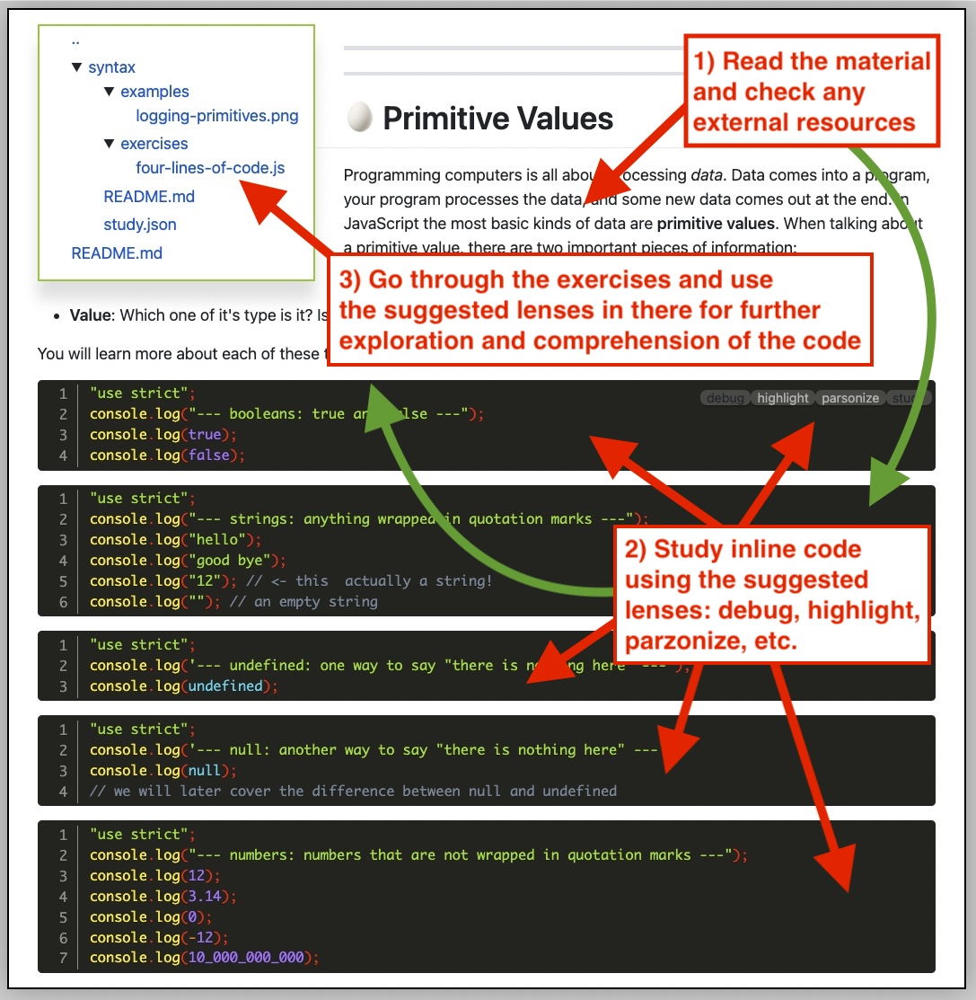
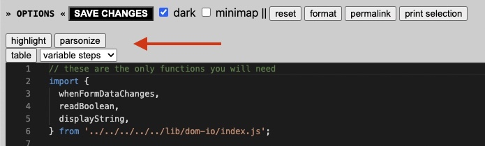

<h1 id="{{ Week 07-JavaScript Core 1 | slugify }}">
  Week 07 | JavaScript Core 1
</h1>

  

  <h2 class="week-controls__previous_week">

    <!-- ADD CHECK FOR WEEK open:true (remove if false) -->
    

      

      <a href="/WDX-180/curriculum/week{{ previous_week_num }}">Week {{ previous_week_num }} &#8678;</a>
    

  </h2>

  Updated: 21/11/2023

  <h2 class="week-controls__next_week">

    <!-- ADD CHECK FOR WEEK open:true (remove if false) -->
    

      

      <a href="/WDX-180/curriculum/week{{ next_week_num }}">&#8680; Week {{ next_week_num }}</a>
    

  </h2>

---

<!-- Week 07 - Day 1 | Just Enough JavaScript - Part 1 -->

  

    <h2>
      Week 07 - Day 1 | Just Enough JavaScript - Part 1</h2>
  

### Schedule

  - [Study](#study-plan-NN)
  - [Exercises](#exercises-NN)
  - [Extra Resources](#extra-resources-NN)

### Study Plan

  This Module is about learning "Just enough JavaScript" in order to understand, trace and debug the execution process of JavaScript programs and learn how to read and comprehend every single line of code that you see. That's probably the most important task, anyone learning a new language (even natural languages), must go through in order to become familiar with this new fascinating territory. 

  In order to follow the material, you will need to install and use the `study-lenses` tool. Here are the instructions:

  
  **Setting up Study Lenses (v2) on your System**
  
  1. Clone the `study-lenses` repository from this link: [ https://github.com/in-tech-gration/study-lenses/](https://github.com/in-tech-gration/study-lenses/){:target="_blank"}.
      - `git clone git@github.com:in-tech-gration/study-lenses.git`
  
  2. Change to the `study-lenses` directory and install all dependencies:
  
      - Run: `cd study-lenses`
      - Then: `npm install` (or `npm i` for short)
  
  3. Checkout to the `lenses2` branch and run the `npm link` command to make this available globally:
  
      - `git checkout lenses2`
      - `npm link` 
      - (or if you're on a Mac/Linux, you'll perhaps need `sudo npm link`)
  
  4. Check that `study-lenses` have been successfully installed on your system by running the following command:
  
      - `lenses2 --version` or `lenses2 -v`

  **Launching Study Lenses and following the material**

  Once `lenses2` is properly installed on your system, you can go to your `WDX-180` folder and run `lenses2` with the material for this Module:

  - `cd WDX-180/`
  - `lenses2 curriculum/modules/javascript/denepo/_just-enough-javascript/`

  Here's a basic methodology for going through the material:

  - 1) Read the related material and explore any external resources
  - 2) Study the inline code using the recommended lenses
  - 3) Go through the exercises and try to explore and comprehend the code using the suggested (enabled) lenses
  - 4) Feel free to experiment with more lenses!

  

  Once you are inside an exercise of example code, once again use the recommended lenses displayed above the code to explore and understand the code:

  

  Now it's time to go through the material. For this Module you will only need to go through the following sections:

  - **00-errors**
  - **01-comments-and-logs**
  - **02-primitive-values**
  - **03-operators**
  - **04-booleans**
  - **05-strings**
  - **06-undefined**

<!-- Summary -->

<!-- Exercises -->

### Extra Resources

  _(Nothing here yet. Feel free to contribute if you've found some useful resources.)_

<!-- Sources and Attributions -->
  

<!-- Week 07 - Day 2 | Just Enough JavaScript - Part 2 -->

  

    <h2>
      Week 07 - Day 2 | Just Enough JavaScript - Part 2</h2>
  

### Schedule

  - [Study](#study-plan-NN)
  - [Exercises](#exercises-NN)
  - [Extra Resources](#extra-resources-NN)

### Study Plan

  In this Module, we are continuing our journey into "Just enough JavaScript".

  Make sure to follow the guides on **Setting up Study Lenses (v2) on your System** and **Launching Study Lenses and following the material** from Day 01 and then go through the following sections:

  - **07-variables**
  - **08-null**

<!-- Summary -->

<!-- Exercises -->

### Extra Resources

  _(Nothing here yet. Feel free to contribute if you've found some useful resources.)_

<!-- Sources and Attributions -->
  

<!-- Week 07 - Day 3 | Just Enough JavaScript - Part 3 -->

  

    <h2>
      Week 07 - Day 3 | Just Enough JavaScript - Part 3</h2>
  

### Schedule

  - [Study](#study-plan-NN)
  - [Exercises](#exercises-NN)
  - [Extra Resources](#extra-resources-NN)

### Study Plan

  In this Module, we are continuing our journey into "Just enough JavaScript".

  Make sure to follow the guides on **Setting up Study Lenses (v2) on your System** and **Launching Study Lenses and following the material** from Day 01 and then go through the following sections:

  - **09-interactions**
  - **10-numbers**
  - **11-block-scope**
  - **12-conditionals**

<!-- Summary -->

<!-- Exercises -->

### Extra Resources

  _(Nothing here yet. Feel free to contribute if you've found some useful resources.)_

<!-- Sources and Attributions -->
  

<!-- Week 07 - Day 4 | Just Enough JavaScript - Part 4 -->

  

    <h2>
      Week 07 - Day 4 | Just Enough JavaScript - Part 4</h2>
  

### Schedule

  - [Study](#study-plan-NN)
  - [Exercises](#exercises-NN)
  - [Extra Resources](#extra-resources-NN)

### Study Plan

  In this Module, we are continuing our journey into "Just enough JavaScript".

  Make sure to follow the guides on **Setting up Study Lenses (v2) on your System** and **Launching Study Lenses and following the material** from Day 01 and then go through the following sections:

  - **13-while-loops**
  - **14-review-quiz**

<!-- Summary -->

<!-- Exercises -->

### Extra Resources

  _(Nothing here yet. Feel free to contribute if you've found some useful resources.)_

<!-- Sources and Attributions -->
  

<!-- Week 07 - Day 5 | Just Enough JavaScript - Part 5 -->

  

    <h2>
      Week 07 - Day 5 | Just Enough JavaScript - Part 5</h2>
  

### Schedule

  - [Study](#study-plan-NN)
  - [Exercises](#exercises-NN)
  - [Extra Resources](#extra-resources-NN)

### Study Plan

  In this Module, we are continuing our journey into "Just enough JavaScript".

  Make sure to follow the guides on **Setting up Study Lenses (v2) on your System** and **Launching Study Lenses and following the material** from Day 01 and then go through the following sections:

  - **15-for-of-loops**
  - **16-break**
  - **17-continue**

<!-- Summary -->

<!-- Exercises -->

### Extra Resources

  _(Nothing here yet. Feel free to contribute if you've found some useful resources.)_

<!-- Sources and Attributions -->
  

**Weekly feedback:** Hey, it's really important for us to know how your experience with the course has been so far, so don't forget to fill in and submit your [**mandatory** feedback form](https://forms.gle/S6Zg3bbS2uuwsSZF9){:target="_blank"} before the day ends. Thanks you!