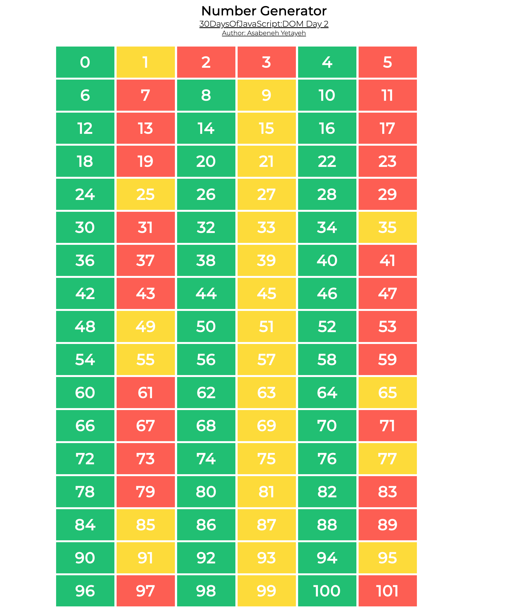
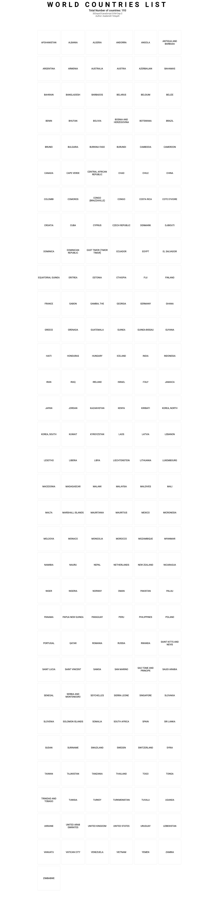

<h1 id="{{ Week 10-Web APIs 1: DOM | slugify }}">
  Week 10 | Web APIs 1: DOM
</h1>

  

  <h2 class="week-controls__previous_week">

    

      

      <a href="../week{{ previous_week_num }}">Week {{ previous_week_num }} &#8678;</a>
    

  </h2>

  Updated: 8/12/2025

  <h2 class="week-controls__next_week">

    

      

      <a href="../week{{ next_week_num }}">&#8680; Week {{ next_week_num }}</a>
    

  </h2>

<!-- VERSION -->

  You are viewing v2.0 of this content. To go back to v1.0 click <a href="v1.0">this link</a>.

<!-- VERSION -->

---

<!-- Week 10 - Day 1 | Introduction to the DOM API -->

  

    <h2>
      Week 10 - Day 1 | Introduction to the DOM API</h2>
  

### Schedule

  - [Study](#study-plan)
  - [Exercises](#exercises)
  - [Extra Resources](#extra-resources)

### Study Plan

  > "The making of good software takes time.
  > If you try to make it take less time, it will take more time."

  Starting today, **there's a new requirement for you**. 

  

  Under the `user/` folder, you'll find a new `bug_journal/` folder that contains a sample file called `BUG_JOURNAL.draft.md`.  Copy this file, rename it to `BUG_JOURNAL.md` and **start tracking your bugs** from now on. You'll find a small example inside the draft (you can remove it from your copy) to give you an idea on what to look for and how to document each bug. There's a long and short version of bug reporting. Use the one that fits your style and mode of operation.

  > "The worst thing you can do is to ignore your mistakes. Don't get into the bad habit of error amnesia. You should be learning from your mistakes and the only way to learn from your mistakes is to pay attention to them." ~ Douglas Crockford

  > Those who cannot remember the past are condemned to repeat it.
  > Jorge Santayana

  The import steps are:

  - Make sure to pay attention to the bugs and errors in your code
  - When they happen, stop for a moment and document them
  - Write a brief description of the bug/error
  - Include a small code replicating the bug 
  - Try to categorize the bug (in any way you want)
  - Think about what caused the bug
  - Think about ways to detect, protect the code from or avoid the bug altogether in the future

  Why should you do this?

  - Stop making the same mistakes again and again!
  - Develop safer, more stable and bug-free software by learning how you've failed in the past
  - Nothing is a more valuable lesson that our failures

  ---

  

  - [Watch: **HTML vs DOM? Let’s debug them**](https://www.youtube.com/watch?v=J-02VNxE7lE){:target="_blank"} to understand the basic difference between these two very crucial concepts in Web Development and start building an intuition around the Document Object Model (DOM).
    - **Duration:** 5min
    - **Level:** Beginner

  - **Practice time!** Now that you know the difference between HTML and the DOM, and got a first test of working with the DOM using the `DevTools`, it's time to practice those skills and become comfortable with DOM manipulation.
    - Go through this [**document**](https://developer.chrome.com/docs/devtools/dom/){:target="_blank"} and stop at each section to practice the command or tool described in your browser.

  <!-- TODO: Integrate into the curriculum (as a Module?): https://github.com/GoogleChrome/developer.chrome.com/blob/main/site/en/docs/devtools/dom/index.md -->

  <!-- TODO: Convert interactive tutorial steps into progress steps -->

  <!-- TODO: Review + Add Practice -->

  - Watch lessons 1-7* from [**JavaScript DOM Manipulation Mastery: A Comprehensive Guide**](https://www.youtube.com/watch?v=BGkc6dKUZ84){:target="_blank"} and try to replicate as much as you can in your local environment.
    - **Duration:** 65min
    - **Level:** Intermediate

  _*up to `LESSON 8: DOM EVENT BASICS` section, around 01:04:46_

<!-- Summary -->

<!-- Exercises -->

<!-- Extra Resources -->

### Sources and Attributions

---

_Photo by [Iewek Gnos](https://unsplash.com/@imkirk?utm_content=creditCopyText&utm_medium=referral&utm_source=unsplash){:target="_blank"} on [Unsplash](https://unsplash.com/photos/macbook-pro-on-white-wooden-desk-hhUx08PuYpc?utm_content=creditCopyText&utm_medium=referral&utm_source=unsplash){:target="_blank"}_
  

<!-- Week 10 - Day 2 | DOM Manipulation - Part 01 -->

  

    <h2>
      Week 10 - Day 2 | DOM Manipulation - Part 01</h2>
  

### Schedule

  - [Study](#study-plan-NN)
  - [Exercises](#exercises-NN)
  - [Extra Resources](#extra-resources-NN)

### Study Plan

  **Computer Science mini-lesson: What is "Arity"?**
  
  In computer science, `arity` is the number of arguments taken by a function:
  
  - A `nullary` function takes no arguments: `alert()`
  - A `unary` function takes one argument: `alert(1)`
  - A `binary` function takes two arguments: `alert(1,2)`
  - A `ternary` function takes three arguments: `alert(1,2,3)`
  - An `n-ary` function takes `n` arguments
  
  Source: [Wikipedia](https://en.wikipedia.org/wiki/Arity)

  ---

  [Read: **Document Object Model (DOM) Manipulation - Part 01**](../modules/javascript/web_apis/dom/manipulation/part-01/content/index.md){:target="_blank"}

### Summary

  With the examples above, you have a pretty good understanding of some basic methods that can help us manipulate HTML elements found in a webpage.

### Exercises

  **Simple Manipulation - Part 01**

  Copy the folder `curriculum/week10/exercises/simple_manipulation/` inside folder `user/week10/exercises/day02/` and complete all the challenges found inside the JavaScript file.

  **IMPORTANT:** Make sure to complete all the tasks found in the **daily Progress Sheet** and update the sheet accordingly. Once you've updated the sheet, don't forget to `commit` and `push`. The progress draft sheet for this day is: **/user/week10/progress/progress.draft.w10.d02.csv**

  You should **NEVER** update the `draft` sheets directly, but rather work on a copy of them according to the instructions [found here](../week01/resources/PROGRESS-WORKFLOW.md).

### Extra Resources

  _(Nothing here yet. Feel free to contribute if you've found some useful resources.)_

### Sources and Attributions

  **Content is based on the following sources:**

  - [30 Days Of JavaScript: Document Object Model(DOM)](https://github.com/in-tech-gration/30-Days-Of-JavaScript/blob/master/21_Day_DOM/21_day_dom.md){:target="_blank"} [(Permalink)](https://github.com/in-tech-gration/30-Days-Of-JavaScript/blob/55d8e3dbc0410d64c1dc3ea5915e015a7950cf2a/21_Day_DOM/21_day_dom.md){:target="_blank"}

  Don't forget to star this awesome [repo](https://github.com/Asabeneh/30-Days-Of-JavaScript){:target="_blank"}!
  

<!-- Week 10 - Day 3 | DOM Manipulation - Part 02 -->

  

    <h2>
      Week 10 - Day 3 | DOM Manipulation - Part 02</h2>
  

### Schedule

  - [Study](#study-plan-NN)
  - [Exercises](#exercises-NN)
  - [Extra Resources](#extra-resources-NN)

### Study Plan

  [Read **Document Object Model (DOM) Manipulation - Part 02**](../modules/javascript/web_apis/dom/manipulation/part-02/content/index.md){:target="_blank"}

### Summary

  🌕 Now,  you are fully charged with a super power, you have completed the most important and challenging part of the challenge and in general JavaScript. You learned DOM and now you have the capability to build and develop applications. Now do some exercises for your brain and for your muscle.

### Exercises

  **Simple Manipulation - Part 02**

  In this exercise, we want you to copy the folder (`simple_manipulation/`) with the files you've submitted for the exercise from Part 01, and complete the task found below:

  > _(if you have not done the previous exercise, now is a good time to do so!)_

  1. Loop through the nodeList and get the text content of each paragraph
  2. Set a text content to paragraph the fourth paragraph,**_Fourth Paragraph_**
  3. Change stye of each paragraph using JavaScript(eg. color, background, border, font-size, font-family)
  4. Select all paragraphs and loop through each element and give the first and third paragraph a color of green, and the second and the fourth paragraph a red color
  5. Set text content, id and class to each paragraph

  **DOM Mini Project**

  Copy the folder `curriculum/week10/exercises/dom_mini_project/` inside folder `user/week10/exercises/day03/` and complete all the challenges found below. Apply all the styles and functionality using JavaScript only.

  1. The year color is changing every 1 second
  2. The date and time background color is changing every on seconds
  3. 'Done' challenges has background green
  4. 'Ongoing' challenges has background yellow
  5. 'Coming' challenges have background red

  The result should be as 

  

  **IMPORTANT:** Make sure to complete all the tasks found in the **daily Progress Sheet** and update the sheet accordingly. Once you've updated the sheet, don't forget to `commit` and `push`. The progress draft sheet for this day is: **/user/week10/progress/progress.draft.w10.d03.csv**

  You should **NEVER** update the `draft` sheets directly, but rather work on a copy of them according to the instructions [found here](../week01/resources/PROGRESS-WORKFLOW.md).

### Extra Resources

  _(Nothing here yet. Feel free to contribute if you've found some useful resources.)_

### Sources and Attributions

  **Content is based on the following sources:**

  - [30 Days Of JavaScript: Document Object Model(DOM)](https://github.com/in-tech-gration/30-Days-Of-JavaScript/blob/master/21_Day_DOM/21_day_dom.md){:target="_blank"} [(Permalink)](https://github.com/in-tech-gration/30-Days-Of-JavaScript/blob/55d8e3dbc0410d64c1dc3ea5915e015a7950cf2a/21_Day_DOM/21_day_dom.md){:target="_blank"}

  Don't forget to star this awesome [repo](https://github.com/Asabeneh/30-Days-Of-JavaScript){:target="_blank"}!
  

<!-- Week 10 - Day 4 | DOM Manipulation - Part 03 -->

  

    <h2>
      Week 10 - Day 4 | DOM Manipulation - Part 03</h2>
  

### Schedule

  - [Study](#study-plan-NN)
  - [Exercises](#exercises-NN)
  - [Extra Resources](#extra-resources-NN)

### Study Plan

  [Read: **Document Object Model (DOM) Manipulation - Part 03**](../modules/javascript/web_apis/dom/manipulation/part-03/content/index.md){:target="_blank"}

### Summary

  Now, you know how to destroy a created DOM element when it is needed. You learned DOM and now you have the capability to build and develop applications. Now do some exercises for your brain and for your muscle.

### Exercises

  **Number Generator**

  Copy the folder `curriculum/week10/exercises/number_generator/` inside folder `user/week10/exercises/day04/` and compete all the challenges found below:

  - Inside the div container with class name `wrapper` on the HTML document, create **dynamically** 102 `div` container, each one containing a number from 0 to 101.
  - Append style to each number as described below:
    - Even numbers background is green
    - Odd numbers background is yellow
    - Prime numbers background is red

  The expected output should be as shown in the image below. 

  

  **Countries List**

  Copy the folder `curriculum/week10/exercises/countries_list/` inside folder `user/week10/exercises/day04/` and use the countries array provided to display **dynamically** all countries as shown in the image below:

  

  **Asabeneh's Challenge**

  Copy the folder `curriculum/week10/exercises/asabeneh_challenge/` inside folder `user/week10/exercises/day04/` and use the asabenehChallenges2020 array provided to display **dynamically** its content as show in the image below: 

  

  > Note: The drop down button has been created using [*details*](https://www.w3schools.com/tags/tag_details.asp){:target="_blank"} HTML element.

  **IMPORTANT:** Make sure to complete all the tasks found in the **daily Progress Sheet** and update the sheet accordingly. Once you've updated the sheet, don't forget to `commit` and `push`. The progress draft sheet for this day is: **/user/week10/progress/progress.draft.w10.d04.csv**

  You should **NEVER** update the `draft` sheets directly, but rather work on a copy of them according to the instructions [found here](../week01/resources/PROGRESS-WORKFLOW.md).

### Extra Resources

  _(Nothing here yet. Feel free to contribute if you've found some useful resources.)_

### Sources and Attributions

  **Content is based on the following sources:**

  - [30 Days Of JavaScript: Document Object Model(DOM)](https://github.com/in-tech-gration/30-Days-Of-JavaScript/blob/master/22_Day_Manipulating_DOM_object/22_day_manipulating_DOM_object.md){:target="_blank"} [(Permalink)](https://github.com/in-tech-gration/30-Days-Of-JavaScript/blob/55d8e3dbc0410d64c1dc3ea5915e015a7950cf2a/22_Day_Manipulating_DOM_object/22_day_manipulating_DOM_object.md){:target="_blank"}

  Don't forget to star this awesome [repo](https://github.com/Asabeneh/30-Days-Of-JavaScript){:target="_blank"}!
  

<!-- Week 10 - Day 5 | Introduction to Events -->

  

    <h2>
      Week 10 - Day 5 | Introduction to Events</h2>
  

### Schedule

  - [Study](#study-plan)
  - [Exercises](#exercises)
  - [Extra Resources](#extra-resources)

### Study Plan

  <!-- TODO: Review + Add Practice -->

  - Watch lessons 8-9* from [**JavaScript DOM Manipulation Mastery: A Comprehensive Guide**](https://youtu.be/BGkc6dKUZ84?t=3887){:target="_blank"} and try to replicate as much as you can in your local environment.
    - **Duration:** 20min
    - **Level:** Intermediate

  _*Starting from `LESSON 8: DOM EVENT BASICS` around 01:04:46 up to the end of the video_

  After watching the video and practice all the concepts in your local 
  environment, take notes and a long break to let all this knowledge 
  consolidate.

  Then, prepare a hot cup of tea or coffee and prepare to dive once more
  into the DOM API by watching the following video, while taking notes
  and stopping at times to practice what you see in your local environment
  and code files:

  <!-- TODO: Review + Add Practice -->

  - Watch [**DOM API - JavaScript Tutorial for beginners**](https://youtu.be/wbQLEXg_urE){:target="_blank"} and try to replicate as much as you can in your local environment.
    - **Duration:** 42min
    - **Level:** Beginner

  ---

<!-- Summary -->

<!-- Exercises -->

<!-- Extra Resources -->

<!-- Sources and Attributions -->
  

**Weekly feedback:** Hey, it's really important for us to know how your experience with the course has been so far, so don't forget to fill in and submit your [**mandatory** feedback form](https://forms.gle/S6Zg3bbS2uuwsSZF9){:target="_blank"} before the day ends. Thanks you!

## Week 10 - Weekend Suggestions

If you are in the mood of enjoying related content during the weekend, check out our weekly recommendations [here](WEEKEND.md).

---

<!-- COMMENTS: -->
