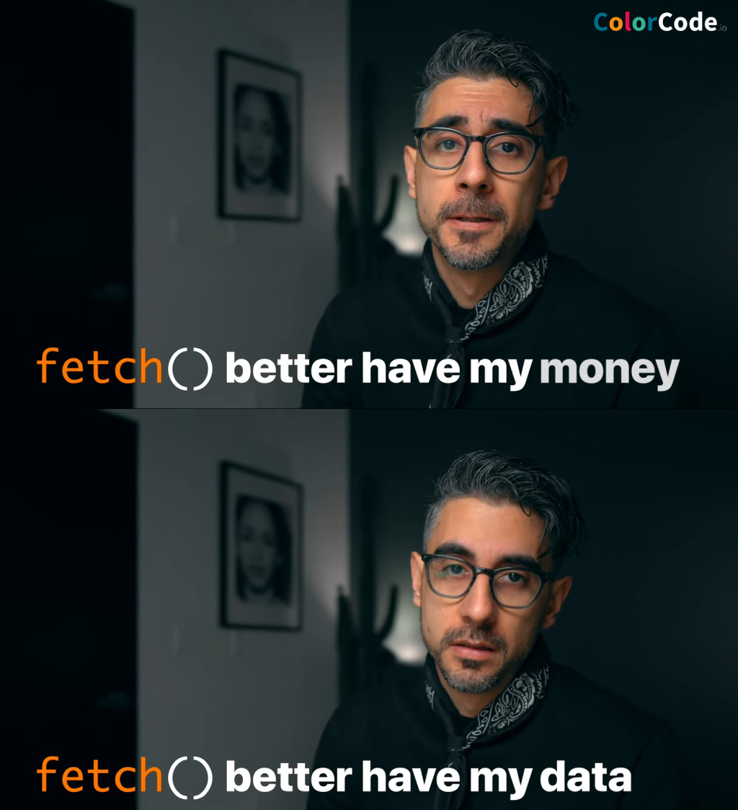

<h1 id="{{ Week 11-Web APIs 2: JSON - Promises - APIs | slugify }}">
  Week 11 | Web APIs 2: JSON - Promises - APIs
</h1>

  

  <h2 class="week-controls__previous_week">

    <!-- ADD CHECK FOR WEEK open:true (remove if false) -->
    

      

      <a href="/WDX-180/curriculum/week{{ previous_week_num }}">Week {{ previous_week_num }} &#8678;</a>
    

  </h2>

  Updated: 6/12/2023

  <h2 class="week-controls__next_week">

    <!-- ADD CHECK FOR WEEK open:true (remove if false) -->
    

      

      <a href="/WDX-180/curriculum/week{{ next_week_num }}">&#8680; Week {{ next_week_num }}</a>
    

  </h2>

---

<!-- Week 11 - Day 1 | Introduction to JSON -->

  

    <h2>
      Week 11 - Day 1 | Introduction to JSON</h2>
  

### Schedule

  - [Study](#study-plan-NN)
  - [Exercises](#exercises-NN)
  - [Extra Resources](#extra-resources-NN)

### Study Plan

  - [Read: **Introduction to JSON**](../modules/javascript/core/json/30-days-of-javascript/index.md){:target="_blank"}

### Summary

  🌕 You are extraordinary. You know a light-weight data format which you may use to store data or to send it an HTTP server. Now do some exercises for your brain and for your muscle.

### Exercises

  **JSON Basics**

  Copy the folder `curriculum/week11/exercises/json_basics/` inside folder `user/week11/exercises/day01/` and compete all the challenges found inside the JavaScript file.

  **IMPORTANT:** Make sure to complete all the tasks found in the **daily Progress Sheet** and update the sheet accordingly. Once you've updated the sheet, don't forget to `commit` and `push`. The progress draft sheet for this day is: **/user/week11/progress/progress.draft.w11.d01.csv**

  You should **NEVER** update the `draft` sheets directly, but rather work on a copy of them according to the instructions [found here](../week01/resources/PROGRESS-WORKFLOW.md).

### Extra Resources

  _(Nothing here yet. Feel free to contribute if you've found some useful resources.)_

### Sources and Attributions

  **Content is based on the following sources:**

  - [30 Days Of JavaScript: JSON](https://github.com/in-tech-gration/30-Days-Of-JavaScript/blob/master/16_Day_JSON/16_day_json.md){:target="_blank"} [(Permalink)](https://github.com/in-tech-gration/30-Days-Of-JavaScript/blob/55d8e3dbc0410d64c1dc3ea5915e015a7950cf2a/16_Day_JSON/16_day_json.md){:target="_blank"}

  Don't forget to star this awesome [repo](https://github.com/Asabeneh/30-Days-Of-JavaScript){:target="_blank"}!
  

<!-- Week 11 - Day 2 | Introduction to Promises -->

  

    <h2>
      Week 11 - Day 2 | Introduction to Promises</h2>
  

### Schedule

  - [Study](#study-plan-NN)
  - [Exercises](#exercises-NN)
  - [Extra Resources](#extra-resources-NN)

### Study Plan

  - [Read: **Introduction to Promises**](../modules/javascript/async/promises/30-days-of-javascript/index.md){:target="_blank"}

  Promises are a tough subject in JavaScript, and a lot of developers, even very experienced ones, have issues with them. So you do not have to worry is this concept feel unclear to you.

  Below you can find 2 great videos that explain both the Asynchronous topic and Promises

  - [Watch: **Async JavaScript & Callback Functions**](https://www.youtube.com/watch?v=QSqc6MMS6Fk){:target="_blank"}
    - Level: Beginner
    - Duration: 24mins
    - Captions: Yes

  - [Watch: **JavaScript Promises**](https://www.youtube.com/watch?v=TnhCX0KkPqs){:target="_blank"}
    - Level: Beginner
    - Duration: 37mins
    - Captions: Yes

<!-- Summary -->

<!-- Exercises -->

### Extra Resources

  _(Nothing here yet. Feel free to contribute if you've found some useful resources.)_

### Sources and Attributions

  **Content is based on the following sources:**

  - [30 Days Of JavaScript: Promises](https://github.com/in-tech-gration/30-Days-Of-JavaScript/blob/master/18_Day_Promises/18_day_promises.md){:target="_blank"} [(Permalink)](https://github.com/in-tech-gration/30-Days-Of-JavaScript/blob/55d8e3dbc0410d64c1dc3ea5915e015a7950cf2a/18_Day_Promises/18_day_promises.md){:target="_blank"}

  Don't forget to star this awesome [repo](https://github.com/Asabeneh/30-Days-Of-JavaScript){:target="_blank"}!
  

<!-- Week 11 - Day 3 | Introduction to Fetch API -->

  

    <h2>
      Week 11 - Day 3 | Introduction to Fetch API</h2>
  

### Schedule

  - [Study](#study-plan-NN)
  - [Exercises](#exercises-NN)
  - [Extra Resources](#extra-resources-NN)

### Study Plan

  

  - [Watch: **JavaScript Fetch API 👨🏻‍💻 in 1 Minute**](https://www.youtube.com/watch?v=3ySZQXVjCoM){:target="_blank"}
    - Level: Beginner
    - Duration: 1min
    - Captions: Yes

  - [Read: **Fetch API and Async/Await**](../modules/javascript/web_apis/fetch/30-days-of-javascript/index.md){:target="_blank"}

  - [Watch **Fetch API**](https://www.youtube.com/watch?v=ubw2hdQIl4E){:target="_blank"}
    - Level: Beginner
    - Duration: 30min
    - Caption: Yes

<!-- Summary -->

### Exercises

  **Fetch Basics**

  Copy the folder `curriculum/week11/exercises/fetch_basics/` inside folder `user/week11/exercises/day03/` and compete all the challenges found inside the JavaScript file.

  **IMPORTANT:** Make sure to complete all the tasks found in the **daily Progress Sheet** and update the sheet accordingly. Once you've updated the sheet, don't forget to `commit` and `push`. The progress draft sheet for this day is: **/user/week11/progress/progress.draft.w11.d03.csv**

  You should **NEVER** update the `draft` sheets directly, but rather work on a copy of them according to the instructions [found here](../week01/resources/PROGRESS-WORKFLOW.md).

### Extra Resources

  _(Nothing here yet. Feel free to contribute if you've found some useful resources.)_

### Sources and Attributions

  **Content is based on the following sources:**

  - [30 Days Of JavaScript: Promises](https://github.com/in-tech-gration/30-Days-Of-JavaScript/blob/master/18_Day_Promises/18_day_promises.md){:target="_blank"} [(Permalink)](https://github.com/in-tech-gration/30-Days-Of-JavaScript/blob/55d8e3dbc0410d64c1dc3ea5915e015a7950cf2a/18_Day_Promises/18_day_promises.md){:target="_blank"}

  Don't forget to star this awesome [repo](https://github.com/Asabeneh/30-Days-Of-JavaScript){:target="_blank"}!
  

**Weekly feedback:** Hey, it's really important for us to know how your experience with the course has been so far, so don't forget to fill in and submit your [**mandatory** feedback form](https://forms.gle/S6Zg3bbS2uuwsSZF9){:target="_blank"} before the day ends. Thanks you!

## Week 11 - Weekend Suggestions

If you are in the mood of enjoying related content during the weekend, check out our weekly recommendations [here](WEEKEND.md).