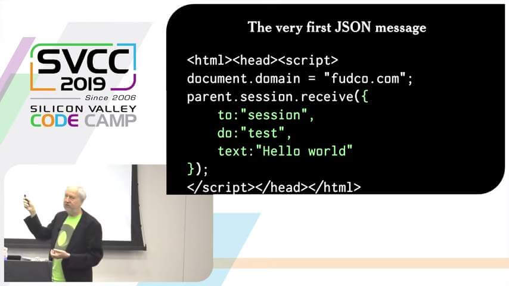
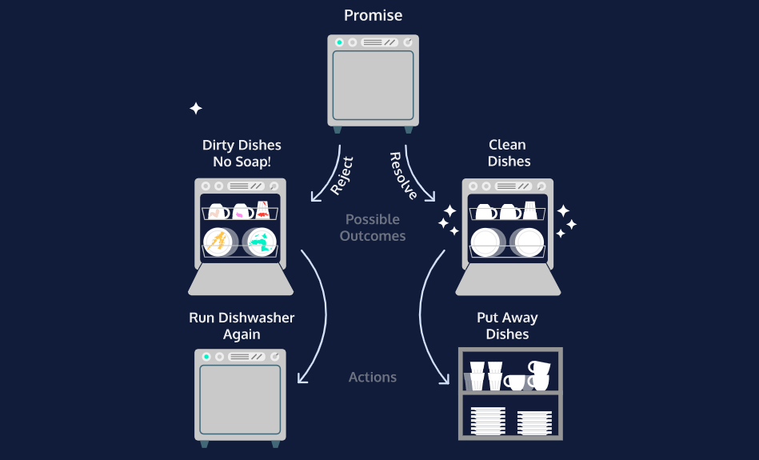
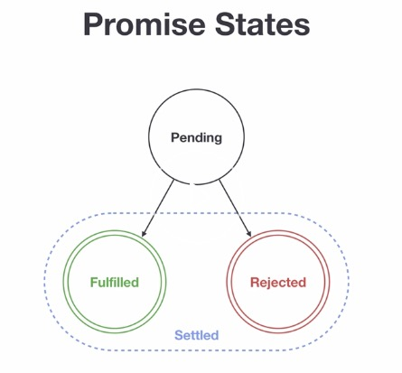

<hr class="mb-0">

<h1 id="{{ Week 11-Web APIs 2: Asynchronous Programming - Promises - JSON - Fetch API | slugify }}">
  <span class="week-prefix">Week 11 |</span> Web APIs 2: Asynchronous Programming - Promises - JSON - Fetch API
</h1>

<div class="week-controls">

  

  <h2 class="week-controls__previous_week">

    <!-- ADD CHECK FOR WEEK open:true (remove if false) -->
    

      

      <a href="../week{{ previous_week_num }}">Week {{ previous_week_num }} &#8678;</a>
    

  </h2>

  <span>Updated: 28/12/2023</span>

  <h2 class="week-controls__next_week">

    <!-- ADD CHECK FOR WEEK open:true (remove if false) -->
    

      

      <a href="../week{{ next_week_num }}">&#8680; Week {{ next_week_num }}</a>
    

  </h2>

</div>

---

<!-- Week 11 - Day 1 | Introduction to JSON -->
<details markdown="1">
  <summary>
    <h2>
      <span class="summary-day">Week 11 - Day 1</span> | Introduction to JSON</h2>
  </summary>

### Schedule

  - [Study](#study-plan-NN)
  - [Exercises](#exercises-NN)
  - [Extra Resources](#extra-resources-NN)

### Study Plan

  > How to become a better programmer? 
  > _"**Fail as fast as you can and as often as you can.**"_ ~ [Scott Hanselman](https://www.hanselman.com/){:target="_blank"}


  ---


  

  - Read [**Introduction to JSON**](../modules/javascript/core/json/intro/content/index.md){:target="_blank"} to learn about the world's most popular data format. JSON, which stands for `JavaScript Object Notation`, is a plain text, lightweight data format that can be used across different systems and programming languages.

### Summary

  🌕 You are extraordinary. You know a light-weight data format which you may use to store data or to send it an HTTP server. Now do some exercises for your brain and for your muscle.

### Exercises

  **JSON Basics**

  Copy the folder `curriculum/week11/exercises/json_basics/` inside folder `user/week11/exercises/day01/` and compete all the challenges found inside the JavaScript file.

  **IMPORTANT:** Make sure to complete all the tasks found in the **daily Progress Sheet** and update the sheet accordingly. Once you've updated the sheet, don't forget to `commit` and `push`. The progress draft sheet for this day is: **/user/week11/progress/progress.draft.w11.d01.csv**

  You should **NEVER** update the `draft` sheets directly, but rather work on a copy of them according to the instructions [found here](../week01/resources/PROGRESS-WORKFLOW.md).


### Extra Resources

  _(Nothing here yet. Feel free to contribute if you've found some useful resources.)_

### Sources and Attributions

  **Content is based on the following sources:**

  - [30 Days Of JavaScript: JSON](https://github.com/in-tech-gration/30-Days-Of-JavaScript/blob/master/16_Day_JSON/16_day_json.md){:target="_blank"} [(Permalink)](https://github.com/in-tech-gration/30-Days-Of-JavaScript/blob/55d8e3dbc0410d64c1dc3ea5915e015a7950cf2a/16_Day_JSON/16_day_json.md){:target="_blank"}

  Don't forget to star this awesome [repo](https://github.com/Asabeneh/30-Days-Of-JavaScript){:target="_blank"}!
  
</details>

<hr class="mt-1">

<!-- Week 11 - Day 2 | Introduction to Promises -->
<details markdown="1">
  <summary>
    <h2>
      <span class="summary-day">Week 11 - Day 2</span> | Introduction to Promises</h2>
  </summary>

### Schedule

  - [Study](#study-plan-NN)
  - [Exercises](#exercises-NN)
  - [Extra Resources](#extra-resources-NN)

### Study Plan

  [**Promises, Promises!**](https://www.youtube.com/watch?v=DpKAnp5Klzw){:target="_blank"}

  

  - [Read: **Promises and Callbacks**](../modules/javascript/async/promises/intro/content/index.md){:target="_blank"}

  Promises are a tough subject in JavaScript, and a lot of developers, even very experienced ones, have issues with them. So you do not have to worry is this concept feel unclear to you.

  Below you can find 2 great videos that explain both the Asynchronous topic and Promises

  - [Watch: **Async JavaScript & Callback Functions**](https://www.youtube.com/watch?v=QSqc6MMS6Fk){:target="_blank"}
    - Level: Beginner
    - Duration: 24mins
    - Captions: Yes

  

  - [Watch: **JavaScript Promises**](https://www.youtube.com/watch?v=TnhCX0KkPqs){:target="_blank"}
    - Level: Beginner
    - Duration: 37mins
    - Captions: Yes

<!-- Summary -->

<!-- Exercises -->

### Extra Resources

  _(Nothing here yet. Feel free to contribute if you've found some useful resources.)_

### Sources and Attributions

  **Content is based on the following sources:**

  - [30 Days Of JavaScript: Promises](https://github.com/in-tech-gration/30-Days-Of-JavaScript/blob/master/18_Day_Promises/18_day_promises.md){:target="_blank"} [(Permalink)](https://github.com/in-tech-gration/30-Days-Of-JavaScript/blob/55d8e3dbc0410d64c1dc3ea5915e015a7950cf2a/18_Day_Promises/18_day_promises.md){:target="_blank"}

  Don't forget to star this awesome [repo](https://github.com/Asabeneh/30-Days-Of-JavaScript){:target="_blank"}!
  
</details>

<hr class="mt-1">

<!-- Week 11 - Day 3 | Introduction to Fetch API -->
<details markdown="1">
  <summary>
    <h2>
      <span class="summary-day">Week 11 - Day 3</span> | Introduction to Fetch API</h2>
  </summary>

### Schedule

  - [Study](#study-plan-NN)
  - [Exercises](#exercises-NN)
  - [Extra Resources](#extra-resources-NN)

### Study Plan

  

  - [Watch: **JavaScript Fetch API 👨🏻‍💻 in 1 Minute**](https://www.youtube.com/watch?v=3ySZQXVjCoM){:target="_blank"}
    - Level: Beginner
    - Duration: 1min
    - Captions: Yes

  - [Read: **Fetch API**](../modules/javascript/web_apis/fetch/intro/content/index.md){:target="_blank"}

  - [Watch **Fetch API**](https://www.youtube.com/watch?v=ubw2hdQIl4E){:target="_blank"}
    - Level: Beginner
    - Duration: 30min
    - Caption: Yes

<!-- Summary -->

### Exercises

  **Fetch Basics**

  Copy the folder `curriculum/week11/exercises/fetch_basics/` inside folder `user/week11/exercises/day03/` and compete all the challenges found inside the JavaScript file.

  **IMPORTANT:** Make sure to complete all the tasks found in the **daily Progress Sheet** and update the sheet accordingly. Once you've updated the sheet, don't forget to `commit` and `push`. The progress draft sheet for this day is: **/user/week11/progress/progress.draft.w11.d03.csv**

  You should **NEVER** update the `draft` sheets directly, but rather work on a copy of them according to the instructions [found here](../week01/resources/PROGRESS-WORKFLOW.md).


### Extra Resources

  _(Nothing here yet. Feel free to contribute if you've found some useful resources.)_

### Sources and Attributions

  **Content is based on the following sources:**

  - [30 Days Of JavaScript: Promises](https://github.com/in-tech-gration/30-Days-Of-JavaScript/blob/master/18_Day_Promises/18_day_promises.md#fetch-api){:target="_blank"} [(Permalink)](https://github.com/in-tech-gration/30-Days-Of-JavaScript/blob/55d8e3dbc0410d64c1dc3ea5915e015a7950cf2a/18_Day_Promises/18_day_promises.md#fetch-api){:target="_blank"}

  Don't forget to star this awesome [repo](https://github.com/Asabeneh/30-Days-Of-JavaScript){:target="_blank"}!
  
</details>

<hr class="mt-1">

<!-- Week 11 - Day 4 | Introduction to Async/Await -->
<details markdown="1">
  <summary>
    <h2>
      <span class="summary-day">Week 11 - Day 4</span> | Introduction to Async/Await</h2>
  </summary>

### Schedule

  - [Study](#study-plan-NN)
  - [Exercises](#exercises-NN)
  - [Extra Resources](#extra-resources-NN)

### Study Plan

  **Let's learn about `async/await`!**

  

  - [Watch: **JavaScript Async Await 👨🏻‍💻 Tutorial in 1 Minute**](https://www.youtube.com/watch?v=TtnodUZ7xnQ){:target="_blank"}
    - Level: Beginner
    - Duration: 1min
    - Captions: Yes

  - [Read: **Introduction to Async/Await**](../modules/javascript/async/async_await/intro/content/index.md){:target="_blank"}

  - [Watch: **Async Await vs. Promises**](https://www.youtube.com/watch?v=spvYqO_Kp9Q){:target="_blank"}
    - Level: Beginner
    - Duration: 24mins
    - Captions: Yes

<!-- Summary -->

<!-- Exercises -->

### Extra Resources

  _(Nothing here yet. Feel free to contribute if you've found some useful resources.)_

### Sources and Attributions

  **Content is based on the following sources:**

  - [30 Days Of JavaScript: Promises](https://github.com/in-tech-gration/30-Days-Of-JavaScript/blob/master/18_Day_Promises/18_day_promises.md#async-and-await){:target="_blank"} [(Permalink)](https://github.com/in-tech-gration/30-Days-Of-JavaScript/blob/55d8e3dbc0410d64c1dc3ea5915e015a7950cf2a/18_Day_Promises/18_day_promises.md#async-and-await){:target="_blank"}

  Don't forget to star this awesome [repo](https://github.com/Asabeneh/30-Days-Of-JavaScript){:target="_blank"}!
  
</details>

<hr class="mt-1">

<!-- Week 11 - Day 5 | Async Recap & Practice -->
<details markdown="1">
  <summary>
    <h2>
      <span class="summary-day">Week 11 - Day 5</span> | Async Recap & Practice</h2>
  </summary>

### Schedule

  - [Study](#study-plan-NN)
  - [Exercises](#exercises-NN)
  - [Extra Resources](#extra-resources-NN)

### Study Plan

  **Welcome to Asynchronous programming!**

  {:style="width:100%"}

  **Programming Training Wheels**: Here are two suggestions that can help you work better with Promises and asynchronous functions:

  **Suggestion #1:**

  **Remember to handle errors first:** 
  
  When working with a Promise-based function, using either the `await` or `.then()` syntax, **always** start with the error handling structure before moving on to do something with the rest of the code. In the case of the `then()` syntax, **always** start by typing in the `catch()` handler, then move on to type the `then()` handler:
  
  **Step 1**
  
  ```js
  fetch( URL )
  .catch( error => console.log(error) ); // <= ALWAYS start this way
  ```
  
  **Step 2**
  
  ```js
  fetch( URL )
  .then( response => /* Now we can start writing the code inside the then() */ )
  .catch( error => console.log(error) );
  ```
  
  In the case of the `await` syntax, you simple start by enclosing the code inside a `try/catch`:
  
  ```js
  try {
    const response = await fetch( URL );
  } catch( error ){ //<= ALWAYS start this way
    console.log( error );
  }
  ```

  **Suggestion #2:**

  **Naming helps: Name all your async Promise-based functions using the `Async` suffix:**
  
  ```js
  async function getDataFromFacebookAsync(){
    // ...
  }
  function collectUserDataAsync(){
    return new Promise(/* callback function here... */);
  }
  ```
  
  Having the `Async` suffix in your async function will help you remember to handle these functions using `await` or the `.then().catch()` syntax. Once you get familiar with asynchronous and Promise-based functions, you can get rid of this training wheels even though they will hurt nobody and can probably be of help to some beginner coders that will work on your code.
  
  This will help you avoid common beginners' errors such as trying to get the result of an async function without `await` or `then()`:
  
  ❌ Wrong:
  
  ```js
  const response = getDataFromFacebook( URL );
  ```
  
  ✅ Correct:
  
  ```js
  const response = await getDataFromFacebookAsync( URL );
  ```
  

  **What's the purpose of this?**
  
  Just like training wheels on a bicycle, `programming training wheels` act as our support and reminders in our first rides with JavaScript. Their role is to instill some core concepts, avoid bugs and common beginner mistakes and also get us accustomed with some of the good practices.
  
  > "The functionality of training wheels is based on the premise that a learner rider can gradually develop their balance and coordination skills by relying on the support of the extra wheels. As the rider gains confidence and proficiency, the training wheels are gradually raised or removed, theoretically allowing the rider to transition to riding without additional support." ~ Wikipedia
  

  ---


  Now, let's practice what we've learned so far with a few exercises:

  - [**Async/Await exercise: WaitForResult**](https://in-tech-gration.github.io/WDX-180/curriculum/modules/javascript/async/async_await/exercises/wait_for_result/){:target="_blank"}

  - [**Promise Refactoring**](https://in-tech-gration.github.io/WDX-180/curriculum/modules/javascript/async/async_await/exercises/promise_refactoring/){:target="_blank"}

  - [**Wikipedia JSON API**](https://in-tech-gration.github.io/WDX-180/curriculum/modules/javascript/async/async_await/exercises/wikipedia/){:target="_blank"}

  - [**Bitcoin Wallet**](https://in-tech-gration.github.io/WDX-180/curriculum/modules/javascript/web_apis/fetch/exercises/bitcoin-wallet/){:target="_blank"}

<!-- Summary -->

<!-- Exercises -->

### Extra Resources

  _(Nothing here yet. Feel free to contribute if you've found some useful resources.)_

<!-- Sources and Attributions -->
  
</details>


<hr class="mt-1">

**Weekly feedback:** Hey, it's really important for us to know how your experience with the course has been so far, so don't forget to fill in and submit your [**mandatory** feedback form](https://forms.gle/S6Zg3bbS2uuwsSZF9){:target="_blank"} before the day ends. Thanks you!

## Week 11 - Weekend Suggestions

If you are in the mood of enjoying related content during the weekend, check out our weekly recommendations [here](WEEKEND.md).