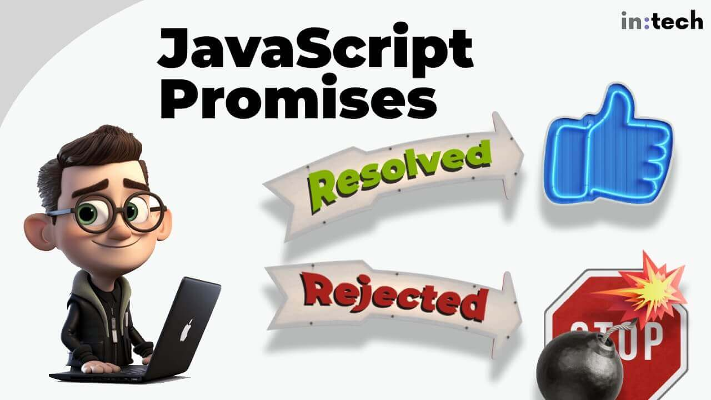
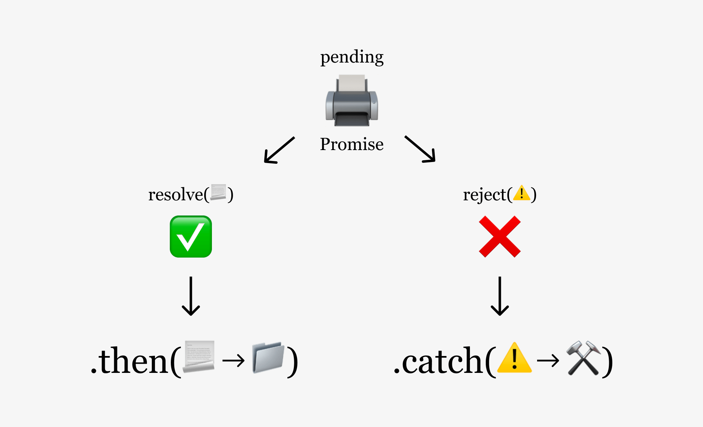
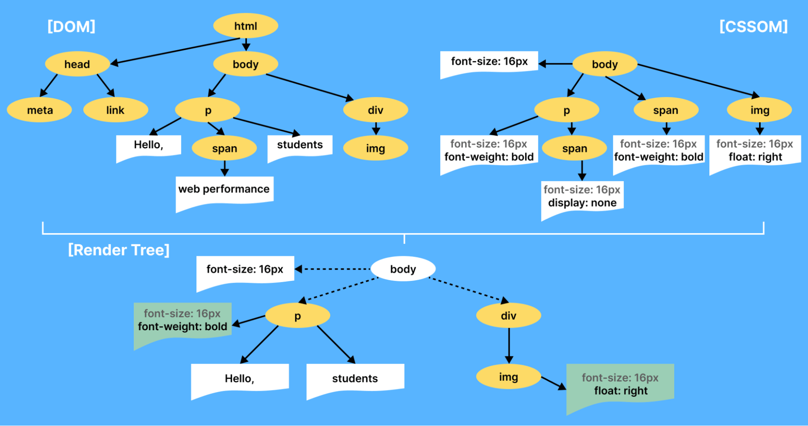
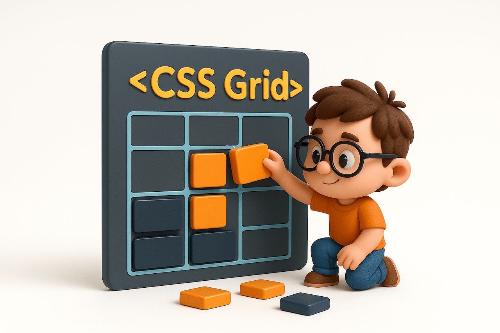
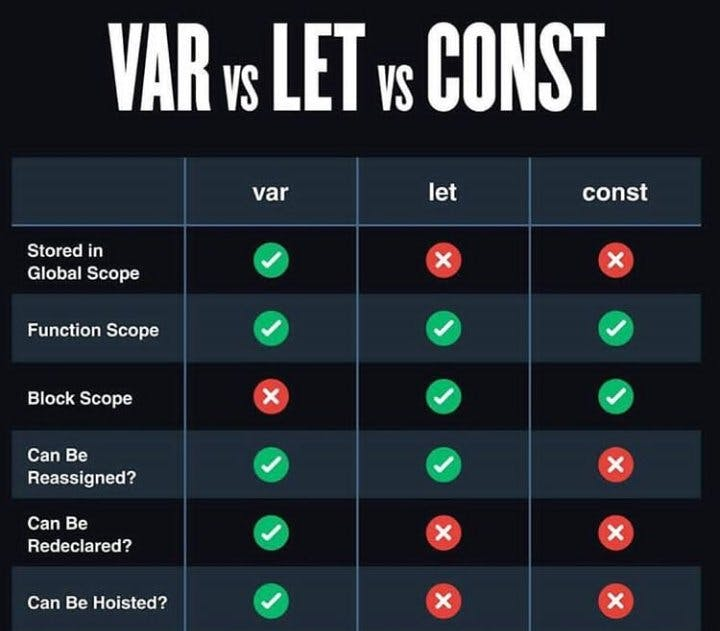

<hr class="mb-0">

<h1 id="{{ Week 13-Intermediate JavaScript | slugify }}">
  <span class="week-prefix">Week 13 |</span> Intermediate JavaScript
</h1>


<div class="week-controls">

  

  <h2 class="week-controls__previous_week">

    

      

      <a href="../week{{ previous_week_num }}">Week {{ previous_week_num }} &#8678;</a>
    

  </h2>

  <span>Updated: 19/1/2026</span>

  <h2 class="week-controls__next_week">

    

      

      <a href="../week{{ next_week_num }}">&#8680; Week {{ next_week_num }}</a>
    

  </h2>

</div>

<!-- VERSION -->
<hr style="margin-bottom:0" />
<div class="center opacity-50 opacity-100:hover">
  You are viewing v2.0 of this content. To go back to v1.0 click <a href="v1.0">this link</a>.
</div>
<!-- VERSION -->

---

<!-- Week 13 - Day 1 | JavaScript Promises -->
<details markdown="1">
  <summary>
    <h2>
      <span class="summary-day">Week 13 - Day 1</span> | JavaScript Promises</h2>
  </summary>

### Schedule

  - **Lecture: JavaScript Promises**
  - **Practice**
  - **Exercises**
  - **Work on Project (Group/Personal)**

### Study Plan

  

  - [Watch Part 1](https://www.youtube.com/watch?v=rhr3CWnYO60){:target="_blank"} of today's lecture on `JavaScript Promises`.

  - Take a break, walk away from the keyboard and do some quick stretch exercises.

  - [Watch Part 2](https://www.youtube.com/watch?v=FkVIzOicuCE){:target="_blank"} of the lecture on `JavaScript Promises`. 

  - Practice with Promises.

  - Post your questions on [Slack](https://intechgration.slack.com){:target="_blank"}, in the comments on YouTube, at the bottom of this page or our [discussion forum on GitHub](https://github.com/in-tech-gration/WDX-180/discussions){:target="_blank"}.

  

  _(Image from [https://www.alexlintu.com/what-is-a-promise/](https://www.alexlintu.com/what-is-a-promise/){:target="_blank"})_

  **Resources**

  - Servers that return JSON data:
    - [Chuck Norris Jokes](https://api.chucknorris.io/jokes/random){:target="_blank"}
    - [Cat Facts](https://catfact.ninja/fact){:target="_blank"}
    - Check out the **Working offline** section below for running a local JSON server even when you have no Internet connectivity.

  - Lectures Code:
    - [Promises](./assets/intechgration-io-promises.zip){:target="_blank"}
    - [Functions: The Chicken and the Egg](./assets/intechgration-io-functions-chicken-egg.zip){:target="_blank"}

  - Lectures Diagrams:
    - [Promises (in real life)](./assets/1_2lVkfUxpad7Y_2Y0K3ToLQ.png){:target="_blank"}
    - [Promises (states)](./assets/Ekran-Resmi-2020-06-06-12.21.27.png){:target="_blank"}
    - [Promises (states)](./assets/1_3S0Y1DQJe-NsUXHdNl8gHg.png){:target="_blank"}
    - [Definition of 'Pending'](./assets/Google.Define.Pending.jpg){:target="_blank"}
    - [Excalidraw](./assets/Promise.Diagram.png){:target="_blank"}
    - [Server-Client Headers](./assets/Server.Client.Headers.png){:target="_blank"}

  **Working offline**

  What happens when one of the JSON servers used for practice (e.g. `catfact.ninja`, `api.chucknorris.io`, etc.) are down?

  What happens if you want to practice connecting to a JSON server through JavaScript when there's no Internet connectivity?

  No need to worry. You can always use the `json-server` for that! All you need is to run the following command while you are still connected to the Internet: `npx json-server db.json` 

  The command will do 2 things: It will ask you to install the `json-server` on your machine and then create a sample `db.json` file under the current folder and start running a JSON server under the default port (3000). The server is responsible for dynamically serving the contents of the `db.json` file through different routes: `/posts`, `/comments`, `/profile`.

  You can now practice by connecting to the server on the default port, or run it on a custom port using: `npx json-server db.json --port <CUSTOM_PORT_NUMBER>`.

  You can study the `db.json` file structure and add any custom JSON data you like to practice on. You can also run `npx json-server --help` to check all the available features of the `json-server` module. 

  Happy (offline) hacking! 

<!-- Summary -->

### Exercises

  Finish all the exercises found on this [repository](https://github.com/in-tech-gration/promises-exercises){:target="_blank"}.


  **IMPORTANT:** Make sure to complete all the tasks found in the **daily Progress Sheet** and update the sheet accordingly. Once you've updated the sheet, don't forget to `commit` and `push`. The progress draft sheet for this day is: **/user/week13/progress/progress.draft.w13.d01.csv**

  You should **NEVER** update the `draft` sheets directly, but rather work on a copy of them according to the instructions [found here](../modules/curriculum/progress_workflow.md).

<!-- Extra Resources -->

<!-- Sources and Attributions -->
  
</details>

<hr class="mt-1">

<!-- Week 13 - Day 2 | CSS Object Model -->
<details markdown="1">
  <summary>
    <h2>
      <span class="summary-day">Week 13 - Day 2</span> | CSS Object Model</h2>
  </summary>

### Schedule

  - [Study](#study-plan-NN)
  - [Exercises](#exercises-NN)
  - [Extra Resources](#extra-resources-NN)

### Study Plan

  Let's learn the **CSS Object Model**

  > "The CSS Object Model is a set of APIs allowing the manipulation of CSS from JavaScript. 
  >
  > It is much like the DOM, but for the CSS rather than the HTML. 
  >
  > It allows users to read and modify CSS style dynamically."


  - Slowly go through this lengthy article: [**A Beginner’s Guide To CSS Object Model (CSSOM)**](https://www.lambdatest.com/blog/css-object-model/){:target="_blank"}

  

  In this article you'll find the word `Interface` mentioned quite a lot, so let's ask `ChatGPT` to explain this to us:

  **What is an Interface?**

  > "In the world of programming and computer science, an "interface" refers to a set of rules or specifications that define how different software components can interact with each other. It's like a contract that outlines what methods or functions an object or component should have and how they should behave.
  >
  > Think of it as a way for different parts of a program to communicate with each other without needing to know all the nitty-gritty details of how each part is implemented. **It's a bit like using a remote control to interact with your TV. You don't need to know exactly how the TV works internally; you just need to know the buttons on the remote control and what they do (that's the interface).**
  >
  > In the context of MDN documentation, when you see terms like "CSSStyleSheet", "Event interface", "FocusEvent interface," "UIEvent interface," etc., they are referring to specific sets of rules that describe what properties and methods an object (e.g. an Event object) should have. These interfaces tell developers what they can expect from these objects and how they can work with them."


  **CAUTION:** The ChatGPT response was reviewed and curated by our staff of professional developers. Never trust AI-generated responses 100%.

  Here is a list of the main concepts that you will learn in this article:

  - The `HTMLElement.style.*` set of properties
  - The `window.getComputedStyle(Element)` method
  - The `CSSStyleDeclaration Interface` and its properties:
    - `getPropertyValue()`
    - `getPropertyPriority()`
    - `setProperty(propertyName, value, priority)`
    - `removeProperty(property)`
    - `item()`
    - `length`
  - The `StyleSheet & StyleSheetList Interfaces` and their properties:
    - `disabled`
    - `href`
    - `media`
    - `ownerNode`
    - `parentStyleSheet`
    - `title`
    - `type`
    - `document.styleSheets.length`
  - The `CSSStyleSheet & CSSRule Interfaces`
    - `cssRules`
    - `deleteRule()`
    - `insertRule()`
    - `cssText`
    - `parentRule`
    - `parentStyleSheet`
  - The `CSSMediaRule & CSSKeyframeRule Interfaces`
    - `media`
    - `keyText`

  **FAQ**

  > Here are some questions that we've accumulated from students going over the topics covered in this module.


  - **Question:** _What does "paint" mean? Is it a feature of the browser? Does the browser use `Canvas` to paint the DOM? How does it "paint" the pixels?_
    - **Answer:** The term "paint" refers to an internal Browser feature. The way browsers "paint" everything on the main browser window is something that is hidden away from us. It is not to be confused with the `Canvas API` which is an HTML element with drawing/painting capabilities and an accompanying JavaScript API, and a topic that we will covered in a future Module.
  
  - **Question:** _Is `CSSStyleDeclaration` a special type of object? I feel like I don't fully understand the object model in JS._
    - **Answer:** `CSSStyleDeclaration` is actually an [`Interface`](https://developer.mozilla.org/en-US/docs/Web/API/CSSStyleDeclaration){:target="_blank"}, a kind of a blueprint, if you will, based on which a special type of Object is created. This is a concept that will be covered in upcoming Modules of the Intermediate and Advanced parts of the course.

  - **Question:** _When we use JavaScript, are the CSS styles applied inline? Because it seems so. If we have a rule in our project not to use inline styling, how are we going to handle this? Should we use CSS classes instead?_
    - **Answer:** When you use the `.style` Element property, you are actually applying inline styling to the Element. But, that's not always a bad thing, and it's a widely used pattern when styling must be updated dynamically (via JS).

  - _Should we use CSS classes instead?_: That's another approach that you can use if you definitely want to avoid inline styling for some reason. Here's one way of injecting CSS styling by dynamically creating a `<style>` element and appending it to the `<head>` element of our page:

  ```js
  const style = document.createElement("style");
  style.textContent = `
    .someClass { 
      background: black;
      color: white;
    }
  `
  document.head.appendChild(style);
  ```

<!-- Summary -->

<!-- Exercises -->

### Extra Resources

  <!-- TODO: INTEGRATE: https://github.com/in-tech-gration/web.dev/blob/main/src/site/content/en/blog/critical-rendering-path-constructing-the-object-model/index.md -->


  - [Constructing the Object Model](https://web.dev/articles/critical-rendering-path/constructing-the-object-model){:target="_blank"}

### Sources and Attributions

  - [CSS Object Model (CSSOM) @MDN](https://developer.mozilla.org/en-US/docs/Web/API/CSS_Object_Model){:target="_blank"}
  
</details>

<hr class="mt-1">

<!-- Week 13 - Day 3 | Promises & Scope -->
<details markdown="1">
  <summary>
    <h2>
      <span class="summary-day">Week 13 - Day 3</span> | Promises & Scope</h2>
  </summary>

### Schedule

  - **Lecture: Promises & Scope**
  - **Practice**
  - **Work on Project (Group/Personal)**

### Study Plan

  

  Your instructor will share the video lectures with you. The first part of the lecture is about Promises and error handling, while the second part is all about `scope` in JavaScript and different ways to define variables.  

  > A new term needs a proper Google search for its original definition:
  > 
  > **Scope:** *“the extent of the area or subject matter that something deals with or to which it is relevant.”*  
  > *Example: "we widened the scope of our investigation"*  


  - **Recommended reading:** read the full articles about [var](https://developer.mozilla.org/en-US/docs/Web/JavaScript/Reference/Statements/var){:target="_blank"}, [let](https://developer.mozilla.org/en-US/docs/Web/JavaScript/Reference/Statements/let){:target="_blank"} and [const](https://developer.mozilla.org/en-US/docs/Web/JavaScript/Reference/Statements/const){:target="_blank"} on MDN and share your questions on our Slack forum or leave a comment below.

### Summary

  Here is an AI-generated summary of the lectures:

  **Lecture 1: Promises**

  1. **Creating promises**: The instructor explains how to create promises using the `Promise` constructor and provides examples.

  2. **Handling promise errors**: He demonstrates how to handle promise errors using `.catch()` or `.finally()`.

  3. **Chaining promises**: The discussion covers chaining promises together using the `.then()` method.

  4. **Combining promises**: The instructor shows how to combine multiple promises into a single promise using methods like `Promise.all()` and `Promise.race()`.

  5. **Performance measurement**: He mentions the importance of measuring performance in JavaScript and provides a link to an MDN API for timing functions.

  6. **Timing promise execution**: The discussion highlights that there's no way to guarantee the exact time it takes for promises to execute, even on the same machine.

  The meeting also touches upon related topics, such as:

  * Creating arrow functions with single statements
  * Combining multiple promise-based functions into a single function

  **Lecture 2: Scope**

  1. The concept of scope in JavaScript is important to understand.

  2. There are different types of scope: global, function, and block scope.

  3. Variables declared with `var` have function scope, while variables declared with `let` or `const` have block scope.

  4. Lexical scoping (also known as static scoping) is a way of resolving variable references in JavaScript.

  5. It's not necessary to know the term "lexical scoping" to understand how scope works in JavaScript; just learn the rules and you'll be fine.

  6. Naming variables can help with understanding scope, especially when working with complex code.

### Exercises

  - Practice with Promises and what you've learned from the lectures

  - Study the behavior of the following code, and make sure to understand the mechanics behind it and be able to explain this during a coding interview (practice by explaining this to an imaginary person or to a class mate):

  ```js
  console.log(a);
  var a = 42;
  console.log(a);

  console.log(b);
  let b = 42;
  console.log(b);
  ```

  **IMPORTANT:** Make sure to complete all the tasks found in the **daily Progress Sheet** and update the sheet accordingly. Once you've updated the sheet, don't forget to `commit` and `push`. The progress draft sheet for this day is: **/user/week13/progress/progress.draft.w13.d03.csv**

  You should **NEVER** update the `draft` sheets directly, but rather work on a copy of them according to the instructions [found here](../modules/curriculum/progress_workflow.md).

### Extra Resources

  - [Measuring performance](https://developer.mozilla.org/en-US/docs/Web/API/Performance/now){:target="_blank"} (Performance.now())

  - [Page Marker: Draw on the Web Chrome Extension](https://chromewebstore.google.com/detail/page-marker-draw-on-web/jfiihjeimjpkpoaekpdpllpaeichkiod){:target="_blank"}

<!-- Sources and Attributions -->
  
</details>

<hr class="mt-1">

<!-- Week 13 - Day 4 | Advanced CSS -->
<details markdown="1">
  <summary>
    <h2>
      <span class="summary-day">Week 13 - Day 4</span> | Advanced CSS</h2>
  </summary>

### Schedule

  - [Study](#study-plan-NN)
  - [Exercises](#exercises-NN)
  - [Extra Resources](#extra-resources-NN)

<!-- Study Plan -->

### Summary

  

  Let's begin by reading about [What is a Software Post-Mortem and How Do You Write One?](https://www.freecodecamp.org/news/what-is-a-software-post-mortem/){:target="_blank"}

  After having read the article, open up the code [found here](https://github.com/in-tech-gration/WDX-180/tree/main/curriculum/modules/javascript/misc/post_mortem){:target="_blank"} debug the program and write a short post mortem.

  When you're done, take a short break and move on to the next section, where
  we switch gears and learn about the all powerful **CSS Grid**.  

  ---


  **Introduction to CSS Grid**

  

  - Watch the lecture [here](https://youtu.be/9164u4MbdHo){:target="_blank"}.
  - Study the code [here](https://github.com/in-tech-gration/WDX-180/tree/main/curriculum/modules/css/misc/advanced_css/assets/lecture-code){:target="_blank"}
  - Practice on CSS Grid by recreating the layouts depicted in the images found [here](https://github.com/in-tech-gration/WDX-180/tree/main/curriculum/modules/css/misc/advanced_css/assets/css-grid-practice){:target="_blank"}

  ---


  Next, we are going to explore some pretty useful and cool CSS features (that you probably didn't know exist). Let's go!

  - Go through [**this article**](https://www.lambdatest.com/blog/advanced-css-tricks-and-techniques/){:target="_blank"} that covers quite a lot of features. For each one, you should check the appropriate MDN article for more details and play around with the feature in your local development environment. Perhaps it's a good idea at this point to create a file named `advanced-css-tricks.html` and work on it.

  The point of this module is to become aware and familiar with these really handy CSS tools. Unless you practice, of course, there's no point in moving forward, so let's use these tricks to build a web page that includes every single feature in the list.

  - **Responsive CSS Grids**
  - **Vertically Align with Flexbox**
  - **SVG for Icons and Logos**
  - **Masking**
  - **Shape Outside**
  - **Zoom on Hover**
  - **Scroll Snapping**
  - **Variable Fonts**
  - **Generate Text Animation**
  - **Initial Letter**
  - **Logical Properties and Values**
  - **CSS Subgrids**
  - **Smart Quotes in HTML/CSS**
  - **Comma-Separated Lists**
  - **Feature Query**
  - **Background Repeat**
  - **CSS Gradients**
  - **Truncate Strings**

  On top of that, you want to create a page that includes every single feature with a small description taken from the MDN docs and a small example (containing both the code used and the actual displayed output).

### Exercises

  - Build a replica of the [**var/let/const table**](./assets/var-let-const.jpg){:target="_blank"} using HTML and CSS. Sprinkle the table with some JavaScript if you feel like it.

  

  You can use some emojis for the ❌ and ✅ or you can recreate them using plain CSS!

  - [Check Mark](https://emojipedia.org/check-mark-button){:target="_blank"}
  - [Cross Mark](https://emojipedia.org/cross-mark){:target="_blank"}

  If you go with the CSS route for the symbols, you can use the following HTML entities
  and find some CSS rules to apply colors, background, borders, circles, etc. to these characters


  - `<span>&check;</span>`
  - `<span>&CircleTimes;</span>`

  Refs:


  - [Unicode Character “⊗” (U+2297)](https://www.compart.com/en/unicode/U+2297){:target="_blank"}
  - [Unicode Character “✓” (U+2713)](https://www.compart.com/en/unicode/U+2713){:target="_blank"}

  You can of course, build the structure in many ways, but the `<table>` element is the most appropriate here.
  In case you've started building using another element, feel free to do so, and we'll check how different layouts
  and structure look later on.

  **IMPORTANT:** Make sure to complete all the tasks found in the **daily Progress Sheet** and update the sheet accordingly. Once you've updated the sheet, don't forget to `commit` and `push`. The progress draft sheet for this day is: **/user/week13/progress/progress.draft.w13.d04.csv**

  You should **NEVER** update the `draft` sheets directly, but rather work on a copy of them according to the instructions [found here](../modules/curriculum/progress_workflow.md).

### Extra Resources

  _(Nothing here yet. Feel free to contribute if you've found some useful resources.)_

### Sources and Attributions

  - [18 Advanced CSS Tricks And Tips [2023]](https://www.lambdatest.com/blog/advanced-css-tricks-and-techniques/){:target="_blank"}
  
</details>

<hr class="mt-1">

<!-- Week 13 - Day 5 | Intermediate JavaScript -->
<details markdown="1">
  <summary>
    <h2>
      <span class="summary-day">Week 13 - Day 5</span> | Intermediate JavaScript</h2>
  </summary>

### Schedule

  - **Lecture: Intermediate JavaScript**
  - **Practice**
  - **Work on Project (Group/Personal)**

### Study Plan

  Your instructor will share the video lectures with you. Here are the topics covered:

  - **Part 1**:
    - Variable scope and use of the `window` object as a global namespace.
    - Naming variables in a way that shows intent and protects our code
  - **Part 2**:
    - Variable declarations, function definitions and function expressions
    - Scoping rules

  Practice on the topics covered and explore the concepts by trying things out in your own code.

<!-- Summary -->

### Exercises

<!-- ### Extra Resources -->

  **IMPORTANT:** Make sure to complete all the tasks found in the **daily Progress Sheet** and update the sheet accordingly. Once you've updated the sheet, don't forget to `commit` and `push`. The progress draft sheet for this day is: **/user/week13/progress/progress.draft.w13.d05.csv**

  You should **NEVER** update the `draft` sheets directly, but rather work on a copy of them according to the instructions [found here](../modules/curriculum/progress_workflow.md).

<!-- Extra Resources -->

<!-- Sources and Attributions -->
  
</details>


<hr class="mt-1">

**Weekly feedback:** Hey, it's really important for us to know how your experience with the course has been so far, so don't forget to fill in and submit your [**mandatory** feedback form](https://forms.gle/S6Zg3bbS2uuwsSZF9){:target="_blank"} before the day ends. Thanks you!

## Week 13 - Weekend Suggestions

If you are in the mood of enjoying related content during the weekend, check out our weekly recommendations [here](WEEKEND.md).

---

<!-- COMMENTS: -->
<script src="https://utteranc.es/client.js"
  repo="in-tech-gration/WDX-180"
  issue-term="pathname"
  theme="github-dark"
  crossorigin="anonymous"
  async>
</script>