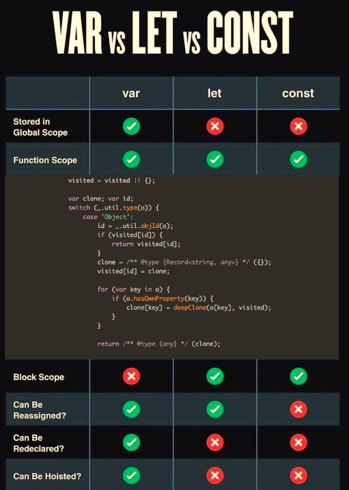

<hr class="mb-0">

<h1 id="{{ Week 15-JavaScript Events | slugify }}">
  <span class="week-prefix">Week 15 |</span> JavaScript Events
</h1>


<div class="week-controls">

  

  <h2 class="week-controls__previous_week">

    

      

      <a href="../week{{ previous_week_num }}">Week {{ previous_week_num }} &#8678;</a>
    

  </h2>

  <span>Updated: 22/1/2025</span>

  <h2 class="week-controls__next_week">

    

      

      <a href="../week{{ next_week_num }}">&#8680; Week {{ next_week_num }}</a>
    

  </h2>

</div>

---

<!-- Week 15 - Day 1 | ES6 Modules & The Arguments Object -->
<details markdown="1">
  <summary>
    <h2>
      <span class="summary-day">Week 15 - Day 1</span> | ES6 Modules & The Arguments Object</h2>
  </summary>

### Schedule

  - **Watch the lectures**
  - **Study the suggested material**
  - **Practice on the topics and share your questions**

### Study Plan

  Your instructor will share the video lectures with you. Here are the topics covered:

  - **Part 1:** Check your Frontend knowledge / Learn about the `arguments` object
  - **Part 2:** ECMAScript 6 Modules (`import/export`)

  You can find the lecture code [here](https://github.com/in-tech-gration/WDX-180/tree/main/curriculum/week15/assets/code){:target="_blank"}

  **Suggested material for study:**

  - The Function [Arguments Object](https://developer.mozilla.org/en-US/docs/Web/JavaScript/Reference/Functions/arguments){:target="_blank"}
  - [Rest Parameters](https://developer.mozilla.org/en-US/docs/Web/JavaScript/Reference/Functions/rest_parameters){:target="_blank"}
  -[Default Parameters](https://developer.mozilla.org/en-US/docs/Web/JavaScript/Reference/Functions/Default_parameters){:target="_blank"}

  - Modules  
    - [MDN](https://developer.mozilla.org/en-US/docs/Web/JavaScript/Guide/Modules){:target="_blank"}  
    - [export statement](https://developer.mozilla.org/en-US/docs/Web/JavaScript/Reference/Statements/export){:target="_blank"}  
    - [import statement](https://developer.mozilla.org/en-US/docs/Web/JavaScript/Reference/Statements/import){:target="_blank"}

  **References & Resources:**

  - [Prefetching resources in the browser](https://www.30secondsofcode.org/html/s/prefetching-resources/){:target="_blank"}  
  - [https://v8.dev/features/modules](https://v8.dev/features/modules){:target="_blank"}

### Summary

  In the first lecture, we try to answer some of the following questions and check whether we are up-to-date with some important Frontend concepts:

  - What is Browser-Caching?
  - What is Cache Busting?  
  - What is Server-Caching?
  - What is rendering?
  - What are Backend languages?
  - What is dynamic content?
  - What are the steps of `<script>` parsing in the Browser?
  - What is defer/async?

  Next, the first lecture explores the `arguments` object that is used inside function definitions to access all the arguments passed to the function, even if they are not declared as parameters.

  In the second lecture we explore JavaScript modules and imports:

  1. Basic import and export statements
  2. Using the `import` statement with curly braces (`{}`)
  3. Dynamic imports using the `import()` function
  4. Using `async/await` with dynamic imports
  5. Handling errors and rejections when importing modules

  The lecture also covers examples of how to use dynamic imports to preload modules, such as importing a module when the mouse cursor is close 
  to an element on the screen.

### Exercises

  - Complete the [MDN article](https://developer.mozilla.org/en-US/docs/Web/JavaScript/Guide/Modules){:target="_blank"} on Modules and share your code and questions on Slack  
  - Try to implement modules on your personal/group project(s)  
  - Try to implement dynamic module loading when the mouse cursor is close to the button about to be clicked (you can try the mouseenter, mousemove events)

  **IMPORTANT:** Make sure to complete all the tasks found in the **daily Progress Sheet** and update the sheet accordingly. Once you've updated the sheet, don't forget to `commit` and `push`. The progress draft sheet for this day is: **/user/week15/progress/progress.draft.w15.d01.csv**

  You should **NEVER** update the `draft` sheets directly, but rather work on a copy of them according to the instructions [found here](../modules/curriculum/progress_workflow.md).


### Extra Resources

  - Read [Good Code, is a love letter to the next developer who will maintain it](https://addyosmani.com/blog/good-code/){:target="_blank"} by Addy Osmani

  ---


  _Photo by [Lukas](https://www.pexels.com/photo/turned-on-laptop-computer-574073/)_

<!-- Sources and Attributions -->
  
</details>

<hr class="mt-1">

<!-- Week 15 - Day 2 | iframe, eval & syntax highlighting -->
<details markdown="1">
  <summary>
    <h2>
      <span class="summary-day">Week 15 - Day 2</span> | iframe, eval & syntax highlighting</h2>
  </summary>

### Schedule

  - **Study the suggested material**
  - **Practice on the topics and share your questions**

### Study Plan

  First of all, some theory. Start by reading about `iframe` and `eval` (or as some people call it, `evil()`):

  - [eval @ W3Schools](https://www.w3schools.com/jsref/jsref_eval.asp){:target="_blank"}
  - [eval @ MDN](https://developer.mozilla.org/en-US/docs/Web/JavaScript/Reference/Global_Objects/eval){:target="_blank"}

  - [iframe @ W3Schools](https://www.w3schools.com/tags/tag_iframe.ASP){:target="_blank"}
  - [iframe @ MDN](https://developer.mozilla.org/en-US/docs/Web/HTML/Element/iframe){:target="_blank"}

<!-- Summary -->

### Exercises

  The challenge for today is to build an exact replica of this [reference table](https://cdn.hashnode.com/res/hashnode/image/upload/v1658225167119/MxOGBQkWE.jpg) using HTML and CSS.

  For each row of the table, the user must be able to click on it and some sample code must be displayed that shows the difference between the 3 ways of declaring a variable and the particular feature (e.g. function scope, hoisting, etc.). See the screenshot below for an idea on how to display the code. It's up to you to find the most appropriate solution. Feel free to experiment and also come up with various ways to do this.

  

  The code must be syntax highlighted. You **must** use the [prism.js library](https://prismjs.com/#examples) for that and pick the `tomorrow night` theme. 

  You can optionally go one step further and make the code runnable. You can experiment with things like `eval`, `iframe` or anything you can think of or find on StackOverflow. You might also want to experiment with ready-made libraries like [Flems](https://flems.io/).

  Good luck!

  **IMPORTANT:** Make sure to complete all the tasks found in the **daily Progress Sheet** and update the sheet accordingly. Once you've updated the sheet, don't forget to `commit` and `push`. The progress draft sheet for this day is: **/user/week15/progress/progress.draft.w15.d02.csv**

  You should **NEVER** update the `draft` sheets directly, but rather work on a copy of them according to the instructions [found here](../modules/curriculum/progress_workflow.md).


<!-- Extra Resources -->

<!-- Sources and Attributions -->
  
</details>

<hr class="mt-1">

<!-- Week 15 - Day 3 | Event Propagation & Delegation -->
<details markdown="1">
  <summary>
    <h2>
      <span class="summary-day">Week 15 - Day 3</span> | Event Propagation & Delegation</h2>
  </summary>

### Schedule

  - **Watch the lectures**
  - **Study the suggested material**
  - **Practice on the topics and share your questions**

### Study Plan

  Your instructor will share the video lectures with you. Here are the topics covered:

  - Part 1: **Events & Event Propagation**
  - Part 2: **Event Propagation & Event Delegation**

  The lecture code can be found [here](https://github.com/in-tech-gration/WDX-180/tree/main/curriculum/modules/javascript/misc/_w15d03/assets/code){:target="_blank"} _([Download link](https://downgit.github.io/#/home?url=https://github.com/in-tech-gration/WDX-180/tree/main/curriculum/modules/javascript/misc/_w15d03/assets/code){:target="_blank"})_

  **Lecture Notes:**

  - The `event` object:  
    - The *event* object becomes available automatically inside an event handler function:

  ```js
  document.body.addEventListener("click", function(){
    console.log( event ); // `event` is here, even though we never declared it!
  });  
  ```

  - If you want to supply a custom name for the *event* object, you should also supply a parameter name and change both occurrences (parameter+usage of the parameter):

  ```js
  function clickHandler( ev ){ console.log(ev); }  
  ```


  - Best practices: ALWAYS supply the event parameter and use meaningful and descriptive names, e.g. `event`, `eventObject`, etc.  

  - `event.target` is ALWAYS the element that triggered the event  

  - `addEventListener` (alarm) listens on the (outgoing) bubbling phase of the event flow (propagation)  

  - Unregistering Inline (Anonymous) Event Handlers:

  ```js
  document.addEventListener('click', function register(e){ // 1) Name the function
    if condition
      document.removeEventListener('click', register) // 2) Use the function name to remove it
  });
  ```

  **Study Material:**

  - **Study** the [Event Flow diagram](https://www.w3.org/TR/2003/NOTE-DOM-Level-3-Events-20031107/events.html#Events-flow-h2){:target="_blank"} (again) to understand what happens every single time an event is triggered.  

  - **Study and experiment** with the [code](https://github.com/in-tech-gration/WDX-180/tree/main/curriculum/modules/javascript/misc/_w15d03/assets/code/events.part.01){:target="_blank"} that we’ve created during the first session.   

  - **Study and practice** some of the events we’ve covered and mentioned: *click, dblclick, contextmenu, mouseover.* If you find some other cool events, please share it!  

  - **Check** the MDN documentation on the [*addEventListener*](https://developer.mozilla.org/en-US/docs/Web/API/EventTarget/addEventListener){:target="_blank"}  

  - What about the `event` object properties? Make sure to find about all of them.

  - Explore the [visibilitychange](https://developer.mozilla.org/en-US/docs/Web/API/Document/visibilitychange_event){:target="_blank"} event.

<!-- Summary -->

### Exercises

  - **Finish** the 3 tasks found in the [**Target Practice Exercise**](https://github.com/in-tech-gration/WDX-180/tree/main/curriculum/modules/javascript/misc/_w15d03/assets/code/target-practice){:target="_blank"} _([Download link](https://downgit.github.io/#/home?url=https://github.com/in-tech-gration/WDX-180/tree/main/curriculum/modules/javascript/misc/_w15d03/assets/code/target-practice){:target="_blank"})_  

  - **Study the code** that we’ve created during the 2nd session ([Poor man’s Excel](https://github.com/in-tech-gration/WDX-180/tree/main/curriculum/modules/javascript/misc/_w15d03/assets/code/poor.mans.excel){:target="_blank"}) and try to **recreate a table** that contains inputs that the user can update.

  **IMPORTANT:** Make sure to complete all the tasks found in the **daily Progress Sheet** and update the sheet accordingly. Once you've updated the sheet, don't forget to `commit` and `push`. The progress draft sheet for this day is: **/user/week15/progress/progress.draft.w15.d03.csv**

  You should **NEVER** update the `draft` sheets directly, but rather work on a copy of them according to the instructions [found here](../modules/curriculum/progress_workflow.md).


### Extra Resources

  - [JavaScript Reserved Keywords](https://www.w3schools.com/js/js_reserved.asp){:target="_blank"}  

  - [Event Propagation](https://dmitripavlutin.com/javascript-event-delegation/){:target="_blank"}  

  - [JavaScript Key Codes (interactive)](https://www.toptal.com/developers/keycode){:target="_blank"}

  - Explore `Custom Events`:
    - [Custom Events](https://developer.mozilla.org/en-US/docs/Web/API/CustomEvent/CustomEvent){:target="_blank"}
    - [Creating and triggering events](https://developer.mozilla.org/en-US/docs/Web/Events/Creating_and_triggering_events){:target="_blank"}


<!-- Sources and Attributions -->
  
</details>

<hr class="mt-1">

<!-- Week 15 - Day 4 | Events Recap -->
<details markdown="1">
  <summary>
    <h2>
      <span class="summary-day">Week 15 - Day 4</span> | Events Recap</h2>
  </summary>

### Schedule

  - **Re-watch yesterday's lectures**
  - **Study the suggested material**
  - **Practice on the topics and share your questions**

<!-- Study Plan -->

<!-- Summary -->

<!-- Exercises -->

<!-- Extra Resources -->

<!-- Sources and Attributions -->
  
</details>

<hr class="mt-1">

<!-- Week 15 - Day 5 | Events Part 2 -->
<details markdown="1">
  <summary>
    <h2>
      <span class="summary-day">Week 15 - Day 5</span> | Events Part 2</h2>
  </summary>

### Schedule

  - **Watch the lectures**
  - **Study the suggested material**
  - **Practice on the topics and share your questions**

### Study Plan

  Your instructor will share the video lectures with you. Here are the topics covered:

  - Part 1: Events & target vs currentTarget
  - Part 2: Events & Stopping Propagation, Creating a Modal

  - Learn about [removeEventListener()](https://developer.mozilla.org/en-US/docs/Web/API/EventTarget/removeEventListener){:target="_blank"}  

  - HTMLElement.**className [(MDN)](https://developer.mozilla.org/en-US/docs/Web/API/Element/className){:target="_blank"} (Read/Write)**  
    - **document.querySelector(“h1”).className \=== \<h1 class=”THIS VALUE HERE”\>**  
  - HTMLElement.**nodeName [(MDN)](https://developer.mozilla.org/en-US/docs/Web/API/Node/nodeName){:target="_blank"} (Read-only)**  
    - **nodeName,** gives you the tag name in UPPERCASE e.g. **HEADER \=== \<header\>, H1 \=== \<h1\>, BUTTON \=== \<button\>, DIV \=== \<div\>**  
  - **event.target is ALWAYS the element that triggered the event**, e.g. the button or any element that was clicked.  
  - **event.stopPropagation() [(MDN)](https://developer.mozilla.org/en-US/docs/Web/API/Event/stopPropagation){:target="_blank"}:** stops the event flow (propagation) from moving forward. Can happen from within an Event Listener at any step (capturing, bubbling).
  - **event.currentTarget is the element that has the eventListener added to it.**

  ```js
  CURRENTTARGET.addEventListener( event, function(event){  
    event.currentTarget === CURRENTTARGET  
  })  
  ```

  **Code**

  - The [Accept Cookies Modal example](https://github.com/in-tech-gration/WDX-180/tree/main/curriculum/modules/javascript/misc/_w15d05/assets/code/cookies-modal){:target="_blank"}

<!-- ### Summary -->


<!-- Summary -->

### Exercises

  - Study, practice and try to solve the counter challenge

  **IMPORTANT:** Make sure to complete all the tasks found in the **daily Progress Sheet** and update the sheet accordingly. Once you've updated the sheet, don't forget to `commit` and `push`. The progress draft sheet for this day is: **/user/week15/progress/progress.draft.w15.d05.csv**

  You should **NEVER** update the `draft` sheets directly, but rather work on a copy of them according to the instructions [found here](../modules/curriculum/progress_workflow.md).


<!-- Extra Resources -->

<!-- Sources and Attributions -->
  
</details>


<hr class="mt-1">

**Weekly feedback:** Hey, it's really important for us to know how your experience with the course has been so far, so don't forget to fill in and submit your [**mandatory** feedback form](https://forms.gle/S6Zg3bbS2uuwsSZF9){:target="_blank"} before the day ends. Thanks you!


---

<!-- COMMENTS: -->
<script src="https://utteranc.es/client.js"
  repo="in-tech-gration/WDX-180"
  issue-term="pathname"
  theme="github-dark"
  crossorigin="anonymous"
  async>
</script>